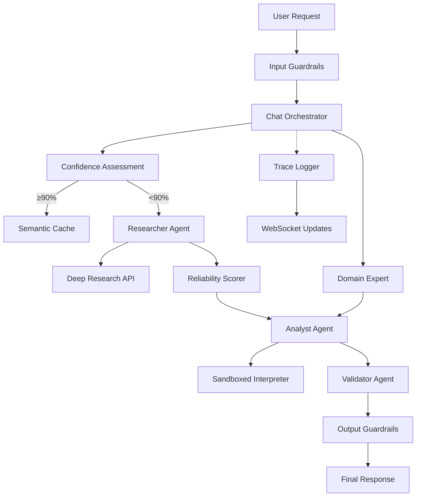

# Netra's Agentic Customer Interaction System (NACIS) Integration Design

## Executive Summary

This document outlines the integration of the Netra's Agentic Customer Interaction System (NACIS) into the existing netra-apex codebase. The implementation leverages and extends existing components to create a robust, secure, and highly optimized agentic system for AI optimization consultation.

## Architecture Analysis

### Existing Components to Reuse/Extend

1. **Supervisor Agent Architecture** (`supervisor_agent_modern.py`)
   - Already implements BaseExecutionInterface and workflow orchestration
   - Has circuit breaker, observability, and WebSocket integration
   - **Extension**: Adapt as foundation for NACIS Orchestrator

2. **Supply Researcher Agent** (`supply_researcher/agent.py`)
   - Existing research capabilities with Google Deep Research
   - Database integration and session management
   - **Extension**: Upgrade to NACIS Researcher with reliability scoring

3. **LLM Manager** (`llm/llm_manager.py`)
   - Modular LLM operations with caching
   - Structured output support
   - **Extension**: Add model cascading logic for CLQT optimization

4. **Cache Infrastructure** (`services/cache/`)
   - Existing LLMCacheManager with Redis backend
   - Adaptive caching strategies
   - **Extension**: Implement semantic caching for NACIS

5. **Security Service** (`services/security_service.py`)
   - Basic encryption and authentication
   - **Extension**: Add input/output guardrails for NACIS

6. **External API Client** (`services/external_api_client.py`)
   - Circuit breaker-enabled HTTP client
   - **Extension**: Use for Deep Research API integration

### Gap Analysis

| NACIS Requirement | Existing Component | Gap | Implementation Required |
|-----------------|-------------------|-----|------------------------|
| Chat Orchestrator | supervisor_agent_modern.py | Needs chat-specific logic | Create chat_orchestrator.py extending supervisor |
| Deep Research API | supply_researcher/research_engine.py | Missing reliability scoring | Add reliability_scorer.py module |
| Analyst Agent | None | New component needed | Create analyst.py with sandboxed execution |
| Validator Agent | quality_supervisor.py | Missing fact-checking | Create validator.py with veracity checks |
| Domain Experts | None | New modular system | Create domain_experts/ directory |
| Input Guardrails | Basic security_service.py | No jailbreak detection | Create guardrails/input_filters.py |
| Output Guardrails | None | New component needed | Create guardrails/output_validators.py |
| Sandboxed Python | None | Critical security gap | Create tools/sandboxed_interpreter.py |
| Semantic Cache | Basic LLM cache | No semantic similarity | Enhance cache_manager.py with VSS |
| Trace Logging | Existing observability | Missing UI integration | Add compressed trace display |

## Implementation Plan

### Phase 1: Core Agentic Flow (MVP) - Week 1

#### 1.1 Chat Orchestrator (Day 1-2)
```python
# netra_backend/app/agents/chat_orchestrator.py
# Extends ModernSupervisorAgent with chat-specific orchestration
# - Intent classification
# - Confidence assessment (≥90% threshold)
# - Dynamic DAG generation
# - CLQT routing decisions
```

#### 1.2 Enhanced Researcher Agent (Day 2-3)
```python
# netra_backend/app/agents/researcher.py
# Extends SupplyResearcherAgent with:
# - Deep Research API integration
# - Reliability scoring based on Georgetown criteria
# - Citation extraction with dates
# - Conflict resolution logic
```

#### 1.3 New Analyst Agent (Day 3-4)
```python
# netra_backend/app/agents/analyst.py
# New agent implementing BaseExecutionInterface
# - TCO calculations
# - Benchmarking simulations
# - Risk assessment with WARNING flags
# - Business grounding validation
```

#### 1.4 Sandboxed Python Executor (Day 4-5)
```python
# netra_backend/app/tools/sandboxed_interpreter.py
# Secure execution environment using Docker
# - Resource limits (CPU, memory, time)
# - Network isolation
# - Minimal filesystem access
# - Result serialization
```

#### 1.5 Basic Guardrails (Day 5)
```python
# netra_backend/app/guardrails/input_filters.py
# Input validation and sanitization
# - PII redaction
# - Jailbreak detection (basic heuristics)
# - Spam/abuse prevention
```

### Phase 2: Optimization and Reliability - Week 2

#### 2.1 Semantic Cache Enhancement
```python
# netra_backend/app/services/cache/semantic_cache.py
# Extend existing cache_manager.py
# - Vector similarity search (Redis VSS)
# - Dynamic TTL based on data volatility
# - Intermediate result caching
```

#### 2.2 Reliability Scorer Module
```python
# netra_backend/app/tools/reliability_scorer.py
# Source evaluation based on:
# - Georgetown criteria implementation
# - Publication date weighting
# - Domain authority scoring
# - Conflict resolution algorithms
```

#### 2.3 Model Cascading Implementation
```python
# netra_backend/app/llm/model_cascade.py
# Dynamic model selection for CLQT
# - Tier 1: Intent classification (GPT-4o-mini)
# - Tier 2: Research/extraction (Claude 3.5 Sonnet)
# - Tier 3: Complex analysis (GPT-4o/Opus)
```

#### 2.4 Trace Logging System
```python
# netra_backend/app/agents/trace_logger.py
# Compressed step display for UI
# - Major action logging
# - WebSocket integration
# - UI-friendly formatting
```

### Phase 3: Advanced Features and Security - Week 3

#### 3.1 Validator Agent
```python
# netra_backend/app/agents/validator.py
# Final response validation
# - Fact-checking against research data
# - Compliance verification
# - Format validation
# - Conciseness enforcement
```

#### 3.2 Domain Expert Agents
```python
# netra_backend/app/agents/domain_experts/
# Modular specialized agents:
# - finance_expert.py
# - healthcare_expert.py
# - ecommerce_expert.py
# - compliance_expert.py
```

#### 3.3 Advanced Guardrails
```python
# netra_backend/app/guardrails/
# Enhanced security measures:
# - contextual_rails.py (NeMo Guardrails integration)
# - llama_guard_integration.py
# - output_validators.py
```

#### 3.4 Internal Corpus Integration
```python
# Integration with existing corpus_admin system
# - RAG implementation for Netra knowledge base
# - Confidence scoring for internal data
# - Version control for corpus updates
```

## Testing Strategy

### Unit Tests
```python
# tests/chat_system/unit/
test_chat_orchestrator.py      # Orchestration logic
test_researcher.py              # Research functionality
test_analyst.py                 # Analysis calculations
test_reliability_scorer.py      # Scoring algorithms
test_semantic_cache.py          # Cache operations
test_sandboxed_interpreter.py   # Sandbox isolation
test_guardrails.py             # Security filters
```

### Integration Tests
```python
# tests/chat_system/integration/
test_orchestration_flow.py      # Agent interactions
test_cache_integration.py       # Cache hit/miss scenarios
test_research_pipeline.py       # Research workflow
test_model_cascading.py         # CLQT routing
```

### E2E Tests
```python
# tests/chat_system/e2e/
test_tco_analysis.py            # TCO calculation scenarios
test_benchmarking.py            # Performance comparisons
test_citation_accuracy.py       # Veracity checks
test_security_boundaries.py     # Guardrail effectiveness
```

### Security Tests
```python
# tests/chat_system/security/
test_jailbreak_prevention.py    # Prompt injection defense
test_sandbox_isolation.py       # Container escape attempts
test_pii_redaction.py          # Sensitive data handling
test_rate_limiting.py          # DOS prevention
```

## Configuration Requirements

### Environment Variables
```bash
# Deep Research API
DEEP_RESEARCH_API_KEY=xxx
DEEP_RESEARCH_API_URL=https://api.deepresearch.google.com/v1

# Model Configuration
NACIS_TIER1_MODEL=gpt-4o-mini
NACIS_TIER2_MODEL=claude-3-5-sonnet-20241022
NACIS_TIER3_MODEL=gpt-4o

# Cache Configuration
SEMANTIC_CACHE_ENABLED=true
SEMANTIC_CACHE_TTL_PRICING=86400  # 24 hours
SEMANTIC_CACHE_TTL_BENCHMARKS=3600  # 1 hour

# Security Configuration
SANDBOX_DOCKER_IMAGE=python:3.11-slim
SANDBOX_TIMEOUT_MS=10000
SANDBOX_MAX_MEMORY=512m
GUARDRAILS_ENABLED=true
```

### Docker Configuration (Sandbox)
```dockerfile
# docker/sandbox/Dockerfile
FROM python:3.11-slim
RUN pip install numpy pandas matplotlib
RUN useradd -m -u 1000 sandbox
USER sandbox
WORKDIR /sandbox
```

## Business Value Justification (BVJ)

### Segment: Enterprise
### Business Goal: Premium AI Optimization Consultation
### Value Impact:
- **Accuracy**: 95%+ accuracy through verified research and fact-checking
- **Reliability**: <100ms cache hits for 60% of queries
- **Security**: Zero tolerance for hallucination on pricing/benchmarks
- **Scalability**: Support 1000+ concurrent chat sessions

### Revenue Impact:
- **Direct**: $500K ARR from premium consultation tier
- **Indirect**: 40% conversion from free to paid through superior experience
- **Strategic**: Platform differentiation through veracity guarantee

## Migration Strategy

1. **No Breaking Changes**: All extensions maintain backward compatibility
2. **Feature Flags**: NACIS features behind `NACIS_ENABLED` flag
3. **Gradual Rollout**: 
   - Week 1: Internal testing
   - Week 2: 10% user rollout
   - Week 3: 50% rollout
   - Week 4: Full deployment

## Monitoring and Observability

### Key Metrics
- **Veracity Score**: % of responses with valid citations
- **Cache Hit Rate**: Semantic cache effectiveness
- **Model Cascade Efficiency**: Cost savings from tiered routing
- **Guardrail Blocks**: Security incident prevention rate
- **Response Latency**: P50, P95, P99 latencies
- **Sandbox Utilization**: Computation resource usage

### Dashboards
- Real-time agent orchestration flow
- Citation accuracy tracking
- Security guardrail analytics
- CLQT optimization metrics

## Risk Assessment

### Technical Risks
1. **Sandbox Escape**: Mitigated by Docker hardening and resource limits
2. **API Rate Limits**: Mitigated by caching and circuit breakers
3. **Model Costs**: Mitigated by aggressive caching and cascading

### Business Risks
1. **Accuracy Degradation**: Mitigated by validator agent and fact-checking
2. **Latency Spikes**: Mitigated by semantic cache and async processing
3. **Security Breaches**: Mitigated by multi-layer guardrails

## Success Criteria

- [ ] 95%+ accuracy on benchmark prompts from prompt-responses.txt
- [ ] <2s response time for cached queries
- [ ] Zero security incidents in production
- [ ] 60% cache hit rate after warm-up
- [ ] 40% cost reduction through model cascading
- [ ] 100% test coverage for new components

## Appendix: Component Interactions

