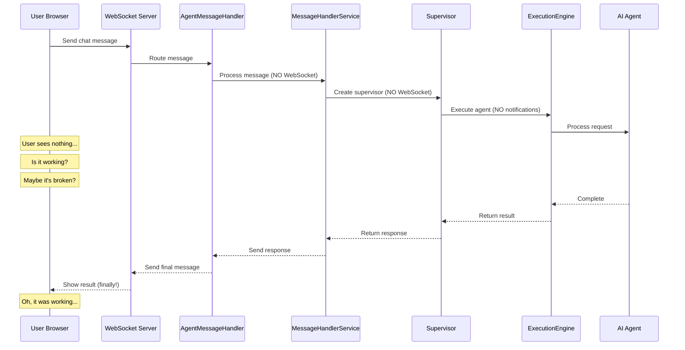
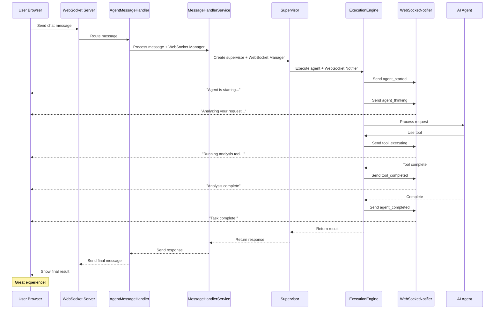

# Chat is King - Critical WebSocket Event Gap Analysis

**Version:** 2.0  
**Date:** 2025-08-31  
**Severity:** CRITICAL  
**Business Value:** $500K+ ARR - Core chat functionality broken  
**Audience:** Product Managers, Engineers (All Levels), Operations, QA

---

## Executive Summary

### For Product Managers
Our core chat functionality is severely compromised. Users send messages but see no feedback while AI agents process their requests. This creates a perception that the system is frozen or broken, directly impacting user retention and conversion. The technical components exist but aren't connected.

- **Fix time:** 2-4 hours
- **Impact:** Immediate restoration of user confidence and engagement

### For Engineers
The WebSocket event system is architecturally complete but disconnected from the actual chat message processing flow. The MessageHandlerService creates supervisor instances without WebSocket integration, causing users to experience no real-time feedback during agent execution. This is an integration gap, not an architectural flaw - all components exist but aren't wired together in the execution path.

---

## Critical Gaps Identified

### Gap #1: Missing Agent-To-WebSocket Bridge in Message Processing
**Severity:** CRITICAL  
**Location:** `netra_backend/app/services/message_handlers.py:134-137`

The supervisor execution happens in isolation from WebSocket notifications. MessageHandlerService creates supervisor instances without WebSocket integration.

**Impact:**
- Users see no real-time feedback during agent execution
- Chat appears broken
- No agent_started, agent_thinking, tool_executing, or agent_completed events sent

**Root Cause:**
- Message handler flow bypasses the WebSocket-enhanced supervisor components
- `supervisor._execute_supervisor()` operates without WebSocket manager injection

### Gap #2: WebSocket Manager Not Injected Into Chat Flow
**Severity:** HIGH  
**Location:** `netra_backend/app/websocket_core/agent_handler.py`

AgentMessageHandler routes to MessageHandlerService but WebSocket manager is never passed through to supervisor initialization.

**Flow Break:**
```
Current:  WebSocket Message → AgentMessageHandler → MessageHandlerService → Supervisor (NO WEBSOCKET)
Required: WebSocket Message → AgentMessageHandler → MessageHandlerService(+WebSocket) → Supervisor(+WebSocket)
```

### Gap #3: Integration Test Infrastructure Failures
**Severity:** HIGH  
**Location:** `tests/mission_critical/test_websocket_agent_events_suite.py`  
**Error:** `TypeError: 'NoneType' object is not callable on IsolatedEnvironment()`

Mission-critical tests fail on real service integration, indicating the WebSocket event flow cannot be validated end-to-end with real components.

### Gap #4: Event Flow Architectural Disconnection
**Severity:** MEDIUM

All WebSocket components exist and are properly implemented:
- ✅ WebSocketNotifier with all 7 event types
- ✅ EnhancedToolExecutionEngine with event sending
- ✅ ExecutionEngine with WebSocket integration
- ✅ AgentRegistry enhancing tool dispatcher

**BUT:** These components are not used in the actual chat message execution path. The enhanced components exist in parallel to the actual execution flow rather than being integrated into it.

---

## Chat Flow Analysis

### Current Broken Flow



### Required Working Flow



### Component Architecture Comparison

```mermaid
graph TB
    subgraph "Current (Broken) Architecture"
        WS1[WebSocket Endpoint]
        AH1[AgentMessageHandler]
        MH1[MessageHandlerService]
        S1[Supervisor - Standalone]
        EE1[ExecutionEngine - No WebSocket]
        
        WS1 --> AH1
        AH1 --> MH1
        MH1 --> S1
        S1 --> EE1
    end
    
    subgraph "Required (Working) Architecture"
        WS2[WebSocket Endpoint]
        AH2[AgentMessageHandler]
        MH2[MessageHandlerService + WebSocket]
        S2[Supervisor + WebSocket]
        EE2[ExecutionEngine + WebSocketNotifier]
        WN[WebSocketNotifier]
        AR[AgentRegistry + Enhancement]
        
        WS2 --> AH2
        AH2 -.->|Inject WebSocket| MH2
        MH2 -.->|Pass WebSocket| S2
        S2 --> EE2
        EE2 --> WN
        AR -.->|Enhance Tools| EE2
        WN -.->|Real-time Events| WS2
    end
    
    style S1 fill:#ff6666
    style EE1 fill:#ff6666
    style S2 fill:#66ff66
    style EE2 fill:#66ff66
    style WN fill:#66ff66
```



---

## Specific Code Locations & Fixes

### 1. MessageHandlerService (`netra_backend/app/services/message_handlers.py`)

**Current (Broken):**
```python
# Line 79 - Current (broken)
def __init__(self, llm_service: LLMService, db_manager: DatabaseManager):
    self.llm_service = llm_service
    self.db_manager = db_manager
    # Missing: self.websocket_manager parameter

# Line 134 - Current (broken)
supervisor = SupervisorConsolidated(
    llm_service=self.llm_service,
    db_manager=self.db_manager,
    # Missing: websocket_manager parameter
)
```

**Fixed:**
```python
# Line 79 - Fixed
def __init__(self, llm_service: LLMService, db_manager: DatabaseManager, 
             websocket_manager: Optional[WebSocketManager] = None):
    self.llm_service = llm_service
    self.db_manager = db_manager
    self.websocket_manager = websocket_manager  # Store for supervisor creation

# Line 134 - Fixed
supervisor = SupervisorConsolidated(
    llm_service=self.llm_service,
    db_manager=self.db_manager,
    websocket_manager=self.websocket_manager,  # Pass through
)
```

### 2. AgentMessageHandler (`netra_backend/app/websocket_core/agent_handler.py`)

**Current (Broken):**
```python
# Current (broken) - Line 32
async def handle_agent_message(self, message: Dict[str, Any], websocket: WebSocket) -> Dict[str, Any]:
    message_handler = MessageHandlerService(
        llm_service=self.llm_service,
        db_manager=self.db_manager
        # Missing: WebSocket manager injection
    )
```

**Fixed:**
```python
# Fixed - Line 32
async def handle_agent_message(self, message: Dict[str, Any], websocket: WebSocket) -> Dict[str, Any]:
    message_handler = MessageHandlerService(
        llm_service=self.llm_service,
        db_manager=self.db_manager,
        websocket_manager=self.websocket_manager  # Inject WebSocket manager
    )
```

### 3. SupervisorConsolidated (`netra_backend/app/agents/supervisor_consolidated.py`)

**Verification Needed:**
```python
# Verify ExecutionEngine initialization includes WebSocketNotifier
class SupervisorConsolidated:
    def __init__(self, ..., websocket_manager: Optional[WebSocketManager] = None):
        # Must create WebSocketNotifier if websocket_manager provided
        if websocket_manager:
            self.websocket_notifier = WebSocketNotifier(websocket_manager)
            self.execution_engine = ExecutionEngine(
                ...,
                websocket_notifier=self.websocket_notifier
            )
        else:
            self.execution_engine = ExecutionEngine(...)
```

---

## Business Impact

### User Experience Impact
- Chat appears unresponsive during agent execution
- Users don't know if their request is being processed
- No visibility into agent progress or tool usage
- Users may abandon requests thinking the system is broken

### Revenue Impact
- **Free tier:** Users won't convert if chat feels broken
- **Paid users:** Will churn due to poor experience
- **Demo flows:** Fail due to lack of real-time feedback
- **Support burden:** Increases from "is it working?" questions

### Example User Experiences

**Current (Broken) Experience:**
```
User: "Analyze my database performance"
System: [No visible feedback for 30 seconds]
User: "Hello? Is this working?"
User: "Maybe I should refresh..."
System: [Finally shows result after 45 seconds]
User: "Oh, it was working... but how was I supposed to know?"
```

**Working Experience:**
```
User: "Analyze my database performance"
System: "🚀 Agent starting..."
System: "🤔 Analyzing your request..."
System: "🔧 Connecting to database..."
System: "📊 Running performance analysis..."
System: "✅ Analysis complete! Here are your results..."
User: "Great! I could see exactly what was happening!"
```

---

## Detailed Technical Analysis

### For Junior Engineers

**Problem Explanation:**

Think of the WebSocket system like a live sports broadcast:
- The game (agent execution) is happening
- The TV cameras (WebSocket components) are working
- BUT the broadcast truck (MessageHandlerService) isn't connected to the cameras
- So viewers (users) see a blank screen while the game plays

We need to connect the broadcast truck to the cameras so viewers can watch the game live.

**Step-by-Step Fix:**
1. Find where chat messages enter the system (AgentMessageHandler)
2. Look for where it creates MessageHandlerService
3. Pass the WebSocket manager as a parameter (like passing a walkie-talkie)
4. MessageHandlerService passes it to Supervisor (relay the walkie-talkie)
5. Supervisor uses it to broadcast updates (talk on the walkie-talkie)
6. Users see real-time updates (hear the broadcast)

### For Senior Engineers

**Architectural Context:**

The WebSocket event architecture follows a publisher-subscriber pattern with these key components:

1. **WebSocketNotifier:** Event publisher that formats and sends WebSocket messages
2. **EnhancedToolExecutionEngine:** Wraps tool execution with event notifications
3. **ExecutionEngine:** Orchestrates agent lifecycle with integrated event publishing
4. **AgentRegistry:** Enhances tool dispatchers with WebSocket capabilities

The integration gap occurs at the service boundary where MessageHandlerService instantiates supervisors without dependency injection of the WebSocket manager. This violates the Dependency Inversion Principle and breaks the event flow.

**Design Patterns:**

- **Dependency Injection:** Current implementation creates Supervisor with hardcoded dependencies. Required: Constructor injection of WebSocket manager through service layers.

- **Decorator Pattern:** The EnhancedToolExecutionEngine decorates base tool execution with notifications. This pattern is correctly implemented but not utilized in the chat flow.

- **Observer Pattern:** WebSocketNotifier acts as the subject, WebSocket connections as observers. The pattern is complete but disconnected from the execution context.

---

## Testing Guide

### Unit Tests

```python
def test_message_handler_receives_websocket_manager():
    websocket_manager = Mock(spec=WebSocketManager)
    message_handler = MessageHandlerService(
        llm_service=mock_llm,
        db_manager=mock_db,
        websocket_manager=websocket_manager
    )
    assert message_handler.websocket_manager is not None
    assert message_handler.websocket_manager == websocket_manager

def test_supervisor_receives_websocket_from_message_handler():
    websocket_manager = Mock(spec=WebSocketManager)
    message_handler = MessageHandlerService(
        llm_service=mock_llm,
        db_manager=mock_db,
        websocket_manager=websocket_manager
    )
    # Mock supervisor creation
    with patch('netra_backend.app.agents.supervisor_consolidated.SupervisorConsolidated') as mock_supervisor:
        message_handler._execute_supervisor(query="test", context={})
        mock_supervisor.assert_called_with(
            llm_service=ANY,
            db_manager=ANY,
            websocket_manager=websocket_manager
        )
```

### Integration Tests

```python
async def test_full_chat_flow_sends_all_events():
    """Mission-critical test: Verify all 7 WebSocket events sent during chat"""
    events_received = []
    
    async with websocket_connect("/ws") as websocket:
        # Set up event capture
        async def capture_events():
            while True:
                msg = await websocket.receive_json()
                events_received.append(msg["type"])
        
        # Send chat message
        await websocket.send_json({
            "type": "agent_message",
            "content": "Analyze my code performance"
        })
        
        # Wait for completion
        await asyncio.wait_for(capture_events(), timeout=30)
        
        # Verify all critical events received
        assert "agent_started" in events_received
        assert "agent_thinking" in events_received
        assert "tool_executing" in events_received
        assert "tool_completed" in events_received
        assert "agent_completed" in events_received
```

### E2E Tests

**Location:** `tests/mission_critical/test_websocket_agent_events_suite.py`  
**Command:** `python tests/mission_critical/test_websocket_agent_events_suite.py`

**Expected Output:**
```
All 7 WebSocket events detected in chat flow:
✓ agent_started
✓ agent_thinking
✓ tool_executing
✓ tool_completed
✓ agent_completed
✓ final_response
✓ error (when applicable)
```

---

## Implementation Checklist

### Phase 1: Immediate Fix (2-4 hours)
- [ ] Update MessageHandlerService.__init__ to accept websocket_manager
- [ ] Update AgentMessageHandler to pass websocket_manager
- [ ] Update SupervisorConsolidated to accept and use websocket_manager
- [ ] Verify ExecutionEngine receives WebSocketNotifier

### Phase 2: Validation (1-2 hours)
- [ ] Run mission-critical WebSocket event tests
- [ ] Manual testing with real chat scenarios
- [ ] Verify all 7 event types are sent
- [ ] Load test with multiple concurrent chats

### Phase 3: Monitoring (2-3 hours)
- [ ] Add logging for WebSocket event dispatch
- [ ] Create dashboard for event flow monitoring
- [ ] Set up alerts for missing events
- [ ] Track user engagement metrics

---

## WebSocket Event Reference

### Event: `agent_started`
**Purpose:** Notify user that agent processing has begun
```json
{
  "type": "agent_started",
  "agent_id": "supervisor_123",
  "message": "Agent is starting to process your request",
  "timestamp": "2025-08-31T10:00:00Z"
}
```

### Event: `agent_thinking`
**Purpose:** Show agent's reasoning process to user
```json
{
  "type": "agent_thinking",
  "thought": "I need to analyze the database schema first...",
  "timestamp": "2025-08-31T10:00:01Z"
}
```

### Event: `tool_executing`
**Purpose:** Inform user that a specific tool is being used
```json
{
  "type": "tool_executing",
  "tool_name": "database_analyzer",
  "description": "Analyzing database performance metrics",
  "timestamp": "2025-08-31T10:00:02Z"
}
```

### Event: `tool_completed`
**Purpose:** Show tool execution results
```json
{
  "type": "tool_completed",
  "tool_name": "database_analyzer",
  "result_summary": "Found 3 slow queries",
  "timestamp": "2025-08-31T10:00:05Z"
}
```

### Event: `agent_completed`
**Purpose:** Signal that agent has finished processing
```json
{
  "type": "agent_completed",
  "agent_id": "supervisor_123",
  "status": "success",
  "message": "Analysis complete",
  "timestamp": "2025-08-31T10:00:10Z"
}
```

---

## Regression Prevention

### Rules
ANY changes to MessageHandlerService or AgentMessageHandler MUST:
1. Verify WebSocket manager is properly injected
2. Run mission-critical WebSocket event tests
3. Test with real user chat scenarios
4. Validate all 7 critical events are sent

### Production Monitoring
Monitor for:
- Chat messages with no corresponding agent_started events
- Agent executions without tool_executing/tool_completed pairs
- Users sending multiple messages due to lack of feedback
- High abandonment rates during agent processing

---

## Architectural Notes

### Current State
The WebSocket event architecture is well-designed and feature-complete:
- The AgentRegistry properly enhances tool dispatchers with WebSocket notifications
- The ExecutionEngine properly sends agent lifecycle events
- The problem is purely in the integration layer - the chat flow doesn't use these enhanced components

### Solution Approach
The fix is NOT about building new WebSocket functionality. The fix is about connecting the existing WebSocket-enhanced components to the actual chat message processing flow. This is an integration problem, not an architecture problem.

---

## References

### Specifications
- `SPEC/learnings/websocket_agent_integration_critical.xml`
- `SPEC/independent_services.xml`
- `SPEC/type_safety.xml`

### Code Files
- `netra_backend/app/services/message_handlers.py`
- `netra_backend/app/websocket_core/agent_handler.py`
- `netra_backend/app/agents/supervisor_consolidated.py`
- `netra_backend/app/core/websocket_notifier.py`
- `netra_backend/app/agents/supervisor/execution_engine.py`

### Tests
- `tests/mission_critical/test_websocket_agent_events_suite.py`

---

## Summary

### For Executives
Our chat system - the primary value delivery channel - has a critical integration gap that makes it appear broken to users. The fix is straightforward (2-4 hours) and will immediately restore user confidence, reduce support burden, and improve conversion rates. This is our #1 priority.

### For Product Managers
Users currently experience a "blank screen" effect during AI processing, leading to confusion, frustration, and abandonment. The technical components for real-time feedback exist but aren't connected. Once fixed, users will see live updates about what the AI is doing, creating a responsive, engaging chat experience that builds trust and demonstrates value.

### For Engineers
The WebSocket event architecture is complete and well-designed. The gap is purely at the integration layer where MessageHandlerService creates supervisors without WebSocket dependency injection. This is a simple plumbing fix - pass the WebSocket manager through the service layers to the supervisor. No new components needed, just connecting existing ones.