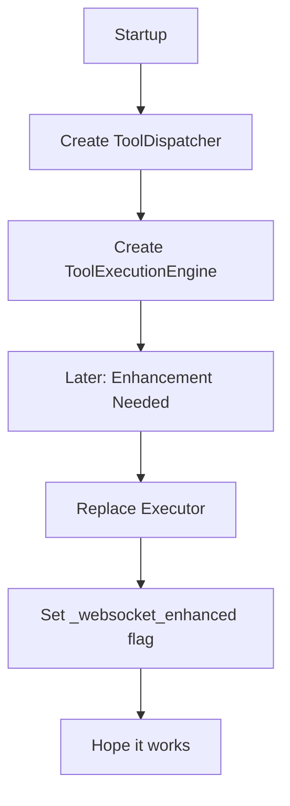
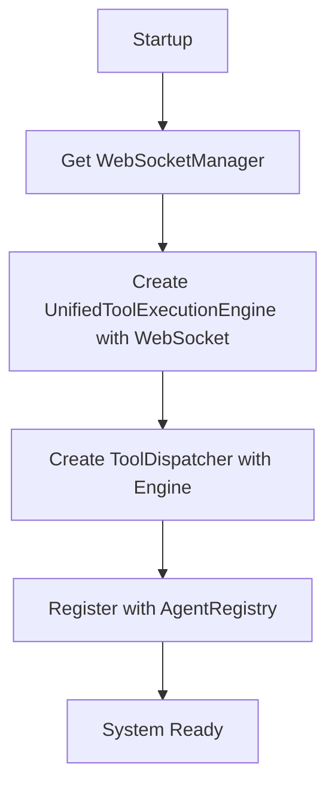

# SSOT Tool Enhancement Fix Plan

## Problem Summary
The current "enhancement" pattern violates SSOT by:
1. Creating multiple paths to configure WebSocket support
2. Using hidden `_websocket_enhanced` flags for state management
3. Replacing executors at runtime instead of proper initialization
4. Confusing naming that suggests optional functionality for critical features

## Proposed Architecture

### Current (Problematic) Flow


### New (Clean) Flow


## Implementation Steps

### Step 1: Remove Enhancement Pattern
- Delete `enhance_tool_dispatcher_with_notifications()` function
- Remove all `_websocket_enhanced` flag checks
- Remove `_ensure_tool_dispatcher_enhancement()` from startup

### Step 2: Direct Initialization
Modify `ToolDispatcher.__init__()` to accept WebSocketManager directly:
```python
class ToolDispatcher:
    def __init__(self, tools: List[BaseTool] = None, websocket_manager: Optional['WebSocketManager'] = None):
        self._init_components(websocket_manager)
        self._register_initial_tools(tools)
    
    def _init_components(self, websocket_manager: Optional['WebSocketManager']) -> None:
        self.registry = ToolRegistry()
        # Always use UnifiedToolExecutionEngine
        self.executor = UnifiedToolExecutionEngine(websocket_manager)
        self.validator = ToolValidator()
```

### Step 3: Update AgentRegistry
Simplify `set_websocket_manager()`:
```python
def set_websocket_manager(self, manager: 'WebSocketManager') -> None:
    """Set websocket manager on registry and agents."""
    if manager is None:
        raise ValueError("WebSocketManager cannot be None")
    
    self.websocket_manager = manager
    
    # Set on all registered agents (backward compatibility)
    for agent_name, agent in self.agents.items():
        agent.websocket_manager = manager
```

### Step 4: Update Startup Sequence
```python
async def _phase3_agent_infrastructure(self) -> None:
    # Get WebSocketManager first
    websocket_manager = get_websocket_manager()
    
    # Create tool dispatcher with WebSocket support from the start
    tool_dispatcher = ToolDispatcher(websocket_manager=websocket_manager)
    
    # Create agent registry
    registry = AgentRegistry(
        llm_manager=llm_manager,
        tool_dispatcher=tool_dispatcher
    )
    
    # Set WebSocket manager on registry (for agents)
    registry.set_websocket_manager(websocket_manager)
```

### Step 5: Clean Up ToolExecutionEngine
Remove the delegation pattern - make it simpler:
```python
class ToolExecutionEngine:
    """Simple wrapper that is always unified."""
    def __init__(self, websocket_manager: Optional['WebSocketManager'] = None):
        # No delegation, direct implementation
        self.websocket_manager = websocket_manager
        self.notifier = WebSocketNotifier(websocket_manager) if websocket_manager else None
```

## Migration Safety

### Test Coverage Required
1. All existing WebSocket event tests must pass
2. Tool execution must work with and without WebSocket
3. Startup sequence must be deterministic

### Rollback Plan
If issues arise:
1. Keep old enhancement function but deprecate it
2. Add logging to track usage
3. Remove in next iteration

## Success Criteria
- [ ] No `_websocket_enhanced` flags in codebase
- [ ] No `enhance_tool_dispatcher` functions
- [ ] Single initialization path for tool execution
- [ ] All mission critical tests pass
- [ ] WebSocket events still fire correctly