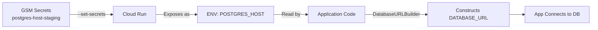

# Staging GSM Configuration - The CORRECT Solution

## The Real Problem

The deployment script (`deploy_to_gcp.py`) correctly uses `--set-secrets` to reference Google Secret Manager secrets. When you use `--set-secrets`, Cloud Run:

1. Mounts the secrets as files at `/secret/<secret-name>`
2. **ALSO exposes them as environment variables** with the name you specify

The format is: `--set-secrets ENV_VAR_NAME=gsm-secret-name:latest`

## What's Actually Happening

The deployment script calls:
```python
backend_secrets = SecretConfig.generate_secrets_string("backend", "staging")
# Returns: "POSTGRES_HOST=postgres-host-staging:latest,POSTGRES_USER=postgres-user-staging:latest,..."
cmd.extend(["--set-secrets", backend_secrets])
```

This tells Cloud Run to:
- Fetch secret `postgres-host-staging` from GSM
- Expose it as environment variable `POSTGRES_HOST`
- Also mount it at `/secret/POSTGRES_HOST`

## The ACTUAL Problem

**The GSM secrets don't exist!** The deployment expects these secrets in Google Secret Manager:
- `postgres-host-staging`
- `postgres-user-staging`
- `postgres-password-staging`
- `jwt-secret-staging`
- `secret-key-staging`
- etc.

But they were never created!

## The Solution

### Step 1: Check What Secrets Exist

```bash
python scripts/fix_staging_gsm_secrets.py --project netra-staging --check-only
```

### Step 2: Create Missing Secrets

```bash
python scripts/fix_staging_gsm_secrets.py --project netra-staging --create
```

This creates all required secrets with placeholder values.

### Step 3: Update Critical Secrets with Real Values

```bash
# Set your actual Cloud SQL password
echo "your-actual-db-password" | gcloud secrets versions add postgres-password-staging --data-file=- --project=netra-staging

# Set your Memorystore Redis IP
echo "10.123.45.67" | gcloud secrets versions add redis-host-staging --data-file=- --project=netra-staging

# Generate secure JWT secret
echo "$(openssl rand -base64 64)" | gcloud secrets versions add jwt-secret-staging --data-file=- --project=netra-staging

# Generate secure secret key
echo "$(openssl rand -base64 64)" | gcloud secrets versions add secret-key-staging --data-file=- --project=netra-staging
```

### Step 4: Deploy

```bash
python scripts/deploy_to_gcp.py --project netra-staging --build-local
```

## How It Works



## Required GSM Secrets

Based on `deployment/secrets_config.py`, these secrets MUST exist in GSM:

| GSM Secret Name | Environment Variable | Purpose |
|-----------------|---------------------|---------|
| postgres-host-staging | POSTGRES_HOST | Cloud SQL instance path |
| postgres-port-staging | POSTGRES_PORT | Database port (5432) |
| postgres-db-staging | POSTGRES_DB | Database name |
| postgres-user-staging | POSTGRES_USER | Database username |
| postgres-password-staging | POSTGRES_PASSWORD | Database password |
| jwt-secret-staging | JWT_SECRET_STAGING | JWT signing |
| jwt-secret-key-staging | JWT_SECRET_KEY | JWT key |
| secret-key-staging | SECRET_KEY | App secret |
| service-secret-staging | SERVICE_SECRET | Inter-service auth |
| redis-host-staging | REDIS_HOST | Redis IP |

## The Application Code is Correct

The application correctly:
1. Reads environment variables (set by Cloud Run from GSM)
2. Uses `DatabaseURLBuilder` to construct URLs from `POSTGRES_*` env vars
3. Falls back to reading directly from GSM API if needed

## What NOT to Do

❌ DON'T modify the deployment script to retrieve and set secret values
❌ DON'T modify the application to read from `/secret/*` files
❌ DON'T change how `--set-secrets` works

✅ DO ensure the GSM secrets exist with correct values
✅ DO use the exact secret names expected by `secrets_config.py`
✅ DO let Cloud Run handle the secret-to-env-var mapping

## Verification

After deploying, verify the service has the env vars:

```bash
gcloud run services describe netra-backend-staging \
  --region=us-central1 \
  --project=netra-staging \
  --format=json | jq '.spec.template.spec.containers[0].env'
```

The output should show environment variables populated from GSM.

## Summary

The staging failure was simply due to missing GSM secrets. The deployment and application code are correct - they just need the secrets to actually exist in Google Secret Manager.