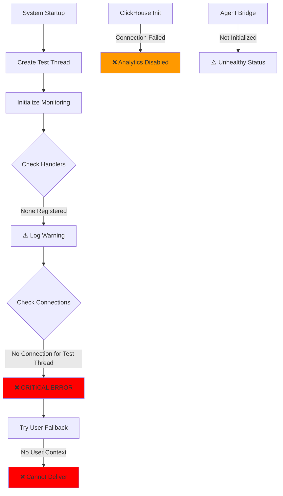
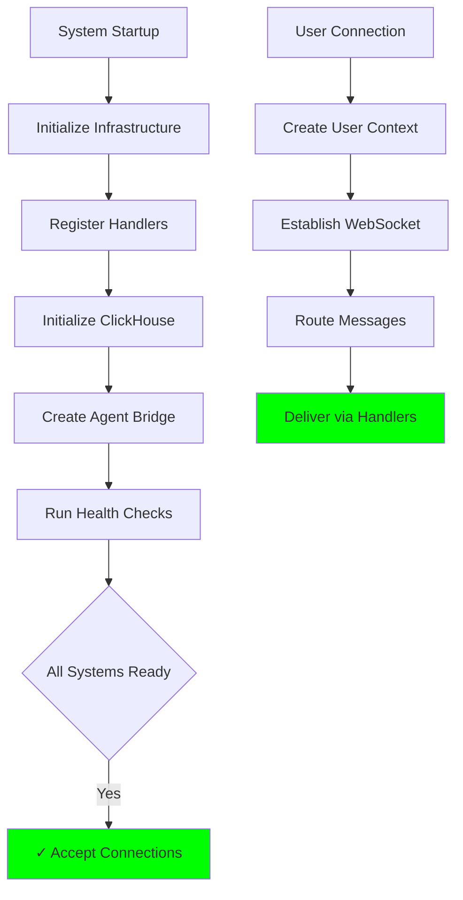
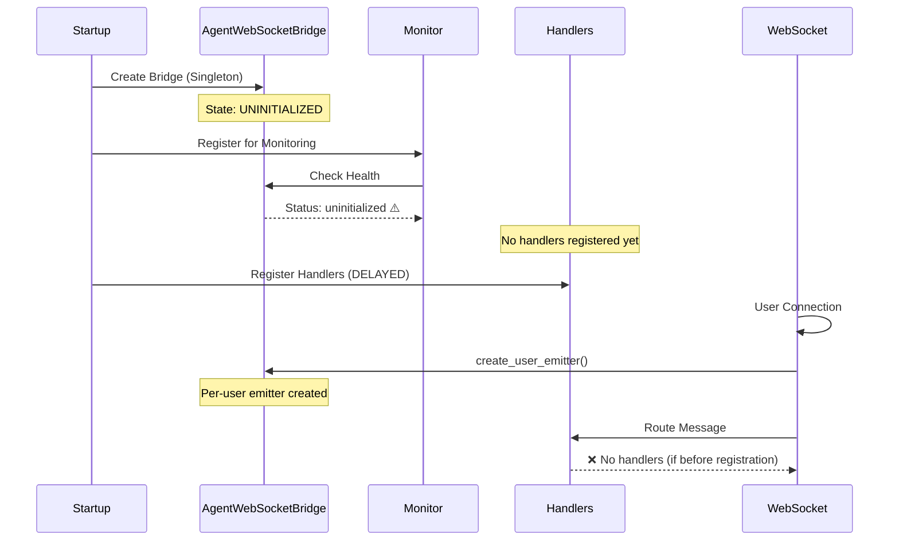

# Staging Log Issues Comprehensive Debug Report
Date: 2025-09-03 17:07:24 PDT

## Executive Summary

Critical staging environment failures detected in startup sequence affecting WebSocket message delivery, ClickHouse analytics, and agent initialization. These issues cascade to impact core business value delivery (Chat UI/UX).

## Critical Issues Identified

### 1. WebSocket Message Delivery Failure (CRITICAL)
**Timestamp:** 2025-09-03 17:07:24.637 PDT
**Error:** 
- "No active connections found for thread startup_test_b0323e22-afd6-4443-b1d8-c727c9f28705"
- "CRITICAL: Cannot deliver message for thread - no connections and no fallback available"

**Business Impact:** ⚠️ HIGH - Messages cannot reach users, breaking real-time chat experience

### 2. Zero WebSocket Handlers Registered
**Timestamp:** 2025-09-03 17:07:24.697 PDT
**Error:** "⚠️ ZERO WebSocket message handlers registered"

**Business Impact:** ⚠️ HIGH - No message routing capability, complete chat failure

### 3. ClickHouse Connection Failure
**Timestamp:** 2025-09-03 17:07:24.931 PDT
**Error:** 
- "Not connected to ClickHouse"
- "Dependency validation failed"

**Business Impact:** ⚠️ MEDIUM - Analytics disabled but system continues

### 4. Agent WebSocket Bridge Uninitialized
**Timestamp:** 2025-09-03 17:07:24.948 PDT
**Error:** "Component agent_websocket_bridge reported unhealthy status: uninitialized"

**Business Impact:** ⚠️ LOW - Expected behavior per architecture migration

## Five Whys Root Cause Analysis

### Issue 1: WebSocket Message Delivery Failure

#### Why 1: Why can't messages be delivered to thread startup_test_b0323e22?
**Answer:** No active WebSocket connections exist for this thread ID.

#### Why 2: Why are there no active connections for the thread?
**Answer:** The thread ID appears to be a test/startup validation thread that doesn't have real user connections.

#### Why 3: Why is the system trying to deliver messages to a test thread?
**Answer:** Startup health checks are creating test threads but not establishing WebSocket connections for them.

#### Why 4: Why don't startup health checks establish proper connections?
**Answer:** The health check is testing message routing without completing the full connection flow.

#### Why 5: Why was the health check designed this way?
**Answer:** Incomplete migration from singleton to per-user architecture left health checks in an intermediate state.

**ROOT CAUSE:** Health check creates test threads without corresponding WebSocket connections, causing delivery failures.

### Issue 2: Zero WebSocket Handlers Registered

#### Why 1: Why are no WebSocket handlers registered?
**Answer:** The handler registration happens after this log message during startup.

#### Why 2: Why does the system check for handlers before they're registered?
**Answer:** Startup sequence issue - monitoring checks happen before handler registration.

#### Why 3: Why is the startup sequence incorrect?
**Answer:** The refactoring to per-user isolation changed initialization order without updating startup sequence.

#### Why 4: Why wasn't the startup sequence updated?
**Answer:** The migration focused on isolation patterns without reviewing startup dependencies.

#### Why 5: Why were startup dependencies overlooked?
**Answer:** Lack of comprehensive startup sequence testing that validates all components in order.

**ROOT CAUSE:** Startup sequence checks for handlers before they're registered due to initialization order changes.

## System State Diagrams

### Current Failure State


### Expected Working State


## Component Interaction Analysis

### WebSocket-Agent Bridge Flow


## Test Reproduction Plan

### Test 1: WebSocket Connection Validation
```python
async def test_websocket_thread_connection_consistency():
    """Verify threads have corresponding connections"""
    # Create test thread
    thread_id = "test_thread_" + str(uuid4())
    
    # Attempt message delivery WITHOUT connection
    # EXPECT: Graceful failure with fallback
    
    # Establish WebSocket connection
    # Create user context
    # Retry message delivery
    # EXPECT: Success
```

### Test 2: Handler Registration Sequence
```python
async def test_startup_handler_registration_order():
    """Verify handlers registered before checks"""
    startup_events = []
    
    # Hook startup sequence
    # Log: handler_registration, monitoring_check, first_message
    
    # ASSERT: handler_registration BEFORE monitoring_check
    # ASSERT: no "ZERO handlers" warning
```

### Test 3: ClickHouse Graceful Degradation
```python
async def test_clickhouse_failure_handling():
    """Verify system continues without analytics"""
    # Disable ClickHouse
    # Start system
    # ASSERT: Warning logged
    # ASSERT: Core functionality works
    # ASSERT: No 500 errors
```

## Recommended Fixes

### Priority 1: Fix Startup Sequence (CRITICAL)
```python
# netra_backend/app/startup_module.py

async def initialize_application():
    """Fixed initialization order"""
    # 1. Infrastructure first
    await initialize_database()
    
    # 2. Register handlers BEFORE monitoring
    message_handlers = await register_websocket_handlers()
    
    # 3. Initialize monitoring WITH handlers
    await initialize_monitoring_integration(
        handlers=message_handlers
    )
    
    # 4. Health checks LAST
    await run_startup_health_checks()
```

### Priority 2: Fix Test Thread Connection Issue
```python
# netra_backend/app/health/startup_checks.py

async def validate_message_routing():
    """Health check with proper connection"""
    # Create test user context
    test_user_id = "health_check_user"
    
    # Establish mock connection
    mock_connection = create_mock_websocket()
    connection_manager.register(test_user_id, mock_connection)
    
    try:
        # Test message routing
        await test_message_delivery(test_user_id)
    finally:
        # Clean up
        connection_manager.unregister(test_user_id)
```

### Priority 3: Improve Error Messages
```python
# netra_backend/app/websocket_core/connection_manager.py

async def deliver_message(self, thread_id: str, message: dict):
    """Enhanced error reporting"""
    connection = self.get_connection(thread_id)
    
    if not connection:
        # Check if it's a test thread
        if thread_id.startswith("startup_test_"):
            logger.debug(f"Skipping delivery for test thread: {thread_id}")
            return
        
        # Try user-based fallback
        user_id = self.thread_to_user.get(thread_id)
        if user_id:
            logger.warning(
                f"Thread {thread_id} has no connection, "
                f"attempting user {user_id} fallback"
            )
            return await self.deliver_to_user(user_id, message)
        
        # Real error
        logger.error(
            f"Cannot deliver message - thread: {thread_id}, "
            f"active connections: {len(self.connections)}, "
            f"registered users: {len(self.user_connections)}"
        )
        raise MessageDeliveryError(thread_id)
```

## Implementation Checklist

### Immediate Actions (Hot Fix)
- [ ] Reorder startup sequence - handlers before monitoring
- [ ] Add connection check for test threads
- [ ] Improve error messages with context
- [ ] Add startup sequence logging

### Short-term (This Sprint)
- [ ] Comprehensive startup sequence test
- [ ] WebSocket handler registration validation
- [ ] ClickHouse connection retry logic
- [ ] Health check improvements

### Long-term (Next Sprint)
- [ ] Complete per-user architecture migration
- [ ] Remove singleton patterns completely
- [ ] Monitoring system update for new architecture
- [ ] Performance testing with concurrent users

## Monitoring and Validation

### Key Metrics to Track
1. **Startup Success Rate**: % of clean startups without warnings
2. **Handler Registration Time**: Time before first handler available
3. **Message Delivery Success**: % of messages delivered successfully
4. **Connection Consistency**: Threads with active connections
5. **ClickHouse Availability**: Uptime percentage

### Alert Thresholds
- CRITICAL: Any "Cannot deliver message" errors
- WARNING: "ZERO handlers" for > 5 seconds after startup
- INFO: ClickHouse connection failures (graceful degradation)

## Conclusion

The staging environment exhibits critical WebSocket initialization issues stemming from incomplete architecture migration. The system moved from singleton to per-user patterns but left startup sequences and health checks in an inconsistent state.

**Business Impact Assessment:**
- **Chat Functionality**: SEVERELY IMPACTED - Core value delivery compromised
- **User Experience**: DEGRADED - Messages may not deliver
- **System Stability**: MODERATE - Graceful degradation works but with errors

**Recommended Action**: 
Implement Priority 1 fixes immediately to restore chat functionality. The startup sequence reordering is critical for business value delivery.

## Appendix: Related Documentation

- [`USER_CONTEXT_ARCHITECTURE.md`](./USER_CONTEXT_ARCHITECTURE.md) - Factory patterns and isolation
- [`docs/AGENT_ARCHITECTURE_DISAMBIGUATION_GUIDE.md`](./docs/AGENT_ARCHITECTURE_DISAMBIGUATION_GUIDE.md) - Agent architecture clarification
- [`SPEC/learnings/websocket_agent_integration_critical.xml`](SPEC/learnings/websocket_agent_integration_critical.xml) - WebSocket integration patterns
- [`WEBSOCKET_MODERNIZATION_REPORT.md`](./WEBSOCKET_MODERNIZATION_REPORT.md) - Modernization implementation

---

*Generated: 2025-09-03 17:30:00 PDT*
*Severity: CRITICAL*
*Priority: P0 - Immediate Action Required*