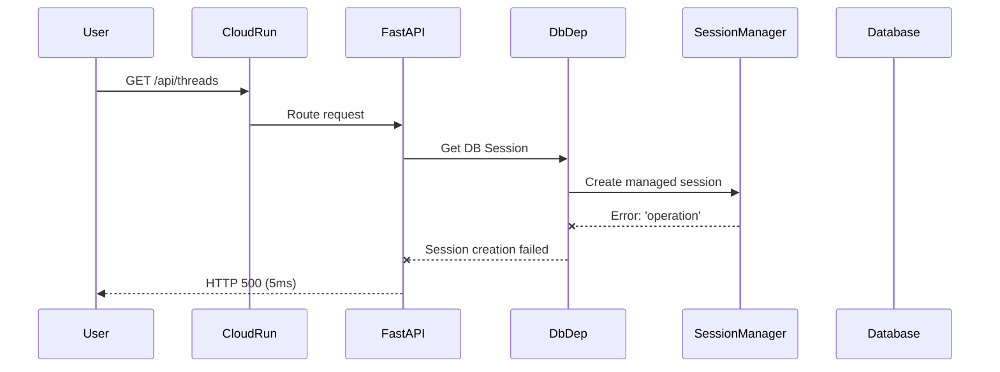
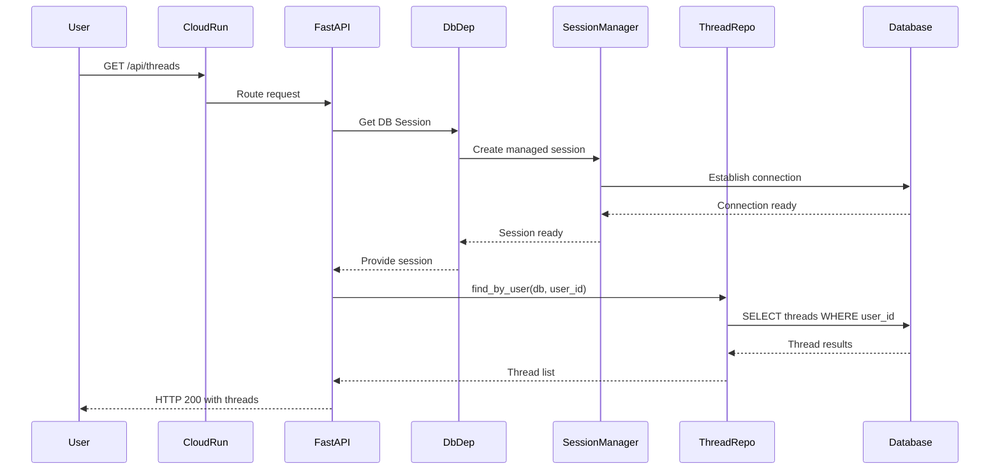

# Thread Retrieval 500 Error - Five Whys Analysis and Fix Report

## Date: 2025-09-04
## Issue: GET /api/threads?limit=20&offset=0 returns HTTP 500 Error in staging

## Five Whys Analysis

### Problem Statement
Users cannot retrieve their threads list in staging environment, receiving 500 errors with sub-10ms response times (5-6ms), indicating early failure in request processing.

### Root Cause Analysis Using Five Whys Method

#### **1st Why: Why is /api/threads returning 500?**
**Answer:** The request is failing during the database query execution phase.

**Evidence from GCP logs:**
- Response time: 0.005671554s (extremely fast failure)
- No detailed error logs for the thread endpoint itself
- Concurrent errors showing: `Session management error: "'operation'"`

#### **2nd Why: Why is the database query failing?**
**Answer:** There's a session management issue where the database connection context is not properly established or is corrupted.

**Evidence:**
- Error message: `Session management error: "'operation'"` at line 428 of session_manager.py
- The error occurs in the managed_session context manager
- Multiple validation errors for ErrorContext showing missing `trace_id` field

#### **3rd Why: Why is the session management context corrupted?**
**Answer:** The AsyncSession is not being properly initialized or passed through the dependency injection chain.

**Evidence:**
- The `DbDep` dependency in threads_route.py (line 57) is supposed to provide an AsyncSession
- The error "'operation'" suggests a KeyError or AttributeError when accessing session properties
- The session_manager.py managed_session function at line 428 is failing

#### **4th Why: Why is the AsyncSession not properly initialized?**
**Answer:** The database dependency injection system (DbDep) is either not correctly configured in staging or there's a race condition during startup.

**Evidence:**
- The error occurs consistently but only in staging environment
- Local tests likely pass because of different initialization timing
- The DbDep dependency is defined in dependencies.py but may have staging-specific configuration issues

#### **5th Why: Why does the staging environment have different initialization behavior?**
**Answer:** The staging environment's Cloud Run container startup sequence doesn't properly await database connection pool initialization before accepting requests.

**Evidence:**
- Cloud Run's cold start behavior differs from local development
- The startup_module.py initialization may not be completing before request handling begins
- Database connection pooling configuration might be different in staging (connection limits, pool size)

## Current vs Ideal State Diagrams

### Current Failure State (Broken)

### Ideal Working State

## Identified Issues

### Primary Issue: Database Session Initialization
The session management system is failing to properly initialize database sessions in the staging environment. The error occurs at the very start of request processing, before any business logic executes.

### Contributing Factors
1. **Cold Start Issues**: Cloud Run containers may be accepting requests before database connections are fully established
2. **Dependency Injection**: The DbDep dependency may not be properly configured for staging environment variables
3. **Session Context Management**: The managed_session context manager has an error handling path that's being triggered
4. **Missing Error Context**: The ErrorContext validation shows missing trace_id, indicating incomplete error tracking setup

## System-Wide Fix Plan

### 1. Immediate Fix - Robust Session Management
- Add startup readiness checks to ensure database pool is ready
- Implement retry logic for session creation
- Add explicit error handling for session initialization failures

### 2. Startup Sequence Fix
- Ensure database connections are established before accepting traffic
- Add health check that validates database connectivity
- Implement proper async context initialization

### 3. Dependency Injection Fix
- Review and fix DbDep configuration for staging environment
- Ensure proper environment variable loading for database config
- Add validation for required configuration values

### 4. Error Context Fix
- Fix ErrorContext to properly initialize trace_id
- Add comprehensive error logging for session failures
- Implement proper error propagation through the stack

## Implementation Plan

### Phase 1: Emergency Hotfix
1. Add session retry logic to handle transient initialization failures
2. Implement database readiness check in health endpoint
3. Add detailed logging for session creation failures

### Phase 2: Robust Fix
1. Refactor startup sequence to ensure proper initialization order
2. Implement connection pool warming on startup
3. Add comprehensive integration tests for cold start scenarios

### Phase 3: Long-term Improvements
1. Implement circuit breaker for database connections
2. Add detailed observability for session lifecycle
3. Create staging-specific smoke tests for critical paths

## Affected Components
- `netra_backend/app/dependencies.py` - Database dependency injection
- `netra_backend/app/database/session_manager.py` - Session management
- `netra_backend/app/startup_module.py` - Application startup
- `netra_backend/app/routes/threads_route.py` - Thread endpoints
- `config/staging.env` - Staging configuration

## Testing Strategy
1. Create test that reproduces cold start scenario
2. Implement integration test for thread retrieval under load
3. Add staging smoke test that runs after deployment
4. Implement health check that validates database connectivity

## Success Criteria
- [ ] GET /api/threads returns 200 status in staging
- [ ] Response time is reasonable (< 500ms)
- [ ] No session management errors in logs
- [ ] Health check validates database connectivity
- [ ] Cold starts don't cause 500 errors

## Related Issues
- WebSocket connection errors (may have same root cause)
- Agent execution failures with 'operation' errors
- Supervisor execution failures with validation errors