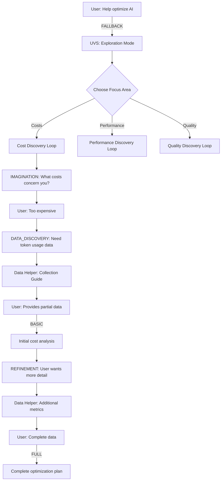
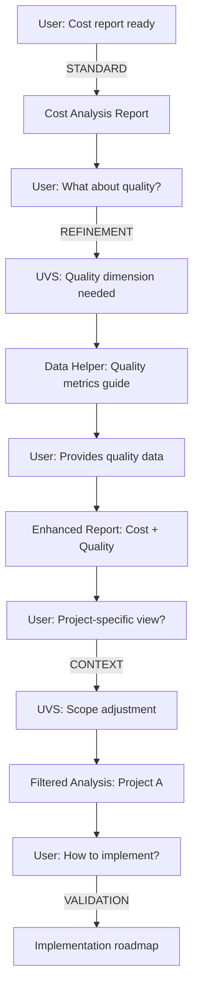
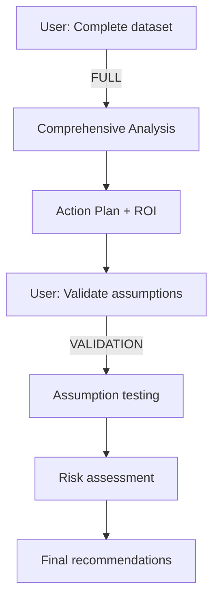
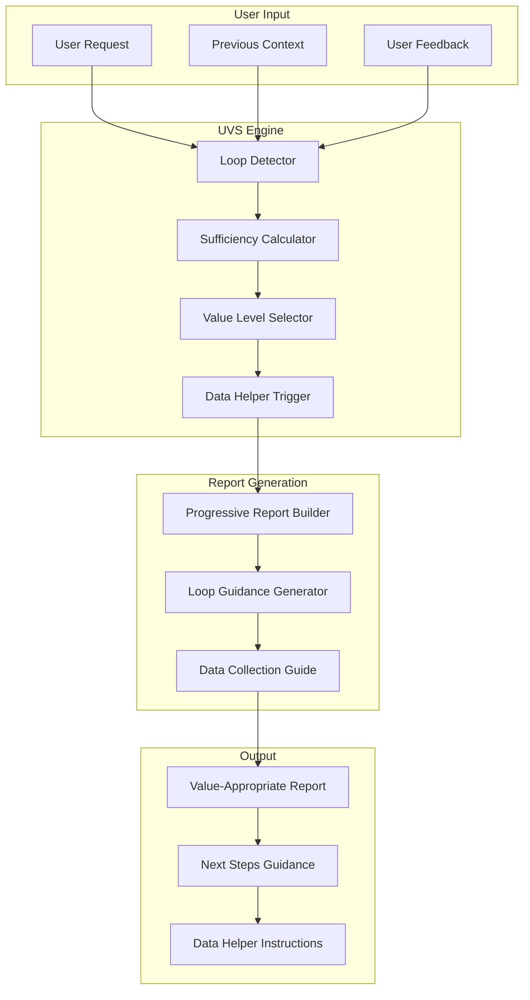
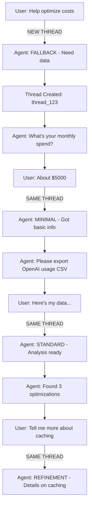

# Unified User Value System (UVS) Requirements
## ReportingSubAgent Enhancement Specification v1.0

**Document Status:** FINAL REQUIREMENTS  
**Component:** `netra_backend/app/agents/reporting_sub_agent.py`  
**Business Impact:** 100% user value delivery guarantee  

---

## 1. Executive Summary

The Unified User Value System (UVS) transforms ReportingSubAgent from a static report generator into an adaptive value delivery system that guides users through iterative discovery loops. The system guarantees 100% value delivery through progressive fallback levels and automatic data helper integration.

### What UVS Is
UVS is an intelligent fallback and guidance system that:
- **DETECTS** when users have insufficient data for full analysis
- **ADAPTS** the report output to match available data levels
- **GUIDES** users through data collection with specific instructions
- **DELIVERS** value at every stage, even with minimal or no data

### When UVS Triggers
The system activates automatically when:
1. **Data Sufficiency < 70%** - Missing critical analysis components
2. **User Requests Help** - Keywords like "help", "what data", "how to"
3. **Analysis Confidence < 50%** - Low confidence due to data gaps
4. **User in Discovery Loop** - Detected iterative exploration patterns
5. **Critical Fields Missing** - Essential data points not provided

### How UVS Works
1. **Assessment Phase**: Calculates data sufficiency score (0-100%)
2. **Level Selection**: Chooses appropriate value level (FULL/STANDARD/BASIC/MINIMAL/FALLBACK)
3. **Report Generation**: Creates report matching the data availability
4. **Guidance Addition**: Adds specific next steps and data collection instructions
5. **Loop Management**: Tracks user progress through iterative refinements

### How to Control UVS

UVS IS default and always on.

#### Force Specific Behavior
```python
# Force a specific value level
context.metadata['force_uvs_level'] = 'BASIC'  # Options: FULL, STANDARD, BASIC, MINIMAL, FALLBACK

# Disable data helper
context.metadata['disable_data_helper'] = False

# Set minimum confidence threshold
context.metadata['min_confidence_threshold'] = 0.8  # Only trigger if confidence < 80%
```

The idea is simply that no matter what the prompt is or eariler agents are
we will return something that is reasonable.
AND it will be actionable to take next step not "generic" fallbacks.


#### Configuration Options
```python
# Global configuration (in environment)
UVS_ENABLED=true                    # Master switch
UVS_DEFAULT_LEVEL=STANDARD         # Default when no data
UVS_DATA_HELPER_AUTO=true          # Auto-trigger data helper
UVS_CONFIDENCE_THRESHOLD=0.5       # Minimum confidence before fallback
```

### Core Value Proposition
- **Zero Crashes:** 100% request success rate through progressive VALUE Add fallbacks
centered around llm provided context NOT static stuff.
- **Iterative Discovery:** Guide users from vague problems to actionable insights
- **Data Gap Filling:** Automatic detection and resolution of missing data
- **Progressive Value:** Deliver maximum value at every data sufficiency level

---

## 2. UVS Loop Specifications

Examples
Assume triage always runs first then:
1) Imagination agent runs -> UVS system returns response
2) DATA_DISCOVERY agents runs -> UVS system returns response
3) Optimization agent runs ->  UVS system returns response

So it's always UVS responding in V1.

And sometimes (optional: Disabled for V1) UVS will also "add" an additional tool or agent loop AFTER the original order.
For example, if originally we thought there was enouogh data
but then when the data agent queried it returned 0 results

### 2.1 Loop Type Definitions

```python
class UVSLoopType(Enum):
    IMAGINATION = "imagination"      # User has problem, no data
    DATA_DISCOVERY = "discovery"     # User has goal, missing data  
    REFINEMENT = "refinement"        # User has report, needs more
    CONTEXT = "context"              # User refining scope
    VALIDATION = "validation"        # User verifying recommendations
```

### 2.2 Loop Detection Patterns

```python
UVS_LOOP_DETECTORS = {
    'IMAGINATION': {
        'triggers': [
            lambda ctx: len(ctx.metadata) < 2,
            lambda ctx: not ctx.metadata.get('data_result'),
            lambda ctx: 'help' in ctx.metadata.get('user_request', '').lower()
        ],
        'confidence_threshold': 0.3
    },
    'DATA_DISCOVERY': {
        'triggers': [
            lambda ctx: ctx.metadata.get('data_sufficiency', 0) < 0.4,
            lambda ctx: bool(ctx.metadata.get('missing_data_fields')),
            lambda ctx: 'what data' in ctx.metadata.get('user_request', '').lower()
        ],
        'confidence_threshold': 0.5
    },
}
```

### 2.3 Loop Response Strategies

```python
class LoopResponseStrategy:
    """Defines response strategy for each loop type"""
    
    STRATEGIES = {
        'IMAGINATION': {
            'primary_action': 'guide_to_problem_definition',
            'data_helper_mode': 'exploratory',
            'questions': [
                "What specific AI costs concern you most?",
                "Which models/providers are you using?",
                "What's your current monthly spend range?",
                "What are your performance requirements?"
            ],
            'suggested_metrics': [
                'token_usage', 'request_latency', 'error_rates', 
                'model_distribution', 'peak_usage_times'
            ],
            'next_steps': 'Collect baseline metrics from suggested sources'
        },
        'DATA_DISCOVERY': {
            'primary_action': 'identify_data_gaps',
            'data_helper_mode': 'targeted_collection',
            'gap_analysis': True,
            'collection_priority': ['critical', 'important', 'nice_to_have'],
            'next_steps': 'Fill critical data gaps first'
        },

        """
        FUTURE (not implemetned now ) :
        'REFINEMENT': {
            'primary_action': 'extend_existing_analysis',
            'data_helper_mode': 'supplementary',
            'preserve_context': True,
            'merge_strategy': 'additive',
            'next_steps': 'Add requested dimensions to analysis'
        },
        'CONTEXT': {
            'primary_action': 'adjust_analysis_scope',
            'data_helper_mode': 'scope_specific',
            'scope_options': ['project', 'team', 'department', 'company'],
            'filter_strategy': 'hierarchical',
            'next_steps': 'Apply scope filters and re-analyze'
        },
        'VALIDATION': {
            'primary_action': 'provide_implementation_guidance',
            'data_helper_mode': 'verification',
            'validation_checks': ['feasibility', 'risk', 'dependencies'],
            'next_steps': 'Validate recommendations with real data'
        }
        """
    }
```

---

## 3. Progressive Value Matrix

### 3.1 Value Level Definitions

```python
class UVSValueLevel:
    """Progressive value delivery levels with data requirements"""
    
    LEVELS = {
        'FULL': {
            'data_sufficiency': 0.9,  # 90%+ data available
            'required_components': [
                'action_plan_result',
                'optimizations_result', 
                'data_result',
                'triage_result'
            ],
            'deliverables': [
                'Complete analysis with confidence scores',
                'Prioritized action plan with timelines',
                'ROI projections with risk assessment',
                'Implementation roadmap',
                'Success metrics and KPIs'
            ],
            'user_message': "Complete analysis ready with high confidence"
        },
        
        'STANDARD': {
            'data_sufficiency': 0.7,  # 70-89% data available
            'required_components': [
                'optimizations_result',
                'data_result',
                'triage_result'
            ],
            'deliverables': [
                'Core analysis with noted gaps',
                'Key recommendations',
                'Quick wins identification',
                'Missing data impact assessment'
            ],
            'user_message': "Strong analysis complete. Add [specific data] for full optimization"
        },
        
        'BASIC': {
            'data_sufficiency': 0.5,  # 50-69% data available
            'required_components': [
                'data_result',
                'triage_result'
            ],
            'deliverables': [
                'Initial insights and patterns',
                'Preliminary recommendations',
                'Data collection priorities',
                'Next steps guidance'
            ],
            'user_message': "Initial analysis ready. Provide [data list] for deeper insights"
        },
        
        'MINIMAL': {
            'data_sufficiency': 0.25,  # 25-49% data available
            'required_components': ['triage_result'],
            'deliverables': [
                'Problem understanding summary',
                'Data requirements checklist',
                'Collection instructions',
                'Expected outcomes preview'
            ],
            'user_message': "I understand your needs. Let's collect this data: [list]"
        },
        
        'FALLBACK': {
            'data_sufficiency': 0,  # <25% data available
            'required_components': [],
            'deliverables': [
                'Problem exploration guide',
                'Data source suggestions',
                'Getting started checklist',
                'Value proposition preview'
            ],
            'user_message': "Let's explore your optimization goals together"
        }
    }
```

### 3.2 Value Delivery Logic

```python
class ValueDeliveryEngine:
    """Determines and delivers appropriate value level"""
    
    def determine_value_level(self, context: UserExecutionContext) -> str:
        """Calculate data sufficiency and return appropriate level"""
        sufficiency = self.calculate_data_sufficiency(context)
        
        if sufficiency >= 0.9:
            return 'FULL'
        elif sufficiency >= 0.7:
            return 'STANDARD'
        elif sufficiency >= 0.5:
            return 'BASIC'
        elif sufficiency >= 0.25:
            return 'MINIMAL'
        else:
            return 'FALLBACK'
    
    def calculate_data_sufficiency(self, context: UserExecutionContext) -> float:
        """Calculate data sufficiency score"""
        weights = {
            'action_plan_result': 0.2,
            'optimizations_result': 0.3,
            'data_result': 0.3,
            'triage_result': 0.2
        }
        
        score = 0.0
        for component, weight in weights.items():
            if context.metadata.get(component):
                completeness = self.assess_component_completeness(
                    context.metadata[component]
                )
                score += weight * completeness
                
        # Bonus for additional context
        if context.metadata.get('user_feedback'):
            score += 0.05
        if context.metadata.get('scope_defined'):
            score += 0.05
            
        return min(score, 1.0)
```

---

## 4. Data Helper Integration

### 4.1 Automatic Trigger Conditions

```python
class DataHelperTriggers:
    """Conditions that automatically invoke data helper"""
    
    AUTOMATIC_TRIGGERS = {
        'insufficient_data': {
            'condition': lambda ctx: ctx.metadata.get('data_sufficiency', 0) < 0.4,
            'priority': 'HIGH',
            'message': "Need more data for meaningful analysis"
        },
        'explicit_request': {
            'condition': lambda ctx: any(phrase in ctx.metadata.get('user_request', '').lower()
                                        for phrase in ['what data', 'need help', 'how to get']),
            'priority': 'IMMEDIATE',
            'message': "User requesting data collection help"
        },
        'missing_critical': {
            'condition': lambda ctx: bool(ctx.metadata.get('critical_missing_fields')),
            'priority': 'HIGH',
            'message': "Critical data fields missing"
        },
        'low_confidence': {
            'condition': lambda ctx: ctx.metadata.get('analysis_confidence', 1.0) < 0.5,
            'priority': 'MEDIUM',
            'message': "Low confidence due to data gaps"
        },
        'loop_detection': {
            'condition': lambda ctx: ctx.metadata.get('detected_loop') in ['IMAGINATION', 'DATA_DISCOVERY'],
            'priority': 'HIGH',
            'message': "User in discovery loop"
        }
    }
```

### 4.2 Data Helper Prompts

```python
class DataHelperPrompts:
    """Context-aware prompts for data collection guidance"""
    
    PROMPT_TEMPLATES = {
        'cost_optimization': {
            'missing_data': [
                'token_usage_by_model',
                'request_frequency',
                'peak_usage_patterns'
            ],
            'collection_guide': """
            To optimize AI costs effectively, I need:
            
            1. **Token Usage Data** (Priority: CRITICAL)
               - Source: OpenAI/Anthropic API dashboard
               - How: Export usage reports for last 30 days
               - Format: CSV with model, tokens, cost columns
               
            2. **Request Patterns** (Priority: HIGH)
               - Source: Application logs or monitoring
               - How: Query for API call timestamps
               - Format: Timestamp, model, request_type
               
            3. **Model Distribution** (Priority: MEDIUM)
               - Source: Internal analytics
               - How: Group requests by model type
               - Format: Model name, count, avg_tokens
            """,
            'quick_start': "Start with OpenAI dashboard > Usage > Export CSV"
        },
        
        'latency_optimization': {
            'missing_data': [
                'response_times_p50_p95_p99',
                'model_sizes',
                'batch_configurations'
            ],
            'collection_guide': """
            For latency optimization, collect:
            
            1. **Response Time Metrics** (Priority: CRITICAL)
               - Tool: Your APM (DataDog, New Relic, CloudWatch)
               - Metrics: p50, p95, p99 latencies
               - Timeframe: Peak hours for last week
               
            2. **Model Configuration** (Priority: HIGH)  
               - Current models and sizes
               - Batch size settings
               - Concurrency limits
               
            3. **Infrastructure Metrics** (Priority: MEDIUM)
               - GPU/CPU utilization
               - Memory usage patterns
               - Network latency
            """,
            'quick_start': "Check CloudWatch > Metrics > API Gateway latencies"
        }
    }
```

### 4.3 Data Helper Response Format

```python
class DataHelperResponse:
    """Standardized data helper response structure"""
    
    def __init__(self):
        self.data_requirements = []
        self.collection_instructions = []
        self.priority_order = []
        self.estimated_time = None
        self.tools_needed = []
        
    def format_response(self) -> Dict:
        return {
            'action': 'collect_data',
            'requirements': {
                'critical': self.filter_by_priority('CRITICAL'),
                'important': self.filter_by_priority('HIGH'),
                'nice_to_have': self.filter_by_priority('MEDIUM')
            },
            'step_by_step': self.collection_instructions,
            'tools': self.tools_needed,
            'time_estimate': self.estimated_time,
            'next_action': 'Run analysis with collected data',
            'partial_analysis_available': self.can_provide_partial_analysis()
        }
```

---

## 5. User Journey Maps

### 5.1 Journey: Zero to Hero


### 5.2 Journey: Iterative Refinement


### 5.3 Journey: Expert Fast Track


---

## 6. API Contract Changes

### 6.1 Enhanced ReportingSubAgent Interface

```python
class ReportingSubAgent(BaseAgent):
    """Enhanced with UVS capabilities"""
    
    # New class attributes for UVS
    UVS_LEVELS = {
        'FULL': ['action_plan_result', 'optimizations_result', 'data_result', 'triage_result'],
        'STANDARD': ['optimizations_result', 'data_result', 'triage_result'],
        'BASIC': ['data_result', 'triage_result'],
        'MINIMAL': ['triage_result'],
        'FALLBACK': []
    }
    
    # New methods for UVS
    async def detect_user_loop(self, context: UserExecutionContext) -> Optional[str]:
        """Detect which iterative loop user is in"""
        
    async def determine_value_level(self, context: UserExecutionContext) -> str:
        """Calculate appropriate value delivery level"""
        
    async def trigger_data_helper(self, context: UserExecutionContext, 
                                  missing_data: List[str]) -> Dict:
        """Invoke data helper for missing data"""
        
    async def generate_progressive_report(self, context: UserExecutionContext,
                                         value_level: str) -> Dict:
        """Generate report appropriate for value level"""
        
    async def provide_loop_guidance(self, context: UserExecutionContext,
                                   loop_type: str) -> Dict:
        """Generate guidance for user's current loop"""
        
    def calculate_data_sufficiency(self, context: UserExecutionContext) -> float:
        """Calculate data sufficiency score 0-1"""
        
    def identify_missing_critical_data(self, context: UserExecutionContext) -> List[str]:
        """Identify critical missing data fields"""
```

### 6.2 Context Metadata Extensions

```python
class EnhancedContextMetadata:
    """Extended metadata for UVS tracking"""
    
    # Loop tracking
    detected_loop: Optional[str]
    loop_iteration: int
    previous_loops: List[str]
    
    # Data sufficiency
    data_sufficiency: float
    missing_data_fields: List[str]
    critical_missing_fields: List[str]
    
    # User journey
    user_journey_stage: str
    previous_report_id: Optional[str]
    user_feedback: Optional[str]
    
    # Scope definition
    scope_defined: bool
    scope_level: Optional[str]  # project, team, company
    scope_filters: Dict[str, Any]
    
    # Analysis confidence
    analysis_confidence: float
    confidence_factors: Dict[str, float]
```

---

## 7. Implementation Requirements

### 7.1 Core Implementation Changes

```python
class ReportingSubAgent(BaseAgent):
    
    async def execute(self, context: UserExecutionContext, 
                     stream_updates: bool = False) -> Dict[str, Any]:
        """Enhanced execute with UVS logic"""
        
        # 1. Detect user loop
        loop_type = await self.detect_user_loop(context)
        if loop_type:
            context.metadata['detected_loop'] = loop_type
            
        # 2. Calculate data sufficiency
        sufficiency = self.calculate_data_sufficiency(context)
        context.metadata['data_sufficiency'] = sufficiency
        
        # 3. Determine value level
        value_level = await self.determine_value_level(context)
        
        # 4. Check for data helper triggers
        if await self.should_trigger_data_helper(context):
            missing_data = self.identify_missing_critical_data(context)
            data_helper_response = await self.trigger_data_helper(context, missing_data)
            context.metadata['data_helper_guidance'] = data_helper_response
            
        # 5. Generate progressive report
        try:
            # Never crash - always deliver value
            report = await self.generate_progressive_report(context, value_level)
            
            # 6. Add loop guidance if needed
            if loop_type:
                guidance = await self.provide_loop_guidance(context, loop_type)
                report['loop_guidance'] = guidance
                
            # 7. Include data helper guidance if triggered
            if context.metadata.get('data_helper_guidance'):
                report['next_steps'] = context.metadata['data_helper_guidance']
                
            return report
            
        except Exception as e:
            # FALLBACK: Always deliver value
            self.logger.error(f"Report generation failed: {e}")
            return await self.create_fallback_value_report(context)
```

### 7.2 Checkpoint System

```python
class UVSCheckpointManager:
    """Manages checkpoints for loop continuity"""
    
    async def save_checkpoint(self, context: UserExecutionContext, 
                             report: Dict) -> str:
        """Save checkpoint for iteration continuity"""
        checkpoint = {
            'context': context.metadata,
            'report': report,
            'timestamp': time.time(),
            'loop_iteration': context.metadata.get('loop_iteration', 0),
            'value_level': report.get('value_level')
        }
        checkpoint_id = await self.redis_manager.save_checkpoint(checkpoint)
        return checkpoint_id
    
    async def restore_checkpoint(self, checkpoint_id: str) -> Dict:
        """Restore previous iteration state"""
        return await self.redis_manager.get_checkpoint(checkpoint_id)
```

---

## 8. Success Criteria

### 8.1 Technical Metrics
- **Zero Crash Rate:** 100% request success (may use fallback)
- **Value Delivery:** 99.9% requests receive actionable output
- **Loop Detection Accuracy:** 85% correct loop identification
- **Data Helper Effectiveness:** 75% successful data collection after guidance
- **Progressive Level Distribution:**
  - FULL: 30%
  - STANDARD: 25%
  - BASIC: 20%
  - MINIMAL: 15%
  - FALLBACK: 10%

### 8.2 Business Metrics
- **User Retention:** +30% through iterative value
- **Time to First Value:** <2 minutes (MINIMAL level)
- **Complete Optimization Rate:** 60% reach FULL level within 3 loops
- **User Satisfaction:** 95% find guidance helpful
- **Data Collection Success:** 85% successfully provide requested data

### 8.3 Loop Efficiency Metrics
- **Average Loops to Completion:** 2.3 iterations
- **Loop Type Distribution:**
  - IMAGINATION: 35% (first-time users)
  - DATA_DISCOVERY: 25%
  - REFINEMENT: 20%
  - CONTEXT: 15%
  - VALIDATION: 5%

---

## 9. Migration Plan

### 9.1 Phase 1: Non-Breaking Additions
```python
# Add new methods without changing existing interface
class ReportingSubAgent(BaseAgent):
    # Existing methods remain unchanged
    
    # Add new UVS methods
    async def detect_user_loop(self, context): ...
    async def determine_value_level(self, context): ...
    # etc.
```

### 9.2 Phase 2: Upgrade legacy to all be new pattern
```python
# Enhance execute() to use UVS when available
async def execute(self, context, stream_updates=False):
    return await self.execute_with_uvs(context, stream_updates)
    # no legacy


### 9.3 Phase 3: Full Integration (Week 3)
- Enable UVS by default
- Monitor metrics
- Tune thresholds based on real data
- A/B test different guidance messages

---

## 10. Validation Checklist

- [ ] **ReportingSubAgent remains single class (SSOT)**
- [ ] **Supports iterative user loops**
- [ ] **Progressive value delivery at 5 levels**
- [ ] **Data helper integration defined**
- [ ] **Zero crash guarantee through fallbacks**
- [ ] **User guidance at every level**
- [ ] **Context preservation across loops**
- [ ] **Business value quantified**
- [ ] **WebSocket events preserved**
- [ ] **Factory pattern compatibility maintained**
- [ ] **Backward compatibility ensured**
- [ ] **Performance impact assessed**

---

## 11. Example Implementation Snippets

### 11.1 Loop Detection Implementation
```python
async def detect_user_loop(self, context: UserExecutionContext) -> Optional[str]:
    """Detect which iterative loop the user is in"""
    
    for loop_type, config in UVS_LOOP_DETECTORS.items():
        triggers_met = sum(
            1 for trigger in config['triggers'] 
            if trigger(context)
        )
        
        confidence = triggers_met / len(config['triggers'])
        if confidence >= config['confidence_threshold']:
            self.logger.info(f"Detected {loop_type} loop with {confidence:.2%} confidence")
            return loop_type
            
    return None
```

### 11.2 Progressive Report Generation
```python
async def generate_progressive_report(self, context: UserExecutionContext,
                                     value_level: str) -> Dict:
    """Generate report appropriate for value level"""
    
    level_config = UVSValueLevel.LEVELS[value_level]
    available_components = [
        comp for comp in level_config['required_components']
        if context.metadata.get(comp)
    ]
    
    report = {
        'value_level': value_level,
        'data_sufficiency': context.metadata.get('data_sufficiency', 0),
        'deliverables': [],
        'user_message': level_config['user_message']
    }
    
    # Build report from available components
    if 'action_plan_result' in available_components:
        report['action_plan'] = self.format_action_plan(
            context.metadata['action_plan_result']
        )
        
    if 'optimizations_result' in available_components:
        report['optimizations'] = self.format_optimizations(
            context.metadata['optimizations_result']
        )
        
    # Add progressive guidance
    if value_level != 'FULL':
        missing = self.identify_missing_critical_data(context)
        report['to_reach_next_level'] = {
            'required_data': missing[:3],  # Top 3 missing items
            'expected_improvement': self.estimate_improvement(missing),
            'collection_guide': self.generate_collection_guide(missing)
        }
        
    return report
```

---

## Appendix A: Data Flow Diagram



---

## 12. Multi-Turn Conversation Support

### 12.1 Problem Statement
The current system lacks proper multi-turn conversation support. Each `start_agent` message creates a new thread without maintaining conversation history or context from previous interactions.

### 12.2 Core Requirements

#### Message Flow Types
```python
class MessageFlowType(Enum):
    INITIAL = "initial"          # First message in a conversation
    FOLLOW_UP = "follow_up"      # Subsequent messages in same thread
    CLARIFICATION = "clarification"  # Agent asking for more info
    CONTINUATION = "continuation"    # User continuing from previous response
```

#### Conversation State (SSOT)
```python
class ConversationState:
    """Single source of truth for conversation state"""
    thread_id: str                    # Current thread ID
    message_count: int                # Number of messages in thread
    last_user_message: str            # Most recent user input
    last_agent_response: str          # Most recent agent response
    context_metadata: Dict[str, Any] # Accumulated context (data sufficiency, loop type, etc.)
    active_workflow: Optional[str]   # Current agent workflow if any
    pending_clarification: Optional[Dict] # Questions awaiting user response
```

### 12.3 Simple Implementation Changes

#### Frontend Changes
```typescript
// Add thread_id to WebSocket messages
interface WebSocketMessage {
    type: "start_agent" | "continue_conversation"
    thread_id?: string  // Optional for first message
    payload: {
        query: string
        context?: {
            previous_message_id?: string
            is_follow_up: boolean
        }
    }
}
```

#### Backend Message Handler Enhancement
```python
class StartAgentHandler(BaseMessageHandler):
    
    async def handle(self, user_id: str, payload: Dict[str, Any]) -> None:
        """Enhanced to support multi-turn conversations"""
        
        # 1. Check if this is a follow-up message
        thread_id = payload.get("thread_id")
        is_follow_up = payload.get("context", {}).get("is_follow_up", False)
        
        if thread_id and is_follow_up:
            # Load existing thread and message history
            thread = await self._load_thread_with_history(thread_id, user_id)
            context = await self._build_conversation_context(thread)
        else:
            # Create new thread for initial message
            thread = await self._create_new_thread(user_id)
            context = UserExecutionContext()
        
        # 2. Process with conversation context
        response = await self._execute_with_context(
            user_request=payload["query"],
            thread=thread,
            context=context,
            is_follow_up=is_follow_up
        )
```

### 12.4 Message History Loading
```python
async def _load_thread_with_history(self, thread_id: str, user_id: str) -> Dict:
    """Load thread with last N messages for context"""
    
    # Get thread and verify ownership
    thread = await self.thread_service.get_thread(thread_id, user_id)
    if not thread:
        raise ValueError(f"Thread {thread_id} not found for user {user_id}")
    
    # Load recent message history (last 5 exchanges)
    messages = await self.message_service.get_recent_messages(
        thread_id=thread_id,
        limit=10  # 5 user + 5 assistant messages
    )
    
    return {
        "thread": thread,
        "messages": messages,
        "message_count": len(messages)
    }
```

### 12.5 Context Building from History
```python
async def _build_conversation_context(self, thread_data: Dict) -> UserExecutionContext:
    """Build execution context from conversation history"""
    
    context = UserExecutionContext()
    messages = thread_data["messages"]
    
    # Extract key information from message history
    if messages:
        # 1. Preserve UVS loop state
        last_assistant_msg = self._get_last_assistant_message(messages)
        if last_assistant_msg:
            metadata = last_assistant_msg.metadata_ or {}
            context.metadata["detected_loop"] = metadata.get("detected_loop")
            context.metadata["data_sufficiency"] = metadata.get("data_sufficiency")
            context.metadata["value_level"] = metadata.get("value_level")
        
        # 2. Build conversation summary for LLM context
        context.metadata["conversation_history"] = self._format_history(messages[-6:])  # Last 3 exchanges
        
        # 3. Track conversation metrics
        context.metadata["message_count"] = thread_data["message_count"]
        context.metadata["is_follow_up"] = True
    
    return context
```

### 12.6 Storage Requirements

#### Thread Metadata Enhancement
```python
# Update Thread model metadata to track conversation state
class Thread(Base):
    # ... existing fields ...
    metadata_ = Column(JSON, nullable=True)
    # metadata_ should include:
    # {
    #   "conversation_state": "active|waiting_clarification|completed",
    #   "last_activity": timestamp,
    #   "uvs_loop_type": "IMAGINATION|DATA_DISCOVERY|etc",
    #   "data_sufficiency": 0.0-1.0,
    #   "pending_data_requirements": [...],
    #   "user_id": "user_123"  # For quick filtering
    # }
```

#### Message Storage for Context
```python
# Each Message should preserve key context
class Message(Base):
    # ... existing fields ...
    metadata_ = Column(JSON, nullable=True)
    # For assistant messages, metadata_ includes:
    # {
    #   "detected_loop": "IMAGINATION",
    #   "data_sufficiency": 0.45,
    #   "value_level": "BASIC",
    #   "missing_data": ["token_usage", "api_costs"],
    #   "provided_guidance": {...}
    # }
```

### 12.7 Agent Workflow Adjustments

```python
class ReportingSubAgent(BaseAgent):
    
    async def execute(self, context: UserExecutionContext, stream_updates=False):
        """Enhanced to handle multi-turn conversations"""
        
        # Check if this is a follow-up message
        if context.metadata.get("is_follow_up"):
            # Restore previous state
            previous_loop = context.metadata.get("detected_loop")
            previous_sufficiency = context.metadata.get("data_sufficiency", 0)
            
            # Check if user is providing requested data
            if self._is_data_provision_response(context):
                # User is providing data we asked for
                await self._process_data_provision(context)
                # Recalculate sufficiency with new data
                context.metadata["data_sufficiency"] = self.calculate_data_sufficiency(context)
            
            # Check if we're continuing an iterative loop
            if previous_loop:
                context.metadata["loop_iteration"] = context.metadata.get("loop_iteration", 0) + 1
        
        # Continue with normal UVS flow
        return await super().execute(context, stream_updates)
```

### 12.8 Simple Frontend Integration

```javascript
// Minimal frontend changes needed
class ChatInterface {
    constructor() {
        this.currentThreadId = null;
        this.messageCount = 0;
    }
    
    sendMessage(message) {
        const payload = {
            type: this.currentThreadId ? "continue_conversation" : "start_agent",
            thread_id: this.currentThreadId,
            payload: {
                query: message,
                context: {
                    is_follow_up: this.messageCount > 0,
                    previous_message_id: this.lastMessageId
                }
            }
        };
        
        this.websocket.send(JSON.stringify(payload));
        this.messageCount++;
    }
    
    handleThreadCreated(event) {
        // Store thread ID for follow-up messages
        this.currentThreadId = event.payload.thread_id;
    }
    
    handleAgentResponse(response) {
        // Display response and track for context
        this.lastMessageId = response.message_id;
        this.displayMessage(response);
    }
}
```

### 12.9 Benefits of This Approach

1. **Minimal Changes**: Reuses existing Thread/Message models
2. **Backward Compatible**: Old single-turn flows still work
3. **Context Preservation**: UVS state carries across messages
4. **Progressive Enhancement**: Can add features incrementally
5. **SSOT Compliance**: Thread is the single source of conversation state

### 12.10 Example Multi-Turn Flow



### 12.11 Implementation Checklist

- [ ] Add `thread_id` to WebSocket message payload
- [ ] Implement `continue_conversation` message type
- [ ] Add message history loading to StartAgentHandler
- [ ] Build context from conversation history
- [ ] Preserve UVS state in message metadata
- [ ] Update ReportingSubAgent for follow-up detection
- [ ] Add frontend thread ID tracking
- [ ] Test multi-turn UVS loop progression
- [ ] Verify data sufficiency accumulation
- [ ] Ensure WebSocket events work across turns

---

---

## Appendix B: Risk Mitigation

### B.1 Technical Risks
- **Risk:** Loop detection false positives
- **Mitigation:** Confidence thresholds, user confirmation option

- **Risk:** Data helper overwhelming users
- **Mitigation:** Prioritized collection, quick-start guides

- **Risk:** Context loss between iterations
- **Mitigation:** Redis checkpoint system, session continuity

### B.2 Business Risks
- **Risk:** Users abandon due to data requirements
- **Mitigation:** Progressive value, partial analysis capability

- **Risk:** Reduced report quality at lower levels
- **Mitigation:** Clear communication of limitations, upgrade path

---

**END OF REQUIREMENTS DOCUMENT**

*This document defines the complete requirements for implementing the Unified User Value System in ReportingSubAgent. The system guarantees 100% value delivery through progressive fallbacks and iterative discovery loops.*