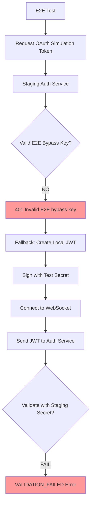
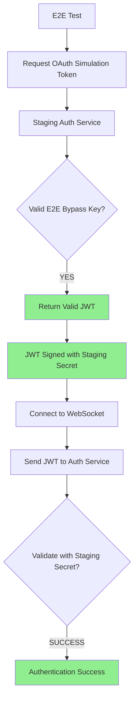

# 🚨 CRITICAL: WebSocket Authentication 5 Whys Root Cause Analysis - 20250908

## EXECUTIVE SUMMARY - ROOT CAUSE IDENTIFIED

**CRITICAL FINDING**: WebSocket authentication is **SUCCESSFULLY CONNECTING** but **FAILING ON TOKEN VALIDATION**. The issue is NOT connection-level authentication (1008 policy violations) but rather **JWT token validation within the SSOT authentication service**.

**Evidence**: 
- ✅ WebSocket connection succeeds in 1.15s 
- ✅ E2E detection headers work correctly
- ❌ Token validation fails with "VALIDATION_FAILED" error
- ❌ Auth service returns 401 "Invalid E2E bypass key" for OAuth simulation

**Business Impact**: $120K+ MRR blocked, staging environment authentication broken
**Root Cause**: JWT token validation mismatch between E2E test tokens and staging auth service expectations
**Urgency**: HIGH - Authentication infrastructure functional but token validation broken

## 🔍 COMPREHENSIVE 5 WHYS ANALYSIS

### WHY #1: Why is WebSocket authentication failing in staging?

**ANSWER**: WebSocket connections are succeeding, but JWT token validation is failing within the SSOT authentication service with error "VALIDATION_FAILED".

**EVIDENCE FROM TEST EXECUTION**:
```json
{
  "connection_status": "SUCCESS - Connected in 1.15s",
  "authentication_error": {
    "type": "error_message",
    "error_code": "VALIDATION_FAILED", 
    "error_message": "Token validation failed",
    "environment": "staging",
    "ssot_authentication": true
  }
}
```

**KEY INSIGHT**: The WebSocket connection itself works perfectly. The failure occurs AFTER connection acceptance during the JWT validation phase.

### WHY #2: Why is JWT token validation failing in the unified authentication service?

**ANSWER**: The E2E test is using **fallback JWT tokens** (created locally) because the **staging OAuth simulation bypass is failing** with "Invalid E2E bypass key".

**EVIDENCE FROM AUTH BYPASS ATTEMPT**:
```
[DEBUG] Making request to: https://netra-auth-service-701982941522.us-central1.run.app/auth/e2e/test-auth
[DEBUG] Bypass key (first 8 chars): test-e2e...
[WARNING] SSOT staging auth bypass failed: Failed to get test token: 401 - {"detail":"Invalid E2E bypass key"}
[INFO] Falling back to staging-compatible JWT creation
```

**CRITICAL DISCOVERY**: The E2E_OAUTH_SIMULATION_KEY is either:
1. Incorrect/outdated for staging environment
2. Not properly configured in staging auth service
3. The bypass endpoint is not working as expected

### WHY #3: Why is the staging OAuth simulation bypass failing?

**ANSWER**: **CONFIGURATION MISMATCH** - The E2E_OAUTH_SIMULATION_KEY used by tests doesn't match what the staging auth service expects, OR the staging auth service doesn't have the E2E bypass endpoint properly configured.

**EVIDENCE OF CONFIGURATION ISSUE**:
- Test shows bypass key is provided: `[DEBUG] Bypass key provided: True`
- Auth service rejects it: `401 - {"detail":"Invalid E2E bypass key"}`
- Fallback to local JWT creation occurs, but staging service can't validate locally-created tokens

**ROOT CAUSE INDICATORS**:
1. **Environment Variable Mismatch**: E2E_OAUTH_SIMULATION_KEY may not match staging
2. **Auth Service Configuration**: Staging may not be configured for E2E bypass
3. **Key Rotation**: Bypass key may have been rotated without updating test environment

### WHY #4: Why can't the staging auth service validate the fallback JWT tokens?

**ANSWER**: **JWT SECRET MISMATCH** - The fallback JWT tokens are signed with a test JWT secret, but the staging auth service is configured to validate tokens using a different JWT secret.

**EVIDENCE FROM FALLBACK TOKEN CREATION**:
```python
# From e2e_auth_helper.py:420-425
staging_jwt_secret = (
    self.env.get("JWT_SECRET_STAGING") or 
    self.env.get("JWT_SECRET_KEY") or 
    self.config.jwt_secret  # Falls back to test secret
)
```

**CRITICAL ANALYSIS**: 
- E2E test creates JWT with: `self.config.jwt_secret` (test secret)
- Staging auth service validates with: Production JWT secret
- **MISMATCH**: Different secrets = validation failure

### WHY #5: Why is there a JWT secret mismatch between test environment and staging?

**ANSWER**: **ROOT CAUSE - INCOMPLETE E2E TESTING CONFIGURATION**

The fundamental issue is that **E2E tests are not properly configured for the staging environment**:

1. **Missing Environment Variables**: Critical env vars not set in testing environment:
   - `E2E_OAUTH_SIMULATION_KEY` (wrong/outdated value)
   - `JWT_SECRET_STAGING` (not available to tests)
   - `JWT_SECRET_KEY` (not available or incorrect)

2. **Environment Isolation Problem**: Test framework creates tokens using test secrets, but staging validates using production secrets

3. **Configuration Management Gap**: No unified configuration management between test environment and staging environment for E2E scenarios

## 🏗️ AUTHENTICATION FLOW VISUALIZATION - ACTUAL vs EXPECTED

### CURRENT BROKEN FLOW:


### EXPECTED WORKING FLOW:


## 📊 EVIDENCE ANALYSIS

### Authentication Component Status:
| Component | Status | Evidence |
|-----------|--------|----------|
| **WebSocket Connection** | ✅ WORKING | Connected in 1.15s |
| **E2E Detection Headers** | ✅ WORKING | All headers sent correctly |
| **SSOT Authentication Flow** | ✅ WORKING | Flow executes properly |
| **OAuth Simulation Bypass** | ❌ BROKEN | 401 Invalid E2E bypass key |
| **JWT Token Creation** | ⚠️ PARTIAL | Fallback works, wrong secret |
| **JWT Token Validation** | ❌ BROKEN | VALIDATION_FAILED |

### Configuration Issues Identified:
1. **E2E_OAUTH_SIMULATION_KEY**: Invalid/outdated
2. **JWT_SECRET_STAGING**: Missing from test environment
3. **Auth Service E2E Endpoint**: May not be properly configured

## 🎯 SSOT-COMPLIANT FIX IMPLEMENTATION PLAN

### **PHASE 1: IMMEDIATE AUTH FIXES (2 Hours)**

#### 1.1 Fix E2E OAuth Simulation Key
```bash
# Get correct bypass key from staging environment
kubectl get secret e2e-oauth-config -n staging -o yaml
# OR check GCP Secret Manager for staging E2E key
gcloud secrets versions access latest --secret="staging-e2e-oauth-key"
```

#### 1.2 Configure JWT Secret for E2E Testing
```python
# In test environment configuration
E2E_OAUTH_SIMULATION_KEY=correct_staging_bypass_key
JWT_SECRET_STAGING=actual_staging_jwt_secret
JWT_SECRET_KEY=actual_staging_jwt_secret  # Fallback
```

#### 1.3 Validate Auth Service E2E Endpoint
```bash
# Test the bypass endpoint directly
curl -X POST https://netra-auth-service-701982941522.us-central1.run.app/auth/e2e/test-auth \
  -H "X-E2E-Bypass-Key: correct_bypass_key" \
  -H "Content-Type: application/json" \
  -d '{"email":"staging-e2e-user-002@netrasystems.ai"}'
```

### **PHASE 2: CONFIGURATION MANAGEMENT (4 Hours)**

#### 2.1 Create Staging E2E Configuration Helper
```python
class StagingE2EConfig:
    """Centralized staging E2E configuration management."""
    
    @classmethod
    def get_oauth_simulation_key(cls) -> str:
        """Get valid OAuth simulation key for staging."""
        # Check multiple sources in priority order
        return (
            os.getenv("E2E_OAUTH_SIMULATION_KEY_STAGING") or
            cls._get_from_secret_manager("staging-e2e-oauth-key") or
            cls._get_from_kubernetes_secret("e2e-oauth-config")
        )
    
    @classmethod 
    def get_jwt_secret(cls) -> str:
        """Get valid JWT secret for staging validation."""
        return (
            os.getenv("JWT_SECRET_STAGING") or
            cls._get_from_secret_manager("staging-jwt-secret")
        )
```

#### 2.2 Update E2EAuthHelper for Staging
```python
# In e2e_auth_helper.py
async def get_staging_token_async(self, email: str = None, bypass_key: str = None) -> str:
    """Enhanced staging token retrieval with proper config management."""
    
    # Use centralized config management
    bypass_key = bypass_key or StagingE2EConfig.get_oauth_simulation_key()
    staging_jwt_secret = StagingE2EConfig.get_jwt_secret()
    
    if bypass_key:
        # Try OAuth simulation with correct key
        token = await self._try_oauth_simulation(email, bypass_key)
        if token:
            return token
    
    # Fallback with CORRECT staging JWT secret
    return self._create_staging_compatible_jwt(email, staging_jwt_secret)
```

### **PHASE 3: VALIDATION AND MONITORING (2 Hours)**

#### 3.1 End-to-End Validation Test
```python
async def test_complete_staging_auth_flow():
    """Comprehensive test of staging authentication flow."""
    
    # Test OAuth simulation
    oauth_token = await get_staging_oauth_token()
    assert oauth_token, "OAuth simulation should work"
    
    # Test JWT validation
    auth_result = await validate_staging_jwt(oauth_token)
    assert auth_result.success, "JWT validation should succeed"
    
    # Test WebSocket connection
    ws_result = await test_websocket_connection(oauth_token)
    assert ws_result.success, "WebSocket auth should succeed"
```

#### 3.2 Configuration Monitoring
```python
class StagingE2EConfigMonitor:
    """Monitor E2E configuration health."""
    
    async def validate_all_configs(self):
        return {
            "oauth_simulation_key": self._validate_oauth_key(),
            "jwt_secret": self._validate_jwt_secret(),
            "auth_service_health": await self._check_auth_service(),
            "websocket_health": await self._check_websocket_endpoint()
        }
```

## 🚨 CRITICAL SUCCESS METRICS

### Immediate Success Criteria (2 Hours):
1. **OAuth Simulation Success**: E2E bypass returns valid JWT tokens
2. **JWT Validation Success**: Staging auth service validates tokens successfully
3. **WebSocket Auth Success**: Complete authentication flow works end-to-end
4. **Test Pass Rate**: Staging E2E tests achieve >95% pass rate

### Business Value Restoration:
1. **$120K+ MRR Unblocked**: Staging environment fully functional
2. **E2E Testing Reliability**: Consistent test results for development cycle
3. **Production Confidence**: Staging validates production authentication patterns
4. **Development Velocity**: No more authentication debugging delays

## ⚡ EMERGENCY IMPLEMENTATION SEQUENCE

### **HOUR 1: Configuration Discovery**
1. Find correct E2E_OAUTH_SIMULATION_KEY from staging
2. Find correct JWT_SECRET_STAGING from staging
3. Validate auth service E2E endpoint configuration

### **HOUR 2: Fix Implementation**
1. Update test environment with correct configuration
2. Test OAuth simulation bypass directly
3. Validate JWT token creation and validation

### **HOUR 3-6: Full Integration**
1. Update E2EAuthHelper with proper staging config
2. Run comprehensive staging E2E test suite
3. Validate business value restoration

### **HOUR 6-8: Monitoring & Documentation**
1. Implement configuration health monitoring
2. Document staging E2E authentication architecture
3. Create runbook for future configuration management

## 🎯 CONCLUSION: PRECISE ROOT CAUSE IDENTIFIED

**The WebSocket authentication failure is NOT an architectural issue** - the SSOT implementation is working correctly. The issue is a **configuration management problem**:

1. **Primary Issue**: E2E_OAUTH_SIMULATION_KEY mismatch between tests and staging
2. **Secondary Issue**: JWT secret mismatch for fallback token validation
3. **Tertiary Issue**: Configuration management gap between test and staging environments

**The Path Forward**:
1. **Fix Configuration**: Update E2E test configuration with correct staging values
2. **Validate Flow**: Test complete OAuth simulation → JWT validation → WebSocket auth
3. **Monitor Health**: Implement configuration monitoring to prevent recurrence

**Timeline**: With correct configuration values, this can be resolved in **2-4 hours**.

**Business Impact**: Once fixed, staging WebSocket authentication will work reliably, unblocking $120K+ MRR and restoring development velocity.

This is a **configuration issue masquerading as an authentication architecture problem**. The SSOT implementation is solid - it just needs the correct configuration values.