# WebSocket Bridge Initialization Bug Fix Report

## Problem Statement
**CRITICAL**: Service health check failing with 503 Service Unavailable
- Error: AgentWebSocketBridge initialization failure
- The WebSocket bridge is receiving None/WebSocketManager instead of AgentWebSocketBridge during supervisor agent initialization
- This prevents the service from starting properly in staging environment

## Root Cause Analysis (Five Whys)

### Why 1: Why is the service health check failing?
**Answer**: Because the AgentWebSocketBridge is missing required methods when checked by AgentRegistry

### Why 2: Why is the AgentWebSocketBridge missing required methods?
**Answer**: Because the wrong object (WebSocketManager) is being passed instead of AgentWebSocketBridge

### Why 3: Why is WebSocketManager being passed instead of AgentWebSocketBridge?
**Answer**: Because in `startup_module_deterministic.py`, the supervisor is initialized with `websocket_manager` directly

### Why 4: Why is the supervisor initialized with WebSocketManager directly?
**Answer**: Because the supervisor is created in Step 11 BEFORE the AgentWebSocketBridge is created in Step 12

### Why 5: Why is this initialization order a problem?
**Answer**: Because the architectural pattern requires ALL agent notifications to go through AgentWebSocketBridge as the SSOT, but the supervisor can't use what doesn't exist yet

## Current Failure State (Mermaid Diagram)

## Ideal Working State (Mermaid Diagram)

```mermaid
sequenceDiagram
    participant Startup
    participant Bridge
    participant SupervisorAgent
    participant AgentRegistry
    
    Note over Startup: Step 11: Create Bridge FIRST
    Startup->>Bridge: Create AgentWebSocketBridge
    
    Note over Startup: Step 12: Create Supervisor with Bridge
    Startup->>SupervisorAgent: new SupervisorAgent(bridge)
    SupervisorAgent->>AgentRegistry: Initialize with bridge
    AgentRegistry->>AgentRegistry: set_websocket_bridge(bridge)
    Note over AgentRegistry: Bridge has all required methods ✓
    
    Note over Startup: Step 13: Complete Integration
    Startup->>Bridge: ensure_integration(supervisor, registry)
    Bridge-->>Startup: Integration successful
```

## Implementation Plan

### 1. Fix Initialization Order
- Move AgentWebSocketBridge creation BEFORE supervisor creation
- Pass the bridge to supervisor instead of websocket_manager

### 2. Update SupervisorAgent Constructor
- Accept AgentWebSocketBridge instead of WebSocketManager
- Ensure bridge is properly passed through to all components

### 3. Verify Bridge Integration
- Ensure bridge.ensure_integration() is called after supervisor creation
- Validate all notification methods are available

### 4. Test the Fix
- Run mission critical WebSocket tests
- Verify service health check passes
- Test with real services

## Files to Modify
1. `netra_backend/app/startup_module_deterministic.py` - Fix initialization order
2. Potentially `netra_backend/app/agents/supervisor_consolidated.py` - If it needs to handle bridge differently

## Success Criteria
- Service starts without "AgentWebSocketBridge incomplete" error
- Health check returns 200 OK
- All WebSocket notifications work properly
- Mission critical tests pass