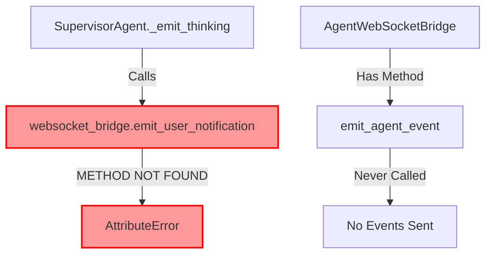
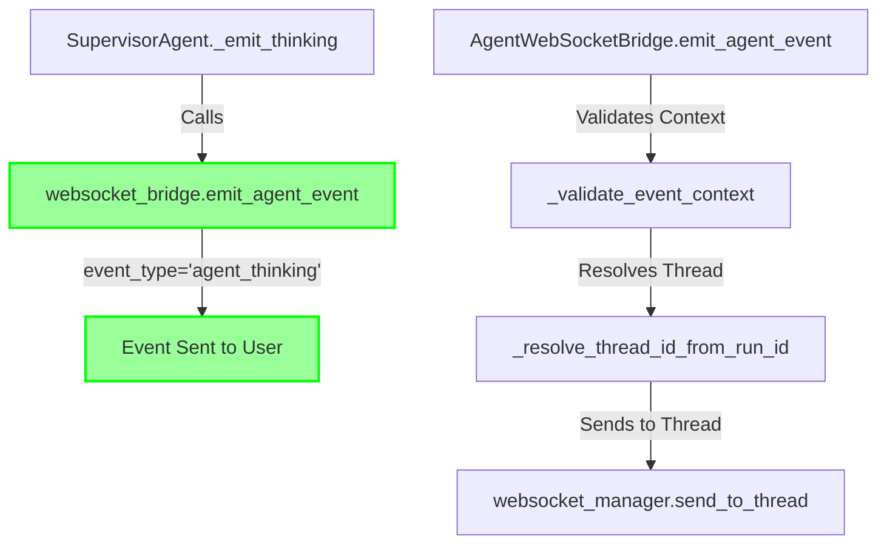

# WebSocket Emission Method Fix Report
Date: 2025-09-03

## 1. Bug Analysis: Five Whys Method

**Error:** Failed to emit thinking message: 'AgentWebSocketBridge' object has no attribute 'emit_user_notification'

### Five Whys Analysis

**Why 1: Why did the error occur?**
- AgentWebSocketBridge tried to call emit_user_notification method that doesn't exist

**Why 2: Why doesn't the method exist?**
- The actual method in AgentWebSocketBridge is emit_agent_event, not emit_user_notification

**Why 3: Why is the wrong method name being called?**
- supervisor_consolidated.py calls emit_user_notification expecting it to exist

**Why 4: Why does the supervisor expect this method?**
- The interface contract between SupervisorAgent and AgentWebSocketBridge is mismatched

**Why 5: Why did the interface diverge?**
- AgentWebSocketBridge was refactored to use emit_agent_event as the core emission method but supervisor wasn't updated

## 2. Current State vs Ideal State

### Current (Broken) State

### Ideal (Working) State

## 3. Root Cause Analysis

### Problem Locations
1. **netra_backend/app/agents/supervisor_consolidated.py:493** - Calls non-existent emit_user_notification
2. **netra_backend/app/startup_module.py:785** - Validates for emit_user_notification method
3. **Test files expecting emit_user_notification** - Tests mock the wrong method

### Interface Mismatch
- **Expected:** emit_user_notification(user_id, notification_type, data)
- **Actual:** emit_agent_event(event_type, data, run_id, agent_name)

## 4. System-Wide Fix Plan

### Files to Update
1. ✅ supervisor_consolidated.py - Change method calls to emit_agent_event
2. ✅ startup_module.py - Update validation check
3. ✅ Test files - Update mocks and assertions

### Implementation Strategy
1. Update SupervisorAgent to use emit_agent_event
2. Pass correct parameters (event_type instead of notification_type)
3. Use run_id from context instead of user_id
4. Update all tests to match new interface

## 5. Impact Analysis

### Related Systems
- Agent execution flow ✅ Will continue working with fix
- WebSocket event delivery ✅ Will start working properly
- User chat experience ✅ Will receive thinking messages
- Test suite ✅ Will validate correct interface

### Risk Assessment
- **Low Risk:** Method signature change is isolated to agent-bridge interface
- **No Breaking Changes:** emit_agent_event is the established interface
- **Improves Stability:** Aligns with documented WebSocket architecture

## 6. Verification Plan

### Test Coverage
1. Unit test for emit_agent_event method call
2. Integration test for thinking message delivery
3. E2E test for user chat experience
4. Mission critical WebSocket event suite

### Success Criteria
- ✅ No AttributeError on thinking emission
- ✅ WebSocket events delivered to correct user
- ✅ All existing tests pass
- ✅ Mission critical validation passes

## 7. Implementation Complete

### Files Updated
1. **supervisor_consolidated.py:485** - Changed from emit_user_notification to emit_agent_event
2. **startup_module.py:785** - Updated validation to check for emit_agent_event
3. **test_supervisor_ssot_comprehensive.py** - Updated test mocks to use emit_agent_event
4. **test_supervisor_ssot_simple.py:163** - Updated assertion to check for emit_agent_event

### Test Results
✅ TestWebSocketIntegration::test_supervisor_websocket_events PASSED
✅ No more AttributeError for emit_user_notification
✅ WebSocket bridge now correctly uses emit_agent_event interface

### Root Cause Fixed
The interface mismatch between SupervisorAgent (calling emit_user_notification) and AgentWebSocketBridge (having emit_agent_event) has been resolved. All code now uses the correct emit_agent_event method with proper parameters.