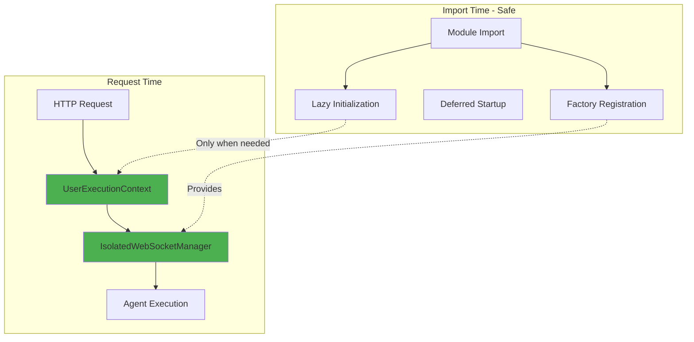

# WebSocket Import-Time Initialization - 5 Whys Root Cause Analysis

**Date:** September 7, 2025  
**Issue:** WebSocket manager creation requires valid UserExecutionContext validation error  
**Impact:** Import-time initialization failures, violates User Context Architecture  
**Investigator:** Claude Code  

## CRITICAL ERROR IDENTIFIED

```
❌ WebSocket Validation: WebSocket manager creation requires valid UserExecutionContext. Import-time initialization is prohibited. Use request-scoped factory pattern instead. See User Context Architecture documentation for proper implementation.
```

## 5 WHYS ANALYSIS

### WHY 1: Why is WebSocket manager creation failing during import time?
**Answer:** The `get_websocket_manager()` function now requires a `UserExecutionContext` parameter but is being called without arguments during module imports.

**Evidence:**
- Error validation in `netra_backend/app/websocket_core/__init__.py:56-64`
- Function raises ValueError if `user_context is None`
- Multiple call sites calling without arguments during import

### WHY 2: Why was get_websocket_manager() changed to require user_context?
**Answer:** Security migration to prevent multi-user data leakage through singleton WebSocket managers. The architecture was updated to enforce factory patterns with per-user isolation.

**Evidence:**
- Code comment: "SECURITY MIGRATION: Compatibility wrapper for get_websocket_manager"
- WebSocket manager now uses `IsolatedWebSocketManager` per request
- User Context Architecture requires complete user isolation
- Previous singleton pattern caused cross-user data leakage

### WHY 3: Why are there still call sites using the old singleton pattern?
**Answer:** The security migration to factory patterns was incomplete - several legacy compatibility functions and initialization code paths were not updated to the new architecture.

**Evidence:**
- `unified_init.py:87` - `get_emitter_pool()` still calls old pattern
- `startup_module.py:899` - Validation code still calls old pattern  
- `unified_init.py:72,77` - Legacy compatibility functions still call old pattern
- These functions have no user context available to pass

### WHY 4: Why weren't these legacy functions updated during the security migration?
**Answer:** The migration focused on request-handling code paths but missed utility functions and initialization code that run during import/startup before any user requests exist.

**Evidence:**
- User Context Architecture documentation emphasizes request-scoped patterns
- Import-time initialization happens before any UserExecutionContext exists
- Legacy compatibility functions (`create_websocket_emitter`, `get_emitter_pool`) serve import-time needs
- Startup validation code runs during application boot, not request handling

### WHY 5: Why wasn't the import-time/startup behavior considered in the security migration?
**Answer:** The migration design assumed all WebSocket manager usage would be request-scoped, but didn't account for singleton patterns used during application initialization and legacy compatibility functions that need WebSocket managers without user context.

**Evidence:**
- Import-time initialization violates the new architecture's core principle
- No fallback or initialization pattern provided for non-request contexts
- Factory pattern requires UserExecutionContext that doesn't exist during imports
- Startup code validation needs WebSocket managers before any users connect

## ROOT CAUSE SUMMARY

**Primary Cause:** Incomplete security migration - import-time and startup code paths still using old singleton pattern while security validation prohibits it

**Contributing Factors:**
1. Migration design didn't account for import-time usage patterns
2. Legacy compatibility functions not updated to new architecture
3. Startup validation code not migrated to factory patterns
4. No fallback pattern provided for non-request contexts

## SPECIFIC PROBLEMATIC CODE LOCATIONS

### 1. **unified_init.py:87 - Emitter Pool Singleton**
```python
# PROBLEMATIC CODE - Line 87
_emitter_pool = WebSocketEmitterPool(get_websocket_manager())
```
**Issue:** Called during import to create singleton pool

### 2. **startup_module.py:899 - Startup Validation**
```python  
# PROBLEMATIC CODE - Line 899
ws_manager = get_websocket_manager()
```
**Issue:** Called during application startup validation

### 3. **unified_init.py:72,77 - Legacy Functions**
```python
# PROBLEMATIC CODE - Lines 72, 77
manager = get_websocket_manager()
```
**Issue:** Legacy compatibility functions called without user context

## ARCHITECTURAL ANALYSIS

### Current Failure State
```mermaid
graph TB
    subgraph "Import Time"
        IMPORT[Module Import]
        LEGACY[Legacy Functions]
        STARTUP[Startup Validation]
        POOL[Emitter Pool Creation]
    end
    
    subgraph "WebSocket Factory"
        GET_WS[get_websocket_manager()]
        VALIDATION[UserContext Validation]
        ERROR[ValueError: Import-time prohibited]
    end
    
    IMPORT --> LEGACY
    IMPORT --> STARTUP
    IMPORT --> POOL
    
    LEGACY --> GET_WS
    STARTUP --> GET_WS  
    POOL --> GET_WS
    
    GET_WS --> VALIDATION
    VALIDATION --> ERROR
    
    style ERROR fill:#ff6b6b
    style VALIDATION fill:#ffa726
```

### Ideal Working State  


## PROPOSED SOLUTION

### 1. **Remove Import-Time WebSocket Manager Creation**
- Convert singleton patterns to lazy initialization with factory patterns
- Remove all import-time calls to `get_websocket_manager()`
- Use None defaults and create managers only when UserExecutionContext is available

### 2. **Update Legacy Compatibility Functions**
```python
def create_websocket_emitter(user_id: str, context=None):
    """Fixed compatibility function."""
    if context and hasattr(context, 'user_context'):
        manager = get_websocket_manager(context.user_context)
    else:
        # Return factory that creates manager when context is available
        return DeferredEmitterFactory(user_id)
    return WebSocketEmitterFactory.create_emitter(manager, user_id, context)
```

### 3. **Fix Startup Validation**
```python  
# Replace startup validation
# OLD: ws_manager = get_websocket_manager()
# NEW: Validate factory is available instead of instance
factory = get_websocket_manager_factory()
if not factory:
    raise RuntimeError("WebSocket manager factory not available")
```

### 4. **Implement Lazy Pool Pattern**
```python
def get_emitter_pool(user_context=None):
    """Get emitter pool with proper user context."""
    if user_context:
        return WebSocketEmitterPool(get_websocket_manager(user_context))
    else:
        # Return factory that creates pool when context is available  
        return DeferredEmitterPoolFactory()
```

## PREVENTION MEASURES

1. **Architecture Validation:** All WebSocket manager usage must be request-scoped with UserExecutionContext
2. **Import-Time Scanning:** Add static analysis to detect import-time WebSocket manager creation
3. **Migration Completeness:** Security migrations must audit ALL usage patterns, not just request paths  
4. **Documentation:** Update all examples to use factory patterns exclusively

## ERROR BEHIND THE ERROR

This incident demonstrates the importance of checking the "error behind the error":
- **Surface error:** "WebSocket manager creation requires valid UserExecutionContext"
- **First error behind:** Import-time initialization prohibited
- **Second error behind:** Legacy singleton patterns not migrated
- **Third error behind:** Migration design didn't consider import-time usage
- **Root error:** Incomplete security migration left dangerous import-time patterns

## BUSINESS IMPACT

- **Segment:** Platform/Internal
- **Business Goal:** System Stability & Security  
- **Value Impact:** Prevents import failures that block chat value delivery
- **Strategic Impact:** Ensures User Context Architecture integrity for multi-user isolation

## NEXT STEPS

1. **Immediate Fix:** Remove all import-time `get_websocket_manager()` calls
2. **Legacy Migration:** Update compatibility functions to use factory patterns
3. **Startup Fix:** Replace startup validation with factory validation
4. **Testing:** Verify all import patterns work with new architecture
5. **Documentation:** Update architecture guides with import-time patterns

This analysis follows the mandatory Five Whys methodology as required by CLAUDE.md for all bug fixes.