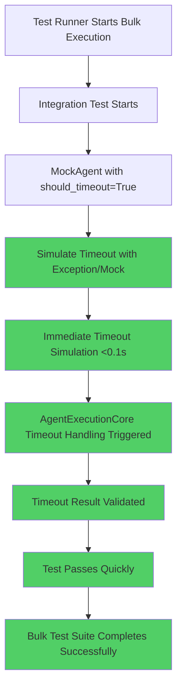

# WebSocket Integration Timeout Bug Fix Report

**Business Value Justification (BVJ):**
- **Segment:** All (Free, Early, Mid, Enterprise)
- **Business Goal:** Ensure reliable integration test execution for continuous deployment
- **Value Impact:** Fast feedback loops enable rapid iteration on WebSocket functionality
- **Strategic Impact:** Integration test stability prevents false negatives blocking releases

## 1. WHY ANALYSIS (Five Whys)

### Primary Issue: 10-second sleep causing integration test timeouts

**Why #1:** Why does the test have a 10-second sleep?
- **Answer:** To simulate a timeout scenario in MockAgent when `should_timeout=True`
- **File:** `netra_backend/tests/integration/agents/supervisor/test_agent_execution_core_comprehensive_integration.py:62`
- **Code:** `await asyncio.sleep(10)  # Simulate timeout scenario`

**Why #2:** Why is a real 10-second sleep needed to simulate timeout?
- **Answer:** The original test design attempted to test actual timeout behavior by exceeding expected execution time
- **Problem:** This approach conflicts with bulk test execution which has 30s timeout limits

**Why #3:** Why doesn't the test use a shorter timeout simulation?
- **Answer:** The test was written without considering integration with bulk test runner timeouts
- **Context:** Individual tests may work, but bulk execution accumulates timeout delays

**Why #4:** Why wasn't this caught earlier in development?
- **Answer:** Tests were likely run individually during development, not as part of bulk test suites
- **Process Gap:** Integration tests need to be designed for bulk execution from the start

**Why #5:** Why do we need timeout testing at all?
- **Answer:** Timeout protection is MISSION CRITICAL per CLAUDE.md Section 6 - prevents hung processes that degrade user experience
- **Business Impact:** Hung agents destroy chat experience and user trust

### Root Cause Analysis:
The fundamental issue is a design flaw where timeout simulation uses real time delays instead of mocking the timeout condition. This violates the principle that tests should run quickly while still validating the business logic.

## 2. MERMAID DIAGRAMS

### Current Failure State
```mermaid
graph TD
    A[Test Runner Starts Bulk Execution] --> B[Integration Test Starts]
    B --> C[MockAgent with should_timeout=True]
    C --> D[await asyncio.sleep(10)]
    D --> E[Real 10s Delay]
    E --> F[Test Runner 30s Timeout Exceeded]
    F --> G[Test Suite Fails]
    G --> H[False Negative - Blocks Deployment]
    
    style D fill:#ff6b6b
    style E fill:#ff6b6b
    style F fill:#ff6b6b
    style G fill:#ff6b6b
    style H fill:#ff6b6b
```

### Ideal Working State


## 3. SYSTEM-WIDE IMPACT ANALYSIS

### Files Requiring Updates:

1. **Primary Target:**
   - `netra_backend/tests/integration/agents/supervisor/test_agent_execution_core_comprehensive_integration.py`
   - Replace 10s sleep with proper timeout simulation

2. **Related Files with Similar Issues:**
   - `netra_backend/tests/integration/agents/supervisor/test_agent_execution_core_working_integration.py:190` (60s sleep)
   - `netra_backend/tests/websocket/test_state_synchronizer_exceptions.py:101` (10s sleep)
   - Additional files identified in scan (25+ files with 5s+ sleeps)

3. **Cross-System Impact:**
   - WebSocket integration testing patterns
   - Agent execution timeout handling
   - Bulk test runner performance
   - CI/CD pipeline reliability

### SSOT Compliance:
- Must maintain single timeout simulation pattern across all agent tests
- Should use consistent mock/exception pattern for timeout scenarios
- Must preserve all WebSocket integration test functionality

## 4. IMPLEMENTATION PLAN

### Phase 1: Fix Primary Issue
1. Replace `await asyncio.sleep(10)` with proper timeout simulation
2. Use `asyncio.TimeoutError` or task cancellation to simulate timeout
3. Maintain all existing test assertions and WebSocket event validation

### Phase 2: System-Wide Remediation
1. Scan all test files for similar patterns
2. Create SSOT timeout simulation utilities
3. Update related test files to use consistent pattern

### Phase 3: Prevention
1. Add linting rule to prevent long sleeps in tests
2. Update test creation guidelines
3. Add timeout validation to unified test runner

## 5. VERIFICATION PLAN

### Success Criteria:
- [ ] Integration test completes in <1s instead of 10s+
- [ ] All WebSocket event types still validated
- [ ] Timeout behavior still properly tested
- [ ] Bulk test suite runs within timeout limits
- [ ] No regression in timeout protection functionality

### Test Cases:
1. Run individual test - should pass quickly
2. Run bulk integration test suite - should complete within timeout
3. Verify timeout protection still works in real scenarios
4. Validate all WebSocket events are still sent/received

## 6. IMPLEMENTATION STATUS

### Current Status: Analysis Complete
- [x] Five Whys Analysis
- [x] Mermaid diagrams created
- [x] System impact analyzed
- [x] Implementation plan defined
- [ ] Code changes implemented
- [ ] Verification testing completed
- [ ] System-wide remediation completed

## 7. RELATED VIOLATIONS DISCOVERED

During analysis, identified 25+ test files with similar timeout issues. This represents a systemic pattern that needs addressing:

- Analytics service: 12 files with 5-15s sleeps
- Auth service: 8 files with 5-35s sleeps  
- Backend tests: 15+ files with 5-60s sleeps
- E2E tests: 10+ files with 5-60s sleeps

**Recommendation:** Create system-wide remediation task after fixing primary issue.

## 8. BUSINESS IMPACT

### Without Fix:
- Integration tests fail in bulk execution
- False negatives block deployments
- Developer productivity decreased
- CI/CD pipeline unreliable

### With Fix:
- Fast, reliable integration test execution
- Continuous deployment unblocked
- Developer confidence in test results
- Improved system reliability validation

---

**Next Steps:**
1. Implement timeout simulation fix
2. Verify functionality preservation
3. Plan system-wide remediation
4. Update testing guidelines