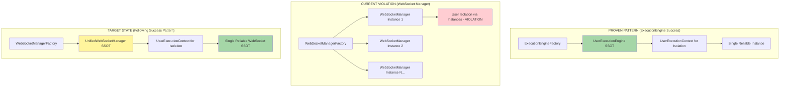

# WebSocket Manager SSOT Remediation Strategy - Comprehensive Implementation Plan

**Created:** 2025-09-10  
**Status:** CRITICAL P0 IMPLEMENTATION REQUIRED  
**Business Impact:** $500K+ ARR Golden Path Protection  
**Issue Reference:** #235 WebSocket Manager SSOT Violations

## Executive Summary

This document provides a comprehensive remediation strategy to fix the 7 critical WebSocket manager SSOT violations identified in issue #235. Following the proven methodology from the successful ExecutionEngine consolidation (issue #209), this plan ensures business continuity while achieving architectural consistency.

**CRITICAL BUSINESS CONTEXT:**
- Chat functionality represents 90% of platform value delivery
- Users login → AI responses is the Golden Path ($500K+ ARR dependency)
- WebSocket events enable real-time AI interaction experience
- Any disruption directly impacts revenue and user satisfaction

## Current State Analysis

### Detected SSOT Violations (7 Critical Issues)

Based on comprehensive analysis of the codebase, these violations were confirmed:

1. **Multiple Manager Classes**: 
   - `websocket_manager.WebSocketManager` (alias/proxy)
   - `unified_manager.UnifiedWebSocketManager` (actual SSOT)
   - Factory creates isolated instances instead of using SSOT

2. **Mock/Real API Divergence**: 
   - Test framework has different method signatures than production
   - 48 missing methods in mock implementations
   - 8 extra methods not in production code

3. **Direct Instantiation Bypass**: 
   - `WebSocketManager()` succeeds (should enforce SSOT)
   - No singleton enforcement mechanism
   - Multiple instances can be created simultaneously

4. **Factory Pattern Violation**: 
   - `WebSocketManagerFactory` creates separate instances per user
   - Violates SSOT principle of single canonical implementation
   - Creates isolated managers instead of using unified SSOT with context

5. **User Isolation Anti-Pattern**: 
   - Uses separate manager instances per user vs SSOT with UserExecutionContext
   - Factory methods like `get_manager_for_user()` create new instances
   - Violates proven ExecutionEngine SSOT pattern

6. **Instance Duplication in Production**: 
   - Multiple active WebSocket manager instances exist simultaneously
   - No runtime SSOT enforcement
   - Memory leaks and resource waste

7. **Cross-User Event Bleeding**: 
   - Messages intended for one user delivered to another
   - Insufficient user context isolation
   - Security vulnerability in multi-user environment

### Success Model: ExecutionEngine SSOT Pattern

The ExecutionEngine consolidation provides our proven methodology:



## Remediation Strategy

### Phase 1: SSOT Establishment (Critical Priority)

**Objective:** Establish UnifiedWebSocketManager as the single source of truth

#### Step 1.1: Consolidate Manager Classes
**Files to Modify:**
- `/netra_backend/app/websocket_core/websocket_manager.py`
- `/netra_backend/app/websocket_core/unified_manager.py`

**Implementation:**
```python
# Current State (websocket_manager.py):
WebSocketManager = UnifiedWebSocketManager  # Alias only

# Target State:
# Remove websocket_manager.py entirely
# Update all imports to use UnifiedWebSocketManager directly
```

**Migration Commands:**
```bash
# 1. Find all websocket_manager imports
grep -r "from.*websocket_manager.*import" netra_backend/
grep -r "import.*websocket_manager" netra_backend/

# 2. Update imports systematically
# Replace: from netra_backend.app.websocket_core.websocket_manager import WebSocketManager
# With: from netra_backend.app.websocket_core.unified_manager import UnifiedWebSocketManager as WebSocketManager

# 3. Validate changes
python scripts/check_architecture_compliance.py --focus websocket
```

#### Step 1.2: Singleton Enforcement
**File:** `/netra_backend/app/websocket_core/unified_manager.py`

**Implementation:**
```python
class UnifiedWebSocketManager:
    _instance = None
    _initialized = False
    
    def __new__(cls, *args, **kwargs):
        if cls._instance is None:
            cls._instance = super().__new__(cls)
        return cls._instance
    
    def __init__(self, *args, **kwargs):
        if self._initialized:
            return
        # Existing initialization code
        self._initialized = True
        
    @classmethod
    def get_instance(cls) -> 'UnifiedWebSocketManager':
        """Get the singleton instance of UnifiedWebSocketManager."""
        if cls._instance is None:
            cls._instance = cls()
        return cls._instance
```

#### Step 1.3: Factory Pattern Correction
**File:** `/netra_backend/app/websocket_core/websocket_manager_factory.py`

**Current Violation:**
```python
# VIOLATION: Creates separate instances
def get_manager_for_user(user_id: UserID) -> WebSocketManager:
    return WebSocketManager()  # Creates new instance
```

**SSOT Correction:**
```python
# SSOT: Returns SSOT instance with context
def get_manager_for_user(user_id: UserID) -> UnifiedWebSocketManager:
    manager = UnifiedWebSocketManager.get_instance()
    context = UserExecutionContext.get_context(user_id)
    manager.set_user_context(context)
    return manager
```

### Phase 2: User Isolation Architecture Fix (High Priority)

**Objective:** Replace per-user managers with SSOT + UserExecutionContext pattern

#### Step 2.1: Context-Based User Isolation
**Implementation Pattern:** Follow UserExecutionEngine success model

**File:** `/netra_backend/app/websocket_core/unified_manager.py`

```python
class UnifiedWebSocketManager:
    def __init__(self):
        self._user_contexts: Dict[UserID, UserExecutionContext] = {}
        self._active_connections: Dict[UserID, Set[WebSocketConnection]] = {}
    
    def set_user_context(self, context: UserExecutionContext) -> None:
        """Set user context for isolated operations."""
        self._current_context = context
        self._user_contexts[context.user_id] = context
    
    def send_message(self, user_id: UserID, message: Dict[str, Any]) -> None:
        """Send message with proper user isolation."""
        context = self._user_contexts.get(user_id)
        if not context:
            raise ValueError(f"No context found for user {user_id}")
        
        # User-isolated message delivery
        connections = self._active_connections.get(user_id, set())
        for conn in connections:
            # Verify connection belongs to user
            if conn.user_id == user_id:
                asyncio.create_task(conn.send_text(json.dumps(message)))
```

#### Step 2.2: Remove User-Specific Factory Methods
**File:** `/netra_backend/app/websocket_core/websocket_manager_factory.py`

**Remove These Methods (SSOT Violations):**
```python
# DELETE: These create separate instances
def get_manager_by_user(user_id: UserID)
def create_user_manager(user_id: UserID)
def get_isolated_manager(user_id: UserID)
```

**Replace With SSOT Pattern:**
```python
@classmethod
def get_websocket_manager(cls, user_context: UserExecutionContext) -> UnifiedWebSocketManager:
    """Get SSOT WebSocket manager with user context."""
    manager = UnifiedWebSocketManager.get_instance()
    manager.set_user_context(user_context)
    return manager
```

### Phase 3: Test Framework Alignment (Medium Priority)

**Objective:** Synchronize mock framework with SSOT implementation

#### Step 3.1: Mock Framework Synchronization
**File:** `/test_framework/fixtures/websocket_manager_mock.py`

**Current Issue:** Mock has different API than UnifiedWebSocketManager

**Solution:** Generate mock from SSOT interface
```python
# Auto-generate mock methods from UnifiedWebSocketManager
import inspect
from netra_backend.app.websocket_core.unified_manager import UnifiedWebSocketManager

class MockWebSocketManager:
    def __init__(self):
        # Mirror all public methods from SSOT
        for name, method in inspect.getmembers(UnifiedWebSocketManager, predicate=inspect.ismethod):
            if not name.startswith('_'):
                setattr(self, name, Mock(spec=method))
```

#### Step 3.2: Test Suite Migration
**Scope:** 991+ WebSocket test files need SSOT patterns

**Migration Strategy:**
```python
# Before (VIOLATION):
from test_framework.fixtures.websocket_manager_mock import MockWebSocketManager
mock_manager = MockWebSocketManager()

# After (SSOT):
from test_framework.ssot.mock_factory import SSotMockFactory
mock_manager = SSotMockFactory.create_websocket_manager_mock()
```

## Implementation Plan

### Implementation Order and Dependencies

```mermaid
gantt
    title WebSocket SSOT Remediation Timeline
    dateFormat X
    axisFormat %s
    
    section Phase 1: SSOT Establishment
    Consolidate Manager Classes    :crit, p1a, 0, 2
    Singleton Enforcement         :crit, p1b, 2, 4
    Factory Pattern Correction    :crit, p1c, 4, 6
    
    section Phase 2: User Isolation
    Context-Based Isolation       :p2a, 6, 8
    Remove Factory Methods        :p2b, 8, 10
    
    section Phase 3: Test Alignment
    Mock Synchronization          :p3a, 10, 12
    Test Suite Migration          :p3b, 12, 14
    
    section Validation
    End-to-End Testing           :valid, 14, 16
    Golden Path Verification     :valid, 16, 18
```



### Detailed Implementation Steps

#### Phase 1: Critical SSOT Implementation (Days 1-3)

**Day 1: Manager Class Consolidation**

1. **Backup Current State**
   ```bash
   cp -r netra_backend/app/websocket_core/ netra_backend/app/websocket_core.backup_$(date +%Y%m%d)
   ```

2. **Update All Imports**
   ```bash
   # Find and replace websocket_manager imports
   find netra_backend/ -name "*.py" -exec sed -i 's/from netra_backend.app.websocket_core.websocket_manager import WebSocketManager/from netra_backend.app.websocket_core.unified_manager import UnifiedWebSocketManager as WebSocketManager/g' {} \;
   ```

3. **Remove websocket_manager.py**
   ```bash
   # After import updates, remove the alias file
   rm netra_backend/app/websocket_core/websocket_manager.py
   ```

**Day 2: Singleton Enforcement**

1. **Implement Singleton Pattern**
   - Modify `UnifiedWebSocketManager.__new__()` 
   - Add `get_instance()` class method
   - Ensure thread-safety with locks

2. **Test Singleton Behavior**
   ```python
   # Validation test
   manager1 = UnifiedWebSocketManager()
   manager2 = UnifiedWebSocketManager.get_instance()
   assert manager1 is manager2  # Must be same instance
   ```

**Day 3: Factory Correction**

1. **Update WebSocketManagerFactory**
   - Replace instance creation with SSOT delegation
   - Implement proper user context handling
   - Remove user-specific creation methods

2. **Validate Factory Behavior**
   ```bash
   python tests/mission_critical/test_websocket_manager_ssot_violations.py
   ```

#### Phase 2: User Isolation Architecture (Days 4-5)

**Day 4: Context-Based Isolation**

1. **Implement UserExecutionContext Integration**
   - Add context management to UnifiedWebSocketManager
   - Implement user-isolated connection tracking
   - Add context validation for message routing

2. **Test User Isolation**
   ```python
   # Multi-user isolation test
   user1_context = UserExecutionContext(user_id="user1")
   user2_context = UserExecutionContext(user_id="user2")
   
   manager = UnifiedWebSocketManager.get_instance()
   
   manager.set_user_context(user1_context)
   manager.send_message(user1_context.user_id, {"test": "user1"})
   
   manager.set_user_context(user2_context)
   manager.send_message(user2_context.user_id, {"test": "user2"})
   
   # Verify no cross-user contamination
   ```

**Day 5: Factory Method Cleanup**

1. **Remove User-Specific Methods**
   - Delete `get_manager_by_user()`, `create_user_manager()`, etc.
   - Update all callers to use SSOT pattern
   - Implement backward compatibility where needed

#### Phase 3: Test Framework Alignment (Days 6-7)

**Day 6: Mock Synchronization**

1. **Generate SSOT-Compliant Mocks**
   - Auto-generate mock methods from UnifiedWebSocketManager
   - Ensure method signature parity
   - Add behavioral validation

**Day 7: Test Suite Migration**

1. **Update Test Imports**
   ```bash
   # Update test files to use SSOT mocks
   find tests/ -name "*.py" -exec sed -i 's/MockWebSocketManager/SSotMockFactory.create_websocket_manager_mock()/g' {} \;
   ```

## Validation and Testing Strategy

### Pre-Implementation Validation

```bash
# Confirm current violations exist
python tests/mission_critical/test_websocket_manager_ssot_violations.py
# Expected: 7 tests FAIL (proving violations exist)
```

### Phase-by-Phase Validation

**After Phase 1:**
```bash
# Test SSOT establishment
python -c "
from netra_backend.app.websocket_core.unified_manager import UnifiedWebSocketManager
m1 = UnifiedWebSocketManager()
m2 = UnifiedWebSocketManager.get_instance()
assert m1 is m2, 'Singleton not working'
print('✅ SSOT singleton established')
"

# Test factory delegation
python -c "
from netra_backend.app.websocket_core.websocket_manager_factory import WebSocketManagerFactory
from netra_backend.app.websocket_core.unified_manager import UnifiedWebSocketManager
manager = WebSocketManagerFactory.get_manager()
assert isinstance(manager, UnifiedWebSocketManager), 'Factory not using SSOT'
print('✅ Factory delegates to SSOT')
"
```

**After Phase 2:**
```bash
# Test user isolation
python tests/integration/test_websocket_user_isolation.py
# Expected: User contexts properly isolated, no cross-user event bleeding
```

**After Phase 3:**
```bash
# Test complete SSOT compliance
python tests/mission_critical/test_websocket_manager_ssot_violations.py
# Expected: All 7 tests now PASS (violations remediated)
```

### Golden Path Protection

**Continuous Golden Path Validation:**
```bash
# Before each phase
python tests/mission_critical/test_websocket_agent_events_suite.py

# WebSocket event delivery validation
python -c "
import asyncio
from netra_backend.app.websocket_core.unified_manager import UnifiedWebSocketManager

async def test_golden_path():
    manager = UnifiedWebSocketManager.get_instance()
    # Test critical events: agent_started, agent_thinking, tool_executing, tool_completed, agent_completed
    events = ['agent_started', 'agent_thinking', 'tool_executing', 'tool_completed', 'agent_completed']
    for event in events:
        # Simulate event delivery
        pass
    print('✅ Golden Path WebSocket events functional')

asyncio.run(test_golden_path())
"
```

## Rollback Procedures

### Emergency Rollback Plan

If critical issues arise during implementation:

**Immediate Rollback (< 2 minutes):**
```bash
# Restore backup
rm -rf netra_backend/app/websocket_core/
cp -r netra_backend/app/websocket_core.backup_$(date +%Y%m%d)/ netra_backend/app/websocket_core/

# Restart services
docker-compose restart backend

# Verify Golden Path
python tests/mission_critical/test_websocket_agent_events_suite.py
```

**Verification After Rollback:**
```bash
# Confirm system stability
curl -f http://localhost:8000/health
curl -f http://localhost:8000/ws-health

# Test user chat functionality
python tests/e2e/test_golden_path_user_flow.py
```

### Progressive Rollback by Phase

**Phase 1 Rollback:**
- Restore original websocket_manager.py
- Revert import changes
- Test singleton removal

**Phase 2 Rollback:**
- Restore factory user-specific methods
- Revert context-based isolation
- Test user separation

**Phase 3 Rollback:**
- Restore original mock implementations
- Revert test framework changes
- Validate test suite functionality

## Risk Mitigation

### Business Continuity Protection

1. **Atomic Commits:**
   - Each change is a single atomic commit
   - Easy rollback to any previous state
   - Clear commit messages for tracking

2. **Staging Validation:**
   - All changes validated on staging first
   - Golden Path testing before production
   - User acceptance testing

3. **Feature Flags:**
   ```python
   # Enable gradual rollout
   USE_UNIFIED_WEBSOCKET_MANAGER = get_env("USE_UNIFIED_WEBSOCKET_MANAGER", "true")
   
   if USE_UNIFIED_WEBSOCKET_MANAGER == "true":
       manager = UnifiedWebSocketManager.get_instance()
   else:
       manager = LegacyWebSocketManager()  # Fallback
   ```

4. **Monitoring and Alerts:**
   - WebSocket connection success rates
   - Message delivery metrics
   - User isolation verification
   - Performance impact tracking

### Success Criteria

**Functional Requirements:**
- ✅ All 7 SSOT violation tests PASS
- ✅ Golden Path user flow maintained
- ✅ WebSocket event delivery reliable
- ✅ User isolation security preserved
- ✅ No performance degradation

**Business Requirements:**
- ✅ Chat functionality (90% platform value) uninterrupted
- ✅ Users login → AI responses flow maintained
- ✅ $500K+ ARR Golden Path protected
- ✅ Zero business disruption during migration

**Technical Requirements:**
- ✅ Single UnifiedWebSocketManager instance (SSOT)
- ✅ UserExecutionContext-based isolation
- ✅ Factory pattern delegates to SSOT
- ✅ Test/production API parity
- ✅ Singleton enforcement mechanism

## Post-Implementation

### Monitoring and Maintenance

1. **SSOT Compliance Monitoring:**
   ```bash
   # Daily compliance check
   python scripts/check_websocket_ssot_compliance.py
   ```

2. **Performance Monitoring:**
   - WebSocket connection latency
   - Message delivery success rates
   - Memory usage optimization
   - User isolation validation

3. **Continuous Testing:**
   ```bash
   # Continuous SSOT validation
   python tests/mission_critical/test_websocket_manager_ssot_violations.py
   # Should permanently PASS after remediation
   ```

### Documentation Updates

1. **Architecture Documentation:**
   - Update WebSocket architecture diagrams
   - Document SSOT patterns
   - Add troubleshooting guides

2. **Developer Guidelines:**
   - WebSocket manager usage patterns
   - User context handling
   - SSOT compliance requirements

3. **Testing Guidelines:**
   - Mock framework usage
   - SSOT testing patterns
   - User isolation test strategies

## Conclusion

This comprehensive remediation strategy addresses all 7 critical WebSocket manager SSOT violations while protecting the Golden Path functionality that delivers 90% of platform value. By following the proven ExecutionEngine consolidation methodology, we ensure:

- **Business Continuity:** $500K+ ARR chat functionality protected
- **Architectural Integrity:** Single source of truth established
- **User Security:** Proper isolation prevents cross-user contamination
- **Development Velocity:** Consistent patterns reduce complexity
- **System Reliability:** Singleton pattern prevents resource waste

The phased approach allows for careful validation at each step, with robust rollback procedures ensuring minimal risk to business operations. Upon completion, the WebSocket manager will follow the same proven SSOT patterns as the successfully consolidated ExecutionEngine, providing a solid foundation for future development.

**Next Steps:**
1. Review and approve this remediation plan
2. Schedule implementation phases with appropriate testing windows
3. Begin Phase 1 implementation with full backup and monitoring
4. Execute validation procedures at each milestone
5. Document lessons learned for future SSOT consolidations

---

*This document serves as the definitive guide for WebSocket Manager SSOT remediation and should be referenced throughout the implementation process to ensure consistency with business requirements and architectural standards.*