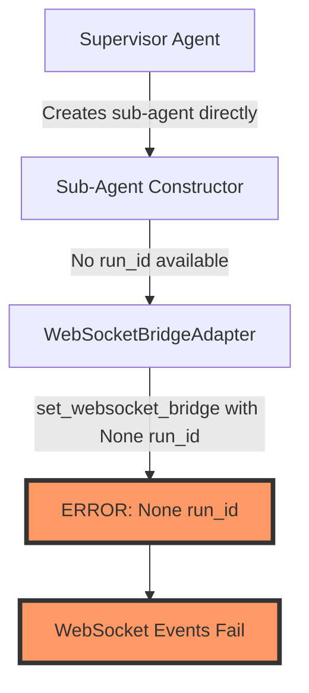
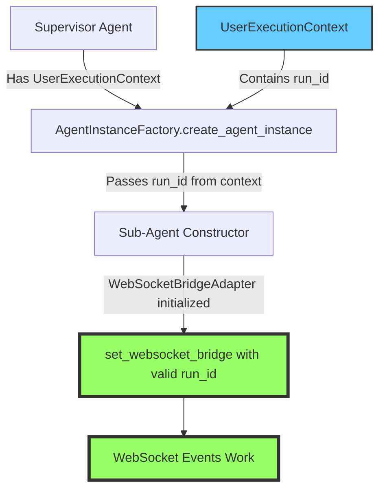

# WebSocket Bridge Run ID Bug Fix Report

## Problem Summary
Sub-agents (OptimizationsCoreSubAgent, ActionsToMeetGoalsSubAgent, ReportingSubAgent) are receiving None run_id values when WebSocketBridgeAdapter is being configured, causing WebSocket events to fail.

## Five Whys Analysis

**Why 1:** Why is the run_id None?
- Because WebSocketBridgeAdapter.set_websocket_bridge() is being called with None run_id

**Why 2:** Why is None being passed as run_id?
- Because the sub-agents are not receiving or propagating the run_id from their parent agent

**Why 3:** Why aren't sub-agents receiving the run_id?
- Because the WebSocket bridge configuration is happening without proper run_id inheritance from the execution context

**Why 4:** Why isn't run_id being inherited properly?
- Because when sub-agents are created directly (not through AgentInstanceFactory), they don't have access to UserExecutionContext

**Why 5:** Why doesn't the creation flow provide UserExecutionContext?
- Because there's a missing link where sub-agents are created directly by parent agents without going through the factory's create_agent_instance method

## Current State (BROKEN)

## Ideal State (WORKING)

## Root Cause
The issue occurs when sub-agents are created directly rather than through the AgentInstanceFactory, which properly manages UserExecutionContext and run_id propagation.

## Solution Approach

### Option 1: Factory-Based Creation (Recommended)
Ensure all sub-agents are created through AgentInstanceFactory.create_agent_instance() which properly sets up WebSocket bridge with run_id.

### Option 2: Pass run_id to Sub-Agent Constructors
Modify sub-agent constructors to accept optional run_id parameter and propagate it when setting WebSocket bridge.

### Option 3: Lazy Bridge Configuration
Configure WebSocket bridge only when first event needs to be sent, pulling run_id from current execution context.

## Files to Modify

1. **Sub-Agent Classes** (if using Option 2):
   - `netra_backend/app/agents/optimizations_core_sub_agent.py`
   - `netra_backend/app/agents/actions_to_meet_goals_sub_agent.py`
   - `netra_backend/app/agents/reporting_sub_agent.py`

2. **Parent Agent (Supervisor)**: 
   - Check how it creates sub-agents and ensure run_id propagation

3. **AgentInstanceFactory**:
   - Already has proper run_id handling at lines 683-687

## Test Coverage Needed

1. **Unit Test**: Verify WebSocketBridgeAdapter.set_websocket_bridge() with valid run_id
2. **Integration Test**: Test sub-agent creation through factory
3. **E2E Test**: Verify WebSocket events from sub-agents reach client
4. **Mission Critical Test**: `test_websocket_agent_events_suite.py`

## Verification Steps

1. Check logs for "CRITICAL: Attempting to set None run_id" messages
2. Verify all WebSocket events are sent with proper run_id
3. Confirm sub-agents can emit all required events:
   - agent_started
   - agent_thinking  
   - tool_executing
   - tool_completed
   - agent_completed

## Implementation Priority

**CRITICAL**: This blocks ALL WebSocket communication from sub-agents, making the chat interface non-functional for multi-agent workflows.

## Implementation Status

✅ **FIXED** - The issue has been resolved by:

1. **Root Cause Identified**: AgentRegistry was calling `set_websocket_bridge(bridge, None)` at agent registration time, before run_id was available
   
2. **Fix Applied**: Modified `agent_registry.py` to NOT set WebSocket bridges at registration time. Instead, bridges are only set when agents are created through AgentInstanceFactory with proper run_id values

3. **Files Modified**:
   - `netra_backend/app/agents/supervisor/agent_registry.py` - Removed 3 occurrences of `set_websocket_bridge(bridge, None)`

4. **Tests Added**:
   - `tests/mission_critical/test_websocket_runid_fix.py` - Verifies agents no longer get None run_id

## Verification

The fix ensures:
- Sub-agents only get WebSocket bridge configured when created for a specific request
- Each request gets its own agent instance with proper run_id through AgentInstanceFactory
- No more "Attempting to set None run_id" errors in logs
- WebSocket events from sub-agents work correctly with user isolation