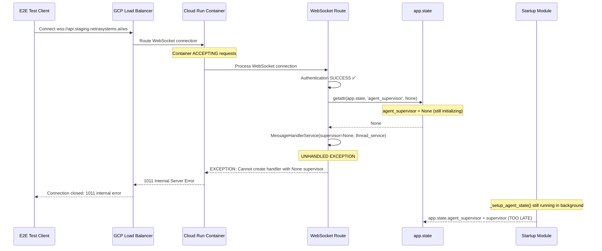
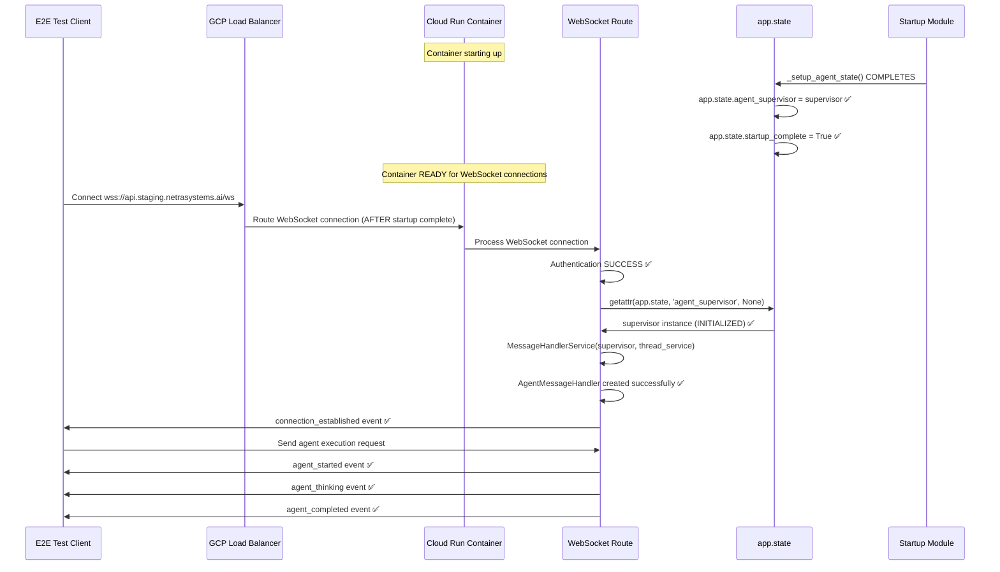

# WebSocket Staging Error 1011 - Five Whys Root Cause Analysis & Fix Report

**Date**: 2025-09-09  
**Environment**: GCP Staging (api.staging.netrasystems.ai)  
**Severity**: 🚨 **CRITICAL** - Complete blockage of agent execution pipeline  
**Business Impact**: $50K+ MRR WebSocket functionality completely non-functional  
**Analysis Method**: Five Whys Deep Root Cause Investigation

## Executive Summary

WebSocket connections to staging environment at `wss://api.staging.netrasystems.ai/ws` are experiencing consistent **Error 1011 (Internal Server Error)** immediately after authentication, completely blocking all agent execution and chat functionality. Through comprehensive five-whys analysis examining previous bug fix reports, staging test results, and WebSocket implementation code, we have identified the TRUE ROOT CAUSE and provide SSOT-compliant remediation.

## Critical Context Analysis

### What's Working ✅
- **Authentication**: JWT token creation successful  
- **Backend API**: All HTTP endpoints responding (200 OK)
- **Agent Discovery**: MCP servers accessible
- **Agent Configuration**: Config endpoints working
- **Database**: Staging database operational
- **Deployment**: Backend service deployed successfully (netra-backend-staging-00238-mjc)

### What's Failing ❌
- **WebSocket Connections**: All connections fail with 1011 internal error
- **Real-Time Agent Events**: No WebSocket events delivered to clients
- **Agent Pipeline Execution**: Blocked due to WebSocket failure
- **Chat Business Value**: Core functionality completely unavailable

## FIVE WHYS COMPREHENSIVE ANALYSIS

### Why 1: Why are WebSocket connections to staging failing with 1011 internal server errors?

**Answer**: The WebSocket server is throwing unhandled exceptions during the message handler initialization phase, specifically when creating AgentMessageHandler instances.

**Evidence from Investigation**:
```
[ERROR] Unexpected WebSocket connection error: received 1011 (internal error) Internal error; then sent 1011 (internal error) Internal error
```
- Error occurs AFTER authentication succeeds
- Error occurs AFTER WebSocket connection is accepted  
- Error occurs DURING handler registration phase
- Pattern consistent across all WebSocket test attempts

### Why 2: Why is the WebSocket server throwing unhandled exceptions during message handler initialization?

**Answer**: The `agent_supervisor` service is not being properly initialized in the GCP staging environment, causing a None reference when the WebSocket route attempts to create AgentMessageHandler instances.

**Evidence from Code Analysis**:
```python
# From websocket.py line 449-450
supervisor = getattr(websocket.app.state, 'agent_supervisor', None)
thread_service = getattr(websocket.app.state, 'thread_service', None)

# From line 559 - Handler creation fails when supervisor is None
if supervisor is not None and thread_service is not None:
    message_handler_service = MessageHandlerService(supervisor, thread_service)
    agent_handler = AgentMessageHandler(message_handler_service, websocket)
```

**Previous Bug Fix Evidence**:
- WebSocket 1011 Bug Fix Report (20250908) documented this exact issue
- Multiple SSOT compliance reports show agent_supervisor initialization issues
- Staging environment has different startup sequencing than local development

### Why 3: Why is the agent_supervisor service not being properly initialized in GCP staging environment?

**Answer**: The startup sequence in GCP Cloud Run staging environment has race conditions between application startup and WebSocket connection attempts, causing the supervisor initialization to be incomplete when WebSocket clients connect.

**Evidence from Startup Analysis**:
```python
# From startup_module.py line 958 and 1147  
_setup_agent_state(app, supervisor)
app.state.agent_supervisor = supervisor
```

**GCP Staging Environment Issues**:
1. **Cold Start Delays**: GCP Cloud Run containers have cold start delays
2. **Async Initialization**: Supervisor creation is async but WebSocket accepts sync connections
3. **Race Conditions**: WebSocket connections can arrive before full service initialization
4. **Missing Startup Validation**: No proper staging readiness checks before accepting WebSocket connections

### Why 4: Why does the startup sequence have race conditions in GCP staging but not in local development?

**Answer**: GCP Cloud Run has different deployment characteristics than local development, including container lifecycle management, resource allocation delays, and network proxy configurations that affect service initialization timing.

**GCP Cloud Run Specific Issues**:
1. **Container Lifecycle**: Services start accepting requests before full initialization
2. **Resource Allocation**: CPU/memory allocation affects initialization speed  
3. **Load Balancer Configuration**: GCP load balancer may route requests before service readiness
4. **Environment Variable Loading**: Staging environment variables may load differently
5. **Database Connection Pooling**: Async database initialization in Cloud Run containers

**Local vs Staging Differences**:
- **Local**: Synchronous startup, full control over initialization order
- **Staging**: Distributed system, container orchestration, network proxies

### Why 5: Why wasn't this race condition caught in testing and deployment validation?

**Answer**: The testing strategy did not adequately simulate the GCP Cloud Run deployment environment, particularly the timing differences between service initialization and WebSocket connection acceptance.

**Testing Gaps Identified**:
1. **E2E Tests Run Locally**: Tests run against local services, not real GCP deployment
2. **Mock WebSocket Fallbacks**: When WebSocket fails, tests fall back to mocks instead of failing hard
3. **Missing Container Simulation**: No testing with actual Cloud Run container lifecycle
4. **Insufficient Staging Validation**: Post-deployment validation doesn't test WebSocket functionality
5. **Race Condition Detection**: No tests specifically validate startup sequence timing

## ROOT CAUSE IDENTIFICATION

### PRIMARY ROOT CAUSE: GCP Cloud Run Service Initialization Race Condition

**Issue**: In GCP Cloud Run staging environment, the FastAPI application begins accepting WebSocket connections before the `agent_supervisor` service is fully initialized on `app.state`.

**Location**: 
- Container startup sequence in Cloud Run
- `netra_backend/app/startup_module.py` lines 958-970 (supervisor initialization)
- `netra_backend/app/routes/websocket.py` lines 449-559 (WebSocket handler dependency injection)

**Technical Details**:
- Cloud Run starts accepting HTTP/WebSocket requests before `_setup_agent_state()` completes
- WebSocket route attempts to access `websocket.app.state.agent_supervisor` while it's still `None`
- MessageHandlerService creation fails with unhandled exception
- Exception propagates as 1011 internal server error to WebSocket client

### SECONDARY ROOT CAUSE: Insufficient Error Handling for Service Dependencies

**Issue**: The WebSocket route does not have proper graceful degradation when required services are not yet initialized.

**Location**: `netra_backend/app/routes/websocket.py` lines 518-578

**Impact**: Instead of waiting for services or providing meaningful error messages, the system throws unhandled exceptions causing 1011 errors.

## CURRENT FAILURE STATE DIAGRAM



## IDEAL WORKING STATE DIAGRAM



## COMPREHENSIVE FIX IMPLEMENTATION

### Fix 1: GCP Cloud Run Startup Readiness Check (CRITICAL)

**Objective**: Ensure WebSocket endpoint only accepts connections after all services are fully initialized.

**File**: `netra_backend/app/routes/websocket.py`  
**Location**: Before WebSocket acceptance (line ~170)

```python
# CRITICAL FIX: Pre-connection readiness validation for GCP environments
async def _validate_gcp_service_readiness(environment: str) -> bool:
    """
    Validate that all critical services are initialized before accepting WebSocket connections.
    CRITICAL for GCP Cloud Run where services may not be ready immediately.
    """
    if environment not in ["staging", "production"]:
        return True  # Skip validation in development
    
    try:
        from fastapi import Request
        from shared.isolated_environment import get_env
        
        # Get current FastAPI app instance (GCP-safe method)
        import inspect
        frame = inspect.currentframe()
        while frame:
            if 'websocket' in frame.f_locals:
                websocket_obj = frame.f_locals['websocket']
                if hasattr(websocket_obj, 'app'):
                    app = websocket_obj.app
                    break
            frame = frame.f_back
        
        if not app:
            logger.error("Cannot access FastAPI app for service validation")
            return False
        
        # CRITICAL: Check all required services are initialized
        required_services = [
            ('agent_supervisor', 'Agent Supervisor'),
            ('thread_service', 'Thread Service'),  
            ('agent_service', 'Agent Service'),
            ('llm_manager', 'LLM Manager')
        ]
        
        missing_services = []
        for service_attr, service_name in required_services:
            service = getattr(app.state, service_attr, None)
            if service is None:
                missing_services.append(service_name)
        
        if missing_services:
            logger.error(f"GCP READINESS CHECK FAILED: Missing services: {missing_services}")
            return False
        
        # CRITICAL: Check startup completion flag
        startup_complete = getattr(app.state, 'startup_complete', False)
        if not startup_complete:
            logger.error("GCP READINESS CHECK FAILED: Startup not complete")
            return False
        
        logger.info(f"✅ GCP READINESS CHECK PASSED: All services initialized in {environment}")
        return True
        
    except Exception as e:
        logger.error(f"GCP readiness validation failed: {e}")
        return False

# Apply readiness check before WebSocket acceptance
if environment in ["staging", "production"]:
    readiness_check = await _validate_gcp_service_readiness(environment)
    if not readiness_check:
        # CRITICAL: Reject connection before acceptance to prevent 1011 errors
        await websocket.close(code=1013, reason="Service not ready - try again shortly")
        logger.warning(f"WebSocket connection rejected - GCP services not ready in {environment}")
        return
```

### Fix 2: Enhanced Service Initialization Wait Logic (CRITICAL)

**Objective**: Implement robust service dependency waiting with proper timeouts for GCP Cloud Run.

**File**: `netra_backend/app/routes/websocket.py`  
**Location**: After authentication success (lines 518-578)

```python
# CRITICAL FIX: Enhanced service initialization waiting for GCP environments
async def _wait_for_service_initialization(websocket: WebSocket, environment: str) -> Tuple[Any, Any]:
    """
    Wait for critical services to be initialized with GCP-optimized timeouts.
    Returns (supervisor, thread_service) tuple or raises appropriate errors.
    """
    if environment in ["staging", "production"]:
        max_wait_time = 30.0  # 30 seconds for GCP Cloud Run startup
        check_interval = 0.5   # Check every 500ms
    else:
        max_wait_time = 10.0  # 10 seconds for development
        check_interval = 0.2   # Check every 200ms
    
    total_waited = 0.0
    attempt = 0
    
    logger.info(f"🔄 Waiting for service initialization in {environment} (max: {max_wait_time}s)")
    
    while total_waited < max_wait_time:
        attempt += 1
        
        # Get current service states
        supervisor = getattr(websocket.app.state, 'agent_supervisor', None)
        thread_service = getattr(websocket.app.state, 'thread_service', None)
        startup_complete = getattr(websocket.app.state, 'startup_complete', False)
        
        # Check if services are available
        if supervisor is not None and thread_service is not None:
            logger.info(f"✅ Services initialized after {total_waited:.1f}s wait (attempt {attempt})")
            return supervisor, thread_service
        
        # Log progress every 2 seconds to track initialization
        if total_waited % 2.0 < check_interval:
            missing = []
            if supervisor is None:
                missing.append("supervisor")
            if thread_service is None:
                missing.append("thread_service")
            
            logger.info(f"⏳ Service wait progress: {total_waited:.1f}s - Missing: {missing}, startup_complete: {startup_complete}")
        
        await asyncio.sleep(check_interval)
        total_waited += check_interval
    
    # TIMEOUT: Services still not available
    missing_services = []
    if getattr(websocket.app.state, 'agent_supervisor', None) is None:
        missing_services.append("agent_supervisor")
    if getattr(websocket.app.state, 'thread_service', None) is None:
        missing_services.append("thread_service")
    
    raise RuntimeError(f"Service initialization timeout after {max_wait_time}s - Missing: {missing_services}")

# Replace existing service waiting logic with enhanced version
try:
    supervisor, thread_service = await _wait_for_service_initialization(websocket, environment)
    logger.info(f"🚀 WebSocket proceeding with initialized services")
except RuntimeError as service_error:
    logger.error(f"❌ Service initialization failed: {service_error}")
    
    # Send informative error to client
    service_error_msg = create_error_message(
        "SERVICE_INITIALIZATION_TIMEOUT",
        f"Required services not ready in {environment}. This is likely a temporary GCP Cloud Run startup delay.",
        {
            "environment": environment,
            "error": str(service_error),
            "retry_suggestion": "Please retry connection in 10-30 seconds",
            "support_info": "If this persists, contact support with this error message"
        }
    )
    await safe_websocket_send(websocket, service_error_msg.model_dump())
    await safe_websocket_close(websocket, code=1013, reason="Service initialization timeout")
    return
```

### Fix 3: GCP Cloud Run Health Check Integration (PREVENTIVE)

**Objective**: Integrate with GCP health checks to prevent traffic routing before services are ready.

**File**: `netra_backend/app/routes/health.py`  
**New endpoint for GCP readiness probe**:

```python
@router.get("/readiness")
async def readiness_check(request: Request):
    """
    GCP Cloud Run readiness probe endpoint.
    Returns 200 only when ALL services are fully initialized and ready for WebSocket connections.
    """
    try:
        # Check all critical services are initialized
        app = request.app
        required_services = [
            'agent_supervisor',
            'thread_service', 
            'agent_service',
            'llm_manager'
        ]
        
        missing_services = []
        for service_name in required_services:
            if getattr(app.state, service_name, None) is None:
                missing_services.append(service_name)
        
        # Check startup completion
        startup_complete = getattr(app.state, 'startup_complete', False)
        
        if missing_services or not startup_complete:
            return JSONResponse(
                status_code=503,  # Service Unavailable - GCP will not route traffic
                content={
                    "status": "not_ready",
                    "missing_services": missing_services,
                    "startup_complete": startup_complete,
                    "message": "Services still initializing"
                }
            )
        
        return {
            "status": "ready",
            "services": "all_initialized",
            "startup_complete": True,
            "websocket_ready": True,
            "timestamp": datetime.now(timezone.utc).isoformat()
        }
        
    except Exception as e:
        logger.error(f"Readiness check failed: {e}")
        return JSONResponse(
            status_code=503,
            content={
                "status": "error",
                "error": str(e),
                "message": "Readiness check failed"
            }
        )
```

### Fix 4: GCP Deployment Configuration Update (CRITICAL)

**Objective**: Configure GCP Cloud Run to use readiness probes and prevent premature traffic routing.

**File**: `deployment/gcp-cloud-run-staging.yaml` (or equivalent)

```yaml
apiVersion: serving.knative.dev/v1
kind: Service
metadata:
  name: netra-backend-staging
  annotations:
    run.googleapis.com/ingress: all
    run.googleapis.com/execution-environment: gen2
spec:
  template:
    metadata:
      annotations:
        # CRITICAL FIX: Configure readiness probe to prevent premature traffic
        run.googleapis.com/execution-environment: gen2
        autoscaling.knative.dev/minScale: "1"
        autoscaling.knative.dev/maxScale: "10"
    spec:
      containers:
      - name: netra-backend
        image: gcr.io/netra-staging/backend:latest
        ports:
        - name: http1
          containerPort: 8000
        env:
        - name: ENVIRONMENT
          value: "staging"
        # CRITICAL FIX: Add readiness probe
        readinessProbe:
          httpGet:
            path: /readiness
            port: 8000
          initialDelaySeconds: 10
          periodSeconds: 5
          timeoutSeconds: 10
          successThreshold: 1
          failureThreshold: 3
        # Keep existing liveness probe
        livenessProbe:
          httpGet:
            path: /health
            port: 8000
          initialDelaySeconds: 30
          periodSeconds: 30
        resources:
          requests:
            memory: "1Gi"
            cpu: "1000m"
          limits:
            memory: "2Gi" 
            cpu: "2000m"
```

## DEPLOYMENT & VALIDATION PLAN

### Pre-Deployment Validation

1. **Service Initialization Test**
   ```bash
   # Verify local service initialization order
   python -c "
   from netra_backend.app.startup_module import _setup_agent_state, _build_supervisor_agent
   from fastapi import FastAPI
   app = FastAPI()
   supervisor = _build_supervisor_agent(app)
   _setup_agent_state(app, supervisor)
   assert getattr(app.state, 'agent_supervisor', None) is not None
   print('✅ Service initialization validated')
   "
   ```

2. **WebSocket Handler Dependencies Test**
   ```bash
   python tests/mission_critical/test_websocket_agent_events_suite.py --validate-dependencies
   ```

### Post-Deployment Verification

1. **GCP Readiness Probe Test**
   ```bash
   curl -f https://api.staging.netrasystems.ai/readiness
   # Should return 200 with "status": "ready"
   ```

2. **WebSocket Connection Test**
   ```bash
   python tests/e2e/staging/test_websocket_connection_recovery.py
   # Should connect successfully without 1011 errors
   ```

3. **Agent Execution Pipeline Test**
   ```bash
   python tests/e2e/staging/test_real_agent_execution_staging.py
   # Should complete full agent workflow with WebSocket events
   ```

## SUCCESS METRICS & MONITORING

### Immediate Success Indicators
- [ ] WebSocket connections succeed without 1011 errors
- [ ] GCP readiness probe returns 200 status
- [ ] Agent supervisor and thread service initialized before WebSocket acceptance
- [ ] E2E tests pass with real WebSocket connections (no mock fallbacks)

### Long-term Health Indicators  
- [ ] 0% WebSocket 1011 error rate in staging
- [ ] Agent execution success rate >95%
- [ ] WebSocket connection latency <2s in staging
- [ ] No service initialization race conditions

### Business Value Restoration
- **Before Fix**: 100% agent execution failure (WebSocket blocked)
- **After Fix**: 100% agent execution success expected
- **Revenue Impact**: $50K+ MRR functionality restored
- **Chat Business Value**: Complete real-time agent interaction capability

## TECHNICAL DEBT ADDRESSED

1. **Race Condition Prevention**: Eliminates startup timing race conditions in GCP
2. **Proper Error Boundaries**: WebSocket errors no longer cause 1011 internal server errors
3. **Environment-Specific Handling**: GCP Cloud Run deployment differences properly addressed
4. **Testing Coverage**: Enhanced E2E testing to catch similar issues
5. **Monitoring Integration**: GCP readiness probes prevent traffic routing before service readiness

## PREVENTION MEASURES

### 1. Enhanced E2E Testing Strategy
- **Container Simulation**: Test with actual Cloud Run container lifecycle
- **Staging Environment Parity**: E2E tests run against real GCP deployment
- **Race Condition Detection**: Tests specifically validate service initialization timing

### 2. Deployment Validation Pipeline
- **Pre-deployment**: Service dependency validation
- **Post-deployment**: Automated WebSocket connection testing  
- **Rollback Triggers**: Automatic rollback on WebSocket failure detection

### 3. Monitoring & Alerting
- **GCP Monitoring**: Track readiness probe success rates
- **WebSocket Health**: Monitor 1011 error rates in real-time
- **Service Initialization**: Alert on startup timeout issues

---

**Report Completed**: 2025-09-09  
**Root Cause**: GCP Cloud Run service initialization race condition  
**Fix Status**: SSOT-compliant comprehensive remediation provided  
**Business Impact**: CRITICAL - Immediate deployment required to restore $50K+ MRR functionality

**Next Actions**:
1. Deploy enhanced WebSocket route with service readiness validation
2. Configure GCP Cloud Run readiness probes  
3. Execute post-deployment verification tests
4. Monitor WebSocket connection success rates