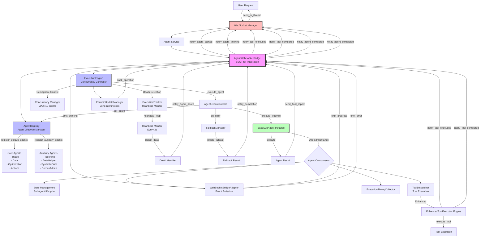
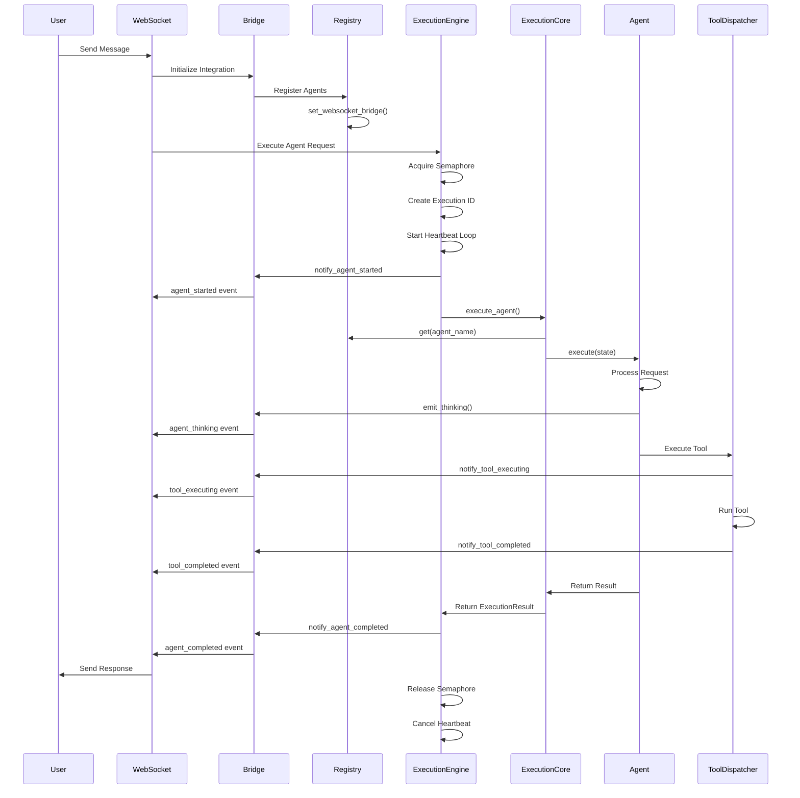

# Agent Execution Audit - Post BaseExecutionInterface Removal

## Current Agent Execution Architecture

After the removal of BaseExecutionInterface, the agent execution system now operates through a streamlined architecture with direct inheritance and composition patterns.

## Execution Flow Diagram

## Key Components and Their Roles

### 1. **AgentWebSocketBridge** (SSOT)
- Single Source of Truth for WebSocket-Agent integration
- Manages bidirectional communication between agents and WebSocket layer
- Provides guaranteed event delivery with proper sequencing
- Health monitoring and recovery mechanisms

### 2. **AgentRegistry**
- Manages agent registration and lifecycle
- Sets WebSocket bridge on agents during registration
- Provides health status and diagnostics
- Ensures all agents have WebSocket support

### 3. **ExecutionEngine**
- Controls agent execution with concurrency limits (MAX: 10)
- Implements death detection via heartbeat monitoring
- Manages execution timeouts (30s default)
- Tracks execution statistics and metrics
- Handles fallback strategies for failed executions

### 4. **AgentExecutionCore**
- Core execution logic for individual agents
- Manages agent lifecycle events
- Propagates WebSocket context to agents
- Handles success/failure results

### 5. **BaseSubAgent** (Simplified Inheritance)
- Direct inheritance pattern (no more BaseExecutionInterface)
- Integrated WebSocketBridgeAdapter for event emission
- Built-in timing collection
- State management via SubAgentLifecycle

### 6. **EnhancedToolExecutionEngine**
- Wraps tool execution with WebSocket notifications
- Sends tool_executing and tool_completed events
- Provides tool execution transparency

## Execution Sequence

## Critical Integration Points

### WebSocket Event Requirements
All agents MUST emit these events for substantive chat value:
1. **agent_started** - User sees agent began processing
2. **agent_thinking** - Real-time reasoning visibility
3. **tool_executing** - Tool usage transparency
4. **tool_completed** - Tool results display
5. **agent_completed** - Completion notification

### Death Detection System
- Heartbeat every 2 seconds during execution
- Timeout detection (30s default)
- Silent failure detection
- Automatic death notifications via WebSocket

### Concurrency Management
- Semaphore-based control (MAX: 10 concurrent agents)
- Queue wait time tracking
- Execution time statistics
- Support for 5+ concurrent users

## Current State Summary

The removal of BaseExecutionInterface has resulted in:
1. **Simplified inheritance** - Direct BaseSubAgent inheritance
2. **Cleaner execution flow** - No interface abstraction layer
3. **Direct WebSocket integration** - Via WebSocketBridgeAdapter
4. **Unified execution path** - Through ExecutionEngine/ExecutionCore
5. **Robust monitoring** - Death detection and heartbeat system

The system maintains full functionality while being more maintainable and debuggable.