# Apex OAuth Authentication Integration Plan for Zen

## Executive Summary
This document outlines a comprehensive plan to integrate optional OAuth 2.0 authentication into Zen for connecting to Apex services. The authentication system will be designed to be non-intrusive, secure, and seamless while maintaining backwards compatibility for users who don't require authentication.

## Architecture Overview

### High-Level Authentication Flow

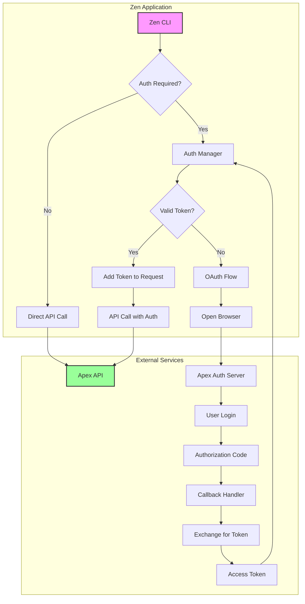

### Detailed OAuth 2.0 Flow

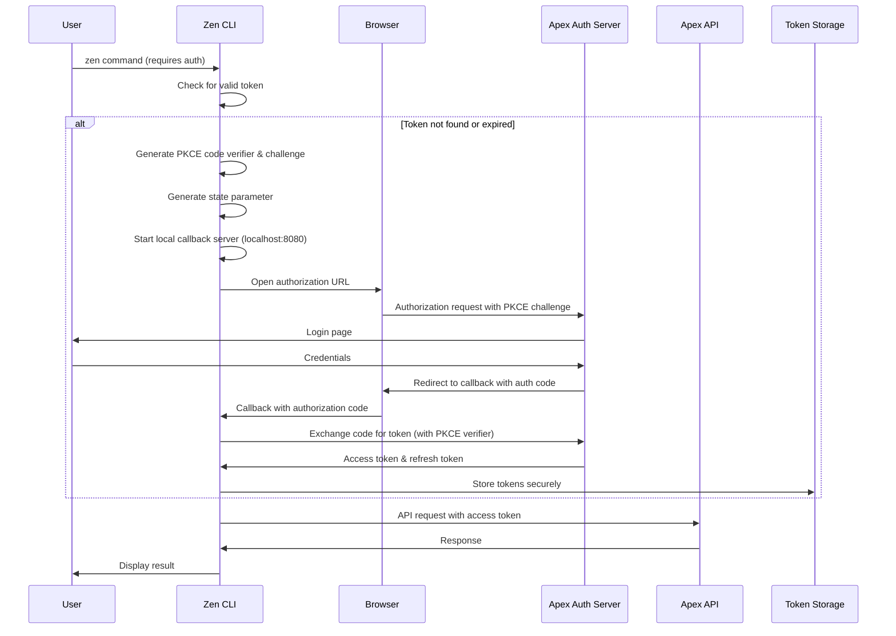

## Component Architecture

### System Components Diagram

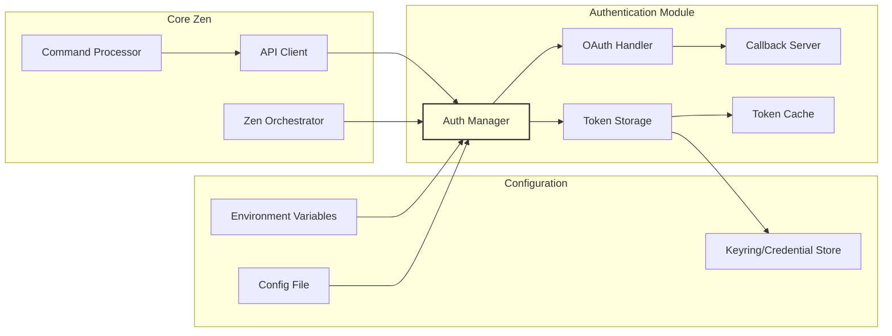

### Class Structure

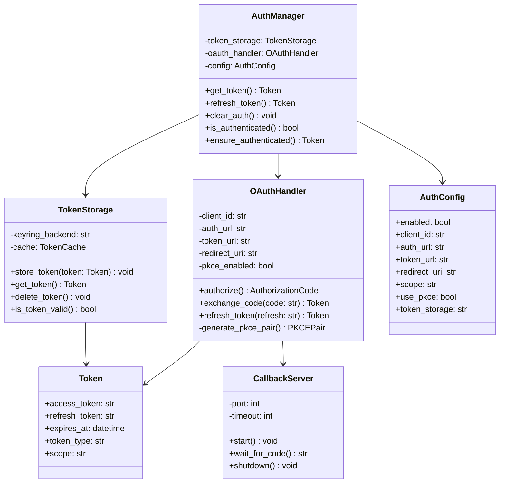

## Implementation Details

### 1. Authentication Module Structure

```
zen/
├── auth/
│   ├── __init__.py
│   ├── auth_manager.py       # Main authentication coordinator
│   ├── oauth_handler.py      # OAuth 2.0 flow implementation
│   ├── token_storage.py      # Secure token storage
│   ├── callback_server.py    # Local HTTP server for OAuth callback
│   ├── config.py             # Authentication configuration
│   └── exceptions.py         # Custom authentication exceptions
```

### 2. Token Storage Strategy

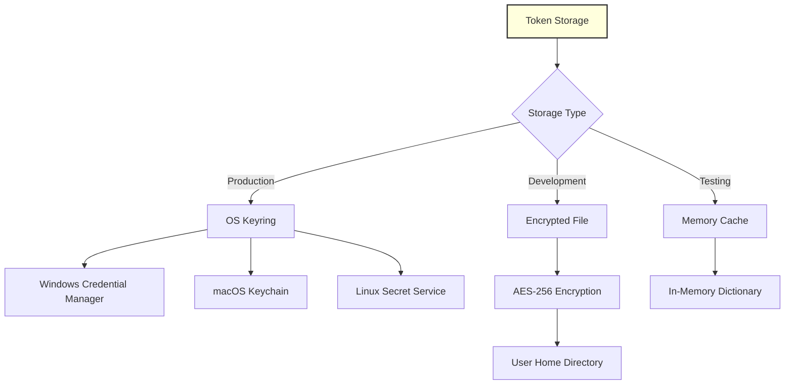

### 3. Configuration Management

#### Configuration File Structure (config.json)
```json
{
  "authentication": {
    "enabled": false,
    "provider": "apex",
    "oauth": {
      "client_id": "${APEX_CLIENT_ID}",
      "auth_url": "https://apex.example.com/oauth/authorize",
      "token_url": "https://apex.example.com/oauth/token",
      "redirect_uri": "http://localhost:8080/callback",
      "scope": "read write",
      "use_pkce": true,
      "timeout": 300
    },
    "token_storage": {
      "type": "keyring",
      "fallback": "encrypted_file",
      "cache_duration": 3600
    },
    "retry": {
      "max_attempts": 3,
      "backoff_factor": 2
    }
  },
  "api": {
    "base_url": "https://api.apex.example.com",
    "timeout": 30,
    "verify_ssl": true
  }
}
```

### 4. Authentication States

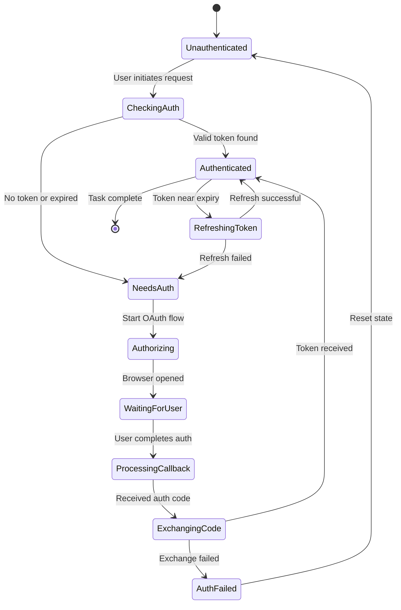

## Integration Points

### 1. Zen Orchestrator Integration

```python
# zen_orchestrator.py modifications

class ZenOrchestrator:
    def __init__(self):
        self.auth_manager = None
        if self.config.get('authentication', {}).get('enabled', False):
            from auth.auth_manager import AuthManager
            self.auth_manager = AuthManager(self.config['authentication'])

    async def prepare_request(self, request):
        """Prepare request with authentication if needed"""
        if self.auth_manager and request.requires_auth:
            token = await self.auth_manager.ensure_authenticated()
            request.headers['Authorization'] = f'Bearer {token.access_token}'
        return request
```

### 2. Command-Line Interface Updates

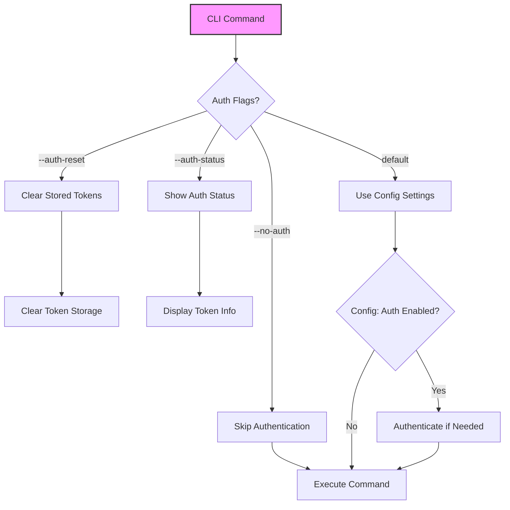

### New CLI Arguments:
- `--no-auth`: Skip authentication even if configured
- `--auth-reset`: Clear stored authentication tokens
- `--auth-status`: Display current authentication status
- `--auth-provider [apex]`: Override authentication provider
- `--auth-timeout [seconds]`: Set authentication timeout

## Security Considerations

### 1. Security Architecture

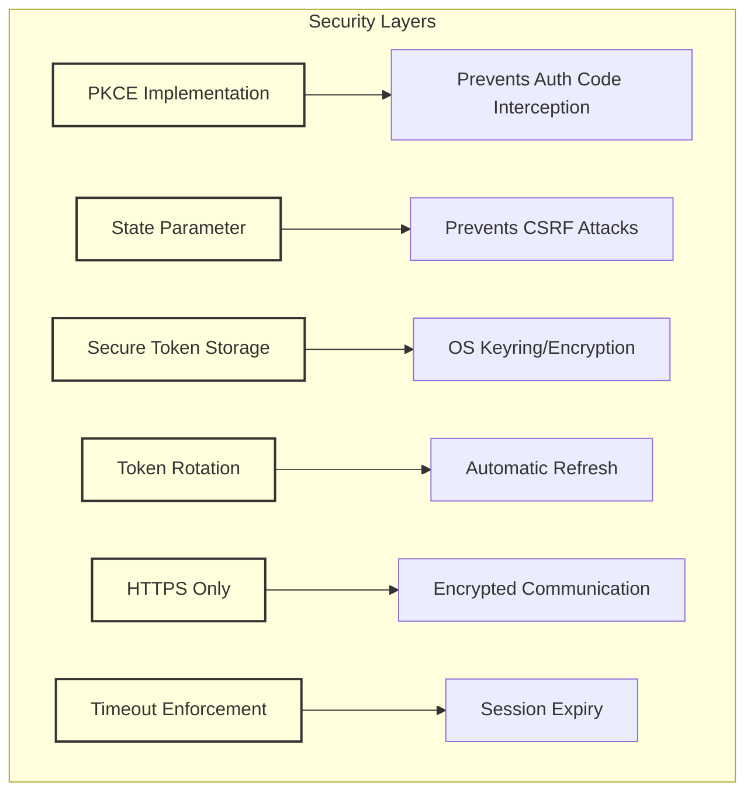

### 2. Security Best Practices

1. **PKCE (Proof Key for Code Exchange)**
   - Generate cryptographically random code verifier
   - Create SHA256 hash as code challenge
   - Prevents authorization code interception attacks

2. **Token Storage**
   - Never store tokens in plain text
   - Use OS-provided credential storage when available
   - Fall back to encrypted file storage with user-specific key
   - Implement token expiry and automatic cleanup

3. **State Parameter**
   - Generate unique state for each auth request
   - Validate state in callback to prevent CSRF

4. **Secure Communication**
   - Always use HTTPS for OAuth endpoints
   - Validate SSL certificates
   - Implement certificate pinning for critical environments

5. **Token Lifecycle**
   - Implement token refresh before expiry
   - Clear tokens on logout or auth reset
   - Implement maximum token age policies

## Error Handling

### Error Flow Diagram

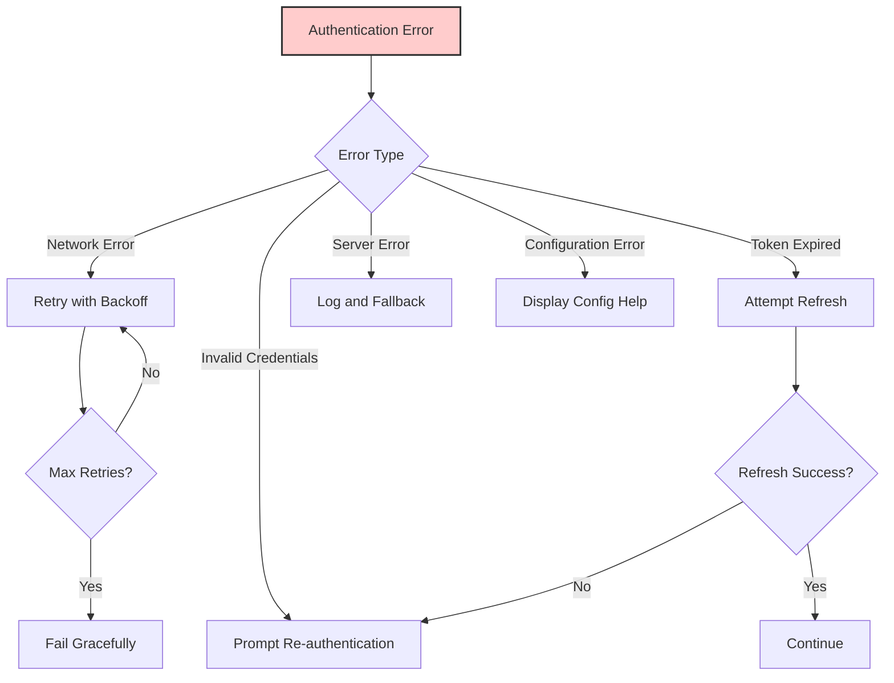

### Error Types and Handling

| Error Type | Description | Handling Strategy | User Message |
|------------|-------------|-------------------|--------------|
| `AuthenticationRequired` | No token available | Initiate OAuth flow | "Authentication required. Opening browser..." |
| `TokenExpired` | Access token expired | Attempt refresh | "Token expired. Refreshing..." |
| `RefreshFailed` | Refresh token invalid | Re-authenticate | "Session expired. Please authenticate again." |
| `NetworkError` | Connection failed | Retry with backoff | "Connection error. Retrying..." |
| `ConfigurationError` | Invalid config | Display help | "Invalid authentication configuration. Check settings." |
| `AuthorizationDenied` | User denied access | Clean exit | "Authorization denied by user." |
| `ServerError` | OAuth server error | Log and retry | "Authentication server error. Please try again." |

## Implementation Phases

### Phase 1: Core Authentication (Week 1-2)
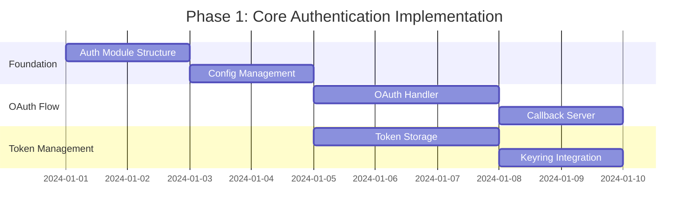

### Phase 2: Integration (Week 3)
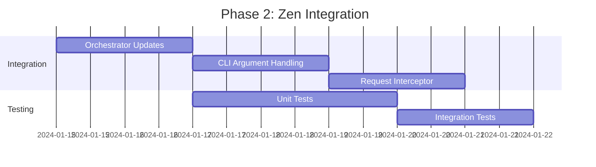

### Phase 3: Security & Polish (Week 4)
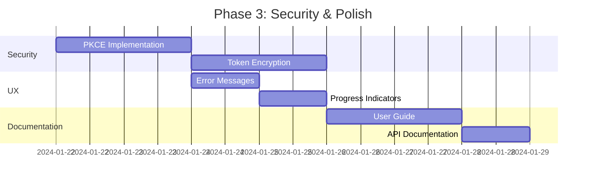

## Testing Strategy

### 1. Test Coverage Areas

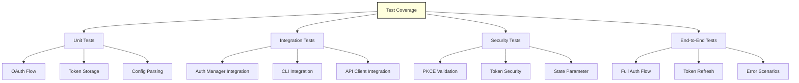

### 2. Test Cases

#### Unit Tests
```python
# test_auth_manager.py
def test_token_validation():
    """Test token expiry validation"""

def test_token_refresh():
    """Test automatic token refresh"""

def test_auth_required_detection():
    """Test detection of auth-required endpoints"""

# test_oauth_handler.py
def test_pkce_generation():
    """Test PKCE code verifier and challenge generation"""

def test_state_validation():
    """Test state parameter validation"""

def test_authorization_url_generation():
    """Test proper OAuth URL construction"""

# test_token_storage.py
def test_secure_storage():
    """Test token encryption and storage"""

def test_token_retrieval():
    """Test token retrieval and decryption"""

def test_token_deletion():
    """Test secure token deletion"""
```

#### Integration Tests
```python
# test_zen_auth_integration.py
def test_authenticated_request():
    """Test full request flow with authentication"""

def test_auth_bypass():
    """Test --no-auth flag functionality"""

def test_token_refresh_during_operation():
    """Test token refresh mid-operation"""
```

## Monitoring and Observability

### 1. Metrics and Logging

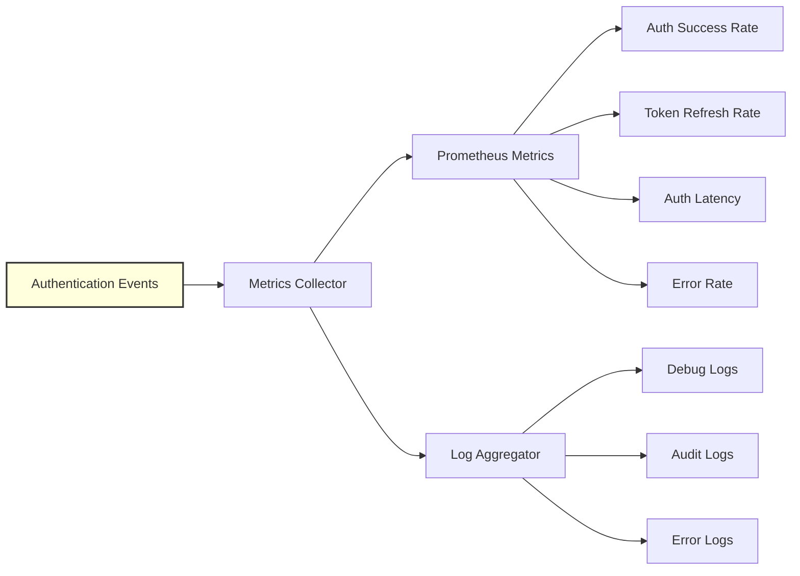

### 2. Key Metrics to Track

| Metric | Description | Alert Threshold |
|--------|-------------|-----------------|
| `auth_success_rate` | Successful authentications / Total attempts | < 95% |
| `token_refresh_rate` | Successful refreshes / Total refresh attempts | < 90% |
| `auth_latency_p95` | 95th percentile authentication time | > 5s |
| `token_expiry_buffer` | Time before token expiry when refresh triggered | < 5 min |
| `auth_errors_per_minute` | Authentication errors per minute | > 10 |

## Migration and Rollout Strategy

### 1. Feature Flag Implementation

```python
# Feature flag for gradual rollout
class AuthFeatureFlags:
    OAUTH_ENABLED = "oauth_enabled"
    PKCE_ENABLED = "pkce_enabled"
    AUTO_REFRESH = "auto_refresh"
    SECURE_STORAGE = "secure_storage"

    @classmethod
    def is_enabled(cls, flag: str, user_config: dict = None) -> bool:
        # Check environment variable first
        env_key = f"ZEN_FF_{flag.upper()}"
        if env_key in os.environ:
            return os.environ[env_key].lower() == 'true'

        # Check user configuration
        if user_config:
            return user_config.get('feature_flags', {}).get(flag, False)

        return False
```

### 2. Rollout Phases

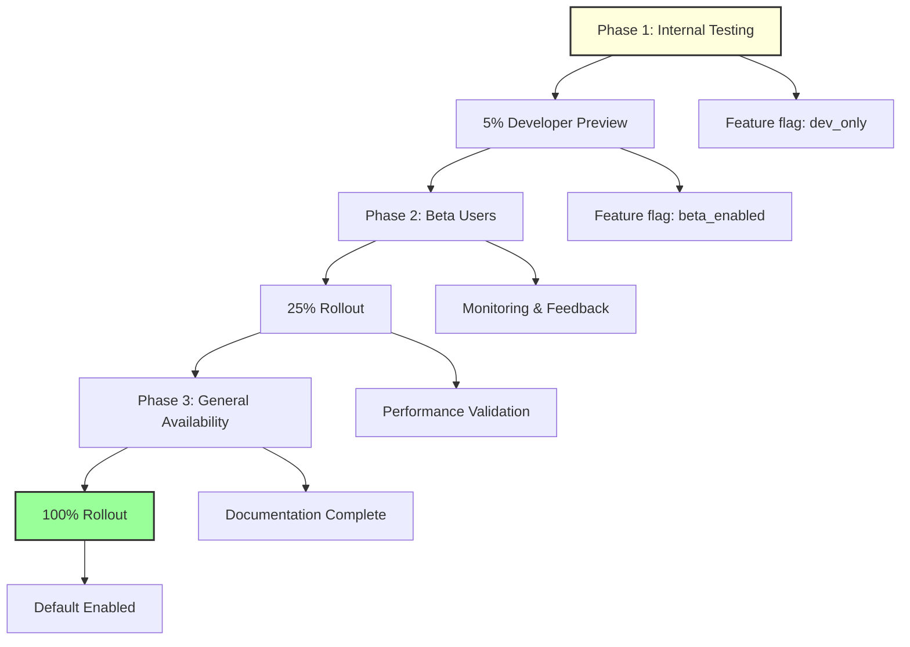

## API Contract

### 1. Authentication Headers

```yaml
# OpenAPI Specification
components:
  securitySchemes:
    bearerAuth:
      type: http
      scheme: bearer
      bearerFormat: JWT

  headers:
    Authorization:
      description: Bearer token for API authentication
      schema:
        type: string
        pattern: '^Bearer [A-Za-z0-9\-_]+\.?[A-Za-z0-9\-_]*\.?[A-Za-z0-9\-_]*$'

    X-Refresh-Token:
      description: Refresh token for obtaining new access tokens
      schema:
        type: string

    X-Client-Id:
      description: OAuth client identifier
      schema:
        type: string
```

### 2. Error Response Format

```json
{
  "error": {
    "code": "AUTH_REQUIRED",
    "message": "Authentication required to access this resource",
    "details": {
      "auth_url": "https://apex.example.com/oauth/authorize",
      "required_scopes": ["read", "write"]
    },
    "timestamp": "2024-01-01T12:00:00Z"
  }
}
```

## Configuration Examples

### 1. Minimal Configuration (Auth Disabled)
```json
{
  "authentication": {
    "enabled": false
  }
}
```

### 2. Basic OAuth Configuration
```json
{
  "authentication": {
    "enabled": true,
    "provider": "apex",
    "oauth": {
      "client_id": "zen-client-123",
      "auth_url": "https://apex.example.com/oauth/authorize",
      "token_url": "https://apex.example.com/oauth/token"
    }
  }
}
```

### 3. Advanced Configuration with All Options
```json
{
  "authentication": {
    "enabled": true,
    "provider": "apex",
    "oauth": {
      "client_id": "${APEX_CLIENT_ID}",
      "client_secret": "${APEX_CLIENT_SECRET}",
      "auth_url": "https://apex.example.com/oauth/authorize",
      "token_url": "https://apex.example.com/oauth/token",
      "redirect_uri": "http://localhost:8080/callback",
      "scope": "read write admin",
      "use_pkce": true,
      "timeout": 300,
      "max_retries": 3
    },
    "token_storage": {
      "type": "keyring",
      "fallback": "encrypted_file",
      "cache_duration": 3600,
      "encryption_key": "${TOKEN_ENCRYPTION_KEY}"
    },
    "retry": {
      "max_attempts": 3,
      "backoff_factor": 2,
      "max_backoff": 30
    },
    "feature_flags": {
      "auto_refresh": true,
      "silent_auth": false,
      "parallel_refresh": true
    }
  }
}
```

## Dependencies

### Required Python Packages

```python
# requirements.txt additions
authlib>=1.2.0          # OAuth 2.0 client implementation
keyring>=24.0.0         # Secure credential storage
cryptography>=41.0.0    # Token encryption
aiohttp>=3.9.0          # Async HTTP client
python-jose>=3.3.0      # JWT handling
pkce>=1.0.3             # PKCE implementation
```

### Optional Dependencies

```python
# requirements-dev.txt
pytest-asyncio>=0.21.0  # Async test support
responses>=0.23.0       # HTTP mocking
pytest-mock>=3.12.0     # Test mocking utilities
```

## Troubleshooting Guide

### Common Issues and Solutions

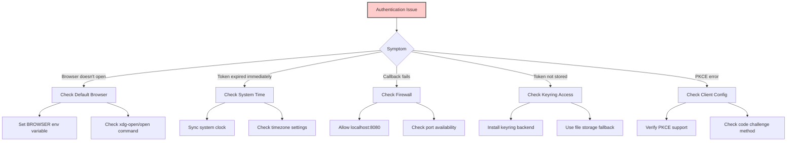

### Debug Mode

```bash
# Enable debug logging for authentication
export ZEN_AUTH_DEBUG=true
export ZEN_AUTH_LOG_LEVEL=DEBUG

# Test authentication flow
zen --auth-test

# Check authentication status
zen --auth-status

# Clear authentication
zen --auth-reset
```

## Performance Considerations

### 1. Token Caching Strategy

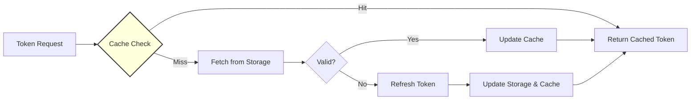

### 2. Performance Metrics

| Operation | Target Latency | Optimization Strategy |
|-----------|---------------|----------------------|
| Token Cache Hit | < 1ms | In-memory LRU cache |
| Token Storage Retrieval | < 50ms | Async I/O, connection pooling |
| Token Refresh | < 500ms | Preemptive refresh, parallel refresh |
| Full OAuth Flow | < 10s | PKCE, optimized redirects |
| Keyring Access | < 100ms | Credential caching |

## Future Enhancements

### Roadmap

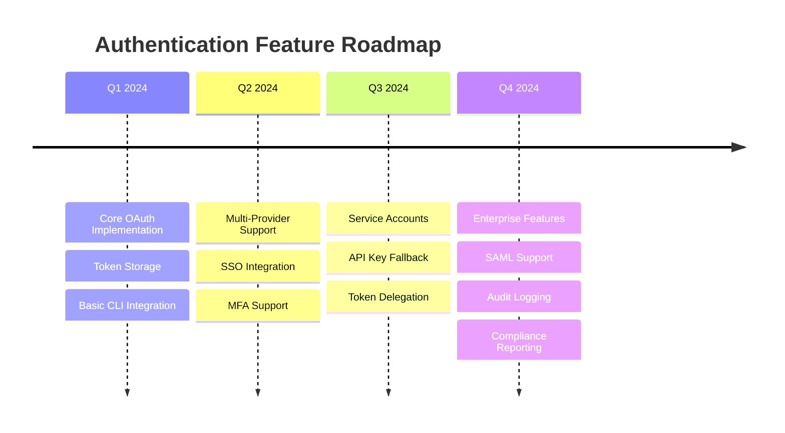

### Potential Future Features

1. **Multi-Provider Support**
   - Support for multiple OAuth providers
   - Provider-specific configurations
   - Dynamic provider selection

2. **Enhanced Security**
   - Multi-factor authentication (MFA)
   - Biometric authentication support
   - Hardware token integration

3. **Enterprise Features**
   - SAML 2.0 support
   - Active Directory integration
   - Role-based access control (RBAC)
   - Audit logging and compliance

4. **Developer Experience**
   - Authentication SDK
   - Plugin architecture
   - Custom authentication providers
   - Testing utilities

## Conclusion

This comprehensive plan provides a robust, secure, and user-friendly OAuth authentication system for Zen to connect with Apex. The implementation focuses on:

- **Security First**: PKCE, secure token storage, and encryption
- **User Experience**: Seamless authentication flow with minimal interruption
- **Flexibility**: Optional authentication with graceful fallbacks
- **Maintainability**: Modular architecture with clear separation of concerns
- **Observability**: Comprehensive logging and monitoring

The phased approach ensures that core functionality is delivered quickly while allowing for iterative improvements and feature additions based on user feedback.

## Appendix

### A. Reference Implementation Snippets

#### OAuth Handler with PKCE

```python
import hashlib
import base64
import secrets
from urllib.parse import urlencode

class OAuthHandler:
    def __init__(self, config: dict):
        self.client_id = config['client_id']
        self.auth_url = config['auth_url']
        self.token_url = config['token_url']
        self.redirect_uri = config.get('redirect_uri', 'http://localhost:8080/callback')
        self.use_pkce = config.get('use_pkce', True)

    def generate_pkce_pair(self) -> tuple[str, str]:
        """Generate PKCE code verifier and challenge"""
        verifier = base64.urlsafe_b64encode(secrets.token_bytes(32)).decode('utf-8').rstrip('=')
        challenge = base64.urlsafe_b64encode(
            hashlib.sha256(verifier.encode('utf-8')).digest()
        ).decode('utf-8').rstrip('=')
        return verifier, challenge

    def get_authorization_url(self, state: str, scope: str = None) -> tuple[str, str]:
        """Generate OAuth authorization URL"""
        params = {
            'response_type': 'code',
            'client_id': self.client_id,
            'redirect_uri': self.redirect_uri,
            'state': state
        }

        if scope:
            params['scope'] = scope

        verifier = None
        if self.use_pkce:
            verifier, challenge = self.generate_pkce_pair()
            params['code_challenge'] = challenge
            params['code_challenge_method'] = 'S256'

        auth_url = f"{self.auth_url}?{urlencode(params)}"
        return auth_url, verifier
```

#### Secure Token Storage

```python
import json
import keyring
from cryptography.fernet import Fernet
from pathlib import Path
from datetime import datetime, timezone

class TokenStorage:
    def __init__(self, storage_type: str = 'keyring', app_name: str = 'zen'):
        self.storage_type = storage_type
        self.app_name = app_name
        self.service_name = f"{app_name}_oauth_tokens"

    def store_token(self, token: dict):
        """Store token securely"""
        token_data = json.dumps({
            **token,
            'stored_at': datetime.now(timezone.utc).isoformat()
        })

        if self.storage_type == 'keyring':
            try:
                keyring.set_password(self.service_name, 'token', token_data)
            except Exception as e:
                # Fallback to encrypted file
                self._store_encrypted_file(token_data)
        else:
            self._store_encrypted_file(token_data)

    def get_token(self) -> dict:
        """Retrieve stored token"""
        if self.storage_type == 'keyring':
            try:
                token_data = keyring.get_password(self.service_name, 'token')
                if token_data:
                    return json.loads(token_data)
            except Exception:
                # Try fallback
                return self._get_encrypted_file()
        else:
            return self._get_encrypted_file()
        return None

    def _get_encryption_key(self) -> bytes:
        """Get or generate encryption key"""
        key_file = Path.home() / f'.{self.app_name}' / 'token_key'
        key_file.parent.mkdir(exist_ok=True, mode=0o700)

        if key_file.exists():
            return key_file.read_bytes()
        else:
            key = Fernet.generate_key()
            key_file.write_bytes(key)
            key_file.chmod(0o600)
            return key

    def _store_encrypted_file(self, data: str):
        """Store token in encrypted file"""
        fernet = Fernet(self._get_encryption_key())
        encrypted = fernet.encrypt(data.encode())

        token_file = Path.home() / f'.{self.app_name}' / 'token'
        token_file.parent.mkdir(exist_ok=True, mode=0o700)
        token_file.write_bytes(encrypted)
        token_file.chmod(0o600)

    def _get_encrypted_file(self) -> dict:
        """Retrieve token from encrypted file"""
        token_file = Path.home() / f'.{self.app_name}' / 'token'
        if not token_file.exists():
            return None

        fernet = Fernet(self._get_encryption_key())
        encrypted = token_file.read_bytes()
        decrypted = fernet.decrypt(encrypted)
        return json.loads(decrypted.decode())
```

### B. Environment Variables

| Variable | Description | Default |
|----------|-------------|---------|
| `APEX_CLIENT_ID` | OAuth client ID | None |
| `APEX_CLIENT_SECRET` | OAuth client secret (if needed) | None |
| `APEX_AUTH_URL` | Authorization endpoint | None |
| `APEX_TOKEN_URL` | Token endpoint | None |
| `ZEN_AUTH_STORAGE` | Token storage type (keyring/file/memory) | keyring |
| `ZEN_AUTH_TIMEOUT` | Authentication timeout in seconds | 300 |
| `ZEN_AUTH_DEBUG` | Enable debug logging | false |
| `ZEN_TOKEN_ENCRYPTION_KEY` | Custom encryption key for token storage | Auto-generated |

### C. CLI Examples

```bash
# Basic usage - auth handled automatically if configured
zen

# Explicitly skip authentication
zen --no-auth

# Check authentication status
zen --auth-status
# Output:
# Authentication Status: Active
# Provider: apex
# Token Valid Until: 2024-01-01 15:30:00 UTC
# Scopes: read, write

# Reset authentication
zen --auth-reset
# Output:
# Authentication tokens cleared successfully

# Run with specific configuration
zen --config apex-auth-config.json

# Debug authentication issues
ZEN_AUTH_DEBUG=true zen --auth-test

# Use different OAuth provider
zen --auth-provider apex --auth-client-id my-client-123
```