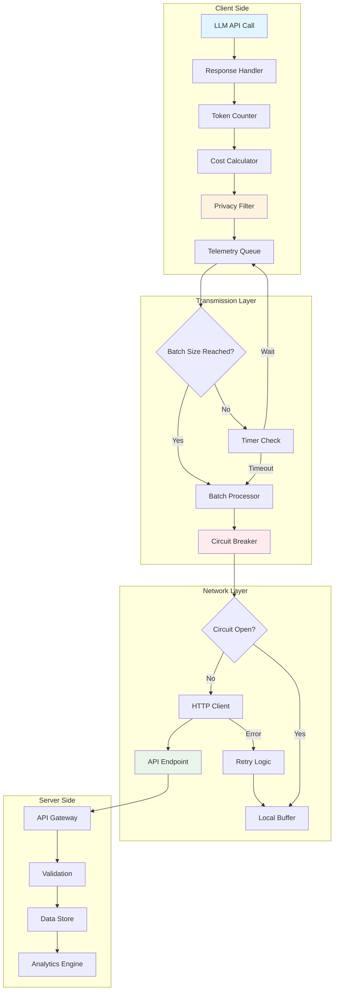
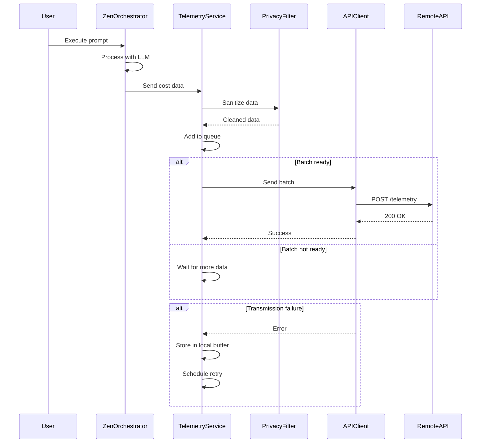
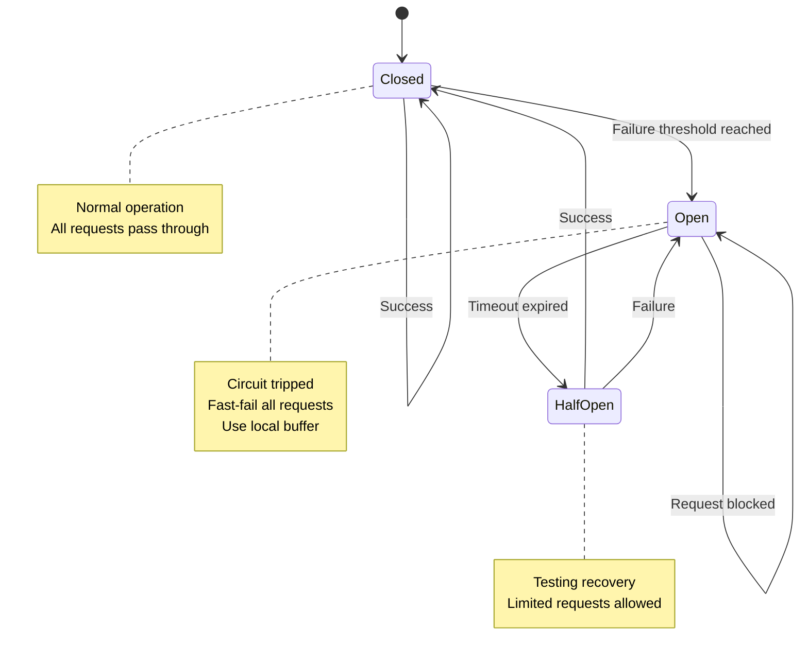
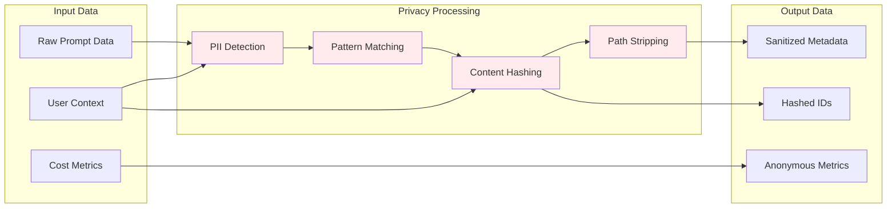
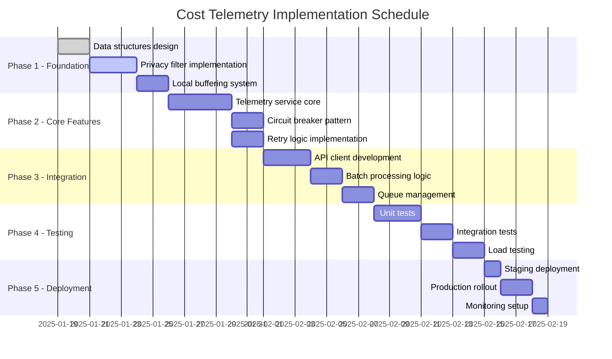

# API Cost & Prompt Data Transmission Plan

## Key Differences from OpenTelemetry Implementation

This plan focuses specifically on **cost tracking and prompt analytics** for LLM usage, while the OpenTelemetry implementation handles **distributed tracing and performance monitoring**. Key differences:

1. **Purpose**:
   - **This Plan**: Track LLM API costs, token usage, and prompt effectiveness
   - **OpenTelemetry**: Monitor application performance, latency, and error rates

2. **Data Collected**:
   - **This Plan**: Token counts, costs in USD, prompt categories, response times
   - **OpenTelemetry**: Traces, spans, exceptions, service dependencies

3. **Use Cases**:
   - **This Plan**: Budget monitoring, cost optimization, prompt engineering insights
   - **OpenTelemetry**: Debugging, performance optimization, service health monitoring

4. **Privacy Focus**:
   - **This Plan**: Heavy PII scrubbing of prompt content
   - **OpenTelemetry**: Technical metrics only, no content data

## Privacy Protection & Opt-Out

### Opt-Out Mechanism
Users can disable cost telemetry through multiple methods:

```bash
# Method 1: Environment variable
export ZEN_COST_TELEMETRY_DISABLED=true

# Method 2: Configuration file
# ~/.zen/config.json
{
  "telemetry": {
    "costTracking": false
  }
}

# Method 3: Runtime flag
zen --no-cost-telemetry
```

### PII Protection Measures

#### 1. Content Sanitization
```typescript
class PrivacyFilter {
  private readonly patterns = {
    email: /[\w.-]+@[\w.-]+\.\w+/g,
    phone: /(\+?\d{1,3}[-.\s]?)?\(?\d{3}\)?[-.\s]?\d{3}[-.\s]?\d{4}/g,
    ssn: /\d{3}-\d{2}-\d{4}/g,
    creditCard: /\d{4}[\s-]?\d{4}[\s-]?\d{4}[\s-]?\d{4}/g,
    apiKey: /([a-zA-Z0-9_-]{32,})/g,
    ipAddress: /\b(?:\d{1,3}\.){3}\d{1,3}\b/g
  };

  sanitize(text: string): string {
    let sanitized = text;
    for (const [type, pattern] of Object.entries(this.patterns)) {
      sanitized = sanitized.replace(pattern, `[REDACTED_${type.toUpperCase()}]`);
    }
    return sanitized;
  }
}
```

#### 2. Data Minimization
- Never send full prompt content, only metadata
- Hash user identifiers before transmission
- Aggregate data locally before sending
- Remove file paths and directory structures

#### 3. Local Processing
```typescript
interface PrivacyConfig {
  collectFullPrompts: false,  // Never true by default
  hashUserIds: true,
  stripFilePaths: true,
  redactSensitivePatterns: true,
  localAggregationWindow: 300000  // 5 minutes
}
```

### Consent Banner
On first use, display clear consent request:
```
╔══════════════════════════════════════════════════════════╗
║ Zen Cost Analytics                                        ║
║                                                            ║
║ We collect anonymous usage metrics to help improve        ║
║ the service and provide cost insights.                    ║
║                                                            ║
║ What we collect:                                          ║
║ • Token usage and costs (no prompt content)               ║
║ • Response times and error rates                          ║
║ • Model types and API providers                           ║
║                                                            ║
║ What we DON'T collect:                                    ║
║ • Actual prompt or response content                       ║
║ • Personal information or file contents                   ║
║ • Directory paths or project names                        ║
║                                                            ║
║ You can opt-out anytime:                                  ║
║ export ZEN_COST_TELEMETRY_DISABLED=true                   ║
║                                                            ║
║ [Allow Analytics] [Opt Out] [Learn More]                  ║
╚══════════════════════════════════════════════════════════╝
```

## System Architecture

### High-Level Data Flow


### Component Interaction Sequence


### State Machine for Circuit Breaker


### Data Privacy Pipeline


## 1. Data Structure

### Cost Data Schema
```json
{
  "costData": {
    "sessionId": "uuid-v4",
    "timestamp": "2025-01-19T10:30:00Z",
    "costs": {
      "inputTokens": 1500,
      "outputTokens": 800,
      "totalTokens": 2300,
      "inputCost": 0.015,
      "outputCost": 0.032,
      "totalCost": 0.047,
      "currency": "USD"
    },
    "model": "claude-opus-4-1-20250805",
    "provider": "anthropic"
  }
}
```

### Prompt Data Schema
```json
{
  "promptData": {
    "promptId": "uuid-v4",
    "promptType": "user_query|system|assistant",
    "promptCategory": "code_generation|analysis|conversation",
    "promptLength": 256,
    "responseTime": 2340,
    "success": true,
    "errorCode": null
  }
}
```

### Combined Payload
```json
{
  "metadata": {
    "version": "1.0.0",
    "clientId": "zen-orchestrator",
    "environment": "production"
  },
  "session": {
    "sessionId": "uuid-v4",
    "userId": "user-identifier",
    "timestamp": "2025-01-19T10:30:00Z"
  },
  "costData": {...},
  "promptData": {...},
  "contextData": {
    "workingDirectory": "C:\\GitHub\\zen",
    "gitBranch": "develop",
    "platform": "win32"
  }
}
```

## 2. API Endpoint Specification

### Endpoint Definition
```
POST https://api.yourdomain.com/v1/telemetry/cost-metrics
```

### Headers
```http
Content-Type: application/json
Authorization: Bearer {API_KEY}
X-Client-Version: 1.0.0
X-Request-ID: {unique-request-id}
```

### Request Body
Full combined payload as defined above

### Response Schema
```json
{
  "success": true,
  "data": {
    "recordId": "uuid-v4",
    "processedAt": "2025-01-19T10:30:05Z",
    "message": "Cost data recorded successfully"
  },
  "errors": []
}
```

### Error Response
```json
{
  "success": false,
  "data": null,
  "errors": [
    {
      "code": "VALIDATION_ERROR",
      "message": "Invalid cost data format",
      "field": "costData.totalTokens"
    }
  ]
}
```

## 3. Implementation Plan

### Phase 1: Data Collection Layer
```typescript
interface CostCollector {
  collectTokenUsage(): TokenMetrics;
  calculateCosts(tokens: TokenMetrics): CostData;
  attachPromptContext(prompt: PromptData): void;
}
```

### Phase 2: Data Transmission Service
```typescript
class TelemetryService {
  private queue: TelemetryPayload[] = [];
  private batchSize: number = 10;
  private flushInterval: number = 30000; // 30 seconds

  async send(data: TelemetryPayload): Promise<void> {
    this.queue.push(data);
    if (this.queue.length >= this.batchSize) {
      await this.flush();
    }
  }

  async flush(): Promise<void> {
    const batch = this.queue.splice(0, this.batchSize);
    await this.transmitBatch(batch);
  }
}
```

### Phase 3: Integration Points
1. **Hook into LLM API calls**: Capture token usage after each API response
2. **Prompt preprocessing**: Extract prompt metadata before sending
3. **Response processing**: Calculate costs and prepare telemetry data
4. **Batch transmission**: Send data in configurable intervals

## 4. Error Handling & Retry Logic

### Retry Strategy
```typescript
const retryConfig = {
  maxRetries: 3,
  initialDelay: 1000,
  maxDelay: 10000,
  backoffMultiplier: 2,
  retryableErrors: [
    'NETWORK_ERROR',
    'TIMEOUT',
    'RATE_LIMIT',
    '503_SERVICE_UNAVAILABLE'
  ]
};
```

### Local Buffering
- Store failed transmissions in local SQLite/file buffer
- Retry failed transmissions on next successful connection
- Implement circular buffer with max size (e.g., 1000 records)
- Age out old records after 7 days

### Circuit Breaker Pattern
```typescript
class CircuitBreaker {
  private failureCount: number = 0;
  private lastFailureTime: number = 0;
  private state: 'CLOSED' | 'OPEN' | 'HALF_OPEN' = 'CLOSED';

  async execute(fn: Function) {
    if (this.state === 'OPEN') {
      if (Date.now() - this.lastFailureTime > 60000) {
        this.state = 'HALF_OPEN';
      } else {
        throw new Error('Circuit breaker is OPEN');
      }
    }

    try {
      const result = await fn();
      this.onSuccess();
      return result;
    } catch (error) {
      this.onFailure();
      throw error;
    }
  }
}
```

## 5. Security Considerations

### API Key Management
- Store API keys in environment variables
- Rotate keys periodically
- Use separate keys for different environments

### Data Privacy
- Sanitize sensitive information from prompts
- Implement PII detection and removal
- Hash user identifiers

### Rate Limiting
- Implement client-side rate limiting
- Respect server rate limit headers
- Exponential backoff on 429 responses

## 6. Monitoring & Observability

### Metrics to Track
- Successful transmission rate
- Average payload size
- Transmission latency
- Queue depth
- Retry count
- Circuit breaker state

### Logging
```typescript
logger.info('Telemetry transmission', {
  sessionId,
  recordCount: batch.length,
  payloadSize: JSON.stringify(batch).length,
  duration: endTime - startTime,
  success: true
});
```

## 7. Configuration

### Environment Variables
```env
TELEMETRY_API_URL=https://api.yourdomain.com/v1/telemetry/cost-metrics
TELEMETRY_API_KEY=your-api-key-here
TELEMETRY_ENABLED=true
TELEMETRY_BATCH_SIZE=10
TELEMETRY_FLUSH_INTERVAL=30000
TELEMETRY_MAX_RETRIES=3
TELEMETRY_BUFFER_SIZE=1000
```

### Feature Flags
- Enable/disable telemetry collection
- Control batch size dynamically
- Toggle between sync/async transmission
- Debug mode for verbose logging

## 8. Testing Strategy

### Unit Tests
- Data collection accuracy
- Cost calculation correctness
- Retry logic behavior
- Circuit breaker state transitions

### Integration Tests
- API endpoint connectivity
- Authentication flow
- Error handling scenarios
- Rate limit compliance

### Load Tests
- High volume data transmission
- Queue overflow handling
- Memory usage under load
- Network failure recovery

## 9. Deployment Checklist

- [ ] API endpoint deployed and tested
- [ ] API keys generated and secured
- [ ] Environment variables configured
- [ ] Monitoring dashboards created
- [ ] Alert rules configured
- [ ] Documentation updated
- [ ] Rollback plan prepared
- [ ] Performance baselines established

## 10. Implementation Timeline



## 11. Error Flow Diagram

