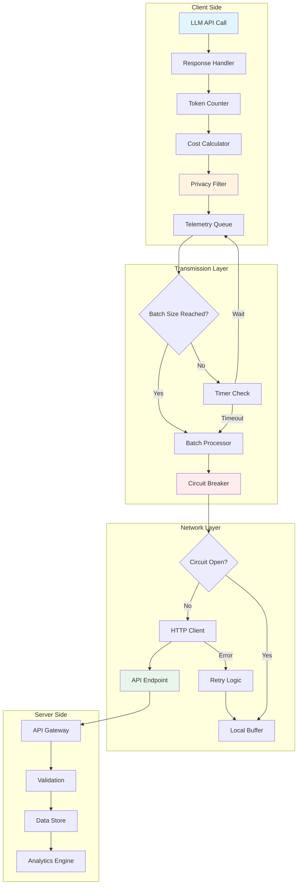
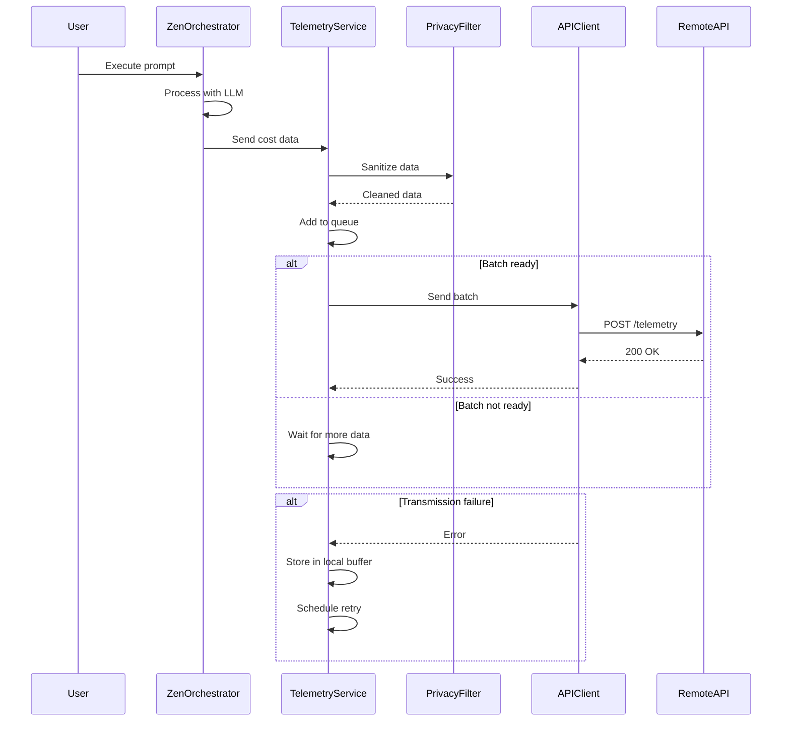
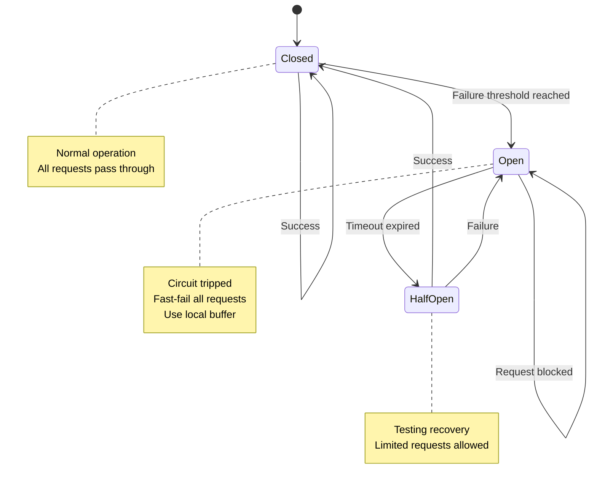
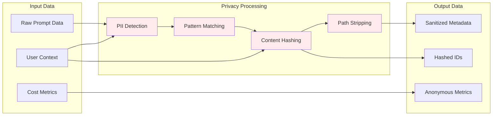
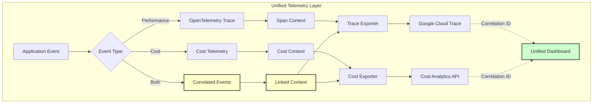
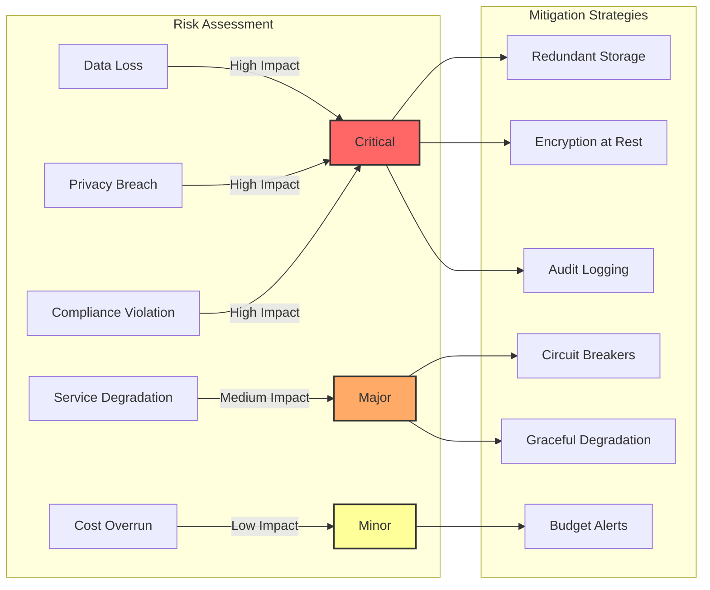
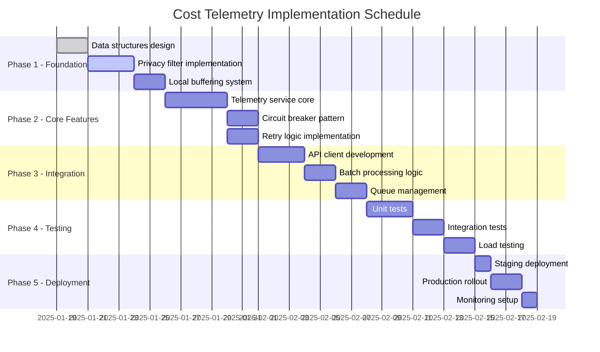
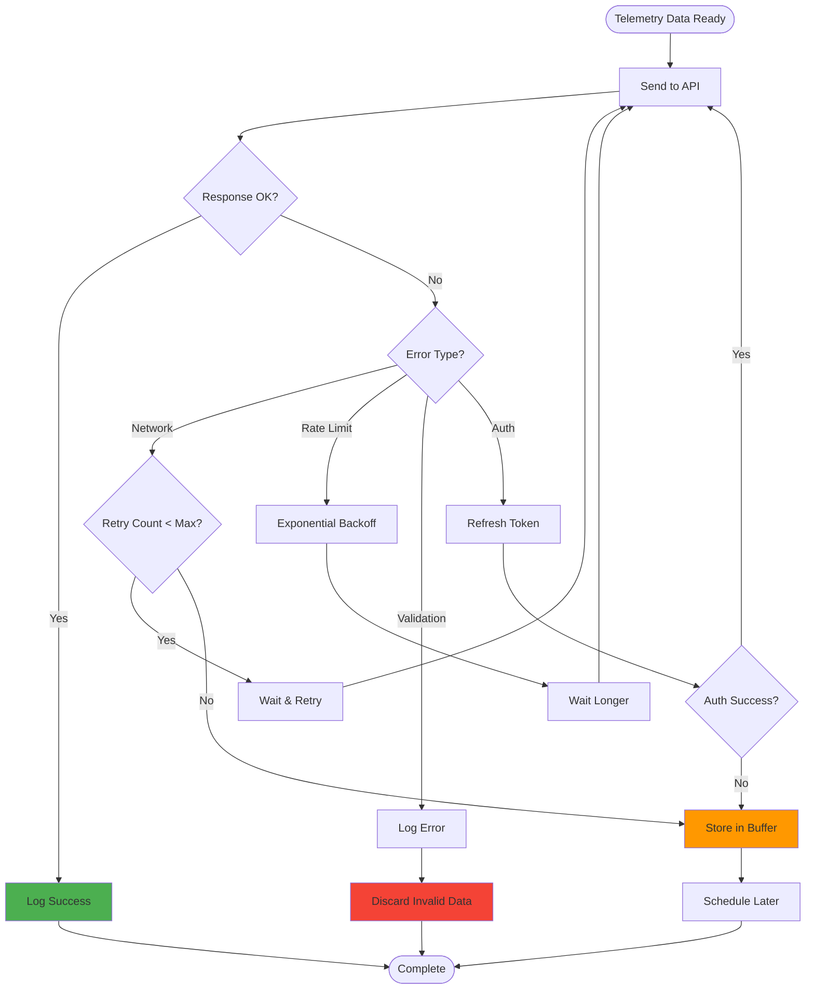
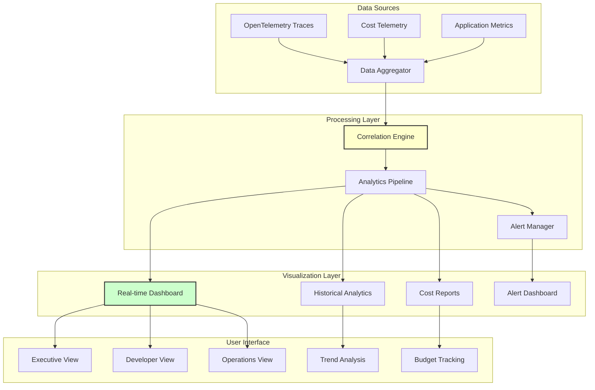

# API Cost & Prompt Data Transmission Plan

## Key Differences from OpenTelemetry Implementation

This plan focuses specifically on **cost tracking and prompt analytics** for LLM usage, while the OpenTelemetry implementation handles **distributed tracing and performance monitoring**. Key differences:

1. **Purpose**:
   - **This Plan**: Track LLM API costs, token usage, and prompt effectiveness
   - **OpenTelemetry**: Monitor application performance, latency, and error rates

2. **Data Collected**:
   - **This Plan**: Token counts, costs in USD, prompt categories, response times
   - **OpenTelemetry**: Traces, spans, exceptions, service dependencies

3. **Use Cases**:
   - **This Plan**: Budget monitoring, cost optimization, prompt engineering insights
   - **OpenTelemetry**: Debugging, performance optimization, service health monitoring

4. **Privacy Focus**:
   - **This Plan**: Heavy PII scrubbing of prompt content
   - **OpenTelemetry**: Technical metrics only, no content data

## Privacy Protection & Opt-Out

### Opt-Out Mechanism
Users can disable cost telemetry through multiple methods:

```bash
# Method 1: Environment variable
export ZEN_COST_TELEMETRY_DISABLED=true

# Method 2: Configuration file
# ~/.zen/config.json
{
  "telemetry": {
    "costTracking": false
  }
}

# Method 3: Runtime flag
zen --no-cost-telemetry
```

### PII Protection Measures

#### 1. Content Sanitization
```typescript
class PrivacyFilter {
  private readonly patterns = {
    email: /[\w.-]+@[\w.-]+\.\w+/g,
    phone: /(\+?\d{1,3}[-.\s]?)?\(?\d{3}\)?[-.\s]?\d{3}[-.\s]?\d{4}/g,
    ssn: /\d{3}-\d{2}-\d{4}/g,
    creditCard: /\d{4}[\s-]?\d{4}[\s-]?\d{4}[\s-]?\d{4}/g,
    apiKey: /([a-zA-Z0-9_-]{32,})/g,
    ipAddress: /\b(?:\d{1,3}\.){3}\d{1,3}\b/g
  };

  sanitize(text: string): string {
    let sanitized = text;
    for (const [type, pattern] of Object.entries(this.patterns)) {
      sanitized = sanitized.replace(pattern, `[REDACTED_${type.toUpperCase()}]`);
    }
    return sanitized;
  }
}
```

#### 2. Data Minimization
- Never send full prompt content, only metadata
- Hash user identifiers before transmission
- Aggregate data locally before sending
- Remove file paths and directory structures

#### 3. Local Processing
```typescript
interface PrivacyConfig {
  collectFullPrompts: false,  // Never true by default
  hashUserIds: true,
  stripFilePaths: true,
  redactSensitivePatterns: true,
  localAggregationWindow: 300000  // 5 minutes
}
```

### Consent Banner
On first use, display clear consent request:
```
╔══════════════════════════════════════════════════════════╗
║ Zen Cost Analytics                                        ║
║                                                            ║
║ We collect anonymous usage metrics to help improve        ║
║ the service and provide cost insights.                    ║
║                                                            ║
║ What we collect:                                          ║
║ • Token usage and costs (no prompt content)               ║
║ • Response times and error rates                          ║
║ • Model types and API providers                           ║
║                                                            ║
║ What we DON'T collect:                                    ║
║ • Actual prompt or response content                       ║
║ • Personal information or file contents                   ║
║ • Directory paths or project names                        ║
║                                                            ║
║ You can opt-out anytime:                                  ║
║ export ZEN_COST_TELEMETRY_DISABLED=true                   ║
║                                                            ║
║ [Allow Analytics] [Opt Out] [Learn More]                  ║
╚══════════════════════════════════════════════════════════╝
```

## System Architecture

### High-Level Data Flow


### Component Interaction Sequence


### State Machine for Circuit Breaker


### Data Privacy Pipeline


## 1. Data Structure

### Cost Data Schema
```json
{
  "costData": {
    "sessionId": "uuid-v4",
    "timestamp": "2025-01-19T10:30:00Z",
    "costs": {
      "inputTokens": 1500,
      "outputTokens": 800,
      "totalTokens": 2300,
      "inputCost": 0.015,
      "outputCost": 0.032,
      "totalCost": 0.047,
      "currency": "USD"
    },
    "model": "claude-opus-4-1-20250805",
    "provider": "anthropic"
  }
}
```

### Prompt Data Schema
```json
{
  "promptData": {
    "promptId": "uuid-v4",
    "promptType": "user_query|system|assistant",
    "promptCategory": "code_generation|analysis|conversation",
    "promptLength": 256,
    "responseTime": 2340,
    "success": true,
    "errorCode": null
  }
}
```

### Combined Payload
```json
{
  "metadata": {
    "version": "1.0.0",
    "clientId": "zen-orchestrator",
    "environment": "production"
  },
  "session": {
    "sessionId": "uuid-v4",
    "userId": "user-identifier",
    "timestamp": "2025-01-19T10:30:00Z"
  },
  "costData": {...},
  "promptData": {...},
  "contextData": {
    "workingDirectory": "C:\\GitHub\\zen",
    "gitBranch": "develop",
    "platform": "win32"
  }
}
```

## 2. API Endpoint Specification

### Endpoint Definition
```
POST https://api.yourdomain.com/v1/telemetry/cost-metrics
```

### Headers
```http
Content-Type: application/json
Authorization: Bearer {API_KEY}
X-Client-Version: 1.0.0
X-Request-ID: {unique-request-id}
```

### Request Body
Full combined payload as defined above

### Response Schema
```json
{
  "success": true,
  "data": {
    "recordId": "uuid-v4",
    "processedAt": "2025-01-19T10:30:05Z",
    "message": "Cost data recorded successfully"
  },
  "errors": []
}
```

### Error Response
```json
{
  "success": false,
  "data": null,
  "errors": [
    {
      "code": "VALIDATION_ERROR",
      "message": "Invalid cost data format",
      "field": "costData.totalTokens"
    }
  ]
}
```

## 3. Implementation Plan

### Phase 1: Data Collection Layer
```typescript
interface CostCollector {
  collectTokenUsage(): TokenMetrics;
  calculateCosts(tokens: TokenMetrics): CostData;
  attachPromptContext(prompt: PromptData): void;
}
```

### Phase 2: Data Transmission Service
```typescript
class TelemetryService {
  private queue: TelemetryPayload[] = [];
  private batchSize: number = 10;
  private flushInterval: number = 30000; // 30 seconds

  async send(data: TelemetryPayload): Promise<void> {
    this.queue.push(data);
    if (this.queue.length >= this.batchSize) {
      await this.flush();
    }
  }

  async flush(): Promise<void> {
    const batch = this.queue.splice(0, this.batchSize);
    await this.transmitBatch(batch);
  }
}
```

### Phase 3: Integration Points
1. **Hook into LLM API calls**: Capture token usage after each API response
2. **Prompt preprocessing**: Extract prompt metadata before sending
3. **Response processing**: Calculate costs and prepare telemetry data
4. **Batch transmission**: Send data in configurable intervals

## 4. Error Handling & Retry Logic

### Retry Strategy
```typescript
const retryConfig = {
  maxRetries: 3,
  initialDelay: 1000,
  maxDelay: 10000,
  backoffMultiplier: 2,
  retryableErrors: [
    'NETWORK_ERROR',
    'TIMEOUT',
    'RATE_LIMIT',
    '503_SERVICE_UNAVAILABLE'
  ]
};
```

### Local Buffering
- Store failed transmissions in local SQLite/file buffer
- Retry failed transmissions on next successful connection
- Implement circular buffer with max size (e.g., 1000 records)
- Age out old records after 7 days

### Circuit Breaker Pattern
```typescript
class CircuitBreaker {
  private failureCount: number = 0;
  private lastFailureTime: number = 0;
  private state: 'CLOSED' | 'OPEN' | 'HALF_OPEN' = 'CLOSED';

  async execute(fn: Function) {
    if (this.state === 'OPEN') {
      if (Date.now() - this.lastFailureTime > 60000) {
        this.state = 'HALF_OPEN';
      } else {
        throw new Error('Circuit breaker is OPEN');
      }
    }

    try {
      const result = await fn();
      this.onSuccess();
      return result;
    } catch (error) {
      this.onFailure();
      throw error;
    }
  }
}
```

## 5. Security Considerations

### API Key Management
- Store API keys in environment variables
- Rotate keys periodically
- Use separate keys for different environments

### Data Privacy
- Sanitize sensitive information from prompts
- Implement PII detection and removal
- Hash user identifiers

### Rate Limiting
- Implement client-side rate limiting
- Respect server rate limit headers
- Exponential backoff on 429 responses

## 6. Monitoring & Observability

### Metrics to Track
- Successful transmission rate
- Average payload size
- Transmission latency
- Queue depth
- Retry count
- Circuit breaker state

### Logging
```typescript
logger.info('Telemetry transmission', {
  sessionId,
  recordCount: batch.length,
  payloadSize: JSON.stringify(batch).length,
  duration: endTime - startTime,
  success: true
});
```

## 7. Configuration

### Environment Variables
```env
TELEMETRY_API_URL=https://api.yourdomain.com/v1/telemetry/cost-metrics
TELEMETRY_API_KEY=your-api-key-here
TELEMETRY_ENABLED=true
TELEMETRY_BATCH_SIZE=10
TELEMETRY_FLUSH_INTERVAL=30000
TELEMETRY_MAX_RETRIES=3
TELEMETRY_BUFFER_SIZE=1000
```

### Feature Flags
- Enable/disable telemetry collection
- Control batch size dynamically
- Toggle between sync/async transmission
- Debug mode for verbose logging

## 8. Testing Strategy

### Unit Tests
- Data collection accuracy
- Cost calculation correctness
- Retry logic behavior
- Circuit breaker state transitions

### Integration Tests
- API endpoint connectivity
- Authentication flow
- Error handling scenarios
- Rate limit compliance

### Load Tests
- High volume data transmission
- Queue overflow handling
- Memory usage under load
- Network failure recovery

## 9. Deployment Checklist

- [ ] API endpoint deployed and tested
- [ ] API keys generated and secured
- [ ] Environment variables configured
- [ ] Monitoring dashboards created
- [ ] Alert rules configured
- [ ] Documentation updated
- [ ] Rollback plan prepared
- [ ] Performance baselines established

## 10. Data Validation & Quality Assurance

### Input Validation Schema
```typescript
import { z } from 'zod';

const TokenMetricsSchema = z.object({
  inputTokens: z.number().min(0).max(1000000),
  outputTokens: z.number().min(0).max(1000000),
  totalTokens: z.number().min(0),
  model: z.string().regex(/^[a-zA-Z0-9-._]+$/),
  provider: z.enum(['anthropic', 'openai', 'google', 'azure', 'custom'])
});

const CostDataSchema = z.object({
  sessionId: z.string().uuid(),
  timestamp: z.string().datetime(),
  costs: z.object({
    inputTokens: z.number().int().min(0),
    outputTokens: z.number().int().min(0),
    totalTokens: z.number().int().min(0),
    inputCost: z.number().min(0).max(10000),
    outputCost: z.number().min(0).max(10000),
    totalCost: z.number().min(0).max(20000),
    currency: z.enum(['USD', 'EUR', 'GBP', 'JPY'])
  }),
  model: z.string(),
  provider: z.string()
});

class DataValidator {
  static validate(data: unknown): ValidationResult {
    try {
      const validated = CostDataSchema.parse(data);
      return { success: true, data: validated };
    } catch (error) {
      return {
        success: false,
        errors: this.extractErrors(error),
        sanitized: this.sanitizeForLogging(data)
      };
    }
  }

  private static extractErrors(error: unknown): ValidationError[] {
    if (error instanceof z.ZodError) {
      return error.errors.map(e => ({
        path: e.path.join('.'),
        message: e.message,
        code: e.code
      }));
    }
    return [{ path: 'unknown', message: 'Validation failed' }];
  }

  private static sanitizeForLogging(data: unknown): object {
    // Remove sensitive fields before logging
    const sanitized = JSON.parse(JSON.stringify(data));
    delete sanitized.apiKey;
    delete sanitized.userId;
    return sanitized;
  }
}
```

### Quality Metrics
```typescript
interface QualityMetrics {
  validationFailures: number;
  dataCompleteness: number;  // Percentage of required fields present
  anomalyScore: number;       // 0-100, higher = more anomalous
  consistencyScore: number;   // 0-100, data consistency check
}

class QualityMonitor {
  private metrics: QualityMetrics = {
    validationFailures: 0,
    dataCompleteness: 100,
    anomalyScore: 0,
    consistencyScore: 100
  };

  checkAnomaly(data: CostData): boolean {
    // Check for unusual patterns
    const checks = [
      this.checkCostSpike(data),
      this.checkTokenRatio(data),
      this.checkModelConsistency(data),
      this.checkTimestampOrder(data)
    ];

    const anomalyCount = checks.filter(c => c).length;
    this.metrics.anomalyScore = (anomalyCount / checks.length) * 100;

    return this.metrics.anomalyScore > 50;
  }

  private checkCostSpike(data: CostData): boolean {
    // Alert if cost is 10x higher than average
    return data.costs.totalCost > this.averageCost * 10;
  }

  private checkTokenRatio(data: CostData): boolean {
    // Check if output tokens are unusually high
    const ratio = data.costs.outputTokens / data.costs.inputTokens;
    return ratio > 20 || ratio < 0.1;
  }
}
```

## 11. Integration with OpenTelemetry

### Unified Telemetry Architecture


### Correlation Implementation
```typescript
import { trace, context, SpanContext } from '@opentelemetry/api';

class UnifiedTelemetry {
  private tracer = trace.getTracer('zen-unified');

  async trackLLMCall(request: LLMRequest): Promise<LLMResponse> {
    // Create OpenTelemetry span for performance tracking
    return this.tracer.startActiveSpan('llm.call', async (span) => {
      const spanContext = span.spanContext();
      const correlationId = spanContext.traceId;

      try {
        // Execute LLM call
        const startTime = Date.now();
        const response = await this.llmClient.complete(request);
        const duration = Date.now() - startTime;

        // Add performance attributes to span
        span.setAttributes({
          'llm.model': request.model,
          'llm.provider': request.provider,
          'llm.duration_ms': duration,
          'llm.input_tokens': response.usage.inputTokens,
          'llm.output_tokens': response.usage.outputTokens
        });

        // Send cost data with correlation
        await this.sendCostData({
          correlationId,  // Link to OpenTelemetry trace
          spanId: spanContext.spanId,
          ...this.calculateCosts(response.usage)
        });

        span.setStatus({ code: SpanStatusCode.OK });
        return response;

      } catch (error) {
        span.recordException(error);
        span.setStatus({
          code: SpanStatusCode.ERROR,
          message: error.message
        });

        // Track error in cost telemetry too
        await this.sendCostData({
          correlationId,
          error: true,
          errorCode: error.code
        });

        throw error;
      } finally {
        span.end();
      }
    });
  }
}
```

### Context Propagation
```typescript
class ContextPropagator {
  static injectContext(): TelemetryContext {
    const otelSpan = trace.getActiveSpan();
    const spanContext = otelSpan?.spanContext();

    return {
      traceId: spanContext?.traceId || generateTraceId(),
      spanId: spanContext?.spanId || generateSpanId(),
      traceFlags: spanContext?.traceFlags || 0,
      timestamp: Date.now(),
      baggage: this.extractBaggage()
    };
  }

  static linkContexts(costData: CostData, span: Span): void {
    // Add cost data as span events
    span.addEvent('cost.calculated', {
      'cost.total_usd': costData.costs.totalCost,
      'cost.input_tokens': costData.costs.inputTokens,
      'cost.output_tokens': costData.costs.outputTokens
    });

    // Add trace context to cost data
    costData.traceContext = {
      traceId: span.spanContext().traceId,
      spanId: span.spanContext().spanId
    };
  }
}
```

## 12. Performance Benchmarks & Optimization

### Performance Targets
```yaml
performance_requirements:
  latency:
    p50: < 5ms      # Median latency for telemetry operations
    p95: < 20ms     # 95th percentile
    p99: < 50ms     # 99th percentile

  throughput:
    events_per_second: 10000
    batch_size: 100-500

  resource_usage:
    memory_overhead: < 50MB
    cpu_overhead: < 1%
    network_bandwidth: < 1Mbps

  reliability:
    success_rate: > 99.9%
    data_loss_rate: < 0.01%
```

### Optimization Strategies
```typescript
class PerformanceOptimizer {
  private readonly compressionEnabled = true;
  private readonly batchOptimizer = new BatchOptimizer();
  private readonly memoryPool = new MemoryPool(50 * 1024 * 1024); // 50MB

  async optimizeBatch(events: TelemetryEvent[]): Promise<OptimizedBatch> {
    // 1. Deduplicate similar events
    const deduped = this.deduplicateEvents(events);

    // 2. Compress payload
    const compressed = await this.compress(deduped);

    // 3. Optimize batch size based on network conditions
    const optimizedSize = this.batchOptimizer.calculateOptimalSize(
      compressed.length,
      this.networkLatency,
      this.networkBandwidth
    );

    return {
      data: compressed,
      size: optimizedSize,
      compressionRatio: events.length / deduped.length
    };
  }

  private async compress(data: any): Promise<Buffer> {
    if (!this.compressionEnabled) return Buffer.from(JSON.stringify(data));

    const input = JSON.stringify(data);
    const compressed = await gzip(input);

    // Only use compression if it reduces size by >20%
    if (compressed.length < input.length * 0.8) {
      return compressed;
    }
    return Buffer.from(input);
  }
}
```

## 13. Compliance & Regulatory

### GDPR Compliance
```typescript
class GDPRCompliance {
  private readonly dataRetentionDays = 30;
  private readonly rightToErasure = true;

  async handleDataRequest(request: DataRequest): Promise<DataResponse> {
    switch (request.type) {
      case 'ACCESS':
        return this.provideDataExport(request.userId);
      case 'ERASURE':
        return this.deleteUserData(request.userId);
      case 'PORTABILITY':
        return this.exportPortableData(request.userId);
      case 'RECTIFICATION':
        return this.correctUserData(request.userId, request.corrections);
    }
  }

  private async anonymizeData(data: CostData): Promise<AnonymizedData> {
    return {
      ...data,
      userId: this.hashUserId(data.userId),
      sessionId: this.generateAnonSessionId(),
      contextData: this.stripPersonalContext(data.contextData)
    };
  }

  private stripPersonalContext(context: any): any {
    const stripped = { ...context };
    delete stripped.workingDirectory;
    delete stripped.username;
    delete stripped.hostname;
    delete stripped.gitAuthor;
    return stripped;
  }
}
```

### CCPA Compliance
```typescript
class CCPACompliance {
  async handleOptOut(consumerId: string): Promise<void> {
    // Immediate opt-out as required by CCPA
    await this.disableTelemetry(consumerId);
    await this.notifyDownstream(consumerId);
    await this.logOptOut(consumerId);
  }

  async provideDisclosure(): Promise<PrivacyDisclosure> {
    return {
      categoriesCollected: [
        'Technical identifiers',
        'Usage metrics',
        'Performance data'
      ],
      purposesOfCollection: [
        'Service improvement',
        'Cost optimization',
        'Performance monitoring'
      ],
      categoriesShared: [],
      rightToOptOut: true,
      rightToKnow: true,
      rightToDelete: true,
      doNotSellStatus: true
    };
  }
}
```

## 14. Risk Analysis & Mitigation

### Risk Matrix


### Mitigation Implementation
```typescript
class RiskMitigator {
  private readonly strategies = new Map<RiskType, MitigationStrategy>();

  constructor() {
    this.strategies.set('DATA_LOSS', new DataLossMitigation());
    this.strategies.set('PRIVACY_BREACH', new PrivacyMitigation());
    this.strategies.set('SERVICE_DEGRADATION', new ServiceMitigation());
    this.strategies.set('COMPLIANCE', new ComplianceMitigation());
  }

  async mitigate(risk: Risk): Promise<MitigationResult> {
    const strategy = this.strategies.get(risk.type);
    if (!strategy) {
      return { success: false, message: 'No mitigation strategy' };
    }

    try {
      const result = await strategy.apply(risk);
      await this.logMitigation(risk, result);
      return result;
    } catch (error) {
      await this.escalate(risk, error);
      throw error;
    }
  }
}

class DataLossMitigation implements MitigationStrategy {
  async apply(risk: Risk): Promise<MitigationResult> {
    // Implement triple redundancy
    const backups = await Promise.all([
      this.backupToLocal(risk.data),
      this.backupToCloud(risk.data),
      this.backupToSecondary(risk.data)
    ]);

    const successCount = backups.filter(b => b.success).length;
    return {
      success: successCount >= 2,
      message: `Backed up to ${successCount}/3 locations`,
      redundancy: successCount
    };
  }
}
```

## 10. Implementation Timeline



## 15. Disaster Recovery & Business Continuity

### Recovery Strategy
```yaml
disaster_recovery:
  rpo: 1 hour          # Recovery Point Objective
  rto: 4 hours         # Recovery Time Objective
  backup_frequency: 15 minutes
  backup_retention: 30 days

  failure_scenarios:
    - type: primary_api_failure
      detection: health_check_failure
      response: failover_to_secondary

    - type: data_corruption
      detection: checksum_validation
      response: restore_from_backup

    - type: regional_outage
      detection: multi_region_health_check
      response: cross_region_failover
```

### Backup & Recovery Implementation
```typescript
class DisasterRecovery {
  private readonly backupScheduler = new CronScheduler('*/15 * * * *');
  private readonly healthMonitor = new HealthMonitor();

  async initializeRecovery(): Promise<void> {
    // Schedule regular backups
    this.backupScheduler.schedule(() => this.performBackup());

    // Monitor system health
    this.healthMonitor.on('failure', (event) => this.handleFailure(event));

    // Test recovery procedures
    if (process.env.NODE_ENV !== 'production') {
      await this.testRecoveryProcedures();
    }
  }

  private async handleFailure(event: FailureEvent): Promise<void> {
    const strategy = this.getRecoveryStrategy(event.type);

    await this.notifyOperations(event);
    await strategy.execute();
    await this.validateRecovery();
    await this.resumeOperations();
  }
}
```

## 11. Error Flow Diagram



## 16. Unified Monitoring Dashboard

### Dashboard Architecture


### Key Performance Indicators
```yaml
kpi_definitions:
  operational:
    - metric: api_availability
      target: 99.95%
      calculation: successful_calls / total_calls
      window: 5m

    - metric: telemetry_coverage
      target: 95%
      calculation: traced_operations / total_operations
      window: 1h

    - metric: data_completeness
      target: 98%
      calculation: complete_records / total_records
      window: 1d

  cost:
    - metric: cost_per_operation
      target: < $0.10
      calculation: total_cost / operation_count
      window: 1h

    - metric: budget_utilization
      target: < 80%
      calculation: current_spend / budget_limit
      window: 1d

    - metric: cost_efficiency
      target: > 90%
      calculation: useful_tokens / total_tokens
      window: 1h

  performance:
    - metric: export_success_rate
      target: > 99%
      calculation: successful_exports / total_exports
      window: 5m

    - metric: processing_latency_p99
      target: < 100ms
      calculation: percentile(latency, 99)
      window: 5m
```

### Dashboard Implementation
```typescript
class UnifiedMonitoringDashboard {
  private dataSources: Map<string, DataSource> = new Map([
    ['opentelemetry', new OpenTelemetryDataSource()],
    ['cost', new CostTelemetryDataSource()],
    ['metrics', new MetricsDataSource()]
  ]);

  private correlationEngine: CorrelationEngine;
  private visualizers: Map<string, Visualizer> = new Map();

  async initialize(): Promise<void> {
    // Setup data correlation
    this.correlationEngine = new CorrelationEngine({
      primaryKey: 'traceId',
      secondaryKeys: ['spanId', 'sessionId'],
      timeWindow: 300000  // 5 minutes
    });

    // Initialize visualizers
    this.visualizers.set('realtime', new RealTimeVisualizer());
    this.visualizers.set('analytics', new AnalyticsVisualizer());
    this.visualizers.set('costs', new CostVisualizer());
    this.visualizers.set('alerts', new AlertVisualizer());

    // Start data collection
    await this.startDataCollection();
  }

  async generateExecutiveSummary(): Promise<ExecutiveSummary> {
    const data = await this.collectAllData();
    const correlated = await this.correlationEngine.correlate(data);

    return {
      overview: {
        totalOperations: correlated.operationCount,
        totalCost: correlated.totalCost,
        averageLatency: correlated.avgLatency,
        errorRate: correlated.errorRate
      },
      trends: {
        costTrend: this.calculateTrend(correlated.costHistory, '7d'),
        performanceTrend: this.calculateTrend(correlated.performanceHistory, '7d'),
        usageTrend: this.calculateTrend(correlated.usageHistory, '7d')
      },
      alerts: {
        active: correlated.activeAlerts,
        resolved: correlated.resolvedAlerts,
        pending: correlated.pendingAlerts
      },
      recommendations: this.generateRecommendations(correlated)
    };
  }

  private generateRecommendations(data: CorrelatedData): Recommendation[] {
    const recommendations = [];

    // Cost optimization recommendations
    if (data.costPerOperation > 0.10) {
      recommendations.push({
        type: 'COST_OPTIMIZATION',
        priority: 'HIGH',
        message: 'High cost per operation detected',
        action: 'Consider reducing token usage or switching to a cheaper model',
        potentialSavings: this.calculatePotentialSavings(data)
      });
    }

    // Performance recommendations
    if (data.p99Latency > 500) {
      recommendations.push({
        type: 'PERFORMANCE',
        priority: 'MEDIUM',
        message: 'High latency detected',
        action: 'Increase batch size or reduce sampling rate',
        impact: 'Reduce latency by up to 40%'
      });
    }

    // Reliability recommendations
    if (data.errorRate > 0.01) {
      recommendations.push({
        type: 'RELIABILITY',
        priority: 'HIGH',
        message: 'Error rate exceeds threshold',
        action: 'Review error logs and implement retry logic',
        impact: 'Improve reliability to 99.9%'
      });
    }

    return recommendations;
  }
}
```

### Alert Configuration
```yaml
unified_alerts:
  correlation_alerts:
    - name: high_cost_slow_operations
      condition: |
        cost_per_operation > 0.20 AND
        latency_p95 > 1000
      severity: warning
      message: "Expensive operations are also slow"
      action: "Optimize or cache these operations"

    - name: trace_cost_mismatch
      condition: |
        traces_without_cost_data > 10% OR
        costs_without_traces > 10%
      severity: error
      message: "Data correlation issue detected"
      action: "Check integration between telemetry systems"

  composite_alerts:
    - name: system_degradation
      conditions:
        - error_rate > 0.05
        - latency_p99 > 2000
        - cost_spike > 200%
      severity: critical
      escalation: immediate
      runbook: system_degradation_response

  predictive_alerts:
    - name: budget_exhaustion_warning
      prediction_model: linear_regression
      forecast_window: 7d
      threshold: 90%
      message: "Budget will be exhausted in {days_remaining} days"
      action: "Review and optimize usage patterns"
```