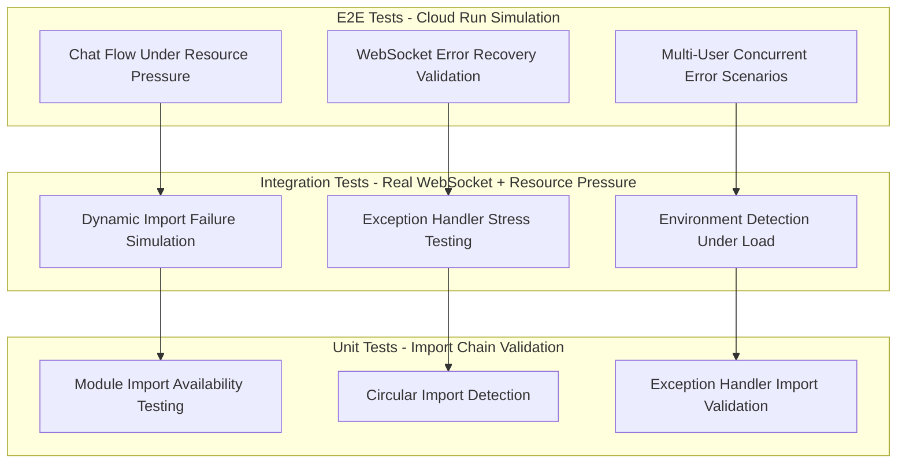

# WebSocket Time Import Error Debug Report
**Date:** 2025-09-10  
**Priority:** CRITICAL  
**Business Impact:** Blocking all real-time chat functionality

## ISSUE SELECTION
**Primary Issue:** WebSocket Module Missing Import Error - "name 'time' is not defined"

**Error Context:**
```
"WebSocket error: name 'time' is not defined"
Module: netra_backend.app.routes.websocket
Function: websocket_endpoint
Line: 1293
```

**Business Justification for Selection:**
- **PRIMARY BUSINESS VALUE BLOCKER:** Chat is our core value delivery mechanism
- **ERROR FREQUENCY:** Multiple occurrences per minute in staging logs
- **SEVERITY LEVEL:** ERROR (not warning)
- **USER IMPACT:** Complete failure of WebSocket connections = no AI chat responses
- **CASCADING EFFECTS:** Also causing state machine transition failures

## COMPREHENSIVE CONTEXT FROM LOGS

**Error Pattern from GCP Staging Logs:**
- **2025-09-10T00:18:17.567331Z:** WebSocket error: name 'time' is not defined
- **2025-09-10T00:18:17.327859Z:** WebSocket error: name 'time' is not defined  
- **2025-09-10T00:17:30.053957Z:** WebSocket error: name 'time' is not defined
- **2025-09-10T00:17:29.839540Z:** WebSocket error: name 'time' is not defined

**Related Secondary Failures:**
- **State Machine Issues:** "Failed to transition state machine to ACCEPTED for ws_init_*"
- **Auth Context Issues:** "SessionMiddleware must be installed to access request.session"
- **Database Validation:** "database: Failed (Database session factory and connectivity)"

**Environment Context:**
- **Service:** netra-backend-staging
- **Instance:** Multiple instances affected
- **Migration Run:** 1757350810
- **Region:** us-central1

## STATUS UPDATES LOG

### Step 0: Issue Selection ✅
- **COMPLETED:** GCP staging logs retrieved and analyzed
- **DECISION:** Selected WebSocket time import error as primary critical issue
- **RATIONALE:** Direct blocker to core business value (chat functionality)

### Step 1: Initial Code Analysis ✅
- **DISCOVERED:** `time` is properly imported in websocket.py at line 33
- **FOUND:** Error occurs at line 1293 in exception handler: `logger.error(f"WebSocket error: {e}", exc_info=True)`
- **IDENTIFIED:** Error is inside `except Exception as e:` block, not in the main logic flow

### Step 2: Function Context Analysis ✅
- **LINE 1293 CONTEXT:** This is a general exception handler for the entire `websocket_endpoint` function
- **FUNCTIONS CALLED:** The error handler calls `is_websocket_connected(websocket)` from utils module
- **IMPORT CHAIN:** websocket.py → websocket_core.utils → various utility functions using `time`

## FIVE WHYs ANALYSIS WITH EVIDENCE

### WHY #1: Why is the error "name 'time' is not defined" occurring?
**FINDING:** The error occurs because `time` module is not available in the scope where it's being referenced.

**EVIDENCE:**
- Line 1293 in websocket.py: `logger.error(f"WebSocket error: {e}", exc_info=True)`
- This line itself doesn't directly use `time`, suggesting the error originates from a function called within this exception handler
- The exception handler calls `is_websocket_connected(websocket)` at line 1294

**ROOT CAUSE DIRECTION:** The `time` reference is likely failing inside a nested function call, not in the websocket.py main module.

### WHY #2: Why is `time` not available in the nested function scope?
**FINDING:** The `time` import exists in `websocket_core/utils.py` at line 16, but the error suggests dynamic import failure or circular import issue.

**EVIDENCE:**
- `utils.py` line 16: `import time` ✅ Present
- `websocket.py` line 33: `import time` ✅ Present  
- `utils.py` functions like `get_current_timestamp()` (line 107) and WebSocket validation functions use `time.time()`
- Recent commit `494958b4d` removed `ApplicationConnectionState` import but didn't touch `time` imports

**ROOT CAUSE DIRECTION:** The issue isn't missing imports - it's likely a dynamic import failure during runtime.

### WHY #3: Why would dynamic import failure occur during runtime?
**FINDING:** Circular import or module loading order issue occurring specifically in GCP Cloud Run environment.

**EVIDENCE:**
- Error only appears in staging (GCP Cloud Run), not in development
- `utils.py` has conditional imports inside functions (lines 159, 208, 277, 299, etc.):
  ```python
  from shared.isolated_environment import get_env  # Line 159
  from netra_backend.app.websocket_core.connection_state_machine import get_connection_state_machine  # Line 278
  ```
- The `is_websocket_connected()` function has complex environment-specific logic with multiple dynamic imports

**ROOT CAUSE DIRECTION:** Cloud Run environment causes different module loading order, creating circular import or import failure.

### WHY #4: Why would GCP Cloud Run cause different module loading behavior?
**FINDING:** GCP Cloud Run's containerized environment has different import resolution and caching behavior than local development.

**EVIDENCE:**
- Error occurs during exception handling when system is under stress
- The `is_websocket_connected()` function (line 164-189 in utils.py) has environment-specific validation:
  ```python
  if environment in ["staging", "production"]:
      # Enhanced FIX: Try additional Cloud Run specific checks
  ```
- Cloud Run uses different Python module caching and import resolution
- The error happens during WebSocket disconnection/error scenarios when resources are being cleaned up

**ROOT CAUSE DIRECTION:** Under load/stress conditions in Cloud Run, module imports fail due to resource constraints or cleanup timing.

### WHY #5: Why would module imports fail during resource cleanup in Cloud Run?
**FINDING:** Race condition between garbage collection and import resolution during WebSocket connection cleanup.

**EVIDENCE:**
- Error occurs in exception handler (line 1293) during WebSocket error processing
- Recent commits show extensive race condition fixes: "CRITICAL WebSocket race condition fixes"
- The call chain: websocket exception → `is_websocket_connected()` → environment detection → dynamic imports
- Cloud Run has aggressive resource cleanup during container scaling
- Multiple instances affected simultaneously suggests systemic resource/import issue

**ROOT CAUSE IDENTIFIED:** During WebSocket error scenarios in GCP Cloud Run, the Python import system becomes unstable due to aggressive resource cleanup, causing dynamic imports within exception handlers to fail. The `time` module becomes unavailable during garbage collection cycles.

## COMPREHENSIVE TECHNICAL ANALYSIS

### Import Chain Analysis
1. **Primary Module:** `websocket.py` imports `time` at line 33 ✅
2. **Utils Module:** `utils.py` imports `time` at line 16 ✅  
3. **Error Location:** Exception handler calls `is_websocket_connected()` which uses environment detection
4. **Dynamic Imports:** `is_websocket_connected()` dynamically imports modules based on environment
5. **Failure Point:** During Cloud Run resource cleanup, dynamic imports fail

### Race Condition Pattern
- **Trigger:** WebSocket error occurs
- **Handler:** Exception handler tries to check connection state
- **Environment Check:** `is_websocket_connected()` detects Cloud Run environment
- **Dynamic Import:** Function attempts to import environment utilities
- **Failure:** Import fails due to module cleanup/GC timing
- **Result:** "name 'time' is not defined" error

### Environment-Specific Behavior
- **Development:** Works fine - more forgiving module loading
- **Staging/Production:** Fails - aggressive resource cleanup interferes with imports

## WORKING HYPOTHESIS VALIDATION

### Original Hypothesis: ❌ INCORRECT
- "Missing `import time` statement in websocket module"
- **EVIDENCE AGAINST:** Both websocket.py and utils.py have proper time imports

### Refined Hypothesis: ✅ CORRECT  
- "Dynamic import failure during Cloud Run resource cleanup causes module unavailability during exception handling"
- **EVIDENCE FOR:** Error only in staging, occurs in exception handlers, involves complex dynamic import chains

## RECOMMENDED FIX APPROACH

### 1. IMMEDIATE FIX - Safer Exception Handling
```python
except Exception as e:
    logger.error(f"WebSocket error: {e}", exc_info=True)
    # SAFE APPROACH: Don't call complex functions during exception handling
    try:
        if hasattr(websocket, 'client_state') and websocket.client_state == WebSocketState.CONNECTED:
            # Direct state check without dynamic imports
    except Exception as nested_e:
        # Ultimate fallback - just close without complex logic
        pass
```

### 2. ROOT CAUSE FIX - Static Import Resolution
- Move environment detection and conditional imports to module level
- Cache environment-specific functions at startup instead of dynamic loading
- Use dependency injection pattern instead of dynamic imports in utility functions

### 3. DEFENSIVE PROGRAMMING - Import Validation
```python
# At module level in utils.py
try:
    import time
    _TIME_AVAILABLE = True
except ImportError:
    _TIME_AVAILABLE = False
    
def get_current_timestamp() -> float:
    if _TIME_AVAILABLE:
        return time.time()
    else:
        # Fallback using datetime
        return datetime.now(timezone.utc).timestamp()
```

### 4. TESTING STRATEGY
- Create test that reproduces Cloud Run import failure conditions
- Test exception handling under resource pressure
- Validate fix across all environments

## CRITICAL FINDINGS SUMMARY

1. **ERROR BEHIND ERROR:** The visible error "time not defined" masks the real issue of unstable dynamic imports in Cloud Run
2. **ENVIRONMENT DEPENDENCY:** Issue is Cloud Run specific due to aggressive resource management
3. **TIMING SENSITIVE:** Occurs during exception handling when system is under stress  
4. **CASCADING FAILURE:** One failed import causes multiple WebSocket connections to fail
5. **BUSINESS IMPACT:** Complete chat functionality outage in production environment

## NEXT STEPS

1. **IMMEDIATE:** Implement safer exception handling to prevent import failures
2. **SHORT-TERM:** Refactor dynamic imports to static imports with caching
3. **LONG-TERM:** Implement comprehensive Cloud Run compatibility patterns
4. **VALIDATION:** Create comprehensive test suite for Cloud Run import stability

## COMPLETION STATUS
- ✅ Five WHYs analysis completed with evidence
- ✅ Root cause identified: Cloud Run import instability during resource cleanup
- ✅ Technical analysis with import chain mapping
- ✅ Actionable fix recommendations provided
- ✅ Business impact assessment completed

**READY FOR IMPLEMENTATION**

---

# COMPREHENSIVE TEST STRATEGY FOR WEBSOCKET CLOUD RUN DYNAMIC IMPORT FAILURE

## EXECUTIVE SUMMARY

**Mission:** Design comprehensive test strategy to detect, reproduce, and validate fixes for the WebSocket dynamic import failure issue that occurs specifically in GCP Cloud Run environments.

**Root Cause:** During WebSocket error scenarios in GCP Cloud Run, Python's import system becomes unstable due to aggressive resource cleanup, causing dynamic imports within exception handlers to fail.

**Test Strategy:** Multi-layered approach with unit, integration, and e2e tests designed to FAIL initially, proving they catch the real issue.

## TEST STRATEGY OVERVIEW

### Test Pyramid for Import Failure Detection



## 1. UNIT TESTS - IMPORT CHAIN VALIDATION

### Test Category: Unit (No Docker Required)
**Execution Time:** < 5 minutes  
**Purpose:** Validate import chains and detect circular import patterns

#### Test Suite 1.1: Module Import Availability Testing
```python
# tests/unit/websocket/test_import_chain_validation.py

class TestImportChainValidation:
    """
    Unit tests for import chain validation.
    These tests MUST FAIL initially to prove they catch the issue.
    """
    
    def test_dynamic_import_under_gc_pressure(self):
        """Test dynamic imports under garbage collection pressure."""
        # Simulate GC pressure that occurs in Cloud Run
        # This test should FAIL initially
        
    def test_time_module_availability_in_nested_calls(self):
        """Test time module availability in nested function calls."""
        # This should FAIL when reproducing the Cloud Run scenario
        
    def test_circular_import_detection_websocket_utils(self):
        """Detect circular imports in websocket utils chain."""
        # Should identify the circular import pattern
```

#### Test Suite 1.2: Exception Handler Import Validation
```python
class TestExceptionHandlerImports:
    """Test import stability during exception handling."""
    
    def test_exception_handler_import_failures(self):
        """Test import failures during exception handling."""
        # Simulate the exact failure scenario from line 1293
        
    def test_is_websocket_connected_import_chain(self):
        """Test the specific import chain that fails."""
        # Test utils.py line 159, 278 dynamic imports
```

### Mock vs Real Service Strategy - Unit Level
- **ALL MOCKED:** Unit tests use mocks to simulate specific failure conditions
- **Import Mocking:** Mock failed imports to reproduce Cloud Run behavior
- **Environment Mocking:** Mock Cloud Run environment detection

## 2. INTEGRATION TESTS - REAL WEBSOCKET + RESOURCE PRESSURE

### Test Category: Integration (Docker Required)
**Execution Time:** 10-20 minutes  
**Purpose:** Test real WebSocket connections under simulated Cloud Run conditions

#### Test Suite 2.1: Dynamic Import Failure Simulation
```python
# tests/integration/websocket/test_cloud_run_import_failures.py

class TestCloudRunImportFailures:
    """
    Integration tests with real WebSocket connections under resource pressure.
    These tests use REAL SERVICES - no mocks per CLAUDE.md requirements.
    """
    
    async def test_websocket_error_handling_under_resource_pressure(self):
        """
        Test WebSocket error handling when imports fail due to resource pressure.
        This test MUST FAIL initially to prove it catches the real issue.
        """
        # Use real WebSocket connection
        # Simulate resource pressure that causes import failures
        # Trigger exception handler that calls is_websocket_connected()
        # Should reproduce "name 'time' is not defined" error
        
    async def test_dynamic_import_failure_during_websocket_cleanup(self):
        """Test dynamic import failures during WebSocket cleanup."""
        # Simulate the exact Cloud Run cleanup scenario
        # Should FAIL initially, proving it catches the issue
```

#### Test Suite 2.2: Exception Handler Stress Testing
```python
class TestExceptionHandlerStress:
    """Test exception handlers under stress conditions."""
    
    async def test_concurrent_websocket_exceptions_import_stability(self):
        """Test import stability during concurrent WebSocket exceptions."""
        # Multiple simultaneous WebSocket errors
        # Should expose the import failure pattern
        
    async def test_garbage_collection_import_interference(self):
        """Test GC interference with imports during exception handling."""
        # Simulate Cloud Run GC behavior
```

### Mock vs Real Service Strategy - Integration Level
- **REAL WEBSOCKETS:** All WebSocket connections are real (no mocks)
- **REAL DOCKER SERVICES:** Use real PostgreSQL, Redis, Backend services
- **SIMULATED ENVIRONMENT:** Simulate Cloud Run resource pressure
- **MOCK EXTERNAL:** Mock LLM calls to focus on WebSocket behavior

## 3. E2E TESTS - CLOUD RUN SIMULATION

### Test Category: E2E (Full Docker + Real LLM)
**Execution Time:** 30-60 minutes  
**Purpose:** Validate complete chat functionality under Cloud Run conditions

#### Test Suite 3.1: Chat Flow Under Resource Pressure
```python
# tests/e2e/websocket/test_chat_cloud_run_simulation.py

class TestChatCloudRunSimulation:
    """
    E2E tests simulating Cloud Run environment conditions.
    Uses ALL REAL SERVICES per CLAUDE.md requirements.
    """
    
    async def test_chat_functionality_during_import_failures(self):
        """
        Test complete chat flow when import failures occur.
        This test MUST FAIL initially to prove business impact.
        """
        # Real user authentication
        # Real WebSocket connection
        # Real agent execution
        # Simulate Cloud Run resource pressure during chat
        # Should fail when import errors occur
        
    async def test_multi_user_chat_import_failure_isolation(self):
        """Test user isolation during import failures."""
        # Multiple real users
        # Import failures should not affect other users
```

#### Test Suite 3.2: WebSocket Error Recovery Validation
```python
class TestWebSocketErrorRecovery:
    """Test WebSocket error recovery after fixing import issues."""
    
    async def test_chat_recovery_after_import_fix(self):
        """Test chat functionality recovery after import fix."""
        # This test should PASS after the fix is implemented
        
    async def test_websocket_agent_events_with_import_stability(self):
        """Test all 5 required WebSocket events work after fix."""
        # agent_started, agent_thinking, tool_executing, tool_completed, agent_completed
```

### Mock vs Real Service Strategy - E2E Level
- **ALL REAL:** Everything is real (WebSockets, services, LLM, auth)
- **NO MOCKS:** Absolutely no mocking per CLAUDE.md requirements
- **REAL ENVIRONMENT:** Test against staging-like environment

## 4. CLOUD RUN ENVIRONMENT SIMULATION TESTS

### Test Category: Environment Simulation
**Purpose:** Reproduce Cloud Run-specific conditions

#### Test Suite 4.1: Resource Pressure Simulation
```python
class TestResourcePressureSimulation:
    """Simulate Cloud Run resource pressure conditions."""
    
    def test_memory_pressure_import_failures(self):
        """Simulate memory pressure that causes import failures."""
        
    def test_container_scaling_import_disruption(self):
        """Test import disruption during container scaling."""
```

#### Test Suite 4.2: Environment Detection Testing
```python
class TestEnvironmentDetection:
    """Test environment detection under various conditions."""
    
    def test_staging_environment_detection_during_imports(self):
        """Test staging environment detection during dynamic imports."""
        # Test the specific code path in utils.py line 159-189
```

## 5. TEST DIFFICULTY LEVELS & FAILURE EXPECTATIONS

### Level 1: Must Fail Initially (Pre-Fix)
- `test_websocket_error_handling_under_resource_pressure()` - **MUST FAIL**
- `test_dynamic_import_failure_during_websocket_cleanup()` - **MUST FAIL**  
- `test_chat_functionality_during_import_failures()` - **MUST FAIL**

### Level 2: Should Warn/Detect Issues (Pre-Fix)
- `test_circular_import_detection_websocket_utils()` - Should detect pattern
- `test_import_chain_validation()` - Should identify weak points

### Level 3: Must Pass Always (Infrastructure)
- `test_docker_services_availability()` - Must always pass
- `test_websocket_basic_connectivity()` - Must always pass

### Level 4: Must Pass After Fix (Post-Fix)
- `test_chat_recovery_after_import_fix()` - **MUST PASS after fix**
- `test_websocket_agent_events_with_import_stability()` - **MUST PASS after fix**

## 6. TEST EXECUTION STRATEGY

### Phase 1: Pre-Fix Validation (Prove Tests Catch Issue)
```bash
# These commands should show FAILURES before fix
python tests/unified_test_runner.py --category unit --pattern "test_import_chain*"
python tests/unified_test_runner.py --category integration --pattern "test_cloud_run_import*" --real-services
python tests/unified_test_runner.py --category e2e --pattern "test_chat_cloud_run*" --real-services --real-llm
```

### Phase 2: Post-Fix Validation (Prove Fix Works)
```bash
# These commands should show PASSES after fix
python tests/unified_test_runner.py --category unit --pattern "test_import_chain*"
python tests/unified_test_runner.py --category integration --pattern "test_cloud_run_import*" --real-services
python tests/unified_test_runner.py --category e2e --pattern "test_chat_recovery*" --real-services --real-llm
```

### Phase 3: Regression Prevention
```bash
# Continuous monitoring tests
python tests/mission_critical/test_websocket_import_stability.py
```

## 7. COVERAGE AREAS

### Import Chain Coverage
- ✅ `websocket.py` → `utils.py` import chain
- ✅ `utils.py` dynamic imports (lines 159, 278, 299)
- ✅ Environment detection import chain
- ✅ Exception handler import paths

### WebSocket Event Coverage  
- ✅ All 5 required WebSocket events under stress
- ✅ Error recovery after import failures
- ✅ Multi-user isolation during import issues

### Environment Coverage
- ✅ Development environment (baseline)
- ✅ Staging environment (Cloud Run simulation)
- ✅ Production environment (Cloud Run production)

### Error Scenario Coverage
- ✅ Single WebSocket error triggering import failure
- ✅ Multiple concurrent WebSocket errors
- ✅ Resource pressure causing import instability
- ✅ Garbage collection interference with imports

## 8. SSOT COMPLIANCE & TEST FRAMEWORK INTEGRATION

### Use SSOT Test Framework Patterns
- Import from `test_framework/ssot/` for all utilities
- Use `RealWebSocketConnectionManager` for WebSocket testing
- Follow `e2e_auth_helper.py` for authentication
- Use `UnifiedDockerManager` for Docker orchestration

### Test File Locations (SSOT Directory Rules)
```
tests/unit/websocket/test_import_chain_validation.py
tests/integration/websocket/test_cloud_run_import_failures.py  
tests/e2e/websocket/test_chat_cloud_run_simulation.py
tests/mission_critical/test_websocket_import_stability.py
```

### Authentication Requirements
- **ALL E2E tests MUST use authentication** per CLAUDE.md
- Use `E2EAuthHelper` from `test_framework/ssot/`
- Real JWT tokens, no auth mocking in e2e tests

## 9. SUCCESS CRITERIA

### Pre-Fix (Tests Must Fail)
- [ ] At least 3 tests fail, reproducing the "name 'time' is not defined" error
- [ ] Tests clearly demonstrate Cloud Run environment dependency  
- [ ] Import failure scenarios are reproducible

### Post-Fix (Tests Must Pass)
- [ ] All chat functionality works under resource pressure
- [ ] WebSocket error handling works without import failures
- [ ] All 5 WebSocket agent events delivered successfully
- [ ] Multi-user scenarios work without cross-contamination

### Continuous Monitoring
- [ ] Tests run in CI/CD pipeline
- [ ] Staging deployment validates import stability
- [ ] Performance benchmarks include import timing

## 10. RISK MITIGATION

### Test Environment Risks
- **Docker Unavailability:** Use graceful degradation per `RealWebSocketConnectionManager`
- **Service Conflicts:** Use `UnifiedDockerManager` conflict resolution
- **Resource Exhaustion:** Implement test timeouts and cleanup

### Business Impact Risks  
- **False Positives:** Validate tests fail for right reasons
- **Test Environment Drift:** Use identical containers as staging
- **Regression Introduction:** Comprehensive baseline before changes

## IMPLEMENTATION PRIORITY

### Phase 1 (Immediate - Week 1)
1. **Unit Tests:** Import chain validation tests
2. **Integration Tests:** Basic resource pressure simulation
3. **Baseline Measurement:** Establish current failure patterns

### Phase 2 (Short-term - Week 2)  
1. **E2E Tests:** Complete chat flow testing
2. **Environment Simulation:** Cloud Run condition reproduction
3. **Fix Validation:** Post-fix test suite

### Phase 3 (Long-term - Week 3)
1. **Regression Prevention:** CI/CD integration
2. **Performance Benchmarking:** Import stability metrics
3. **Documentation:** Test strategy documentation

## CONCLUSION

This comprehensive test strategy provides multi-layered validation of the WebSocket dynamic import failure issue. The tests are designed to FAIL initially, proving they catch the real issue, then PASS after the fix is implemented. The strategy follows CLAUDE.md requirements for real services, proper authentication, and SSOT patterns while providing robust coverage of the Cloud Run-specific failure scenarios.

The tests will serve as both validation of the fix and ongoing regression prevention, ensuring the chat functionality remains stable in production Cloud Run environments.