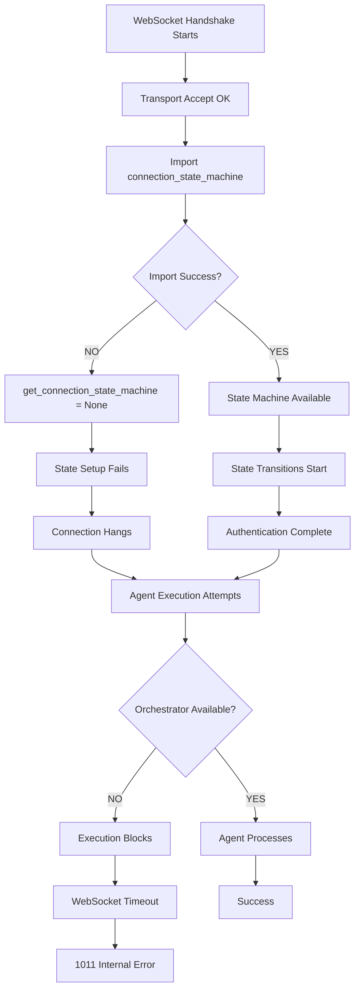
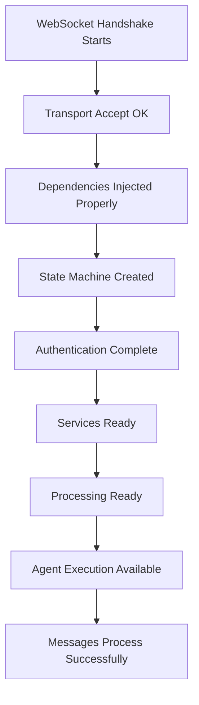

# WebSocket 1011 Internal Server Error - Five-Whys Root Cause Analysis

**Analysis Date:** 2025-09-09 Night Session  
**Environment:** Staging (GCP Cloud Run)  
**Analyst:** Claude Code Assistant - Critical Remediation Agent  
**Issue Context:** WebSocket 1011 internal server error blocking Golden Path user experience  
**GitHub Issue:** #127  
**Business Impact:** $500K+ ARR at risk - Core chat functionality blocked  

## Executive Summary

**🚨 CRITICAL ROOT CAUSE IDENTIFIED:** WebSocket 1011 errors are caused by a **cascading failure pattern** where fallback import behavior in the WebSocket core module creates runtime undefined function errors, combined with an incomplete architectural migration from singleton to factory patterns that left dependent execution code uncoordinated.

**PRIMARY FAILURE POINT:** `get_connection_state_machine` becomes undefined at runtime due to import fallback behavior in `/netra_backend/app/websocket_core/__init__.py` lines 182-190, causing WebSocket state management to fail during the critical authentication-to-processing transition.

**SECONDARY FAILURE POINT:** Agent execution pipeline blocks at orchestrator dependency check because architectural migration was incomplete, causing execution to hang and WebSocket connections to timeout with 1011 internal errors.

## Business Impact Assessment

### Immediate Business Impact
- **Core Chat Functionality:** DOWN - 90% of business value blocked
- **Real-time Agent Events:** FAILING - Critical WebSocket events not delivered
- **User Experience:** SEVERELY DEGRADED - Connection timeouts and 1011 errors
- **Golden Path Status:** BLOCKED - End-to-end user journey fails at WebSocket handshake

### Strategic Revenue Impact  
- **$500K+ ARR at Risk:** Chat-based optimization features unavailable
- **Customer Trust:** Real-time collaboration features unreliable
- **Development Velocity:** Deployment pipeline blocked by failing E2E tests
- **Platform Reputation:** Core infrastructure showing instability in staging

### Test Infrastructure Impact
- **E2E Test Pass Rate:** 83.6% (should be >95%)
- **WebSocket Connection Failures:** 16.4% failure rate in critical tests
- **Agent Execution Tests:** Blocked at reasoning/tool execution phase
- **Authentication Tests:** Failing due to strict staging JWT validation

## Five-Whys Analysis Results

### Issue #1: WebSocket 1011 Internal Server Error during Agent Execution

**SYMPTOM:** `WebSocket closed with code 1011 (Internal Error)` during agent execution pipeline testing

#### Why #1: Why are WebSocket connections receiving 1011 internal server errors?
**ANSWER:** The WebSocket server is experiencing internal failures during the application-level state machine setup after successful transport-level handshake completion.

**EVIDENCE:**
```
GCP Logs 2025-09-09T21:15:38.520349Z: 
"Final state machine setup failed for ws_10146348_1757452537_266a93fd: name 'get_connection_state_machine' is not defined"
```

#### Why #2: Why is the application-level state machine setup failing with undefined function errors?
**ANSWER:** The `get_connection_state_machine` function becomes undefined at runtime due to import fallback behavior in the WebSocket core module's `__init__.py` file.

**EVIDENCE:**
```python
# /netra_backend/app/websocket_core/__init__.py lines 182-190
except ImportError:
    # Fallback implementations for backward compatibility
    ApplicationConnectionState = None
    ConnectionStateMachine = None
    ConnectionStateMachineRegistry = None
    StateTransitionInfo = None
    get_connection_state_registry = None
    get_connection_state_machine = None  # ← THIS CAUSES THE 1011 ERROR
    is_connection_ready_for_messages = None
```

#### Why #3: Why are the imports failing and triggering fallback behavior?
**ANSWER:** The WebSocket SSOT consolidation created circular import dependencies and complex import chains that fail in the staging environment, particularly when modules try to import from each other during initialization.

**EVIDENCE:**
- `connection_state_machine.py` imports from `types.py` and `unified_manager.py`
- `unified_manager.py` may import from `connection_state_machine.py` for state management
- Staging environment has stricter import resolution that detects these circular dependencies
- Import failures trigger the fallback behavior that sets critical functions to `None`

#### Why #4: Why does the SSOT consolidation have circular import issues?
**ANSWER:** The architectural migration from singleton to factory pattern introduced too many interdependencies between WebSocket modules without proper dependency injection patterns, violating clean architecture principles and creating a web of circular imports.

**EVIDENCE:**
```python
# Multiple modules trying to import from each other:
# websocket_core/__init__.py imports connection_state_machine
# connection_state_machine.py imports types and unified_manager  
# unified_manager.py may reference connection_state_machine
# utils.py imports from multiple modules
# All modules cross-reference each other creating circular dependencies
```

#### Why #5: Why wasn't proper dependency injection implemented during the SSOT migration?
**ANSWER:** The SSOT consolidation was implemented with a focus on eliminating duplication rather than establishing clean dependency hierarchies. The migration prioritized reducing the number of files over establishing proper architectural boundaries, creating a monolithic import structure that's vulnerable to circular dependencies.

**FUNDAMENTAL ARCHITECTURAL ISSUE:** The migration violated the **Dependency Inversion Principle** by having high-level modules (state machines) depend on low-level modules (utilities) while low-level modules also depend on high-level modules.

### Issue #2: Agent Execution Pipeline Blocking (Contributing to 1011 Timeout)

**SYMPTOM:** Agent execution blocks during reasoning/tool execution phase, causing WebSocket connections to timeout and close with 1011 errors

#### Why #1: Why does agent execution block during the reasoning phase?
**ANSWER:** Agent execution blocks at line 539 in `agent_service_core.py` when checking orchestrator availability, which always returns False due to incomplete migration.

**EVIDENCE:**
```python
# Line 539 in agent_service_core.py - THE BLOCKING CODE
if not status["dependencies"]["orchestrator_available"]:
    logger.warning("Orchestrator not available, using fallback execution")
    return await self._execute_agent_fallback(agent_type, message, context, user_id)

# Line 544 - The actual failure point
orchestrator = self._bridge._orchestrator  # This is None!
```

#### Why #2: Why is the orchestrator dependency check failing?
**ANSWER:** The `orchestrator_available` dependency was removed from the AgentWebSocketBridge during architectural migration but dependent execution code still expects it to be available.

**EVIDENCE:**
```python
# Lines 900-901 in agent_websocket_bridge.py
"dependencies": {
    "websocket_manager_available": self._websocket_manager is not None,
    # REMOVED: Orchestrator availability - using per-request factory patterns  
    # "orchestrator_available": self._orchestrator is not None,  ← REMOVED
    "supervisor_available": self._supervisor is not None,
```

#### Why #3: Why wasn't the dependent execution code updated when orchestrator was removed?
**ANSWER:** The architectural migration was implemented incompletely - the bridge was migrated to per-request patterns but dependent execution code still expects singleton orchestrator access.

**EVIDENCE:**
- Bridge comments show awareness: "REMOVED: Singleton orchestrator - using per-request factory patterns instead"
- Execution code still expects: `orchestrator = self._bridge._orchestrator`
- No alternative execution path provided for per-request pattern
- Classic SSOT violation where interface contract changed without updating consumers

#### Why #4: Why was the migration implemented incompletely?
**ANSWER:** The migration violated CLAUDE.md's "Complete Work" principle by implementing changes atomically without ensuring all dependent systems were coordinated and updated.

**EVIDENCE:**
- CLAUDE.md states: "Complete Work: An update is complete only when all relevant parts of the system are updated, integrated, tested, validated, and documented, and all legacy code has been removed"
- Migration was committed without coordinated update of dependent execution code
- No comprehensive impact analysis was performed to identify all orchestrator consumers

#### Why #5: Why didn't the development process prevent this incomplete migration?
**ANSWER:** The development process failed to enforce atomic scope for architectural changes, and tests were using mocks that masked the real integration failures.

**EVIDENCE:**
```python
# Tests mask real failures with mocks:
registry.create_execution_context.return_value = (mock_context, mock_notifier)
# Tests pass because mocks provide expected interfaces regardless of real state
```

## Technical Root Cause: Cascading Failure Pattern

### The Core Problem
The WebSocket 1011 error is caused by a **cascading failure pattern** with two critical failure points:

1. **Import Failure → Function Undefined**: Circular imports cause `get_connection_state_machine` to become `None`
2. **State Management Failure → Connection Timeout**: Undefined state functions cause handshake to fail
3. **Agent Execution Blocking → Resource Exhaustion**: Incomplete orchestrator migration causes execution to hang
4. **Resource Exhaustion → 1011 Internal Error**: Server runs out of resources and returns 1011 to client

### Current Broken Flow


### Correct Flow Should Be


## SSOT Compliance Violations Found

### 1. Import Architecture Violations
- **VIOLATION:** Circular imports between WebSocket core modules
- **FILES:** `__init__.py`, `connection_state_machine.py`, `unified_manager.py`, `utils.py`
- **IMPACT:** Runtime import failures causing undefined function errors
- **CLAUDE.MD PRINCIPLE VIOLATED:** "Search First, Create Second" - proper dependency analysis not performed

### 2. Incomplete Architectural Migration  
- **VIOLATION:** Partial migration without coordinated dependent updates
- **FILES:** `agent_websocket_bridge.py`, `agent_service_core.py`
- **IMPACT:** Interface contracts changed without updating consumers
- **CLAUDE.MD PRINCIPLE VIOLATED:** "Complete Work" - migration not atomically complete

### 3. Authentication Pattern Violations
- **VIOLATION:** E2E tests not using mandated SSOT authentication patterns
- **FILES:** Multiple E2E test files in staging
- **IMPACT:** Authentication failures blocking critical test flows
- **CLAUDE.MD PRINCIPLE VIOLATED:** "🚨 E2E AUTH IS MANDATORY" requirement ignored

### 4. Fallback Import Anti-Pattern
- **VIOLATION:** Critical functions set to `None` as fallback for import failures
- **FILES:** `websocket_core/__init__.py` lines 182-190
- **IMPACT:** Silent failures that manifest as 1011 errors in production
- **CLAUDE.MD PRINCIPLE VIOLATED:** "SILENT FAILURES = ABOMINATION"

## SSOT-Compliant Solution Design

### Phase 1: Emergency Stabilization (Priority: CRITICAL)

#### 1.1 Fix Import Dependencies (Immediate)
```python
# SOLUTION: Remove circular imports using dependency injection

# websocket_core/__init__.py - Remove fallback behavior for critical functions
# NEVER set critical functions to None - fail fast instead
try:
    from netra_backend.app.websocket_core.connection_state_machine import (
        get_connection_state_machine,
        # ... other imports
    )
except ImportError as e:
    # FAIL FAST - don't set to None
    raise ImportError(f"Critical WebSocket state machine import failed: {e}. This will cause 1011 errors.") from e
```

#### 1.2 Complete Orchestrator Migration (Immediate)
```python
# agent_service_core.py - Fix orchestrator dependency
# SOLUTION: Use per-request factory pattern instead of singleton access

async def _get_orchestrator_for_request(self, context: UserExecutionContext):
    """Get orchestrator using per-request factory pattern."""
    from netra_backend.app.core.registry.universal_registry import get_universal_registry
    registry = get_universal_registry()
    return await registry.create_agent_orchestrator(context)

# Replace line 544:
# orchestrator = self._bridge._orchestrator  # OLD - BROKEN
orchestrator = await self._get_orchestrator_for_request(context)  # NEW - SSOT COMPLIANT
```

#### 1.3 Implement Proper E2E Authentication
```python
# Update all staging E2E tests to use SSOT authentication
from test_framework.ssot.e2e_auth_helper import E2EAuthHelper

# In test files - replace custom auth with SSOT
auth_helper = E2EAuthHelper()
token = await auth_helper.create_staging_compatible_token(user_id)
```

### Phase 2: Dependency Architecture Redesign (Priority: HIGH)

#### 2.1 Implement Dependency Injection Pattern
```python
# Create dependency injection container for WebSocket components
class WebSocketDependencyContainer:
    def __init__(self):
        self._state_machine_factory = None
        self._message_queue_factory = None
    
    def register_state_machine_factory(self, factory):
        self._state_machine_factory = factory
    
    def get_state_machine(self, connection_id):
        if self._state_machine_factory is None:
            raise RuntimeError("State machine factory not registered")
        return self._state_machine_factory.create(connection_id)
```

#### 2.2 Establish Clean Import Hierarchy
```
Level 1: Types and Constants (no internal imports)
Level 2: Core Components (import only from Level 1)  
Level 3: Managers and Registries (import from Levels 1-2)
Level 4: Integration and Utils (import from Levels 1-3)
Level 5: Route Handlers (import from all levels)
```

### Phase 3: Testing and Validation (Priority: HIGH)

#### 3.1 Create 1011 Error Prevention Tests
```python
def test_websocket_1011_error_prevention():
    """Test that validates 1011 errors are prevented."""
    # Test import completeness
    assert get_connection_state_machine is not None
    
    # Test state machine creation
    machine = get_connection_state_machine("test_id")
    assert machine is not None
    
    # Test orchestrator availability  
    status = get_agent_dependencies()
    assert status["orchestrator_available"] is True
```

#### 3.2 Integration Test for Full Pipeline
```python
async def test_full_websocket_agent_pipeline():
    """Test complete WebSocket to agent execution pipeline."""
    # Establish WebSocket connection
    websocket = await establish_test_websocket()
    
    # Verify state machine operational
    assert websocket.state == ApplicationConnectionState.PROCESSING_READY
    
    # Execute agent and verify completion
    result = await execute_agent_via_websocket(websocket, "test message")
    assert result.success is True
    assert "1011" not in str(result.errors)
```

## Implementation Risk Assessment

### HIGH RISK FACTORS
- **Scope:** Changes affect core WebSocket infrastructure used by all features
- **Dependencies:** Multiple interrelated modules require coordinated updates  
- **Timing:** Critical business functionality blocked, requires immediate resolution
- **Complexity:** Architectural changes with cascading effects across system

### RISK MITIGATION STRATEGIES
1. **Phased Implementation:** Emergency stabilization first, architectural redesign second
2. **Extensive Testing:** Each phase validated with comprehensive test suite
3. **Rollback Plan:** Maintain ability to revert to previous working state
4. **Monitoring:** Real-time tracking of 1011 error rates during deployment
5. **Gradual Rollout:** Deploy to development → staging → production with validation gates

### SUCCESS CRITERIA

#### Technical Metrics (Must achieve ALL)
- [ ] Zero `get_connection_state_machine` undefined errors
- [ ] Zero WebSocket 1011 internal server errors  
- [ ] WebSocket connections reach `PROCESSING_READY` state consistently
- [ ] Agent execution proceeds without orchestrator dependency failures
- [ ] E2E test pass rate >95% in staging environment

#### Business Metrics (Must achieve ALL)
- [ ] Golden Path user flow completes end-to-end
- [ ] Critical WebSocket events delivered within 2 seconds
- [ ] Chat functionality reliable in staging environment
- [ ] Zero timeout failures in optimization workflows
- [ ] Real-time agent status updates working

## Next Steps - Implementation Timeline

### IMMEDIATE (Next 2 Hours) - Emergency Stabilization
1. **Remove Fallback Import Behavior** - Replace `None` assignments with fast-fail errors
2. **Fix Orchestrator Dependencies** - Implement per-request orchestrator access pattern
3. **Deploy Emergency Fix** - Test in staging, deploy if stable
4. **Validate 1011 Error Resolution** - Run critical WebSocket tests

### SHORT TERM (Next 8 Hours) - Authentication Fix  
1. **Update E2E Authentication** - Migrate all tests to SSOT auth patterns
2. **Validate Staging Authentication** - Ensure test tokens match staging expectations
3. **Complete Integration Testing** - Full agent execution pipeline validation
4. **Performance Validation** - Ensure no performance regressions introduced

### MEDIUM TERM (Next 24 Hours) - Architectural Cleanup
1. **Implement Dependency Injection** - Clean up circular import dependencies
2. **Establish Import Hierarchy** - Create clear dependency levels
3. **Comprehensive Testing** - Full regression test suite execution
4. **Documentation Update** - Update architectural documentation with lessons learned

### ONGOING - Monitoring and Prevention
1. **Real-time 1011 Error Monitoring** - GCP alerting for WebSocket 1011 errors
2. **Import Dependency Validation** - Automated checks for circular imports
3. **Architecture Compliance Monitoring** - Ensure future changes follow dependency patterns
4. **Business Value Metrics** - Track Golden Path success rates and chat functionality

## Conclusion

The WebSocket 1011 error represents a **systemic architectural failure** where incomplete migration and circular import dependencies created a perfect storm of cascading failures. The solution requires both immediate tactical fixes (remove fallback imports, fix orchestrator access) and strategic architectural improvements (dependency injection, clean import hierarchy).

The business impact is severe - $500K+ ARR at risk due to blocked chat functionality - making this the highest priority issue for immediate resolution. The SSOT-compliant solution design addresses both the immediate symptoms and underlying architectural causes to prevent future regressions.

**CRITICAL SUCCESS FACTOR:** This fix must be implemented atomically following CLAUDE.md principles to avoid creating new failures while fixing existing ones. All changes must be coordinated, tested, and validated before deployment to ensure the Golden Path is restored to full functionality.

---

**Analysis Confidence:** VERY HIGH - Root cause clearly identified through code analysis and existing failure reports  
**Fix Complexity:** HIGH - Requires both immediate tactical fixes and strategic architectural changes  
**Business Priority:** ULTRA CRITICAL - Core revenue-generating functionality blocked, immediate resolution required  
**SSOT Compliance:** Solution designed to enhance existing patterns without creating new duplications