# ReportingSubAgent UserExecutionContext Integration Audit

## Executive Summary

**CRITICAL VIOLATIONS FOUND**: The ReportingSubAgent has significant UserExecutionContext integration violations that prevent proper user isolation and could lead to cross-user data contamination.

**Risk Level**: 🔴 HIGH - Multiple context integration violations found

**Date**: 2025-09-02
**Auditor**: Claude Code Analysis System
**File Audited**: `netra_backend/app/agents/reporting_sub_agent.py`

## Key Findings

### ✅ Compliant Patterns
1. **Execute method accepts context**: ✅ `execute(self, context: UserExecutionContext, stream_updates: bool = False)`
2. **Context validation**: ✅ Validates `UserExecutionContext` type at method entry
3. **Context usage in business logic**: ✅ Uses `context.metadata` for report building
4. **No database sessions in instance variables**: ✅ Uses `DatabaseSessionManager(context)` pattern
5. **Proper error handling**: ✅ Includes context data in error messages

### 🔴 Critical Violations Found

#### 1. Constructor Missing Context Parameter
**Location**: Line 44 - `def __init__(self):`
```python
def __init__(self):  # ❌ Missing optional context parameter
    super().__init__(
        name="ReportingSubAgent", 
        description="Golden Pattern reporting agent using BaseAgent infrastructure",
        # ... other parameters
    )
```

**Expected Pattern** (based on USER_CONTEXT_ARCHITECTURE.md):
```python
def __init__(self, context: Optional[UserExecutionContext] = None):
    super().__init__(
        name="ReportingSubAgent",
        description="Golden Pattern reporting agent using BaseAgent infrastructure",
        # ... other parameters
    )
    # Store context if provided for factory pattern
    self._user_context = context
```

#### 2. Context Not Passed to LLM Helper Method
**Location**: Line 95 - `_execute_reporting_llm_with_observability` call
```python
# ❌ Context not passed to helper method
llm_response_str = await self._execute_reporting_llm_with_observability(prompt, correlation_id)
```

**Method signature missing context**:
```python
async def _execute_reporting_llm_with_observability(self, prompt: str, correlation_id: str) -> str:
    # ❌ Should accept context parameter for user isolation
```

**Expected Pattern**:
```python
llm_response_str = await self._execute_reporting_llm_with_observability(
    prompt, correlation_id, context  # ✅ Pass context
)

async def _execute_reporting_llm_with_observability(
    self, prompt: str, correlation_id: str, context: UserExecutionContext
) -> str:
    # ✅ Use context for user-specific observability
```

#### 3. Missing Context Factory Integration
**Issue**: No factory method support for creating agents with context
**Impact**: Cannot be used with the new `AgentInstanceFactory` pattern

**Missing Pattern**:
```python
@classmethod
def create_agent_with_context(cls, context: UserExecutionContext) -> 'ReportingSubAgent':
    """Factory method for creating agent with user context."""
    return cls(context=context)
```

## Comparison with Compliant Agents

### Actions Agent (Compliant Example)
```python
async def execute_core_logic(self, context: 'UserExecutionContext') -> Dict[str, Any]:
    # ✅ Context passed to all helper methods
    await self._emit_thinking(context, "Analyzing optimization strategies...")
```

### Data Sub Agent (Compliant Example)
```python
async def _execute_with_context(self, context: UserExecutionContext, 
                               session_manager: DatabaseSessionManager, 
                               stream_updates: bool) -> Dict[str, Any]:
    # ✅ Context-aware helper methods
```

## Security and Isolation Analysis

### Current Risk Assessment
1. **Cross-User Data Leakage**: 🔴 LOW RISK - No user data stored in instance variables
2. **Context Contamination**: 🟡 MEDIUM RISK - Context not passed to all methods
3. **Factory Pattern Incompatibility**: 🔴 HIGH RISK - Cannot be created with user context
4. **Concurrent User Support**: 🟡 MEDIUM RISK - Limited isolation in helper methods

### Expected Architecture Violations

#### Missing User Context Flow

```mermaid
graph TD
    A[AgentInstanceFactory] --> B[create_agent_instance]
    B --> C[ReportingSubAgent.__init__]
    C --> D[❌ Context NOT stored]
    
    E[execute method] --> F[Context received]
    F --> G[_execute_reporting_llm_with_observability]
    G --> H[❌ Context NOT passed]
    H --> I[LLM call without user isolation]
```


## Recommended Fixes

### 1. Update Constructor Signature
```python
def __init__(self, context: Optional[UserExecutionContext] = None, **kwargs):
    super().__init__(
        name="ReportingSubAgent", 
        description="Golden Pattern reporting agent using BaseAgent infrastructure",
        enable_reliability=True,
        enable_execution_engine=True, 
        enable_caching=True,
        **kwargs
    )
    # Store context for factory pattern integration
    self._user_context = context
```

### 2. Update LLM Helper Method
```python
async def _execute_reporting_llm_with_observability(
    self, prompt: str, correlation_id: str, context: UserExecutionContext
) -> str:
    """Execute LLM call with full observability and user context."""
    start_llm_heartbeat(correlation_id, "ReportingSubAgent")
    try:
        # Use context for user-specific logging
        log_agent_input(
            "ReportingSubAgent", "LLM", len(prompt), correlation_id,
            user_id=context.user_id, run_id=context.run_id
        )
        response = await self.llm_manager.ask_llm(prompt, llm_config_name='reporting')
        log_agent_output(
            "LLM", "ReportingSubAgent", len(response), "success", correlation_id,
            user_id=context.user_id, run_id=context.run_id
        )
        return response
    except Exception as e:
        log_agent_output(
            "LLM", "ReportingSubAgent", 0, "error", correlation_id,
            user_id=context.user_id, run_id=context.run_id
        )
        raise
    finally:
        stop_llm_heartbeat(correlation_id)
```

### 3. Update Method Call
```python
# In execute method, line 95
llm_response_str = await self._execute_reporting_llm_with_observability(
    prompt, correlation_id, context  # ✅ Pass context
)
```

### 4. Add Factory Method Support
```python
@classmethod
def create_agent_with_context(cls, context: UserExecutionContext) -> 'ReportingSubAgent':
    """Factory method for creating agent with user context.
    
    This method enables the agent to be created through AgentInstanceFactory
    with proper user context isolation.
    
    Args:
        context: User execution context for isolation
        
    Returns:
        ReportingSubAgent: Configured agent instance
    """
    return cls(context=context)
```

## Implementation Priority

### Phase 1 (Critical) - Constructor Update
- [ ] Add optional `context` parameter to `__init__`
- [ ] Store context in `self._user_context` for factory pattern
- [ ] Maintain backward compatibility with existing calls

### Phase 2 (High) - Context Flow
- [ ] Update `_execute_reporting_llm_with_observability` signature
- [ ] Pass context to helper method in execute
- [ ] Add user-specific observability logging

### Phase 3 (Medium) - Factory Integration
- [ ] Add `create_agent_with_context` class method
- [ ] Update AgentInstanceFactory integration
- [ ] Add comprehensive tests for factory pattern

## Testing Requirements

### Required Test Cases
```python
def test_reporting_agent_context_integration():
    """Test ReportingSubAgent accepts context in constructor."""
    context = create_test_context()
    agent = ReportingSubAgent(context=context)
    assert agent._user_context == context

def test_context_passed_to_llm_helper():
    """Test context is passed to LLM helper method."""
    # Verify context flows through to _execute_reporting_llm_with_observability

def test_factory_pattern_support():
    """Test agent can be created via factory pattern."""
    agent = ReportingSubAgent.create_agent_with_context(context)
    assert isinstance(agent, ReportingSubAgent)
```

## Related Architecture Documents

- **[USER_CONTEXT_ARCHITECTURE.md](../../USER_CONTEXT_ARCHITECTURE.md)** - Factory patterns and execution isolation
- **[AgentInstanceFactory](../agents/supervisor/agent_instance_factory.py)** - Per-request agent instantiation
- **[BaseAgent](../agents/base_agent.py)** - Base patterns and WebSocket integration

## Conclusion

The ReportingSubAgent requires immediate updates to support UserExecutionContext integration properly. While it follows some correct patterns (context in execute method, no instance variable violations), the missing constructor context parameter and lack of context flow to helper methods creates isolation risks.

**Priority**: 🔴 HIGH - Required for proper multi-user support and AgentInstanceFactory integration.

**Estimated Effort**: 2-4 hours (straightforward parameter additions and method signature updates)

**Risk if Not Fixed**: Medium - Agent cannot be used with new factory patterns, limiting scalability and user isolation guarantees.