# Claude Instance Orchestrator - Token Budget Enhancement Plan

## Overview

This plan outlines the implementation of comprehensive token budget controls and real-time monitoring for the Claude Instance Orchestrator. The enhancement will add three levels of budget control with visual monitoring and automatic enforcement.

## Current State Analysis

The orchestrator currently tracks tokens but has no budget limits:
- Tracks `total_tokens`, `input_tokens`, `output_tokens`, `cached_tokens` per instance
- Provides token usage summaries in status reports
- Saves metrics to CloudSQL when enabled
- No budget enforcement or rate limiting

## Architecture Overview


## Current State & Enhancement Goals

## Implementation Plan

### Phase 1: Core Budget Infrastructure

#### 1.1 Token Budget Configuration
Add budget configuration to `InstanceConfig`:

```python
@dataclass
class InstanceConfig:
    # ... existing fields ...
    max_tokens_per_command: Optional[int] = None  # Per-command budget
    token_budget_enabled: bool = False            # Enable budget tracking
    cost_budget_usd: Optional[float] = None       # Cost-based budget
    priority: int = 1                             # Execution priority (1-10)
```

Add global budget configuration to `ClaudeInstanceOrchestrator`:

```python
class ClaudeInstanceOrchestrator:
    def __init__(self, ...,
                 overall_token_budget: Optional[int] = None,
                 hourly_token_budget: Optional[int] = None,
                 budget_period_minutes: int = 60,
                 enable_budget_visuals: bool = True,
                 budget_enforcement_mode: str = "warn"):
```

#### 1.2 Token Budget Manager Architecture


### Phase 2: Budget Enforcement Flow

#### 2.1 Pre-execution Budget Validation

```mermaid
sequenceDiagram
    participant O as Orchestrator
    participant B as BudgetManager
    participant I as Instance
    participant C as Claude

    O->>B: estimate_token_usage(command)
    B->>B: analyze_historical_usage(command)
    B->>O: estimated_tokens

    O->>B: check_all_budgets(command, estimated_tokens)
    alt Budget Available
        B->>O: ✓ Budget OK
        O->>I: start_instance()
        I->>C: execute_command()

        loop During Execution
            C->>I: partial_response + tokens
            I->>B: record_usage(tokens)
            B->>B: check_runtime_budgets()
            alt Over Budget
                B->>I: budget_exceeded_signal
                I->>C: terminate_gracefully()
            end
        end

        C->>I: final_response + total_tokens
        I->>B: record_final_usage(tokens)
        I->>O: completion_status
    else Budget Exceeded
        B->>O: ✗ Budget Exceeded (type, remaining)
        O->>O: queue_for_later() or skip_instance()
        O->>O: log_budget_skip(command, reason)
    end
```



#### 2.2 Runtime Budget Monitoring


### Phase 3: Visual Monitoring System

#### 3.1 Enhanced Status Reports with Budget Visuals


Example enhanced output:
```
╔═══ TOKEN BUDGET STATUS [14:30:15] ═══╗
║ Overall Budget: [████████░░] 80% (8.0K/10K tokens)
║                 Remaining: 2.0K | Est. exhaustion: 2h 15m
║ Hourly Budget:  [██████░░░░] 60% (600/1K tokens/hour)
║                 Next reset: 30m | Rate: 20 tok/min
║
║ Command Budgets:
║   🟢 /gitcommitgardener    [███░░░░░░░] 30% (300/1K)   Priority: 1
║   🔴 /refreshgardener      [██████████] 100% (500/500) Priority: 2 ⚠️ EXCEEDED
║   🟡 /gcploggardener       [█████░░░░░] 50% (250/500)  Priority: 1
║   🔵 /testgardener         [██░░░░░░░░] 20% (100/500)  Priority: 3
║
║ Cost Summary: $12.50 spent | $7.50 remaining | Efficiency: 1.2K tok/$
║
║ Predictions & Alerts:
║   ⚠️  /refreshgardener budget exhausted - new instances blocked
║   📊 Current rate (20 tok/min) will exhaust hourly budget in 30m
║   🎯 Recommend priority rebalancing for optimal throughput
╚════════════════════════════════════════════════════════════════╝
```

#### 3.2 Real-time Dashboard Implementation

```python
class BudgetVisualizationManager:
    def __init__(self, budget_manager: TokenBudgetManager):
        self.budget_manager = budget_manager
        self.update_interval = 5  # seconds

    def render_budget_progress_bar(self, used: int, total: int, width: int = 50) -> str:
        """Render ASCII progress bar with color coding"""

    def render_command_budget_grid(self, command_budgets: Dict[str, CommandBudgetInfo]) -> str:
        """Render grid of per-command budget status"""

    def render_predictions_section(self, status: BudgetStatus) -> str:
        """Render usage predictions and time estimates"""

    def render_efficiency_metrics(self) -> str:
        """Show cost per token, tokens per minute, etc."""

    async def start_live_dashboard_mode(self):
        """Run continuous updating dashboard"""
```

### Phase 4: Advanced Monitoring Features

#### 4.1 Usage Pattern Analysis


#### 4.2 Smart Budget Allocation

```python
class SmartBudgetAllocator:
    def analyze_command_efficiency(self) -> Dict[str, float]:
        """Calculate tokens per successful outcome by command"""

    def recommend_budget_distribution(self, total_budget: int) -> Dict[str, int]:
        """Suggest optimal per-command budget allocation"""

    def predict_completion_time(self, command_queue: List[str]) -> datetime:
        """Estimate when all commands will complete given current usage"""

    def suggest_priority_rebalancing(self) -> List[str]:
        """Recommend priority changes for better throughput"""
```

### Phase 5: Configuration & CLI Integration

#### 5.1 Enhanced CLI Arguments

```bash
# Global budgets
python claude-instance-orchestrator.py \
  --overall-token-budget 10000 \
  --hourly-token-budget 1000 \
  --budget-period-minutes 60 \
  --enable-budget-visuals \
  --budget-enforcement-mode warn

# Per-command budget overrides
python claude-instance-orchestrator.py \
  --command-budget "/gitcommitgardener=500" \
  --command-budget "/refreshgardener=1000" \
  --command-budget "/gcploggardener=750"

# Cost-based budgets
python claude-instance-orchestrator.py \
  --overall-cost-budget 5.00 \
  --hourly-cost-budget 1.00

# Dashboard modes
python claude-instance-orchestrator.py \
  --budget-dashboard-mode live \
  --budget-report-interval 10
```

#### 5.2 Configuration File Format

```json
{
  "budget_config": {
    "overall_token_budget": 10000,
    "hourly_token_budget": 1000,
    "budget_period_minutes": 60,
    "enforcement_mode": "warn",
    "enable_visuals": true,
    "cost_budgets": {
      "overall_usd": 5.00,
      "hourly_usd": 1.00
    }
  },
  "instances": [
    {
      "command": "/gitcommitgardener",
      "max_tokens_per_command": 500,
      "cost_budget_usd": 0.25,
      "priority": 1,
      "token_budget_enabled": true
    }
  ]
}
```

## File Structure & Implementation

### New Files to Create

```
scripts/
├── claude-instance-orchestrator.py (EXISTING - enhance)
├── token_budget/
│   ├── __init__.py
│   ├── budget_manager.py
│   ├── visualization.py
│   ├── analytics.py
│   └── models.py
└── config/
    └── budget_defaults.json
```

### Integration Points


## Testing Strategy

### Unit Tests
```python
# test_token_budget_manager.py
class TestTokenBudgetManager:
    def test_command_budget_enforcement(self):
        """Test per-command budget limits"""

    def test_overall_budget_tracking(self):
        """Test global budget accumulation"""

    def test_sliding_window_rate_limiting(self):
        """Test time-based budget windows"""

    def test_budget_prediction_accuracy(self):
        """Test usage prediction algorithms"""

    def test_visualization_rendering(self):
        """Test ASCII progress bar generation"""
```

### Integration Tests
```python
# test_budget_orchestrator_integration.py
class TestBudgetOrchestrationIntegration:
    async def test_budget_enforcement_during_execution(self):
        """Test budget checks during real instance execution"""

    async def test_budget_dashboard_updates(self):
        """Test real-time dashboard update accuracy"""

    async def test_budget_exceeded_scenarios(self):
        """Test various budget exhaustion scenarios"""
```

## Success Metrics

1. **Budget Control Accuracy**: 100% prevention of budget overruns when enforcement enabled
2. **Real-time Monitoring**: < 5 second lag between usage and dashboard updates
3. **Prediction Accuracy**: Within 10% of actual exhaustion time for 90% of cases
4. **Performance Impact**: < 5% overhead on existing orchestration performance
5. **User Experience**: Clear, actionable budget information in all reports
6. **Configuration Flexibility**: Support for all major budget scenarios

## Risk Mitigation

### Performance Considerations
- Lazy initialization of budget tracking components
- Efficient sliding window algorithms using collections.deque
- Optional budget features to minimize overhead when disabled

### Backward Compatibility
- All budget features optional and disabled by default
- Existing configuration files continue to work unchanged
- Graceful degradation when budget data unavailable

### Edge Cases
- Handle token counting inconsistencies gracefully
- Prevent race conditions in concurrent budget updates
- Robust handling of malformed budget configurations

---

*This comprehensive plan provides detailed implementation guidance for adding sophisticated token budget management to the Claude Instance Orchestrator while maintaining system performance and reliability.*

## Implementation Timeline

### Week 1: Foundation (Phase 1)
- [ ] Implement `TokenBudgetManager` core class
- [ ] Add budget configuration to `InstanceConfig` and orchestrator
- [ ] Create basic budget tracking data structures
- [ ] Add CLI argument parsing for budget options

### Week 2: Enforcement (Phase 2)
- [ ] Implement pre-execution budget validation
- [ ] Add runtime budget monitoring during instance execution
- [ ] Create budget enforcement modes (warn/stop-new/kill-running)
- [ ] Integrate with existing token parsing logic

### Week 3: Visualization (Phase 3)
- [ ] Implement `BudgetVisualizationManager`
- [ ] Enhance status reports with budget progress bars
- [ ] Create live dashboard mode
- [ ] Add usage predictions and efficiency metrics

### Week 4: Advanced Features (Phase 4-5)
- [ ] Implement smart budget allocation algorithms
- [ ] Add usage pattern analysis
- [ ] Create comprehensive configuration system
- [ ] Performance optimization and testing

## Decision Log

### Budget Enforcement Strategy
**Decision**: Use configurable enforcement modes (warn/stop-new/kill-running)
**Rationale**: Provides flexibility for different use cases - development vs production
**Default**: `warn` mode for non-disruptive initial rollout

### Budget Persistence
**Decision**: Per-session budgets with optional persistence to CloudSQL
**Rationale**: Keeps implementation simple while allowing for future cross-session tracking
**Implementation**: Add `--persistent-budgets` flag for CloudSQL storage

### Configuration Precedence
**Decision**: CLI args > config file > command frontmatter > defaults
**Rationale**: Follows standard configuration hierarchy with most specific overriding general
**Example**: CLI `--command-budget` overrides config file per-command settings

### Performance Optimization
**Decision**: Lazy initialization with minimal overhead when budgets disabled
**Rationale**: No performance impact for users not using budget features
**Implementation**: `TokenBudgetManager` only created when budget options specified

## Open Questions & Answers

### Q: Should running commands be terminated when budgets exceeded?
**A**: Configurable via `--budget-enforcement-mode`:
- `warn`: Log warnings, continue execution
- `stop-new`: Block new instances, allow running to complete
- `kill-running`: Terminate running instances when budgets exceeded

### Q: Do budgets persist across orchestrator runs?
**A**: By default no, but optional persistence via:
- `--persistent-budgets`: Store in CloudSQL for cross-session tracking
- `--budget-reset-on-restart`: Force reset even with persistence enabled

### Q: How to handle conflicting budget configurations?
**A**: Clear precedence hierarchy:
1. CLI arguments (highest priority)
2. Config file `budget_config` section
3. Command frontmatter `tokenBudget` field
4. Built-in defaults (lowest priority)

### Q: What about cost budgets vs token budgets?
**A**: Support both with automatic conversion:
- Token budgets: Direct token counting
- Cost budgets: Convert to tokens using current pricing
- Allow mixed mode: overall cost budget + per-command token budgets

## Success Validation Checklist

### Functional Requirements
- [ ] Per-command budget enforcement working correctly
- [ ] Overall budget tracking across all instances
- [ ] Time-based (hourly) budget windows functioning
- [ ] Visual progress bars rendering accurately
- [ ] Real-time dashboard updates within 5 seconds
- [ ] Budget predictions within 10% accuracy

### Non-Functional Requirements
- [ ] < 5% performance overhead when budgets enabled
- [ ] Zero performance impact when budgets disabled
- [ ] Backward compatibility with existing configurations
- [ ] Graceful degradation on configuration errors
- [ ] Memory usage remains bounded during long runs

### User Experience
- [ ] Clear, actionable budget information in reports
- [ ] Intuitive CLI argument naming and behavior
- [ ] Helpful error messages when budgets exceeded
- [ ] Easy configuration via JSON/YAML files
- [ ] Comprehensive documentation and examples

---

*This enhanced plan provides a complete roadmap for implementing comprehensive token budget management in the Claude Instance Orchestrator, with detailed Mermaid diagrams, implementation phases, and success criteria.*
