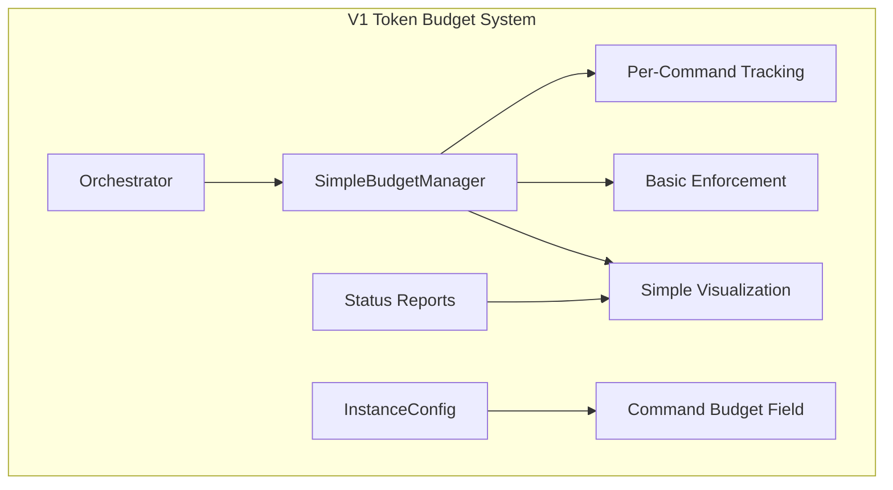

# Claude Token Budget V1 - Minimal Implementation Plan

## Overview

This plan defines the minimal viable product (MVP) for token budget functionality in the Claude Instance Orchestrator. The goal is to implement basic budget tracking and enforcement with simple visual feedback.

## V1 Scope (Minimal Features)

**Core Requirements:**
- Per-command token limits
- Basic enforcement (warn/block modes)
- Simple progress visualization
- CLI configuration
- Real-time budget tracking

**Explicitly OUT of scope for V1:**
- Time-based budgets (hourly/sliding windows)
- Cost-based budgets
- Advanced analytics/predictions
- Persistent budget storage
- Smart allocation algorithms
- Live dashboard mode

## V1 Architecture

## Git Issues for Parallel Development

### Core Infrastructure (Can be developed in parallel)

#### Issue #1: Basic Budget Data Structures
**Priority:** P0 - Foundation
**Effort:** 2-3 days
**Dependencies:** None

**Scope:**
- Create `SimpleBudgetManager` class with basic token tracking
- Implement `CommandBudgetInfo` and `BudgetStatus` dataclasses
- Add methods: `record_usage()`, `check_budget()`, `get_status()`
- Basic unit tests for data structures

**Files to create/modify:**
- `scripts/token_budget/__init__.py`
- `scripts/token_budget/simple_manager.py`
- `scripts/token_budget/models.py`
- `tests/unit/test_simple_budget_manager.py`

**Acceptance criteria:**
- [ ] Budget manager can track token usage per command
- [ ] Can check if command is within budget limits
- [ ] Returns accurate status information
- [ ] Unit tests cover core functionality

---

#### Issue #2: InstanceConfig Budget Fields
**Priority:** P0 - Foundation
**Effort:** 1-2 days
**Dependencies:** None

**Scope:**
- Add `max_tokens_per_command: Optional[int]` to InstanceConfig
- Add `budget_enforcement_mode: str = "warn"` to InstanceConfig
- Update InstanceConfig validation and defaults
- Add budget-related CLI argument parsing

**Files to modify:**
- `scripts/claude-instance-orchestrator.py` (InstanceConfig dataclass)
- `scripts/claude-instance-orchestrator.py` (CLI argument parsing)

**Acceptance criteria:**
- [ ] InstanceConfig accepts budget parameters
- [ ] CLI can specify per-command budgets
- [ ] Validation ensures positive budget values
- [ ] Backward compatibility maintained (budgets optional)

---

#### Issue #3: Basic Enforcement Logic
**Priority:** P0 - Core
**Effort:** 2-3 days
**Dependencies:** Issues #1, #2

**Scope:**
- Implement pre-execution budget checking
- Add enforcement modes: "warn", "block"
- Integrate with existing instance execution flow
- Log budget violations appropriately

**Files to modify:**
- `scripts/claude-instance-orchestrator.py` (ClaudeInstanceOrchestrator class)
- Add budget check before `run_instance()`
- Modify instance execution to record token usage

**Acceptance criteria:**
- [ ] Budget check prevents execution when limits exceeded
- [ ] "warn" mode logs but continues execution
- [ ] "block" mode prevents new instance creation
- [ ] Token usage recorded after execution

---

### Visualization (Can be developed in parallel)

#### Issue #4: Simple Progress Bars
**Priority:** P1 - User Experience
**Effort:** 2 days
**Dependencies:** Issue #1

**Scope:**
- Create ASCII progress bar renderer
- Implement simple budget status display
- Color coding for budget status (green/yellow/red)
- Format budget information clearly

**Files to create:**
- `scripts/token_budget/visualization.py`
- `tests/unit/test_budget_visualization.py`

**Acceptance criteria:**
- [ ] Renders ASCII progress bars for budget usage
- [ ] Shows percentage and absolute numbers
- [ ] Color codes budget status appropriately
- [ ] Handles edge cases (0 budget, over budget)

---

#### Issue #5: Enhanced Status Reports
**Priority:** P1 - User Experience
**Effort:** 2 days
**Dependencies:** Issues #1, #4

**Scope:**
- Integrate budget visuals into existing status reports
- Add budget summary section to status output
- Show per-command budget status
- Maintain existing status report format

**Files to modify:**
- `scripts/claude-instance-orchestrator.py` (`_print_status_report` method)

**Acceptance criteria:**
- [ ] Status reports include budget information
- [ ] Budget section is clearly separated
- [ ] Shows progress for each command with budgets
- [ ] Maintains existing status report functionality

---

### Integration (Sequential after core components)

#### Issue #6: Token Usage Integration
**Priority:** P0 - Integration
**Effort:** 1-2 days
**Dependencies:** Issues #1, #3

**Scope:**
- Integrate budget manager with existing token parsing
- Hook into `_parse_token_usage` method
- Ensure accurate token counting for budget tracking
- Handle edge cases in token parsing

**Files to modify:**
- `scripts/claude-instance-orchestrator.py` (`_parse_token_usage` method)
- Budget manager initialization in orchestrator

**Acceptance criteria:**
- [ ] Token usage automatically recorded in budget manager
- [ ] Integration preserves existing token reporting
- [ ] Handles partial token updates during streaming
- [ ] Budget status updates in real-time

---

#### Issue #7: CLI Configuration
**Priority:** P1 - Configuration
**Effort:** 1-2 days
**Dependencies:** Issue #2

**Scope:**
- Add comprehensive CLI arguments for budget configuration
- Support `--command-budget` flag with format `command=limit`
- Add `--budget-enforcement-mode` flag
- Update help text and documentation

**Files to modify:**
- `scripts/claude-instance-orchestrator.py` (argument parser setup)

**Acceptance criteria:**
- [ ] Can set per-command budgets via CLI
- [ ] Can configure enforcement mode via CLI
- [ ] Help text clearly explains budget options
- [ ] Command validation for budget arguments

---

### Testing & Polish (Can be developed in parallel with core features)

#### Issue #8: Integration Testing
**Priority:** P1 - Quality
**Effort:** 2-3 days
**Dependencies:** Issues #3, #6

**Scope:**
- Create integration tests for budget enforcement
- Test full orchestrator workflow with budgets
- Test various enforcement scenarios
- Test configuration loading and validation

**Files to create:**
- `tests/integration/test_budget_integration.py`
- Test data/config files for budget scenarios

**Acceptance criteria:**
- [ ] Integration tests cover complete budget workflow
- [ ] Tests verify enforcement modes work correctly
- [ ] Tests check token counting accuracy
- [ ] Tests validate configuration handling

---

#### Issue #9: Error Handling & Edge Cases
**Priority:** P1 - Robustness
**Effort:** 1-2 days
**Dependencies:** Issues #3, #6

**Scope:**
- Handle malformed budget configurations gracefully
- Manage edge cases (zero budgets, negative values)
- Proper error messages for budget violations
- Fallback behavior when budget system fails

**Files to modify:**
- `scripts/token_budget/simple_manager.py`
- `scripts/claude-instance-orchestrator.py`

**Acceptance criteria:**
- [ ] Graceful handling of invalid budget configurations
- [ ] Clear error messages for budget violations
- [ ] System continues to function when budget system disabled
- [ ] Logging provides useful debugging information

---

#### Issue #10: Documentation & Examples
**Priority:** P2 - Documentation
**Effort:** 1 day
**Dependencies:** All above issues

**Scope:**
- Update README with budget feature documentation
- Create example configurations
- Add CLI usage examples
- Document budget enforcement behaviors

**Files to create/modify:**
- `README.md` (add budget section)
- `examples/budget_config_examples.md`
- Inline code documentation

**Acceptance criteria:**
- [ ] Clear documentation of budget features
- [ ] Examples show common usage patterns
- [ ] CLI help text is comprehensive
- [ ] Known limitations documented

---

## Development Timeline

### Week 1 (Foundation)
- **Parallel Track A:** Issues #1, #2 (Core data structures & config)
- **Parallel Track B:** Issue #4 (Visualization components)

### Week 2 (Core Implementation)
- **Sequential:** Issue #3 (Enforcement logic) - depends on #1, #2
- **Parallel:** Issue #8 (Integration testing setup)

### Week 3 (Integration)
- **Sequential:** Issue #6 (Token usage integration) - depends on #3
- **Parallel:** Issue #5 (Status report enhancement) - depends on #1, #4
- **Parallel:** Issue #7 (CLI configuration) - depends on #2

### Week 4 (Polish)
- **Parallel:** Issue #9 (Error handling)
- **Parallel:** Issue #10 (Documentation)
- **Sequential:** Final integration testing - depends on all

## Success Criteria for V1

### Functional Requirements
- [ ] Can set per-command token budgets via CLI
- [ ] Budget enforcement prevents/warns about overruns
- [ ] Status reports show budget progress clearly
- [ ] Token usage tracked accurately during execution

### Non-Functional Requirements
- [ ] < 2% performance overhead when enabled
- [ ] Zero impact when budgets disabled
- [ ] Backward compatibility maintained
- [ ] Clear error handling and logging

### User Experience
- [ ] Simple CLI usage with good defaults
- [ ] Clear visual feedback on budget status
- [ ] Helpful error messages
- [ ] Minimal configuration required

## Risk Mitigation

### Technical Risks
- **Token counting accuracy:** Start with existing token parsing, improve incrementally
- **Performance impact:** Lazy initialization, efficient data structures
- **Integration complexity:** Small, focused changes to existing code

### Schedule Risks
- **Dependency bottlenecks:** Issues #1-2 are critical path, prioritize these
- **Testing complexity:** Start integration tests early, run continuously
- **Scope creep:** Defer advanced features to V2, maintain minimal scope

### Quality Risks
- **Regression issues:** Comprehensive testing of existing functionality
- **Configuration complexity:** Keep V1 configuration simple, validate thoroughly
- **Edge case handling:** Focus on common cases first, handle edge cases gracefully

---

This V1 plan delivers core budget functionality with minimal complexity while enabling parallel development across the team. Advanced features are explicitly deferred to V2 to ensure timely delivery of working budget controls.