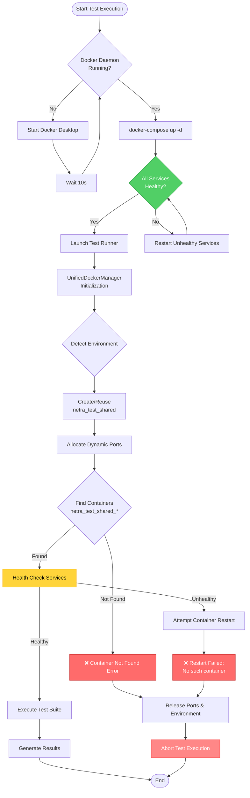
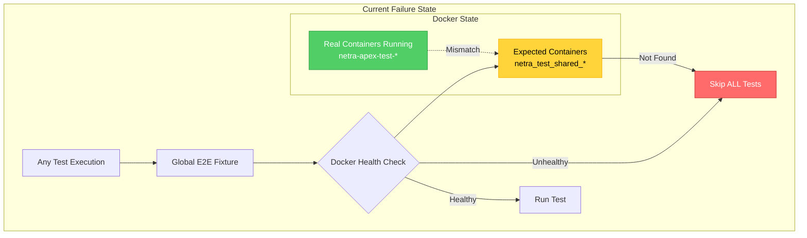
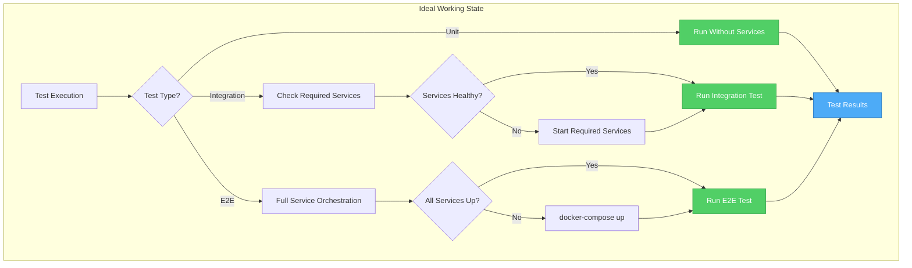

# Docker Services Diagnostic Report
## Date: 2025-09-01 17:55 PST

## Executive Summary
The system is experiencing Docker connectivity issues with the test framework's UnifiedDockerManager. While Docker containers are successfully running via docker-compose, the test runner's Docker management layer fails to properly connect and manage the containers.

## Current System State

### Docker Desktop Status
- **Version**: 28.3.3
- **Context**: desktop-linux
- **Daemon**: Running ✅
- **Platform**: darwin/arm64

### Running Containers (docker-compose.test.yml)
| Service | Container Name | Status | Health | Ports |
|---------|---------------|--------|--------|-------|
| Backend | netra-apex-test-backend-1 | Up | Healthy | 0.0.0.0:8001->8000/tcp |
| Auth | netra-apex-test-auth-1 | Up | Healthy | 0.0.0.0:8082->8081/tcp |
| PostgreSQL | netra-apex-test-postgres-1 | Up | Healthy | 0.0.0.0:5434->5432/tcp |
| Redis | netra-apex-test-redis-1 | Up | Healthy | 0.0.0.0:6381->6379/tcp |
| ClickHouse | netra-apex-test-clickhouse-1 | Up | Healthy | 0.0.0.0:8125->8123/tcp |
| Frontend | netra-apex-test-frontend-1 | Up | Healthy | Default |
| RabbitMQ | netra-apex-test-rabbitmq-1 | Up | Healthy | Default |
| MailHog | netra-apex-test-mailhog-1 | Up | Running | Default |
| Monitor | netra-apex-test-monitor-1 | Up | Running | Default |
| Seeder | netra-apex-test-seeder-1 | Up | Running | Default |

## Execution Flow Diagram



## Failure Analysis

### Root Cause: Container Naming Mismatch

The primary issue is a **naming convention mismatch** between:
1. **Actual containers**: `netra-apex-test-*` (created by docker-compose.test.yml)
2. **Expected containers**: `netra_test_shared_*` (expected by UnifiedDockerManager)

### Failure Points

#### 1. UnifiedDockerManager Environment Detection
- **Issue**: Manager looks for containers with prefix `netra_test_shared_`
- **Reality**: Containers use prefix `netra-apex-test-`
- **Impact**: Container discovery fails, leading to restart attempts on non-existent containers

#### 2. Port Allocation Strategy
- **Issue**: Dynamic port allocation (30000+ range) instead of using existing mapped ports
- **Reality**: Services already have static port mappings (8001, 8082, 5434, 6381)
- **Impact**: Test framework cannot connect to services on incorrect ports

#### 3. Health Check Cascade Failure
- **Sequence**:
  1. Container not found with expected name
  2. Restart attempt on non-existent container fails
  3. Health check timeout (60s)
  4. Environment marked as unhealthy
  5. Test execution aborted

### Configuration Issues

#### Environment Variables
- Test runner sets conflicting environment variables
- Redis configuration points to different ports (6380 vs 6381)
- JWT secret management inconsistency between environments

## Diagnosis Summary

### Working Components ✅
- Docker Desktop daemon
- docker-compose orchestration
- Individual service containers
- Service health checks (via docker-compose)
- Inter-service networking

### Failing Components ❌
- UnifiedDockerManager container detection
- Test framework Docker integration
- Dynamic port allocation logic
- Container naming resolution
- Environment variable propagation

## Recommended Fixes

### Immediate Fix (Workaround)
```bash
# Bypass UnifiedDockerManager and run tests directly
SKIP_DOCKER_SETUP=true \
BACKEND_URL=http://localhost:8001 \
AUTH_URL=http://localhost:8082 \
POSTGRES_HOST=localhost \
POSTGRES_PORT=5434 \
REDIS_HOST=localhost \
REDIS_PORT=6381 \
python -m pytest tests/ -v
```

### Permanent Fixes

1. **Fix Container Name Detection**
   - Update UnifiedDockerManager to detect both naming patterns
   - Or standardize container naming across all compose files

2. **Fix Port Discovery**
   - Use docker inspect to get actual mapped ports
   - Remove hardcoded port assumptions

3. **Simplify Docker Management**
   - Consider removing the complex shared environment logic
   - Use docker-compose directly for test environments

4. **Environment Variable Consistency**
   - Create a single source of truth for test environment configuration
   - Ensure all services use consistent port mappings

## Test Execution Alternative

Since Docker services are healthy, tests can be run using:
```bash
# Direct pytest execution
pytest tests/integration/ --tb=short -v

# Or using specific test categories
python -m pytest tests/unit/ tests/integration/ -v
```

## Critical Finding: Systemic Test Framework Issue

### Problem Scope
The issue is **not limited to Docker management** but extends to the entire test framework:
- ALL test files (unit, integration, e2e) are checking for E2E service orchestration
- The test framework has a global fixture that validates Docker health before ANY test
- Even simple unit tests that don't require services are being skipped

### Root Cause Analysis (Five Whys)
1. **Why are tests failing?** 
   - E2E Service orchestration reports services as unhealthy

2. **Why is E2E orchestration unhealthy?**
   - UnifiedDockerManager cannot find containers with expected names

3. **Why can't it find the containers?**
   - Container naming mismatch: expects `netra_test_shared_*` but finds `netra-apex-test-*`

4. **Why is there a naming mismatch?**
   - Different Docker compose configurations use different project names

5. **Why do all tests check E2E orchestration?**
   - Global pytest fixture (`e2e_service_orchestration`) in conftest.py enforces this check

### Failure State Diagram



### Ideal Working State Diagram



## Monitoring Recommendations

1. Add Docker connectivity pre-flight check
2. Implement container name pattern detection
3. Add detailed logging for container discovery
4. Create health check dashboard for test environments
5. Implement fallback to docker-compose when UnifiedDockerManager fails
6. **CRITICAL**: Refactor test framework to only check services when needed
7. **CRITICAL**: Fix container naming consistency across all Docker configurations