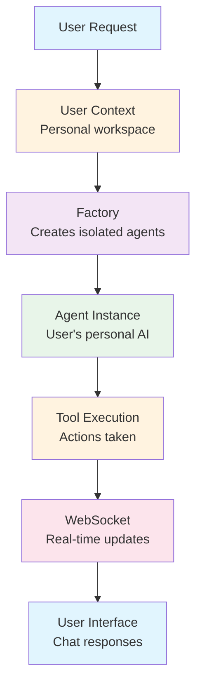
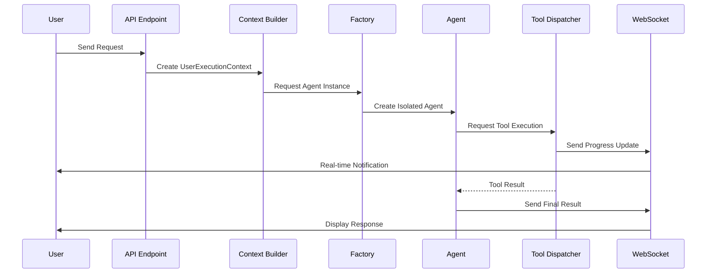
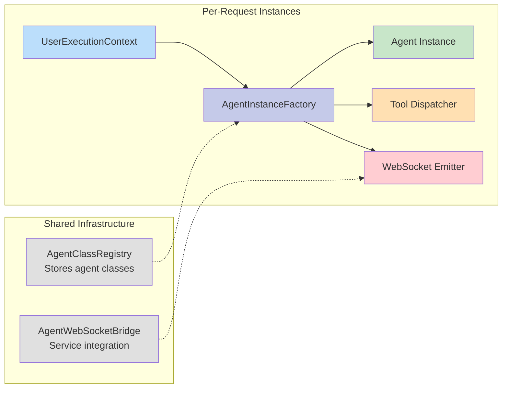
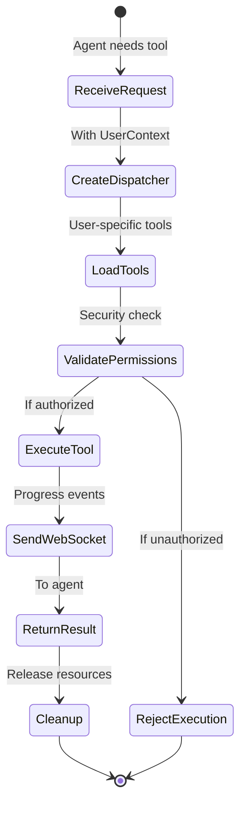
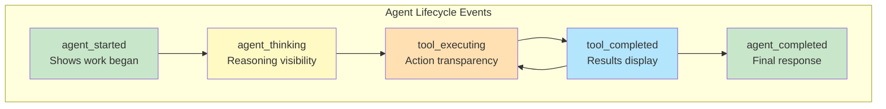
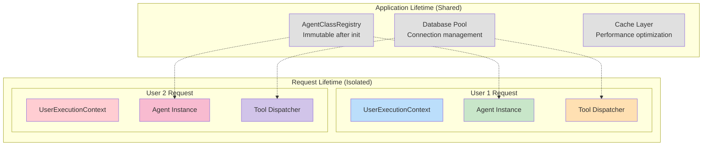
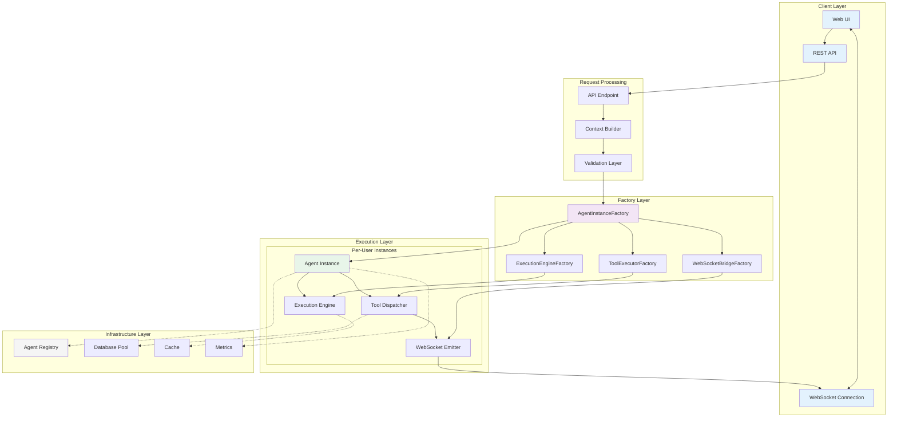
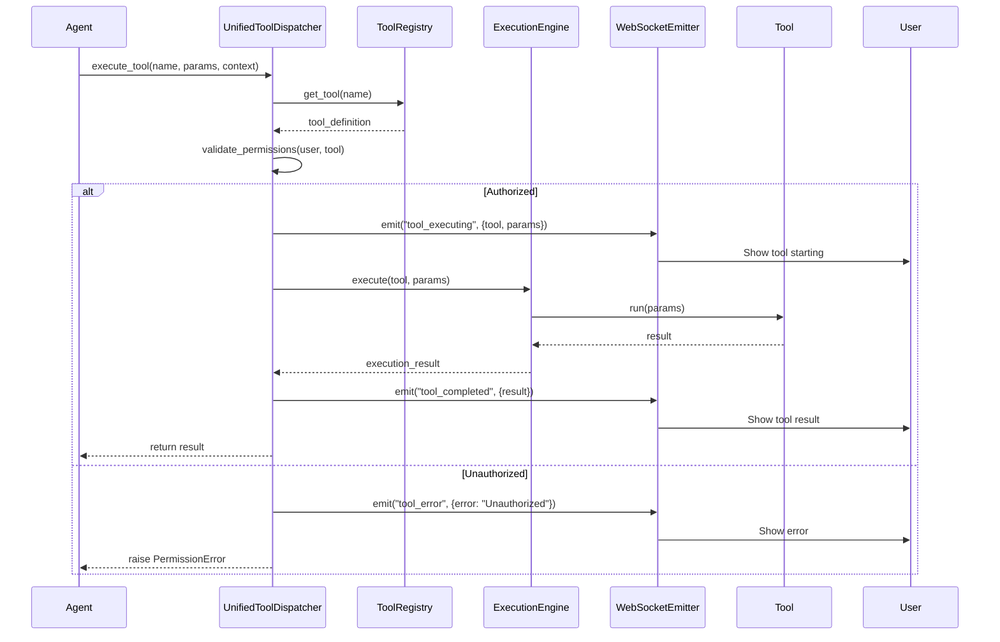
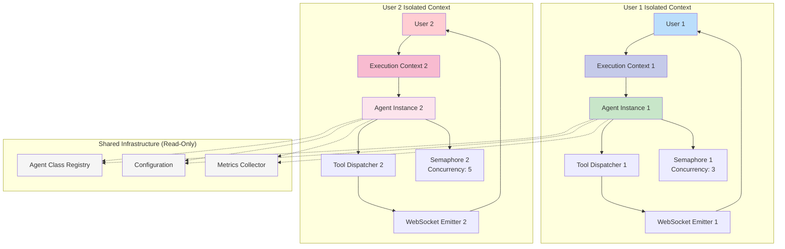
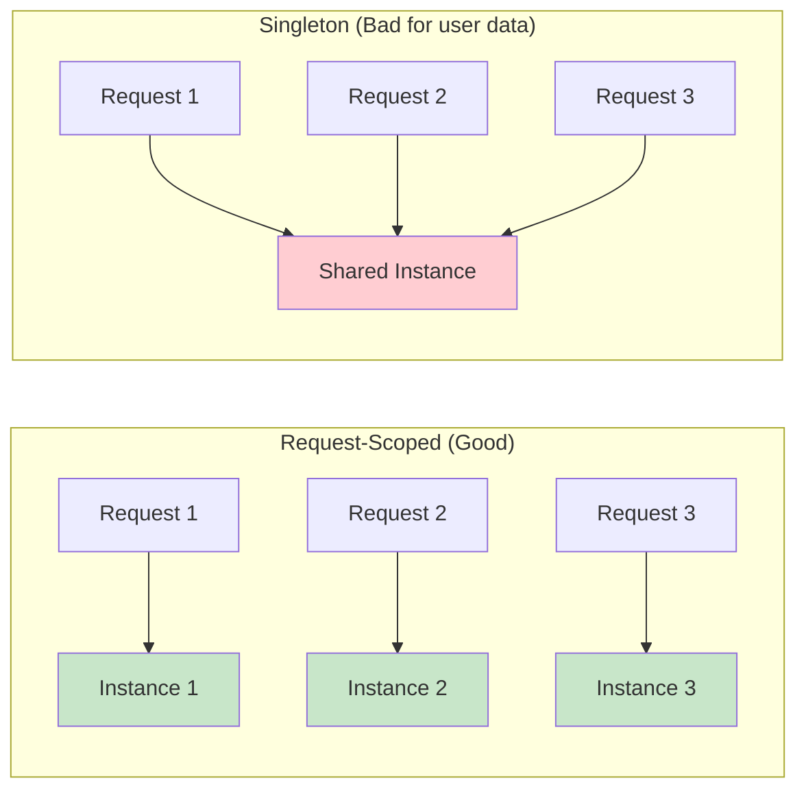

# Netra Apex Agent Architecture Disambiguation Guide

**Version**: 1.1.0  
**Last Updated**: 2025-01-05  
**Audience**: Engineering Teams, New Developers, Senior Architects

> **📣 NEW: UVS Architecture Update**  
> See **[UVS Triage Architecture Transition Guide](./UVS_TRIAGE_ARCHITECTURE_TRANSITION.md)** for the latest 2-agent model with intelligent data sufficiency validation and Data Intelligence Agent (formerly Data Helper) as PRIMARY agent.
>
> **⚠️ CRITICAL: Factory-Based User Isolation**  
> **MANDATORY READING**: The **[User Context Architecture](../reports/archived/USER_CONTEXT_ARCHITECTURE.md)** is the authoritative guide to our Factory-based isolation patterns. This document explains how we ensure complete user isolation, eliminate shared state, and enable reliable concurrent execution for 10+ users. **READ THIS FIRST** before making any changes to execution engines, WebSocket events, or tool dispatchers.

---

## 🎯 Purpose of This Guide

This guide disambiguates the complex agent workflow architecture in Netra Apex, clarifying the relationships between abstract classes, concrete implementations, per-user isolation, and infrastructure components. It provides multiple levels of explanation suitable for different backgrounds.

---

## 📚 Table of Contents

1. [Executive Summary (For Managers)](#executive-summary-for-managers)
2. [High-Level Overview (For New Team Members)](#high-level-overview-for-new-team-members)
3. [Detailed Architecture (For Engineers)](#detailed-architecture-for-engineers)
4. [Deep Dive (For Senior Architects)](#deep-dive-for-senior-architects)
5. [Visual Architecture Diagrams](#visual-architecture-diagrams)
6. [Common Confusion Points](#common-confusion-points)
7. [Quick Reference Guide](#quick-reference-guide)

---

## Executive Summary (For Managers)

### What Does Our Agent System Do?

The Netra Apex agent system is a **multi-user AI orchestration platform** that allows multiple users to interact with AI agents simultaneously without data leakage or performance degradation.

### Key Business Value

- **User Isolation**: Each user's data is completely isolated from others
- **Scalability**: Supports 10+ concurrent users reliably
- **Real-time Updates**: Users see agent progress via WebSocket events
- **Tool Integration**: Agents can use various tools (search, code execution, etc.)
- **Reliability**: Built-in circuit breakers and error handling

### Core Components in Plain English



---

## High-Level Overview (For New Team Members)

### The Big Picture

Think of our agent system like a **restaurant with multiple chefs**:

1. **Customer Order (User Request)**: A user asks for something
2. **Order Ticket (UserExecutionContext)**: Contains all details about what the user wants
3. **Kitchen Manager (AgentInstanceFactory)**: Assigns a dedicated chef for this order
4. **Chef (Agent Instance)**: Works on the user's specific request
5. **Cooking Tools (Tool Dispatcher)**: The chef uses various tools to complete the task
6. **Waiter Updates (WebSocket Events)**: Real-time updates to the customer
7. **Served Dish (Response)**: Final result delivered to the user

### Key Concepts Simplified

| Concept | Restaurant Analogy | Technical Purpose |
|---------|-------------------|-------------------|
| **UserExecutionContext** | Order ticket with table number | Carries user identity and request details |
| **Factory Pattern** | Kitchen assignment system | Creates isolated instances for each user |
| **Agent Instance** | Individual chef | Processes one user's request |
| **Tool Dispatcher** | Kitchen equipment manager | Manages tool access for agents |
| **WebSocket Events** | Waiter updates | Real-time progress notifications |
| **Session Isolation** | Separate kitchen stations | Prevents cross-contamination of user data |

### System Flow Diagram



---

## Detailed Architecture (For Engineers)

### Core Subsystems and Their Responsibilities

#### 1. User Isolation Layer

**UserExecutionContext** (`user_execution_context.py`)
- **What It Is**: Immutable container for all per-request state
- **Key Features**:
  - Frozen dataclass (cannot be modified after creation)
  - Contains: user_id, chat_id, run_id, WebSocket emitter
  - Child context creation for sub-operations
  - Validation on creation to prevent invalid states

```python
# Example usage
context = UserExecutionContext(
    user_id="user_123",
    chat_id="chat_456",
    run_id="run_789",
    websocket_emitter=user_emitter,
    database_session=session
)
```

#### 2. Factory Pattern Implementation

**AgentInstanceFactory** (`agent_instance_factory.py`)
- **Purpose**: Creates isolated agent instances per request
- **How It Works**:
  1. Receives UserExecutionContext
  2. Creates request-scoped dependencies
  3. Instantiates agent with isolated resources
  4. Returns fully configured agent instance



#### 3. Agent Hierarchy

**BaseAgent** (`base_agent.py`)
- **Role**: Foundation class for all agents
- **Provides**:
  - WebSocket integration via adapter pattern
  - Circuit breaker for reliability
  - Session isolation validation
  - Standard execution interface

**Concrete Agents** (e.g., `supervisor_consolidated.py`)
- **Built On**: BaseAgent
- **Add**: Business logic specific to their role
- **Examples**: SupervisorAgent, SearchAgent, CodeAgent

#### 4. Tool Execution Architecture

**UnifiedToolDispatcher** (`tool_dispatcher_unified.py`)
- **SSOT**: Single Source of Truth for all tool execution
- **Modes**:
  - Request-scoped (default): Isolated per user
  - Global (legacy): Shared singleton (deprecated)

**Tool Execution Flow**:



#### 5. WebSocket Event System

**Three-Layer Architecture**:

1. **IsolatedWebSocketEventEmitter** (Per-User)
   - User-specific event routing
   - Event buffering and ordering
   - Automatic cleanup on disconnect

2. **AgentWebSocketBridge** (Service Layer)
   - SSOT for WebSocket-Agent integration
   - Event type definitions
   - Service-wide event handling

3. **WebSocketBridgeAdapter** (Compatibility)
   - Adapts modern emitters to legacy interfaces
   - Ensures backward compatibility
   - Transparent event forwarding

**Critical Events for Business Value**:



#### 6. Workflow Execution Order (CRITICAL)

**⚠️ BUSINESS-CRITICAL**: Agents MUST execute in logical dependency order to produce valuable outputs.

**Correct Execution Order**:
```
1. Triage → Assess data availability and request type
2. Data → Collect and analyze metrics (MUST precede optimization!)  
3. Optimization → Generate strategies based on data insights
4. Actions → Create implementation plans from strategies
5. Reporting → Synthesize all results
```

**Why Order Matters**:
- **Wrong**: Optimization → Data = Strategies without metrics = Worthless
- **Right**: Data → Optimization = Data-driven strategies = Business value

**Implementation** (`workflow_orchestrator.py`):
```python
def _define_workflow_based_on_triage(self, triage_result):
    if data_sufficiency == "sufficient":
        return [
            self._create_pipeline_step("triage", dependencies=[]),
            self._create_pipeline_step("data", dependencies=["triage"]),  # MUST come before optimization
            self._create_pipeline_step("optimization", dependencies=["data"]),  # Requires data insights
            self._create_pipeline_step("actions", dependencies=["optimization"]),
            self._create_pipeline_step("reporting", dependencies=["actions"])
        ]
```

**Related Documentation**:
- [`SPEC/learnings/agent_execution_order_fix_20250904.xml`](../SPEC/learnings/agent_execution_order_fix_20250904.xml) - Critical fix details
- [`AGENT_EXECUTION_ORDER_REASONING.md`](../AGENT_EXECUTION_ORDER_REASONING.md) - Business impact analysis

---

## Deep Dive (For Senior Architects)

### Architectural Decisions and Rationale

#### 1. Factory-Based Isolation Pattern

**Problem**: Multiple users accessing the system concurrently led to data leakage and race conditions with singleton patterns.

**Solution**: Complete factory-based isolation ensuring zero shared state between requests.

**Implementation**:
```python
class AgentInstanceFactory:
    """Creates isolated agent instances with complete user isolation."""
    
    @classmethod
    def create_agent(
        cls,
        agent_class: Type[BaseAgent],
        context: UserExecutionContext,
        **kwargs
    ) -> BaseAgent:
        # Create request-scoped dependencies
        websocket_emitter = cls._create_user_emitter(context)
        tool_dispatcher = cls._create_tool_dispatcher(context)
        database_session = cls._create_session(context)
        
        # Instantiate with isolated resources
        return agent_class(
            context=context,
            websocket_emitter=websocket_emitter,
            tool_dispatcher=tool_dispatcher,
            database_session=database_session,
            **kwargs
        )
```

#### 2. Immutable Context Pattern

**Design Choice**: UserExecutionContext is frozen after creation.

**Benefits**:
- Thread-safe by default
- Prevents accidental state mutation
- Clear ownership and lifecycle
- Easier debugging and testing

**Trade-offs**:
- Must create child contexts for sub-operations
- Slightly more memory usage
- Requires upfront validation

#### 3. Adapter Pattern for Legacy Integration

**Challenge**: Existing code expects AgentWebSocketBridge interface.

**Solution**: WebSocketBridgeAdapter provides transparent adaptation.

```python
class WebSocketBridgeAdapter:
    """Adapts IsolatedWebSocketEventEmitter to AgentWebSocketBridge interface."""
    
    def __init__(self, emitter: IsolatedWebSocketEventEmitter):
        self._emitter = emitter
    
    async def emit_agent_event(self, event_type: str, data: dict):
        """Legacy interface maintained for backward compatibility."""
        await self._emitter.emit(event_type, data)
```

#### 4. Request-Scoped vs Infrastructure Separation

**Request-Scoped (Per-User)**:
- Lifetime: HTTP request duration
- Examples: UserExecutionContext, Agent instances, Tool dispatchers
- Memory: Released after request completion
- Concurrency: Unlimited (bound by resources)

**Infrastructure (Shared)**:
- Lifetime: Application lifetime
- Examples: AgentClassRegistry, Database pools, Cache layers
- Memory: Persistent
- Concurrency: Thread-safe, immutable after init



#### 5. Concurrency Control Mechanisms

**Per-User Semaphores**:
```python
class IsolatedExecutionEngine:
    def __init__(self, context: UserExecutionContext):
        # User-specific concurrency limit
        self._semaphore = asyncio.Semaphore(
            self._get_user_concurrency_limit(context.user_id)
        )
    
    async def execute(self, task):
        async with self._semaphore:  # User-isolated concurrency
            return await self._execute_task(task)
```

**Benefits**:
- Fair resource allocation per user
- Prevents single user from monopolizing system
- Graceful degradation under load
- Per-user rate limiting

---

## Visual Architecture Diagrams

### Complete System Architecture



### Tool Execution Detailed Flow



### User Isolation Boundaries



---

## Common Confusion Points

### 1. "Why so many factories?"

**Question**: Why do we need AgentInstanceFactory, ExecutionEngineFactory, WebSocketBridgeFactory, etc.?

**Answer**: Each factory creates a specific type of isolated resource. This separation ensures:
- Single Responsibility Principle (each factory does one thing)
- Easier testing (can mock individual factories)
- Better debugging (clear creation points)
- Flexible composition (can mix and match factories)

### 2. "What's the difference between Registry and Factory?"

| Aspect | Registry | Factory |
|--------|----------|---------|
| **Purpose** | Stores class definitions | Creates instances |
| **Lifetime** | Application lifetime | Per-request |
| **State** | Immutable after init | Creates new state |
| **Example** | AgentClassRegistry | AgentInstanceFactory |
| **Analogy** | Recipe book | Chef who cooks |

### 3. "When to use Context vs passing parameters?"

**Use Context when**:
- Data is needed throughout the execution chain
- Multiple components need the same user information
- You need to track request lifecycle
- Creating child operations

**Use Parameters when**:
- Data is specific to one function
- Configuration that rarely changes
- Internal implementation details
- Performance-critical paths

### 4. "What's a 'request-scoped' vs 'singleton'?"



### 5. "How do WebSocket events reach the right user?"

**The Journey of an Event**:

1. **Agent Action**: Agent performs an action
2. **Event Creation**: Agent creates event with data
3. **Context Routing**: UserExecutionContext contains user_id
4. **Emitter Selection**: IsolatedWebSocketEventEmitter for that user
5. **Connection Mapping**: WebSocketManager maps user_id to connection
6. **Delivery**: Event sent only to that user's WebSocket

```python
# Simplified flow
async def emit_to_user(context: UserExecutionContext, event: str, data: dict):
    emitter = context.websocket_emitter  # User-specific emitter
    await emitter.emit(event, data)      # Only goes to this user
```

---

## Quick Reference Guide

### Component Cheat Sheet

| Component | File | Purpose | Scope |
|-----------|------|---------|-------|
| **UserExecutionContext** | `user_execution_context.py` | Request state container | Per-request |
| **AgentInstanceFactory** | `agent_instance_factory.py` | Creates agent instances | Per-request |
| **AgentClassRegistry** | `agent_class_registry.py` | Stores agent classes | Application |
| **BaseAgent** | `base_agent.py` | Agent foundation | Abstract |
| **SupervisorAgent** | `supervisor_consolidated.py` | Orchestrates agents | Per-request |
| **UnifiedToolDispatcher** | `tool_dispatcher_unified.py` | Executes tools | Per-request |
| **IsolatedWebSocketEventEmitter** | `isolated_event_emitter.py` | User event routing | Per-user |
| **AgentWebSocketBridge** | `agent_websocket_bridge.py` | Service integration | Application |

### Key Patterns to Remember

1. **Always use factories for instances**: Never create agents directly
2. **Context flows through everything**: Pass UserExecutionContext everywhere
3. **WebSocket events are critical**: Always emit the 5 critical events
4. **Isolation is paramount**: No shared state between users
5. **Cleanup is automatic**: Resources released after request

### Testing Different Scenarios

```python
# Testing user isolation
async def test_user_isolation():
    # Create two different contexts
    context1 = create_context(user_id="user1")
    context2 = create_context(user_id="user2")
    
    # Create isolated agents
    agent1 = factory.create_agent(SearchAgent, context1)
    agent2 = factory.create_agent(SearchAgent, context2)
    
    # Execute concurrently - no interference
    results = await asyncio.gather(
        agent1.execute("search for Python"),
        agent2.execute("search for Java")
    )
    
    # Each gets their own results
    assert "Python" in results[0]
    assert "Java" in results[1]
```

### Debugging Tips

1. **Check context propagation**: Ensure UserExecutionContext is passed everywhere
2. **Verify WebSocket events**: Use browser DevTools to monitor events
3. **Monitor resource cleanup**: Check for memory leaks after requests
4. **Validate isolation**: Run concurrent user tests
5. **Review factory creation**: Ensure factories are used, not direct instantiation

---

## Summary

The Netra Apex agent architecture implements a sophisticated factory-based isolation pattern ensuring complete user separation in a multi-tenant AI orchestration platform. The key to understanding the system is recognizing the distinction between:

- **Infrastructure** (shared, immutable, application-scoped)
- **Instances** (isolated, mutable, request-scoped)
- **Contexts** (immutable, carries request state)
- **Factories** (creates isolated instances)

This architecture enables safe concurrent execution for 10+ users while maintaining data isolation, providing real-time updates, and ensuring system reliability through circuit breakers and proper resource management.

For implementation examples and migration guides, see:
- [GOLDEN_AGENT_INDEX.md](./GOLDEN_AGENT_INDEX.md)
- [USER_CONTEXT_ARCHITECTURE.md](../USER_CONTEXT_ARCHITECTURE.md)
- [TOOL_DISPATCHER_MIGRATION_GUIDE.md](../TOOL_DISPATCHER_MIGRATION_GUIDE.md)