# Agent Execution Flow Analysis - Current vs Ideal State

**Generated:** 2025-09-11  
**Mission:** Complete end-to-end analysis of user request → agent response flow  
**Business Impact:** Protects $500K+ ARR by ensuring reliable chat functionality (90% of platform value)

## Executive Summary

This analysis maps the complete agent execution flow from user chat request to AI response delivery, identifying all classes, types, and paths involved. The analysis reveals a sophisticated but complex system with several critical validation gaps and race conditions that could impact user experience.

**Key Findings:**
- **8 Critical Issues** requiring immediate attention
- **5 Silent Failure Points** where errors don't surface to users  
- **3 Race Conditions** affecting Cloud Run deployments
- **WebSocket Handshake Race Condition** causing 1011 errors and revenue loss

## Current State Architecture Flow

```mermaid
graph TB
    %% User Entry Points
    User[👤 User Chat Request]
    WSEndpoint[🔌 WebSocket Endpoint<br/>/ws]
    HTTPEndpoint[🌐 HTTP API Endpoint]
    
    %% Authentication Layer
    Auth[🔐 WebSocket Auth<br/>authenticate_websocket_ssot()]
    JWTValid[🎟️ JWT Validation<br/>TokenValidator]
    
    %% User Context Creation
    ContextFactory[🏭 UserExecutionContext<br/>Factory Creation]
    ContextValidation[✅ Context Validation<br/>11 validation methods]
    ContextManager[🎛️ UserContextManager<br/>Multi-tenant isolation]
    
    %% WebSocket Infrastructure  
    WSManager[📡 WebSocket Manager<br/>UnifiedWebSocketManager]
    WSBridge[🌉 Agent WebSocket Bridge<br/>create_agent_websocket_bridge()]
    MessageRouter[📮 Message Router<br/>Route to handlers]
    
    %% Agent Orchestration Layer
    WorkflowOrch[🎭 Workflow Orchestrator<br/>Adaptive workflow]
    UserExecEngine[⚙️ User Execution Engine<br/>Per-user isolation]
    AgentExecCore[🎯 Agent Execution Core<br/>Timeout & circuit breakers]
    AgentRegistry[📚 Agent Registry<br/>Factory-based isolation]
    
    %% Agent Types
    SupervisorAgent[🎩 Supervisor Agent<br/>Central orchestration]
    TriageAgent[🔍 Triage Agent<br/>Data sufficiency check]
    DataHelperAgent[📊 Data Helper Agent<br/>Data requirements]
    ReportingAgent[📋 Reporting Agent<br/>Final synthesis]
    
    %% Tool Integration
    ToolDispatcher[🔧 Unified Tool Dispatcher<br/>Tool execution + events]
    ToolExecution[⚡ Tool Execution<br/>With WebSocket events]
    
    %% State Persistence (3-Tier)
    Redis[(🔴 Redis<br/>Hot Cache)]
    PostgreSQL[(🐘 PostgreSQL<br/>Warm Storage)]
    ClickHouse[(⚡ ClickHouse<br/>Cold Analytics)]
    
    %% WebSocket Events (5 Critical)
    EventAgentStarted[📢 agent_started]
    EventAgentThinking[🧠 agent_thinking]  
    EventToolExecuting[🔧 tool_executing]
    EventToolCompleted[✅ tool_completed]
    EventAgentCompleted[🎉 agent_completed]
    
    %% Response Assembly
    ResponseAssembly[📝 Response Assembly<br/>Final result creation]
    WSResponse[📡 WebSocket Response<br/>Delivery to user]
    
    %% Error Boundaries and Issues
    ErrorBoundary1[❌ Auth Failures<br/>Generic HTTPException]
    ErrorBoundary2[❌ Context Validation Errors<br/>InvalidContextError]
    ErrorBoundary3[❌ Agent Execution Failures<br/>Circuit breaker + fallback]
    ErrorBoundary4[❌ WebSocket Event Failures<br/>⚠️ SILENT FAILURES]
    ErrorBoundary5[❌ Database Connection Issues<br/>⚠️ BROAD EXCEPTION HANDLING]
    
    %% Race Conditions
    RaceCondition1[⚡ WebSocket Handshake Race<br/>🚨 CRITICAL - Causes 1011 errors]
    RaceCondition2[⚡ UserContext Thread Safety<br/>🚨 High concurrency risk]
    RaceCondition3[⚡ DB Connection Pool Race<br/>🔴 Connection exhaustion]
    
    %% Flow Connections
    User --> WSEndpoint
    User --> HTTPEndpoint
    
    WSEndpoint --> Auth
    HTTPEndpoint --> Auth
    Auth --> JWTValid
    
    JWTValid --> ContextFactory
    ContextFactory --> ContextValidation
    ContextValidation --> ContextManager
    
    ContextManager --> WSManager
    WSManager --> WSBridge
    WSBridge --> MessageRouter
    
    MessageRouter --> WorkflowOrch
    WorkflowOrch --> UserExecEngine
    UserExecEngine --> AgentExecCore
    AgentExecCore --> AgentRegistry
    
    AgentRegistry --> SupervisorAgent
    SupervisorAgent --> TriageAgent
    TriageAgent --> DataHelperAgent
    DataHelperAgent --> ReportingAgent
    
    AgentExecCore --> ToolDispatcher
    ToolDispatcher --> ToolExecution
    
    ContextManager --> Redis
    ContextManager --> PostgreSQL
    AgentExecCore --> ClickHouse
    
    %% WebSocket Events Flow
    AgentExecCore --> EventAgentStarted
    AgentExecCore --> EventAgentThinking
    ToolDispatcher --> EventToolExecuting
    ToolDispatcher --> EventToolCompleted
    ReportingAgent --> EventAgentCompleted
    
    EventAgentCompleted --> ResponseAssembly
    ResponseAssembly --> WSResponse
    WSResponse --> User
    
    %% Error and Race Condition Connections (shown in red)
    Auth -.->|Fails| ErrorBoundary1
    ContextValidation -.->|Fails| ErrorBoundary2
    AgentExecCore -.->|Fails| ErrorBoundary3
    EventAgentStarted -.->|Fails| ErrorBoundary4
    EventAgentThinking -.->|Fails| ErrorBoundary4
    EventToolExecuting -.->|Fails| ErrorBoundary4
    EventToolCompleted -.->|Fails| ErrorBoundary4
    EventAgentCompleted -.->|Fails| ErrorBoundary4
    Redis -.->|Fails| ErrorBoundary5
    PostgreSQL -.->|Fails| ErrorBoundary5
    ClickHouse -.->|Fails| ErrorBoundary5
    
    WSEndpoint -.->|Race| RaceCondition1
    ContextManager -.->|Race| RaceCondition2
    PostgreSQL -.->|Race| RaceCondition3
    
    %% Styling
    classDef userFacing fill:#e1f5fe,stroke:#01579b,stroke-width:3px
    classDef infrastructure fill:#f3e5f5,stroke:#4a148c,stroke-width:2px
    classDef agent fill:#e8f5e8,stroke:#1b5e20,stroke-width:2px
    classDef database fill:#fff3e0,stroke:#e65100,stroke-width:2px
    classDef websocket fill:#fce4ec,stroke:#880e4f,stroke-width:2px
    classDef error fill:#ffebee,stroke:#c62828,stroke-width:3px
    classDef race fill:#fff8e1,stroke:#ff8f00,stroke-width:4px
    
    class User,WSResponse userFacing
    class ContextFactory,ContextManager,WSManager,WSBridge,MessageRouter infrastructure
    class SupervisorAgent,TriageAgent,DataHelperAgent,ReportingAgent,AgentRegistry agent
    class Redis,PostgreSQL,ClickHouse database  
    class EventAgentStarted,EventAgentThinking,EventToolExecuting,EventToolCompleted,EventAgentCompleted websocket
    class ErrorBoundary1,ErrorBoundary2,ErrorBoundary3,ErrorBoundary4,ErrorBoundary5 error
    class RaceCondition1,RaceCondition2,RaceCondition3 race
```

## Ideal State Architecture Flow

```mermaid
graph TB
    %% User Entry Points
    User[👤 User Chat Request]
    LoadBalancer[⚖️ Load Balancer<br/>Health check aware]
    WSEndpoint[🔌 WebSocket Endpoint<br/>/ws with handshake validation]
    
    %% Enhanced Authentication
    AuthPipeline[🔐 Authentication Pipeline<br/>Multi-stage validation]
    JWTValidation[🎟️ Enhanced JWT Validation<br/>Context-aware errors]
    SessionValidation[📋 Session Validation<br/>State verification]
    
    %% Robust Context Management
    ContextFactory[🏭 Enhanced UserExecutionContext<br/>Factory with validation]
    ContextValidation[✅ Comprehensive Validation<br/>15+ validation methods]
    ContextManager[🎛️ Thread-Safe ContextManager<br/>Complete isolation guarantee]
    ContextHealthCheck[💚 Context Health Monitor<br/>Continuous validation]
    
    %% Enhanced WebSocket Infrastructure
    WSHandshakeValidator[🤝 Handshake Validator<br/>Race condition prevention]
    WSManager[📡 Enhanced WebSocket Manager<br/>Connection health monitoring]
    WSEventConfirmation[✅ Event Delivery Confirmation<br/>Guaranteed delivery]
    MessageRouter[📮 Intelligent Message Router<br/>Load-aware routing]
    
    %% Robust Agent Orchestration
    WorkflowOrch[🎭 Enhanced Workflow Orchestrator<br/>Failure-aware adaptation]
    UserExecEngine[⚙️ Enhanced Execution Engine<br/>Resource-bounded execution]
    AgentExecCore[🎯 Hardened Execution Core<br/>Multi-tier circuit breakers]
    AgentRegistry[📚 Enhanced Agent Registry<br/>Health-aware routing]
    
    %% Enhanced Agent Types
    SupervisorAgent[🎩 Enhanced Supervisor<br/>Failure detection & recovery]
    TriageAgent[🔍 Smart Triage Agent<br/>Context-aware analysis]
    DataHelperAgent[📊 Enhanced Data Helper<br/>Validation & error handling]
    ReportingAgent[📋 Robust Reporting Agent<br/>Quality assurance checks]
    
    %% Enhanced Tool Integration
    ToolDispatcher[🔧 Enhanced Tool Dispatcher<br/>Execution confirmation]
    ToolValidator[✅ Tool Validation Engine<br/>Pre-execution validation]
    ToolExecutionMonitor[📊 Tool Execution Monitor<br/>Real-time health tracking]
    
    %% Enhanced State Persistence
    StatePersistenceManager[🗄️ State Persistence Manager<br/>3-tier with health checks]
    Redis[(🔴 Redis + Health Monitor<br/>Hot Cache)]
    PostgreSQL[(🐘 PostgreSQL + Circuit Breaker<br/>Warm Storage)]
    ClickHouse[(⚡ ClickHouse + Retry Logic<br/>Cold Analytics)]
    
    %% Enhanced WebSocket Events
    EventDeliveryManager[📢 Event Delivery Manager<br/>Guaranteed delivery system]
    EventAgentStarted[📢 agent_started ✓]
    EventAgentThinking[🧠 agent_thinking ✓]
    EventToolExecuting[🔧 tool_executing ✓]
    EventToolCompleted[✅ tool_completed ✓]
    EventAgentCompleted[🎉 agent_completed ✓]
    
    %% Enhanced Response Assembly
    ResponseValidator[✅ Response Validator<br/>Quality assurance]
    ResponseAssembly[📝 Enhanced Response Assembly<br/>Multi-format support]
    WSResponseConfirmation[📡 Confirmed WebSocket Response<br/>Delivery guarantee]
    
    %% Enhanced Error Boundaries
    ErrorOrchestrator[🚨 Error Orchestrator<br/>Centralized error management]
    AuthErrorHandler[❌ Specific Auth Errors<br/>Context-rich messages]
    ContextErrorHandler[❌ Context Error Handler<br/>Recovery strategies]
    AgentErrorHandler[❌ Agent Error Handler<br/>Graceful degradation]
    WSEventErrorHandler[❌ WebSocket Event Handler<br/>Event retry + fallback]
    DBErrorHandler[❌ Database Error Handler<br/>Specific exception handling]
    
    %% Enhanced Monitoring
    HealthDashboard[📊 Health Dashboard<br/>Real-time system health]
    PerformanceMonitor[⚡ Performance Monitor<br/>SLA tracking]
    SecurityAuditor[🔒 Security Auditor<br/>Compliance verification]
    
    %% Flow Connections
    User --> LoadBalancer
    LoadBalancer --> WSEndpoint
    WSEndpoint --> WSHandshakeValidator
    WSHandshakeValidator --> AuthPipeline
    
    AuthPipeline --> JWTValidation
    JWTValidation --> SessionValidation
    SessionValidation --> ContextFactory
    
    ContextFactory --> ContextValidation
    ContextValidation --> ContextManager
    ContextManager --> ContextHealthCheck
    
    ContextHealthCheck --> WSManager
    WSManager --> MessageRouter
    MessageRouter --> WorkflowOrch
    
    WorkflowOrch --> UserExecEngine
    UserExecEngine --> AgentExecCore
    AgentExecCore --> AgentRegistry
    
    AgentRegistry --> SupervisorAgent
    SupervisorAgent --> TriageAgent
    TriageAgent --> DataHelperAgent
    DataHelperAgent --> ReportingAgent
    
    AgentExecCore --> ToolDispatcher
    ToolDispatcher --> ToolValidator
    ToolValidator --> ToolExecutionMonitor
    
    ContextManager --> StatePersistenceManager
    StatePersistenceManager --> Redis
    StatePersistenceManager --> PostgreSQL
    StatePersistenceManager --> ClickHouse
    
    %% Enhanced WebSocket Events Flow
    AgentExecCore --> EventDeliveryManager
    EventDeliveryManager --> EventAgentStarted
    EventDeliveryManager --> EventAgentThinking
    ToolExecutionMonitor --> EventDeliveryManager
    EventDeliveryManager --> EventToolExecuting
    EventDeliveryManager --> EventToolCompleted
    ReportingAgent --> EventDeliveryManager
    EventDeliveryManager --> EventAgentCompleted
    
    EventDeliveryManager --> WSEventConfirmation
    WSEventConfirmation --> ResponseValidator
    ResponseValidator --> ResponseAssembly
    ResponseAssembly --> WSResponseConfirmation
    WSResponseConfirmation --> User
    
    %% Error Handling Connections
    AuthPipeline --> ErrorOrchestrator
    ErrorOrchestrator --> AuthErrorHandler
    ContextValidation --> ErrorOrchestrator
    ErrorOrchestrator --> ContextErrorHandler
    AgentExecCore --> ErrorOrchestrator
    ErrorOrchestrator --> AgentErrorHandler
    EventDeliveryManager --> ErrorOrchestrator
    ErrorOrchestrator --> WSEventErrorHandler
    StatePersistenceManager --> ErrorOrchestrator
    ErrorOrchestrator --> DBErrorHandler
    
    %% Monitoring Connections
    ContextHealthCheck --> HealthDashboard
    PerformanceMonitor --> HealthDashboard
    SecurityAuditor --> HealthDashboard
    WSManager --> PerformanceMonitor
    AgentExecCore --> PerformanceMonitor
    ContextManager --> SecurityAuditor
    
    %% Styling
    classDef userFacing fill:#e1f5fe,stroke:#01579b,stroke-width:3px
    classDef infrastructure fill:#f3e5f5,stroke:#4a148c,stroke-width:2px
    classDef agent fill:#e8f5e8,stroke:#1b5e20,stroke-width:2px
    classDef database fill:#fff3e0,stroke:#e65100,stroke-width:2px
    classDef websocket fill:#fce4ec,stroke:#880e4f,stroke-width:2px
    classDef enhanced fill:#e0f2f1,stroke:#00695c,stroke-width:3px
    classDef monitoring fill:#f1f8e9,stroke:#33691e,stroke-width:2px
    classDef errorHandling fill:#fff3e0,stroke:#ef6c00,stroke-width:2px
    
    class User,WSResponseConfirmation userFacing
    class ContextFactory,ContextManager,WSManager,MessageRouter,LoadBalancer infrastructure
    class SupervisorAgent,TriageAgent,DataHelperAgent,ReportingAgent,AgentRegistry agent
    class Redis,PostgreSQL,ClickHouse,StatePersistenceManager database
    class EventAgentStarted,EventAgentThinking,EventToolExecuting,EventToolCompleted,EventAgentCompleted,WSEventConfirmation websocket
    class WSHandshakeValidator,ContextHealthCheck,EventDeliveryManager,ResponseValidator,ToolValidator,ToolExecutionMonitor enhanced
    class HealthDashboard,PerformanceMonitor,SecurityAuditor monitoring
    class ErrorOrchestrator,AuthErrorHandler,ContextErrorHandler,AgentErrorHandler,WSEventErrorHandler,DBErrorHandler errorHandling
```



## Key Differences: Current vs Ideal State

### 🚨 Critical Issues Fixed in Ideal State

1. **WebSocket Handshake Race Condition** 
   - **Current:** Direct WebSocket connection causes 1011 errors in Cloud Run
   - **Ideal:** WSHandshakeValidator prevents race conditions with proper validation

2. **Silent WebSocket Event Failures**
   - **Current:** Event delivery failures logged but not escalated
   - **Ideal:** EventDeliveryManager with guaranteed delivery and confirmation

3. **Broad Database Exception Handling**
   - **Current:** Generic `except Exception` throughout database layer
   - **Ideal:** DBErrorHandler with specific exception types and recovery

4. **Thread Safety Gaps in UserContextManager**
   - **Current:** Complex operations may have race conditions
   - **Ideal:** Enhanced thread-safe operations with comprehensive locking

### 🔧 Enhanced Components in Ideal State

1. **Authentication Pipeline**
   - Multi-stage validation with context-aware errors
   - Session state verification
   - Enhanced JWT validation with better error context

2. **Event Delivery Guarantee**
   - Confirmation system for all 5 critical WebSocket events
   - Retry logic with exponential backoff  
   - Fallback notification mechanisms

3. **Enhanced Error Orchestration**
   - Centralized error management with specific handlers
   - Context-rich error messages for debugging
   - Graceful degradation strategies

4. **Comprehensive Health Monitoring**
   - Real-time system health dashboard
   - Performance SLA tracking
   - Security compliance auditing

## Business Impact Analysis

### Current State Risks
- **$500K+ ARR at Risk:** WebSocket race conditions affecting user onboarding
- **User Experience Degradation:** Silent failures reducing AI response reliability
- **Operational Burden:** Broad exception handling making debugging difficult
- **Enterprise Compliance Risk:** Insufficient audit trails and error context

### Ideal State Benefits
- **Revenue Protection:** Eliminated WebSocket race conditions
- **Enhanced User Experience:** Guaranteed event delivery for real-time progress
- **Operational Efficiency:** Specific error handling enabling faster issue resolution
- **Enterprise Ready:** Comprehensive audit trails and compliance monitoring

## Implementation Priority

### Phase 1: Critical Fixes (Immediate - 1-2 days)
1. WebSocket handshake validation to prevent race conditions
2. Event delivery confirmation system
3. Thread-safe UserContextManager enhancements  
4. Specific database exception handling

### Phase 2: Enhanced Infrastructure (1-2 weeks)
1. Error orchestration system
2. Tool execution validation and monitoring
3. Enhanced authentication pipeline
4. State persistence health monitoring

### Phase 3: Comprehensive Monitoring (2-4 weeks)
1. Health dashboard implementation
2. Performance SLA tracking
3. Security audit framework
4. Advanced error recovery patterns

This analysis provides the foundation for systematic improvements to ensure reliable delivery of substantive AI responses through the chat interface, protecting the 90% of platform value delivered through user interactions.