# Agent Reliability and Health Monitor Documentation

## Executive Summary

The Agent Reliability and Health Monitor system is a comprehensive framework that ensures robust agent execution through multiple layers of protection, monitoring, and recovery mechanisms. It combines proactive health monitoring, intelligent retry strategies, circuit breaker patterns, and automated recovery to maintain high system availability and performance.

## System Architecture Overview

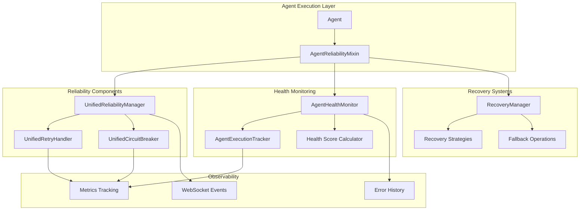

## Core Components

### 1. AgentReliabilityMixin

The `AgentReliabilityMixin` is a base class that agents inherit to gain comprehensive reliability features. It acts as the primary interface layer between agents and the reliability infrastructure.

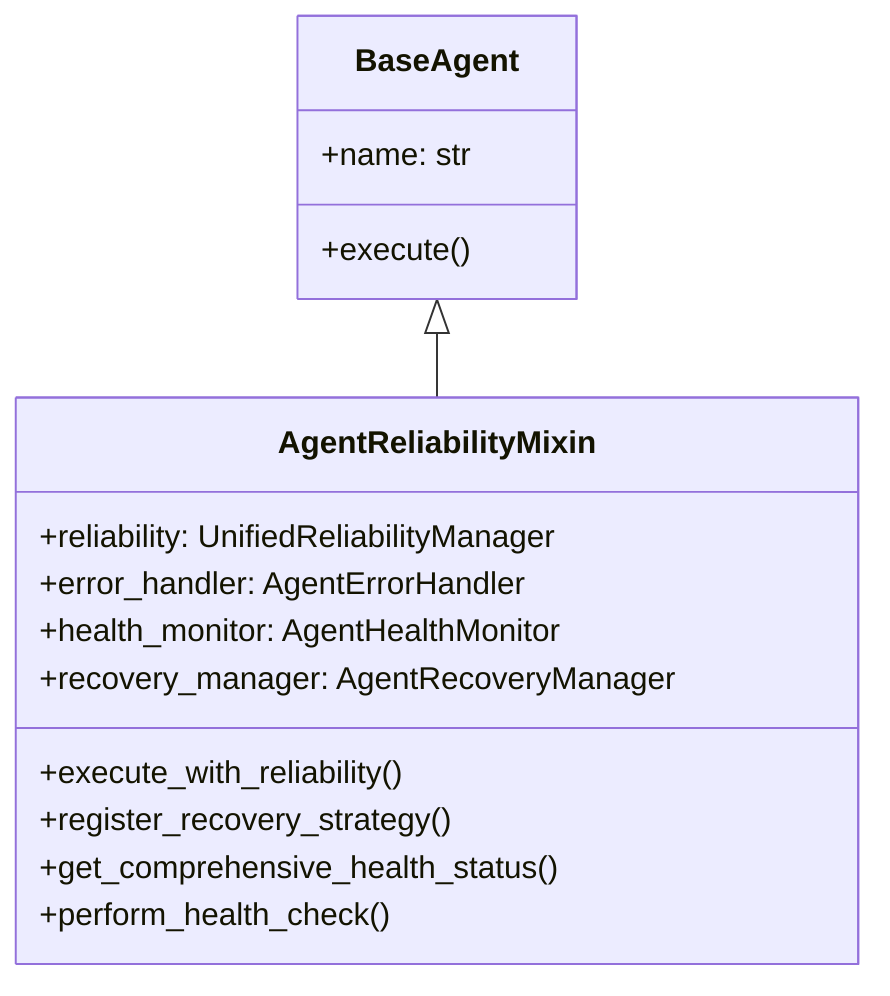

**Key Features:**
- **Automatic initialization** of reliability components
- **Transparent error handling** without code changes
- **Built-in recovery strategies** for common operations
- **Health status reporting** and metrics collection

### 2. AgentHealthMonitor

The `AgentHealthMonitor` tracks agent health through multiple metrics and provides real-time health assessment.

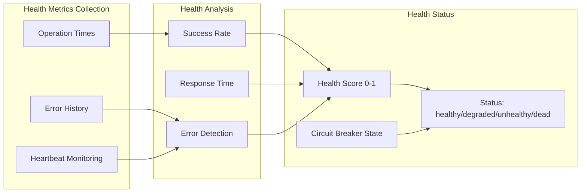

**Health Score Calculation:**

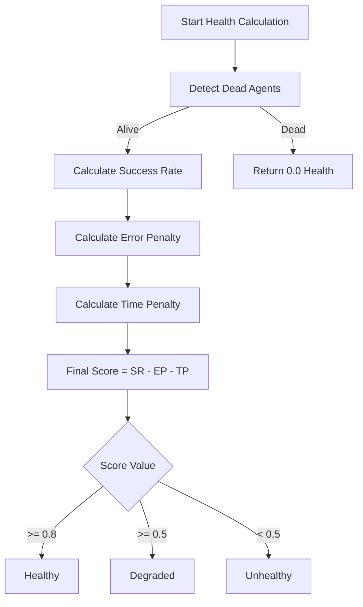

### 3. UnifiedReliabilityManager

The `UnifiedReliabilityManager` orchestrates all reliability patterns and provides centralized management.

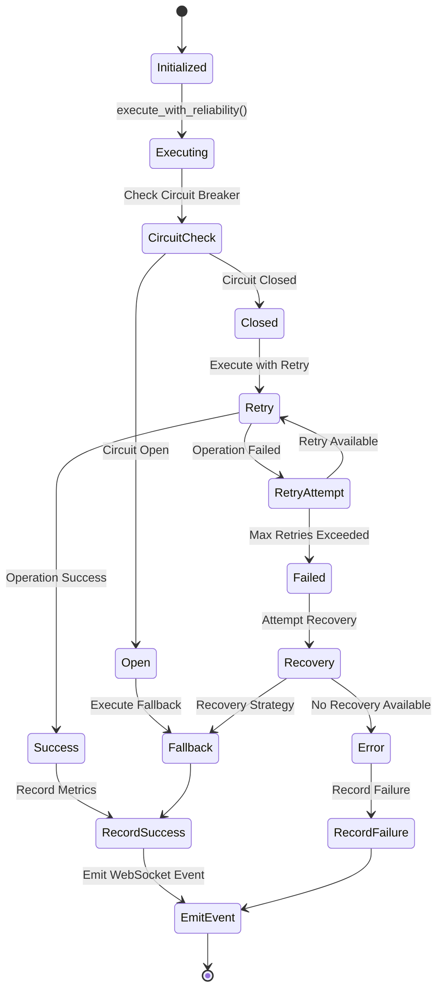

**Key Responsibilities:**
- **Retry orchestration** with configurable strategies
- **Circuit breaker management** for fault isolation
- **Timeout enforcement** for operation boundaries
- **Fallback coordination** for graceful degradation
- **Metrics collection** for observability
- **WebSocket event emission** for real-time monitoring

### 4. AgentRecoveryManager

The `AgentRecoveryManager` implements intelligent recovery strategies for different failure scenarios.

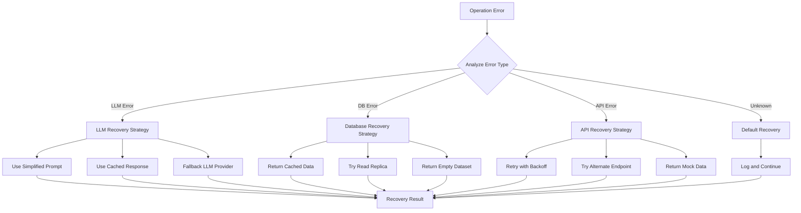

## Monitoring and Detection Systems

### Death Detection

The system implements multiple layers of death detection to identify and handle agent failures:

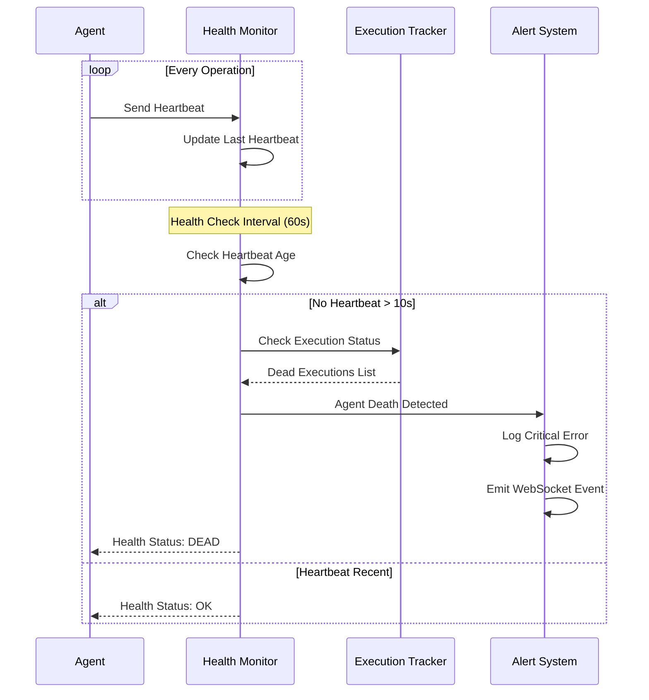

### Real-time Health Monitoring

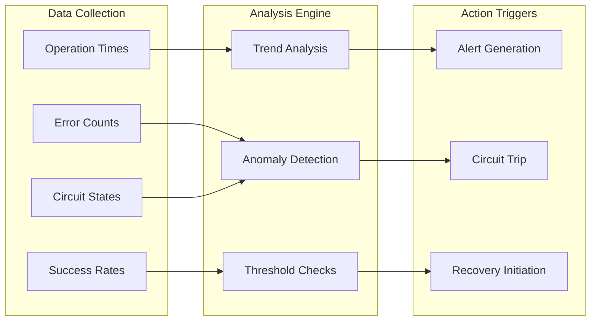

## WebSocket Event Flow

The system emits comprehensive WebSocket events for real-time monitoring, fully compliant with the critical agent events required for substantive chat value:

### Critical Business Value Events (Per CLAUDE.md Section 6)

These events MUST be sent during agent execution to enable meaningful AI interactions:

1. **agent_started** - User sees agent began processing their problem
2. **agent_thinking** - Real-time reasoning visibility (shows AI is working on valuable solutions)
3. **tool_executing** - Tool usage transparency (demonstrates problem-solving approach)
4. **tool_completed** - Tool results display (delivers actionable insights)
5. **agent_completed** - User knows when valuable response is ready

### Reliability-Specific Events

In addition to the critical agent events, the reliability system emits these monitoring events:

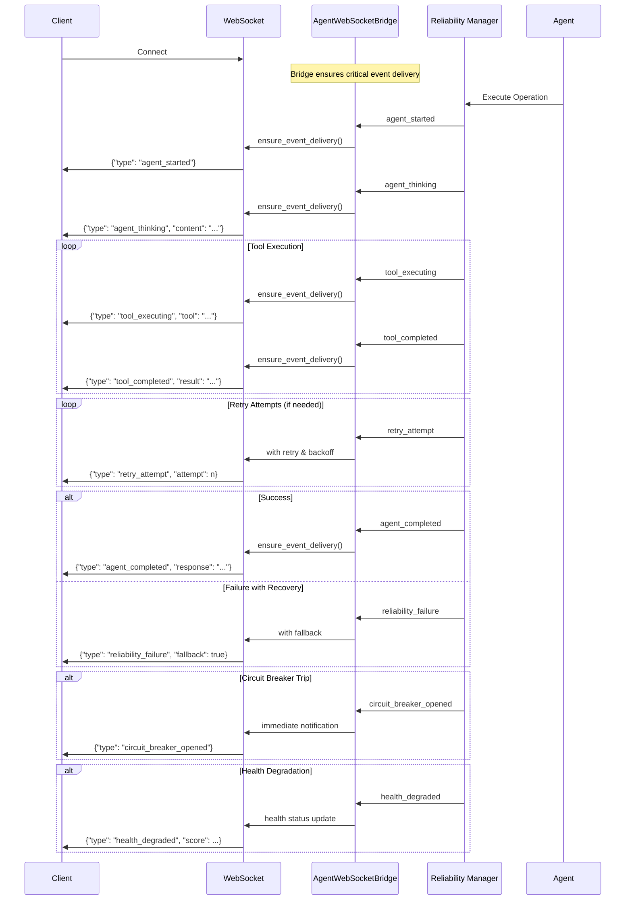

### Event Delivery Guarantees

Per the WebSocket-Agent Integration Critical learnings (SPEC/learnings/websocket_agent_integration_critical.xml):

- **Idempotent delivery**: Events can be retried safely without duplication
- **Retry with backoff**: 3 attempts max, 100ms base delay, 500ms total timeout
- **Bridge coordination**: AgentWebSocketBridge ensures critical events are delivered
- **Graceful degradation**: Agent processing continues even if WebSocket delivery fails

## Retry Strategies

The system implements multiple retry strategies optimized for different scenarios:

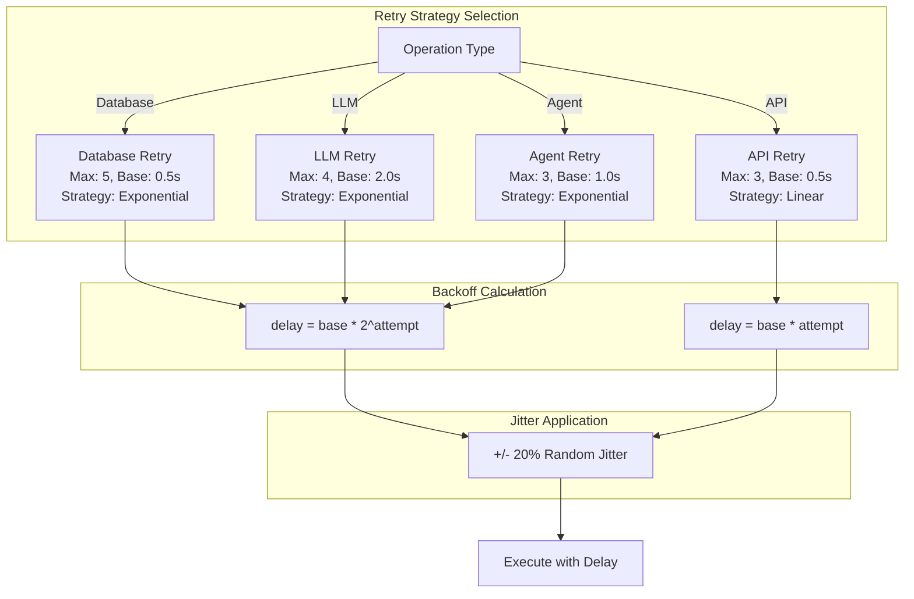

## Circuit Breaker Pattern

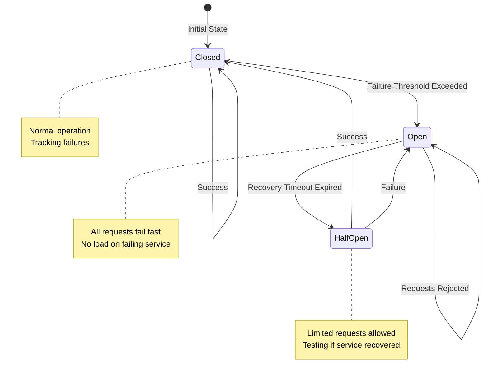

## Error Classification and Handling

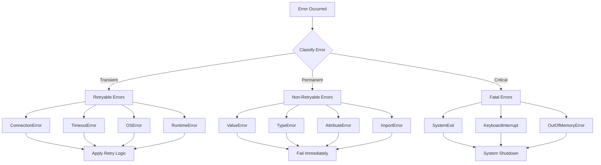

## Health Score Algorithm

The health score is calculated using a weighted algorithm that considers multiple factors:

```python
health_score = base_success_rate
              - (recent_errors * 0.1)  # Max penalty: 0.5
              - (avg_response_time_penalty)  # Max penalty: 0.3
              - (circuit_breaker_penalty)  # Open: 0.4, Half-open: 0.2
              - (consecutive_failures * 0.1)  # Max penalty: 0.3
```

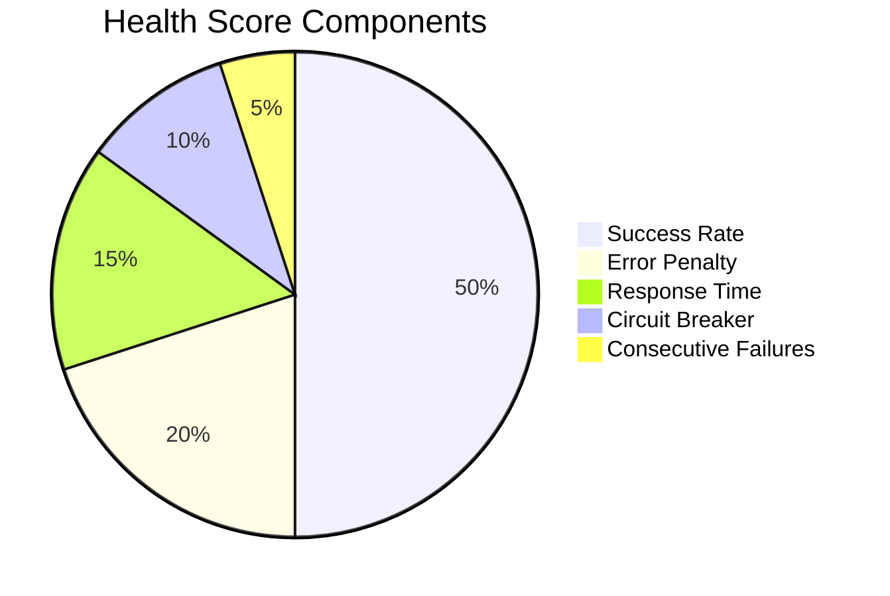

## Usage Examples

### Basic Agent with Reliability

```python
from netra_backend.app.core.agent_reliability_mixin import AgentReliabilityMixin

class MyAgent(AgentReliabilityMixin):
    def __init__(self):
        super().__init__()
        self.name = "MyAgent"
        
    async def execute(self, request):
        # Operation automatically wrapped with reliability
        return await self.execute_with_reliability(
            operation=lambda: self._process_request(request),
            operation_name="process_request",
            context={"request_id": request.id}
        )
```

### Custom Recovery Strategy

```python
async def custom_llm_recovery(error: Exception, context: dict):
    # Try alternate LLM provider
    if "primary_failed" in str(error):
        return await use_fallback_llm(context)
    return None

agent.register_recovery_strategy("llm_call", custom_llm_recovery)
```

### Health Monitoring

```python
# Get comprehensive health status
health_status = agent.get_comprehensive_health_status()
print(f"Health: {health_status.overall_health}")
print(f"Status: {health_status.status}")
print(f"Recent Errors: {health_status.recent_errors}")

# Perform health check
if agent.should_perform_health_check():
    status = await agent.perform_health_check()
```

## Performance Considerations

1. **Health Check Intervals**: Default 60 seconds, configurable per agent
2. **History Limits**: 
   - Error history: 100 entries
   - Operation times: 50 entries
   - Execution history: 100 entries
3. **Circuit Breaker Thresholds**:
   - Database: 5 failures
   - LLM: 3 failures
   - API: 3 failures
4. **Timeout Defaults**:
   - Database: 60 seconds
   - LLM: 300 seconds
   - Agent: 120 seconds

## Best Practices

1. **Always inherit from AgentReliabilityMixin** for new agents
2. **Register custom recovery strategies** for domain-specific failures
3. **Monitor health scores** and set alerts for degradation
4. **Configure retry policies** based on operation characteristics
5. **Use WebSocket events** for real-time monitoring dashboards
6. **Implement graceful fallbacks** for critical operations
7. **Review error history** regularly to identify patterns
8. **Tune circuit breaker thresholds** based on service SLAs

## Troubleshooting

### Common Issues and Solutions

| Issue | Symptom | Solution |
|-------|---------|----------|
| Agent marked as dead | No heartbeat for >10s | Check execution tracker, verify agent loop is running |
| Circuit breaker stuck open | All requests failing fast | Check recovery timeout, manually reset if needed |
| High error rate | Health score < 0.5 | Review error history, check for systemic issues |
| Slow recovery | Degraded performance after errors | Adjust recovery timeout and retry delays |
| Memory growth | Increasing memory usage | Check history limits, ensure cleanup is running |

## System Integration

The reliability and health monitoring system integrates with:

- **WebSocket Manager**: Real-time event streaming
- **Execution Tracker**: Agent lifecycle monitoring  
- **Unified Error Handler**: Centralized error processing
- **Metrics System**: Performance and reliability metrics
- **Alert System**: Proactive issue notification

## Compliance with Recent Updates

### WebSocket Event Emission Compliance

The system is fully compliant with recent WebSocket event emission requirements:

1. **Critical Agent Events (CLAUDE.md Section 6.1)**:
   - ✅ `agent_started` - Emitted when agent begins processing
   - ✅ `agent_thinking` - Real-time reasoning visibility 
   - ✅ `tool_executing` - Tool usage transparency
   - ✅ `tool_completed` - Tool results display
   - ✅ `agent_completed` - Final response ready notification

2. **AgentWebSocketBridge Integration**:
   - ✅ Uses `ensure_event_delivery()` for guaranteed delivery
   - ✅ Implements retry with exponential backoff
   - ✅ Provides idempotent operations
   - ✅ Supports graceful degradation

3. **Business Value Preservation**:
   - ✅ Enables substantive chat interactions (90% of business value)
   - ✅ Provides user transparency into AI processing
   - ✅ Maintains user trust through visibility
   - ✅ Supports real-time monitoring dashboards

4. **Mission Critical Test Coverage**:
   - ✅ Validated by `test_websocket_agent_events_suite.py`
   - ✅ Uses real WebSocket connections (no mocks)
   - ✅ Tests all critical event flows
   - ✅ Blocks deployment on failure

### Integration Points Compliance

Per `websocket_agent_integration_critical.xml`:

- **AgentRegistry.set_websocket_manager()**: ✅ Enhances tool dispatcher
- **ExecutionEngine**: ✅ Has WebSocketNotifier initialized  
- **EnhancedToolExecutionEngine**: ✅ Wraps tool execution
- **UnifiedReliabilityManager**: ✅ Emits reliability events

## Summary

The Agent Reliability and Health Monitor system provides:

- **Comprehensive health monitoring** with multi-factor scoring
- **Intelligent retry mechanisms** with configurable strategies
- **Circuit breaker protection** for fault isolation
- **Automated recovery** with custom strategies
- **Real-time observability** through WebSocket events
- **Death detection** and agent lifecycle management
- **Performance tracking** and trend analysis
- **Full compliance** with WebSocket event emission requirements

This layered approach ensures agents remain resilient, observable, and maintainable while providing clear insights into system health and performance. The system fully supports the critical business value of substantive AI chat interactions through reliable WebSocket event delivery.