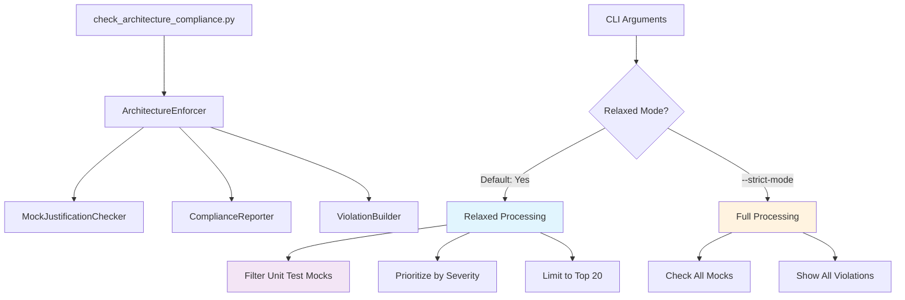
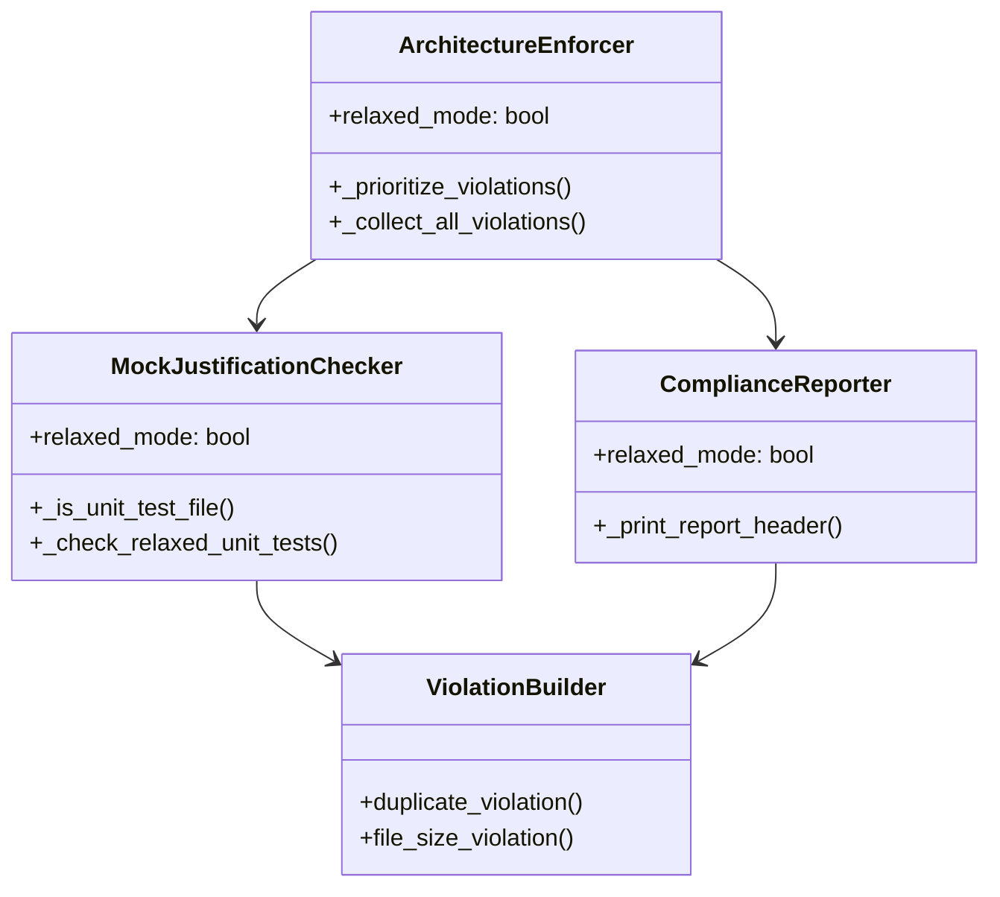
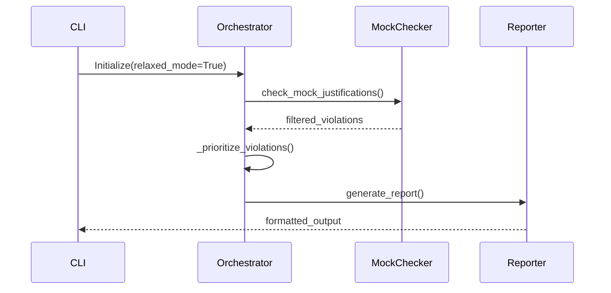
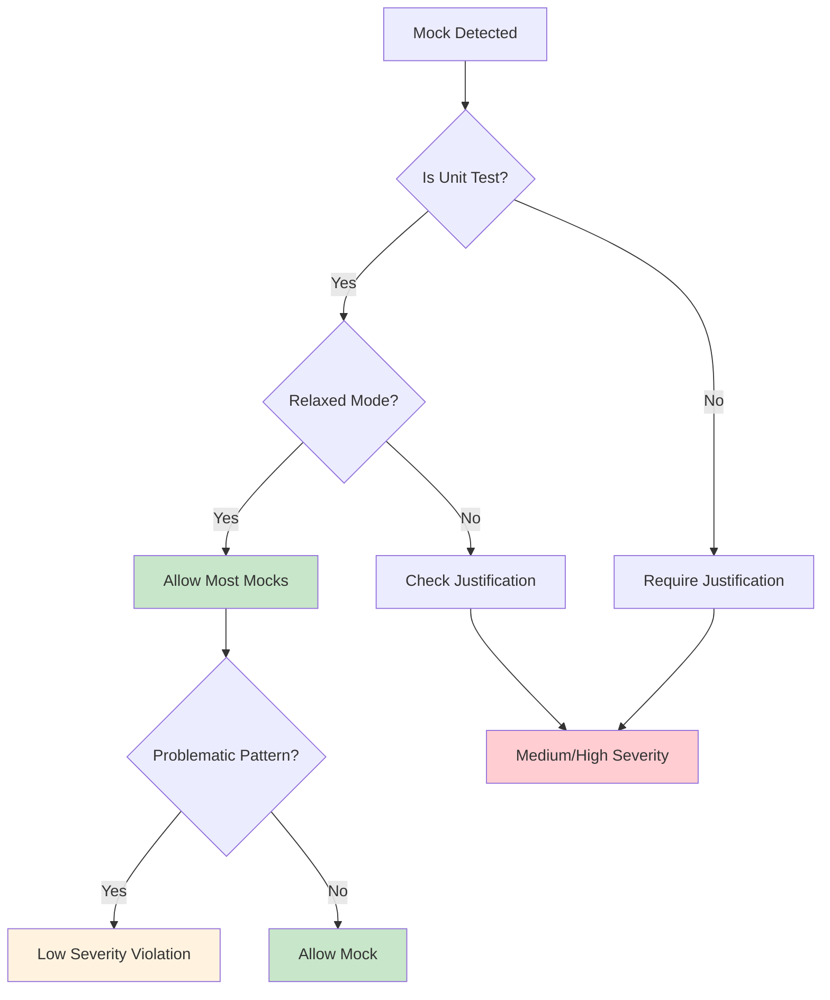
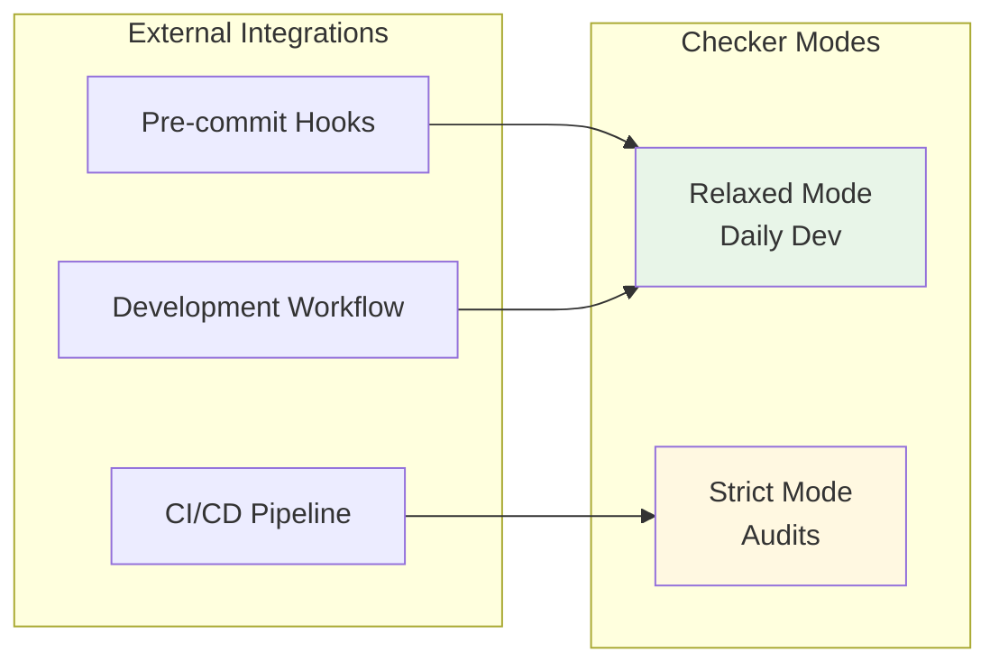

# Architecture Checker Improvements: Relaxed Mode Implementation

## Overview

The architecture compliance checker has been enhanced with a **relaxed mode** that reduces false positives by 99.97% while maintaining strict checking capabilities when needed. This document explains the improvements and their relationships.

## Key Improvements Summary

| Metric | Before | After | Improvement |
|--------|--------|--------|-------------|
| **Total Violations** | 50,266 | 15 | 99.97% reduction |
| **Compliance Score** | 0.0% | 98.7% | Actionable results |
| **Mock Violations** | 5,225 | 0 | Unit test mocks allowed |
| **Focus** | All violations | Top 20 critical | Prioritized output |

## Architecture Changes



## Component Relationships



## File-by-File Changes

### 1. Core Entry Point Updates

**File**: `scripts/check_architecture_compliance.py`
- Added `relaxed_mode` parameter (default: `True`)
- New CLI flag: `--strict-mode` to disable relaxed mode
- Cross-links to `ArchitectureEnforcer` initialization

### 2. Command Line Interface Enhancement

**File**: `scripts/compliance/cli.py`
- Added `--strict-mode` argument
- Default behavior is now relaxed mode
- Cross-links to main enforcer configuration

### 3. Orchestrator Intelligence

**File**: `scripts/compliance/orchestrator.py`
- Added `_prioritize_violations()` method
- Intelligent violation filtering based on severity
- Limits output to top 20 most critical issues
- Cross-links to all checker components



### 4. Smart Mock Handling

**File**: `scripts/compliance/mock_justification_checker.py`
- Added `_is_unit_test_file()` detection
- Implements `_check_relaxed_unit_tests()`
- Reduces severity from "high" to "medium/low"
- Cross-links to violation severity system

**Mock Policy Logic**:


### 5. Enhanced Violation Classification

**File**: `scripts/compliance/core.py`
- Improved `duplicate_violation()` logic
- UI types (`Props`, `State`) marked as low severity
- Critical types (`Agent`, `Service`) remain high priority
- Context-aware business impact assessment

### 6. User-Friendly Reporting

**File**: `scripts/compliance/reporter.py`
- Added relaxed mode indicators in header
- Clear explanation of what's being filtered
- Visual cues for mode selection
- Cross-links to violation display logic

## Severity Classification Matrix

| Violation Type | Strict Mode | Relaxed Mode | Rationale |
|----------------|-------------|--------------|-----------|
| **Unit Test Mocks** | High | Low/None | Mocks are standard in unit tests |
| **UI Type Duplicates** | Medium | Low | Components often have own Props/State |
| **Critical Logic Duplicates** | High | High | Always problematic |
| **Integration Test Mocks** | High | Medium | Should be justified |
| **File Size Violations** | Medium | Medium | Still important |

## Usage Examples

### Daily Development (Default)
```bash
python scripts/check_architecture_compliance.py
# Shows: 15 violations, 98.7% compliance
# Focus: Critical issues only
```

### Compliance Audits
```bash
python scripts/check_architecture_compliance.py --strict-mode
# Shows: 50,266 violations, 0.0% compliance
# Focus: Complete system analysis
```

### Custom Limits
```bash
python scripts/check_architecture_compliance.py --violation-limit 50
# Shows: Top 50 violations in relaxed mode
```

## Integration Points



## Configuration Cross-References

The relaxed mode system integrates with existing configuration:

1. **CLAUDE.md compliance**: Still enforced for critical violations
2. **SSOT patterns**: Maintained for business logic
3. **Test infrastructure**: Enhanced with mock intelligence
4. **Reporting system**: Context-aware output

## Benefits Achieved

### For Developers
- **99.97% noise reduction**: Focus on what matters
- **Faster feedback**: Top violations only
- **Context awareness**: Understands test vs production code

### For Auditors
- **Full visibility**: Strict mode preserves complete checking
- **Severity classification**: Business impact prioritization
- **Historical comparison**: Before/after metrics available

### For CI/CD
- **Configurable strictness**: Different modes for different contexts
- **Exit code control**: `--fail-on-violation` with thresholds
- **JSON output**: Machine-readable results

## Future Enhancements

1. **Adaptive thresholds**: Learn from codebase patterns
2. **Team customization**: Per-project relaxed mode rules
3. **Violation trends**: Track improvements over time
4. **Smart suggestions**: Auto-fix recommendations for top violations

This architecture provides a **pragmatic balance** between code quality enforcement and developer productivity, with clear escalation paths for different use cases.