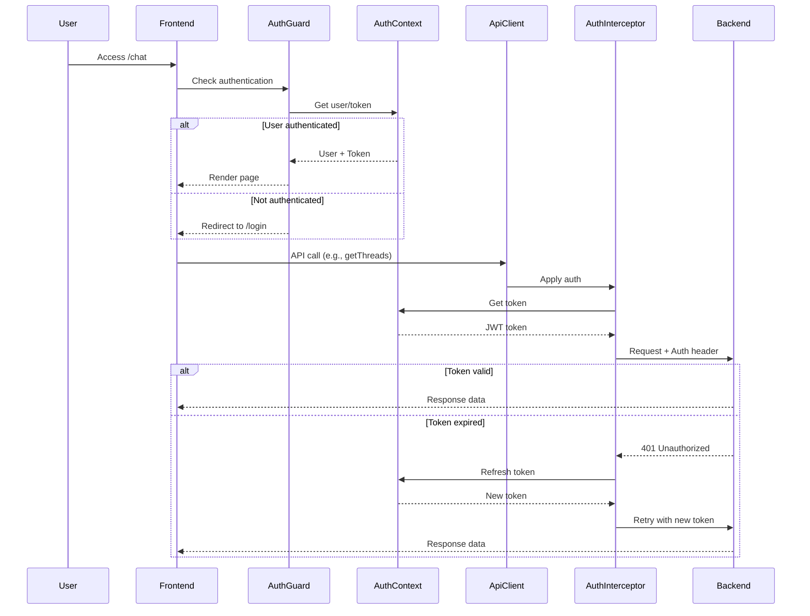

# Authentication Flow Documentation

## Overview
This document describes how authentication works end-to-end in the Netra system, from frontend pages through API calls to backend services.

## Authentication Architecture

### 1. Frontend Authentication Flow

#### Page-Level Protection
All protected routes now use a centralized `AuthGuard` component (SSOT principle):
```tsx
// frontend/components/AuthGuard.tsx
<AuthGuard>
  <ProtectedComponent />
</AuthGuard>
```

Protected routes include:
- `/chat` and `/chat/[threadId]` - Thread management
- `/admin` - Admin panel
- `/corpus` - Corpus management
- `/ingestion` - Data ingestion
- `/enterprise-demo` - Enterprise features
- `/synthetic-data-generation` - Data generation tools

#### Authentication Context
The `AuthProvider` (frontend/auth/context.tsx) manages:
- Token storage in localStorage (`jwt_token`)
- Automatic token refresh (every 2 minutes check)
- User state management
- Development mode auto-login

### 2. API Call Authentication

#### Auth Interceptor Pattern
All API calls go through the `AuthInterceptor` (frontend/lib/auth-interceptor.ts):

```typescript
// Automatic token injection
authenticatedFetch(url, options) {
  // 1. Get token from auth service
  const token = authService.getToken();
  
  // 2. Add Authorization header
  headers['Authorization'] = `Bearer ${token}`;
  
  // 3. Handle 401 responses with retry
  if (response.status === 401) {
    // Attempt token refresh
    const newToken = await refreshToken();
    // Retry with new token
  }
}
```

#### API Client Wrapper
The `apiClient` (frontend/services/apiClientWrapper.ts) provides:
- Centralized request handling
- Automatic auth header injection via interceptor
- Retry logic with exponential backoff
- Connection health checking

### 3. Thread Service Authentication

#### Thread API Calls
Thread operations automatically include authentication:

```typescript
// frontend/services/threadService.ts
class ThreadService {
  static async createThread() {
    // apiClient automatically adds auth headers
    return apiClient.post('/api/threads', data);
  }
  
  static async getThreads() {
    // Auth headers included automatically
    return apiClient.get('/api/threads');
  }
}
```

#### Frontend API Proxy
The Next.js API routes (frontend/app/api/threads/route.ts) add additional headers:
- `Authorization`: Bearer token from client
- `X-API-Key`: Backend API key for service auth
- `X-Service-Name`: Service identification
- `X-Service-Account`: GCP service account

### 4. WebSocket Authentication

#### Secure WebSocket Connection
WebSocket connections use JWT via subprotocol (frontend/services/webSocketService.ts):

```typescript
// JWT passed via Sec-WebSocket-Protocol header
const protocols = [`jwt.${encodedToken}`, 'v1'];
new WebSocket(url, protocols);
```

Features:
- Token refresh during active connections
- Automatic reconnection with fresh tokens
- Development mode support (no auth required)

## Authentication Flow Diagram



## Key Learnings

### 1. SSOT (Single Source of Truth) Principle
**Problem**: Multiple pages had duplicate auth checking logic
**Solution**: Created centralized `AuthGuard` component used by all protected routes

### 2. Token Management
**Problem**: Token expiry during long sessions
**Solution**: 
- Automatic token refresh every 2 minutes
- WebSocket token refresh during active connections
- Auth interceptor handles 401s with automatic retry

### 3. Development Mode Support
**Problem**: Complex auth setup for local development
**Solution**: 
- Auto-login in development mode
- WebSocket connections work without auth in dev
- Clear environment detection

### 4. Service-to-Service Authentication
**Problem**: Frontend proxy needs to authenticate with backend
**Solution**: Multiple auth methods:
- Forward client's Bearer token
- Add service account token as backup
- Include API key for additional security

### 5. WebSocket Authentication
**Problem**: Browser WebSocket API doesn't support custom headers
**Solution**: Use Sec-WebSocket-Protocol for JWT transmission

## Security Considerations

1. **Token Storage**: JWT stored in localStorage (consider httpOnly cookies for production)
2. **Token Transmission**: Always use Bearer prefix in Authorization header
3. **CORS**: Properly configured for staging/production environments
4. **Service Authentication**: Multiple layers (user token + service token + API key)

## Testing Authentication

### Manual Testing
1. Access any protected route without login → Should redirect to /login
2. Login → Should access protected routes
3. Wait for token expiry → Should auto-refresh
4. Open WebSocket connection → Should include auth

### Automated Testing
```bash
# Frontend auth tests
cd frontend && npm test -- --testPathPattern="auth|Auth"

# E2E auth flow
cd frontend && npm run cypress:run -- --spec "**/auth.cy.ts"
```

## Troubleshooting

### Common Issues
1. **"Unauthorized" errors**: Check token expiry and refresh mechanism
2. **WebSocket auth fails**: Verify JWT encoding in subprotocol
3. **API calls fail**: Ensure auth interceptor is applied
4. **Dev mode issues**: Check environment detection

### Debug Tools
- Browser DevTools Network tab: Check Authorization headers
- localStorage: Inspect jwt_token and refresh_token
- Console logs: Enable debug logging for auth components

## Future Improvements

1. **Migrate to httpOnly cookies** for token storage (more secure)
2. **Implement PKCE flow** for OAuth (better security)
3. **Add role-based access control** (RBAC) at component level
4. **Implement session timeout** warnings
5. **Add multi-factor authentication** (MFA) support