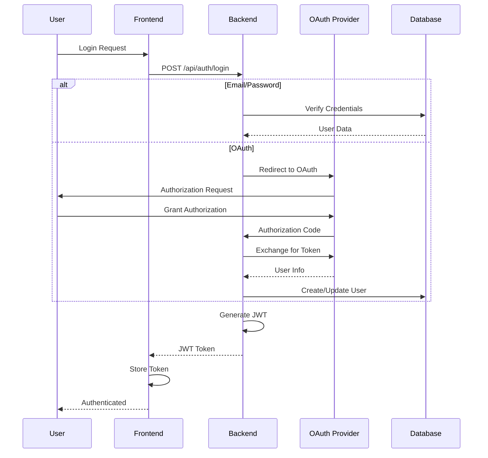

# Authentication & Security Documentation

Comprehensive security documentation for the Netra AI Optimization Platform apex-v1.

## Table of Contents

- [Authentication Overview](#authentication-overview)
- [OAuth 2.0 Implementation](#oauth-20-implementation)
- [JWT Token Management](#jwt-token-management)
- [Security Architecture](#security-architecture)
- [API Security](#api-security)
- [WebSocket Security](#websocket-security)
- [Data Protection](#data-protection)
- [Security Best Practices](#security-best-practices)
- [Compliance & Auditing](#compliance--auditing)

## Authentication Overview

Netra implements a multi-layered authentication system supporting both traditional credentials and OAuth 2.0 providers.

### Authentication Methods

1. **Email/Password Authentication**
   - Bcrypt password hashing
   - Secure password requirements
   - Password reset via email

2. **OAuth 2.0 Providers**
   - Google OAuth
   - GitHub OAuth (planned)
   - Microsoft Azure AD (planned)

3. **API Key Authentication**
   - For programmatic access
   - SHA-256 hashed storage
   - Scoped permissions

### Authentication Flow



## OAuth 2.0 Implementation

### Google OAuth Configuration

```python
# Backend OAuth Configuration
GOOGLE_OAUTH_CONFIG = {
    "client_id": os.getenv("GOOGLE_CLIENT_ID"),
    "client_secret": os.getenv("GOOGLE_CLIENT_SECRET"),
    "authorize_url": "https://accounts.google.com/o/oauth2/v2/auth",
    "token_url": "https://oauth2.googleapis.com/token",
    "userinfo_url": "https://www.googleapis.com/oauth2/v1/userinfo",
    "scopes": ["openid", "email", "profile"],
    "redirect_uri": "http://localhost:8000/api/auth/google/callback"
}
```

### OAuth Flow Implementation

```python
# app/auth/oauth.py
from authlib.integrations.starlette_client import OAuth
from fastapi import HTTPException

class OAuthManager:
    def __init__(self):
        self.oauth = OAuth()
        self.configure_providers()
    
    def configure_providers(self):
        # Google OAuth
        self.oauth.register(
            name='google',
            client_id=GOOGLE_OAUTH_CONFIG["client_id"],
            client_secret=GOOGLE_OAUTH_CONFIG["client_secret"],
            server_metadata_url='https://accounts.google.com/.well-known/openid-configuration',
            client_kwargs={'scope': 'openid email profile'}
        )
    
    async def authorize_redirect(self, provider: str, redirect_uri: str):
        client = self.oauth.create_client(provider)
        return await client.authorize_redirect(redirect_uri)
    
    async def authorize_access_token(self, provider: str):
        client = self.oauth.create_client(provider)
        token = await client.authorize_access_token()
        return token
```

### OAuth User Management

```python
# app/services/auth_service.py
async def handle_oauth_callback(provider: str, token: dict):
    # Extract user info from OAuth token
    user_info = await get_oauth_user_info(provider, token)
    
    # Check if user exists
    existing_user = await db.get_user_by_email(user_info["email"])
    
    if existing_user:
        # Update existing user
        user = await db.update_user_oauth_info(
            user_id=existing_user.id,
            oauth_provider=provider,
            oauth_id=user_info["id"],
            picture=user_info.get("picture")
        )
    else:
        # Create new user
        user = await db.create_oauth_user(
            email=user_info["email"],
            name=user_info.get("name"),
            oauth_provider=provider,
            oauth_id=user_info["id"],
            picture=user_info.get("picture")
        )
    
    # Generate JWT token
    access_token = create_access_token(user)
    return {"access_token": access_token, "user": user}
```

## JWT Token Management

### Token Structure

```json
{
  "header": {
    "alg": "HS256",
    "typ": "JWT"
  },
  "payload": {
    "sub": "user_id",
    "email": "user@example.com",
    "exp": 1234567890,
    "iat": 1234567800,
    "jti": "unique_token_id",
    "type": "access",
    "permissions": ["read", "write"]
  },
  "signature": "..."
}
```

### Token Generation

```python
# app/auth/jwt_handler.py
from datetime import datetime, timedelta
from jose import JWTError, jwt

SECRET_KEY = os.getenv("JWT_SECRET_KEY")
ALGORITHM = "HS256"
ACCESS_TOKEN_EXPIRE_MINUTES = 30
REFRESH_TOKEN_EXPIRE_DAYS = 7

def create_access_token(user: User) -> str:
    expires = datetime.utcnow() + timedelta(minutes=ACCESS_TOKEN_EXPIRE_MINUTES)
    
    payload = {
        "sub": str(user.id),
        "email": user.email,
        "exp": expires,
        "iat": datetime.utcnow(),
        "jti": str(uuid.uuid4()),
        "type": "access",
        "permissions": get_user_permissions(user)
    }
    
    token = jwt.encode(payload, SECRET_KEY, algorithm=ALGORITHM)
    return token

def create_refresh_token(user: User) -> str:
    expires = datetime.utcnow() + timedelta(days=REFRESH_TOKEN_EXPIRE_DAYS)
    
    payload = {
        "sub": str(user.id),
        "exp": expires,
        "iat": datetime.utcnow(),
        "jti": str(uuid.uuid4()),
        "type": "refresh"
    }
    
    token = jwt.encode(payload, SECRET_KEY, algorithm=ALGORITHM)
    return token
```

### Token Validation

```python
# app/auth/dependencies.py
from fastapi import Depends, HTTPException, status
from fastapi.security import HTTPBearer, HTTPAuthorizationCredentials

security = HTTPBearer()

async def verify_token(credentials: HTTPAuthorizationCredentials = Depends(security)):
    token = credentials.credentials
    
    try:
        payload = jwt.decode(token, SECRET_KEY, algorithms=[ALGORITHM])
        
        # Verify token type
        if payload.get("type") != "access":
            raise HTTPException(
                status_code=status.HTTP_401_UNAUTHORIZED,
                detail="Invalid token type"
            )
        
        # Check expiration
        if datetime.fromtimestamp(payload["exp"]) < datetime.utcnow():
            raise HTTPException(
                status_code=status.HTTP_401_UNAUTHORIZED,
                detail="Token expired"
            )
        
        # Get user
        user = await get_user_by_id(payload["sub"])
        if not user or not user.is_active:
            raise HTTPException(
                status_code=status.HTTP_401_UNAUTHORIZED,
                detail="User not found or inactive"
            )
        
        return user
        
    except JWTError:
        raise HTTPException(
            status_code=status.HTTP_401_UNAUTHORIZED,
            detail="Invalid token"
        )

# Dependency for protected routes
async def get_current_user(user: User = Depends(verify_token)):
    return user
```

### Token Refresh

```python
# app/routes/auth.py
@router.post("/refresh")
async def refresh_token(refresh_token: str):
    try:
        payload = jwt.decode(refresh_token, SECRET_KEY, algorithms=[ALGORITHM])
        
        if payload.get("type") != "refresh":
            raise HTTPException(status_code=400, detail="Invalid token type")
        
        user = await get_user_by_id(payload["sub"])
        if not user:
            raise HTTPException(status_code=404, detail="User not found")
        
        # Generate new access token
        new_access_token = create_access_token(user)
        
        return {"access_token": new_access_token}
        
    except JWTError:
        raise HTTPException(status_code=401, detail="Invalid refresh token")
```

## Security Architecture

### Defense in Depth

```
┌─────────────────────────────────────────────────────────┐
│                    External Layer                        │
│  • CDN/WAF (CloudFlare)                                 │
│  • DDoS Protection                                      │
│  • Rate Limiting                                        │
└─────────────────────────────────────────────────────────┘
                            │
┌─────────────────────────────────────────────────────────┐
│                   Application Layer                      │
│  • HTTPS/TLS 1.3                                        │
│  • CORS Configuration                                   │
│  • CSP Headers                                          │
│  • Input Validation                                     │
└─────────────────────────────────────────────────────────┘
                            │
┌─────────────────────────────────────────────────────────┐
│                 Authentication Layer                     │
│  • JWT Validation                                       │
│  • OAuth 2.0                                           │
│  • MFA (planned)                                       │
│  • Session Management                                   │
└─────────────────────────────────────────────────────────┘
                            │
┌─────────────────────────────────────────────────────────┐
│                  Authorization Layer                     │
│  • Role-Based Access Control (RBAC)                    │
│  • Resource-Level Permissions                          │
│  • API Scopes                                          │
└─────────────────────────────────────────────────────────┘
                            │
┌─────────────────────────────────────────────────────────┐
│                     Data Layer                          │
│  • Encryption at Rest                                  │
│  • Encryption in Transit                               │
│  • Database Access Control                             │
│  • Audit Logging                                       │
└─────────────────────────────────────────────────────────┘
```

### Security Headers

```python
# app/middleware/security.py
from fastapi import FastAPI
from fastapi.middleware.cors import CORSMiddleware
from fastapi.middleware.trustedhost import TrustedHostMiddleware

def configure_security_middleware(app: FastAPI):
    # CORS
    app.add_middleware(
        CORSMiddleware,
        allow_origins=["https://app.netrasystems.ai", "http://localhost:3000"],
        allow_credentials=True,
        allow_methods=["GET", "POST", "PUT", "DELETE", "OPTIONS"],
        allow_headers=["*"],
        expose_headers=["X-Total-Count", "X-Request-ID"]
    )
    
    # Trusted hosts
    app.add_middleware(
        TrustedHostMiddleware,
        allowed_hosts=["*.netrasystems.ai", "localhost"]
    )
    
    # Security headers
    @app.middleware("http")
    async def add_security_headers(request, call_next):
        response = await call_next(request)
        response.headers["X-Content-Type-Options"] = "nosniff"
        response.headers["X-Frame-Options"] = "DENY"
        response.headers["X-XSS-Protection"] = "1; mode=block"
        response.headers["Strict-Transport-Security"] = "max-age=31536000; includeSubDomains"
        response.headers["Content-Security-Policy"] = "default-src 'self'; script-src 'self' 'unsafe-inline'"
        return response
```

## API Security

### Rate Limiting

```python
# app/middleware/rate_limit.py
from fastapi import HTTPException
import redis
from datetime import timedelta

redis_client = redis.Redis(host='localhost', port=6379, decode_responses=True)

class RateLimiter:
    def __init__(self, requests: int, window: timedelta):
        self.requests = requests
        self.window = window
    
    async def check_rate_limit(self, identifier: str):
        key = f"rate_limit:{identifier}"
        
        try:
            current = redis_client.incr(key)
            
            if current == 1:
                redis_client.expire(key, self.window.total_seconds())
            
            if current > self.requests:
                raise HTTPException(
                    status_code=429,
                    detail="Rate limit exceeded",
                    headers={"Retry-After": str(self.window.total_seconds())}
                )
                
        except redis.RedisError:
            # Allow request if Redis is down
            pass

# Usage
auth_limiter = RateLimiter(requests=5, window=timedelta(minutes=1))
api_limiter = RateLimiter(requests=100, window=timedelta(minutes=1))

@router.post("/login")
async def login(credentials: LoginCredentials):
    await auth_limiter.check_rate_limit(credentials.email)
    # ... login logic
```

### Input Validation

```python
# app/schemas/validation.py
from pydantic import BaseModel, Field, validator, EmailStr
import re

class UserRegistration(BaseModel):
    email: EmailStr
    password: str = Field(..., min_length=8, max_length=128)
    name: str = Field(..., min_length=1, max_length=255)
    
    @validator('password')
    def validate_password(cls, v):
        if not re.search(r"[A-Z]", v):
            raise ValueError("Password must contain uppercase letter")
        if not re.search(r"[a-z]", v):
            raise ValueError("Password must contain lowercase letter")
        if not re.search(r"\d", v):
            raise ValueError("Password must contain digit")
        if not re.search(r"[!@#$%^&*(),.?\":{}|<>]", v):
            raise ValueError("Password must contain special character")
        return v
    
    @validator('name')
    def validate_name(cls, v):
        if not re.match(r"^[a-zA-Z0-9\s\-']+$", v):
            raise ValueError("Name contains invalid characters")
        return v.strip()

class SQLInjectionProtection:
    @staticmethod
    def sanitize_input(input_str: str) -> str:
        # Remove or escape dangerous characters
        dangerous_chars = ["'", '"', ";", "--", "/*", "*/", "xp_", "sp_"]
        sanitized = input_str
        for char in dangerous_chars:
            sanitized = sanitized.replace(char, "")
        return sanitized
```

### API Key Management

```python
# app/services/api_key_service.py
import secrets
import hashlib

class APIKeyService:
    @staticmethod
    def generate_api_key() -> tuple[str, str]:
        """Generate API key and return (raw_key, hashed_key)"""
        raw_key = f"ntr_{secrets.token_urlsafe(32)}"
        hashed_key = hashlib.sha256(raw_key.encode()).hexdigest()
        return raw_key, hashed_key
    
    @staticmethod
    async def create_api_key(user_id: int, name: str, scopes: list[str]):
        raw_key, hashed_key = APIKeyService.generate_api_key()
        
        # Store hashed key in database
        api_key = await db.create_api_key(
            user_id=user_id,
            name=name,
            key_hash=hashed_key,
            scopes=scopes
        )
        
        # Return raw key only once
        return {
            "id": api_key.id,
            "key": raw_key,  # Only shown once
            "name": name,
            "created_at": api_key.created_at
        }
    
    @staticmethod
    async def validate_api_key(raw_key: str):
        hashed_key = hashlib.sha256(raw_key.encode()).hexdigest()
        api_key = await db.get_api_key_by_hash(hashed_key)
        
        if not api_key or not api_key.is_active:
            raise HTTPException(status_code=401, detail="Invalid API key")
        
        # Update last used timestamp
        await db.update_api_key_last_used(api_key.id)
        
        return api_key
```

## WebSocket Security

### WebSocket Authentication

```python
# app/websocket/auth.py
from fastapi import WebSocket, Query, status

async def websocket_auth(
    websocket: WebSocket,
    token: str = Query(...)
):
    try:
        # Validate JWT token
        user = await verify_token_for_websocket(token)
        
        if not user:
            await websocket.close(code=status.WS_1008_POLICY_VIOLATION)
            return None
        
        return user
        
    except Exception:
        await websocket.close(code=status.WS_1008_POLICY_VIOLATION)
        return None

# WebSocket endpoint with authentication
@app.websocket("/ws")
async def websocket_endpoint(
    websocket: WebSocket,
    user: User = Depends(websocket_auth)
):
    if not user:
        return
    
    await websocket.accept()
    # ... handle WebSocket connection
```

### WebSocket Message Validation

```python
# app/websocket/validation.py
from pydantic import BaseModel, ValidationError

class WebSocketMessage(BaseModel):
    type: str
    data: dict
    timestamp: Optional[datetime]

async def validate_websocket_message(raw_message: str) -> WebSocketMessage:
    try:
        data = json.loads(raw_message)
        message = WebSocketMessage(**data)
        
        # Additional validation based on message type
        if message.type == "optimization_request":
            validate_optimization_request(message.data)
        
        return message
        
    except (json.JSONDecodeError, ValidationError) as e:
        raise ValueError(f"Invalid message format: {str(e)}")

def validate_optimization_request(data: dict):
    required_fields = ["workload_id", "parameters"]
    for field in required_fields:
        if field not in data:
            raise ValueError(f"Missing required field: {field}")
```

## Data Protection

### Encryption at Rest

```python
# app/security/encryption.py
from cryptography.fernet import Fernet
from cryptography.hazmat.primitives import hashes
from cryptography.hazmat.primitives.kdf.pbkdf2 import PBKDF2

class DataEncryption:
    def __init__(self, master_key: str):
        # Derive encryption key from master key
        kdf = PBKDF2(
            algorithm=hashes.SHA256(),
            length=32,
            salt=b'stable_salt',  # Use proper salt management
            iterations=100000,
        )
        key = base64.urlsafe_b64encode(kdf.derive(master_key.encode()))
        self.cipher = Fernet(key)
    
    def encrypt(self, data: str) -> str:
        """Encrypt sensitive data"""
        return self.cipher.encrypt(data.encode()).decode()
    
    def decrypt(self, encrypted_data: str) -> str:
        """Decrypt sensitive data"""
        return self.cipher.decrypt(encrypted_data.encode()).decode()

# Usage for sensitive fields
encryption = DataEncryption(os.getenv("MASTER_KEY"))

# Encrypt before storing
user.ssn_encrypted = encryption.encrypt(ssn)

# Decrypt when retrieving
ssn = encryption.decrypt(user.ssn_encrypted)
```

### Personal Data Handling

```python
# app/services/privacy_service.py
class PrivacyService:
    @staticmethod
    async def anonymize_user_data(user_id: int):
        """Anonymize user data for GDPR compliance"""
        # Replace personal data with anonymized values
        await db.update_user(
            user_id=user_id,
            email=f"deleted_{user_id}@example.com",
            name="Deleted User",
            picture=None,
            metadata={}
        )
    
    @staticmethod
    async def export_user_data(user_id: int) -> dict:
        """Export all user data for GDPR data portability"""
        user_data = {
            "user": await db.get_user(user_id),
            "threads": await db.get_user_threads(user_id),
            "messages": await db.get_user_messages(user_id),
            "runs": await db.get_user_runs(user_id),
            "references": await db.get_user_references(user_id)
        }
        
        return user_data
    
    @staticmethod
    def redact_sensitive_data(text: str) -> str:
        """Redact sensitive information from text"""
        # Redact email addresses
        text = re.sub(r'\b[A-Za-z0-9._%+-]+@[A-Za-z0-9.-]+\.[A-Z|a-z]{2,}\b', '[EMAIL]', text)
        
        # Redact phone numbers
        text = re.sub(r'\b\d{3}[-.]?\d{3}[-.]?\d{4}\b', '[PHONE]', text)
        
        # Redact SSN
        text = re.sub(r'\b\d{3}-\d{2}-\d{4}\b', '[SSN]', text)
        
        # Redact credit card numbers
        text = re.sub(r'\b\d{4}[\s-]?\d{4}[\s-]?\d{4}[\s-]?\d{4}\b', '[CREDIT_CARD]', text)
        
        return text
```

## Security Best Practices

### Password Security

```python
# app/security/password.py
from passlib.context import CryptContext

pwd_context = CryptContext(schemes=["bcrypt"], deprecated="auto")

class PasswordSecurity:
    @staticmethod
    def hash_password(password: str) -> str:
        """Hash password using bcrypt"""
        return pwd_context.hash(password)
    
    @staticmethod
    def verify_password(plain_password: str, hashed_password: str) -> bool:
        """Verify password against hash"""
        return pwd_context.verify(plain_password, hashed_password)
    
    @staticmethod
    def check_password_strength(password: str) -> dict:
        """Check password strength and return score"""
        score = 0
        feedback = []
        
        if len(password) >= 12:
            score += 2
        elif len(password) >= 8:
            score += 1
        else:
            feedback.append("Password should be at least 8 characters")
        
        if re.search(r"[a-z]", password) and re.search(r"[A-Z]", password):
            score += 1
        else:
            feedback.append("Include both uppercase and lowercase letters")
        
        if re.search(r"\d", password):
            score += 1
        else:
            feedback.append("Include at least one number")
        
        if re.search(r"[!@#$%^&*(),.?\":{}|<>]", password):
            score += 1
        else:
            feedback.append("Include at least one special character")
        
        # Check for common passwords
        if password.lower() in COMMON_PASSWORDS:
            score = 0
            feedback = ["This password is too common"]
        
        return {
            "score": score,
            "strength": ["weak", "fair", "good", "strong", "very strong"][min(score, 4)],
            "feedback": feedback
        }
```

### Session Management

```python
# app/security/session.py
class SessionManager:
    def __init__(self):
        self.redis_client = redis.Redis(host='localhost', port=6379)
        self.session_timeout = timedelta(hours=24)
    
    async def create_session(self, user_id: int, metadata: dict = None):
        session_id = str(uuid.uuid4())
        session_data = {
            "user_id": user_id,
            "created_at": datetime.utcnow().isoformat(),
            "metadata": metadata or {}
        }
        
        self.redis_client.setex(
            f"session:{session_id}",
            self.session_timeout,
            json.dumps(session_data)
        )
        
        return session_id
    
    async def get_session(self, session_id: str):
        data = self.redis_client.get(f"session:{session_id}")
        if data:
            return json.loads(data)
        return None
    
    async def invalidate_session(self, session_id: str):
        self.redis_client.delete(f"session:{session_id}")
    
    async def invalidate_all_user_sessions(self, user_id: int):
        # Get all sessions for user
        pattern = "session:*"
        for key in self.redis_client.scan_iter(pattern):
            session_data = self.redis_client.get(key)
            if session_data:
                data = json.loads(session_data)
                if data.get("user_id") == user_id:
                    self.redis_client.delete(key)
```

## Compliance & Auditing

### Audit Logging

```python
# app/services/audit_service.py
class AuditLogger:
    @staticmethod
    async def log_event(
        user_id: Optional[int],
        action: str,
        resource_type: Optional[str],
        resource_id: Optional[str],
        request: Request,
        response_status: int,
        metadata: dict = None
    ):
        audit_log = {
            "user_id": user_id,
            "action": action,
            "resource_type": resource_type,
            "resource_id": resource_id,
            "ip_address": request.client.host,
            "user_agent": request.headers.get("user-agent"),
            "request_id": request.headers.get("x-request-id"),
            "response_status": response_status,
            "timestamp": datetime.utcnow(),
            "metadata": metadata or {}
        }
        
        # Store in database
        await db.create_audit_log(audit_log)
        
        # Send to SIEM if configured
        if SIEM_ENABLED:
            await send_to_siem(audit_log)

# Middleware for automatic audit logging
@app.middleware("http")
async def audit_middleware(request: Request, call_next):
    # Skip health checks
    if request.url.path.startswith("/health"):
        return await call_next(request)
    
    # Get user from token if available
    user_id = None
    if "authorization" in request.headers:
        try:
            user = await verify_token_from_header(request.headers["authorization"])
            user_id = user.id
        except:
            pass
    
    # Process request
    response = await call_next(request)
    
    # Log audit event
    await AuditLogger.log_event(
        user_id=user_id,
        action=f"{request.method} {request.url.path}",
        resource_type="api",
        resource_id=request.url.path,
        request=request,
        response_status=response.status_code
    )
    
    return response
```

### Compliance Features

```python
# app/compliance/gdpr.py
class GDPRCompliance:
    @staticmethod
    async def handle_data_request(user_id: int, request_type: str):
        """Handle GDPR data requests"""
        if request_type == "access":
            # Right to access
            return await PrivacyService.export_user_data(user_id)
        
        elif request_type == "portability":
            # Right to data portability
            data = await PrivacyService.export_user_data(user_id)
            return json.dumps(data, indent=2)
        
        elif request_type == "erasure":
            # Right to be forgotten
            await PrivacyService.anonymize_user_data(user_id)
            return {"status": "User data anonymized"}
        
        elif request_type == "rectification":
            # Right to rectification
            return {"status": "Please contact support for data corrections"}
        
        else:
            raise ValueError(f"Unknown request type: {request_type}")

# app/compliance/security_monitoring.py
class SecurityMonitor:
    @staticmethod
    async def detect_suspicious_activity(user_id: int, action: str):
        """Detect and respond to suspicious activity"""
        # Check for rapid-fire requests
        recent_actions = await get_recent_user_actions(user_id, minutes=5)
        
        if len(recent_actions) > 100:
            await alert_security_team(f"Excessive activity from user {user_id}")
            await temporarily_restrict_user(user_id)
        
        # Check for privilege escalation attempts
        if "admin" in action.lower() and not await is_admin(user_id):
            await log_security_event("Potential privilege escalation attempt", user_id)
        
        # Check for data exfiltration
        if action == "bulk_export" and await get_export_count(user_id, hours=1) > 5:
            await alert_security_team(f"Potential data exfiltration by user {user_id}")
```

## Security Configuration

### Environment Variables

```bash
# .env.production
# Security Keys
JWT_SECRET_KEY=<strong-random-key>
MASTER_ENCRYPTION_KEY=<strong-random-key>
API_KEY_SALT=<strong-random-salt>

# OAuth
GOOGLE_CLIENT_ID=<google-client-id>
GOOGLE_CLIENT_SECRET=<google-client-secret>

# Security Settings
ALLOWED_ORIGINS=https://app.netrasystems.ai
SECURE_COOKIES=true
SESSION_TIMEOUT_MINUTES=1440
MAX_LOGIN_ATTEMPTS=5
PASSWORD_MIN_LENGTH=12

# Rate Limiting
RATE_LIMIT_ENABLED=true
RATE_LIMIT_REQUESTS=100
RATE_LIMIT_WINDOW_SECONDS=60

# Monitoring
SIEM_ENABLED=true
SIEM_ENDPOINT=https://siem.netrasystems.ai
AUDIT_LOG_RETENTION_DAYS=730
```

### Security Checklist

- [ ] All passwords hashed with bcrypt
- [ ] JWT tokens have appropriate expiration
- [ ] Rate limiting configured for all endpoints
- [ ] Input validation on all user inputs
- [ ] SQL injection prevention via parameterized queries
- [ ] XSS prevention via output encoding
- [ ] CSRF protection for state-changing operations
- [ ] Secure session management
- [ ] HTTPS enforced in production
- [ ] Security headers configured
- [ ] Regular security audits scheduled
- [ ] Dependency vulnerability scanning
- [ ] Penetration testing performed
- [ ] Incident response plan documented
- [ ] Data encryption at rest and in transit
- [ ] GDPR compliance implemented
- [ ] Audit logging enabled
- [ ] Security monitoring active
- [ ] Backup and recovery procedures tested