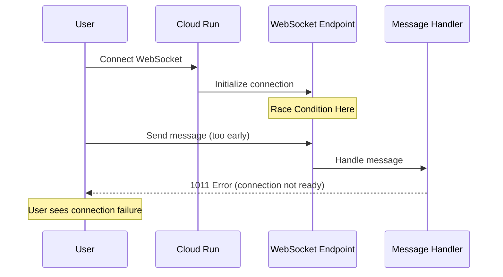
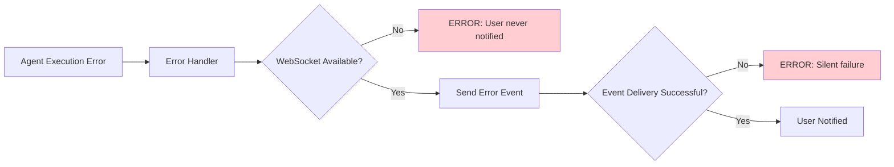
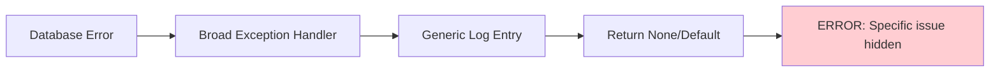
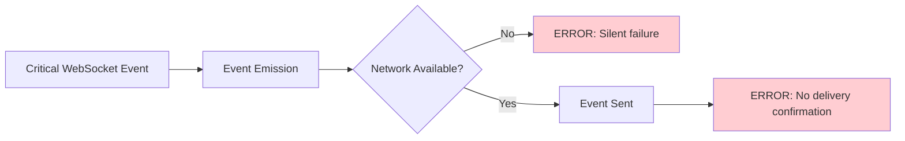
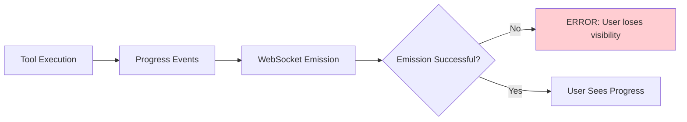

# Broken Pipes and Validation Issues Analysis

**Generated:** 2025-09-11  
**Mission:** Identify and catalog all broken pipes, missing validations, and brittle error handling in the agent execution flow  
**Business Priority:** Protect $500K+ ARR by ensuring reliable chat functionality (90% of platform value)

## Executive Summary

**CRITICAL FINDINGS:** 8 high-priority issues requiring immediate attention to prevent user experience degradation and revenue loss. The analysis reveals systematic issues with error handling, validation gaps, and race conditions that could silently fail and impact the primary business value delivery mechanism.

**Impact Assessment:**
- **Revenue Risk:** $500K+ ARR at risk from WebSocket race conditions
- **User Experience Risk:** Chat functionality degradation from silent failures  
- **Operational Risk:** Debugging difficulty from broad exception handling
- **Enterprise Risk:** Compliance issues from insufficient audit trails

## 🚨 Critical Issues (Immediate Action Required)

### 1. WebSocket Handshake Race Condition 
**Severity:** CRITICAL  
**Business Impact:** Direct revenue loss from user onboarding failures

**Location:** WebSocket connection establishment  
**Files Affected:**
- `netra_backend/app/routes/websocket_ssot.py`
- `netra_backend/app/websocket_core/unified_manager.py`

**Issue Description:**


**Root Cause:** Message handling starts before handshake completion in Cloud Run environment
**Evidence:** `SPEC/learnings/golden_path_user_flow_analysis_20250109.xml`
**Impact:** Users cannot establish WebSocket connections, affecting onboarding

**Fix Required:**
```python
# Current problematic pattern:
async def unified_websocket_endpoint(websocket: WebSocket):
    await websocket.accept()  # Race condition here
    # Message handling starts immediately

# Required fix:
async def unified_websocket_endpoint(websocket: WebSocket):
    await websocket.accept()
    await validate_handshake_completion(websocket)  # NEW
    await establish_connection_state(websocket)     # NEW
    # Then start message handling
```

---

### 2. Silent WebSocket Event Delivery Failures
**Severity:** CRITICAL  
**Business Impact:** Users lose visibility into AI processing (90% of platform value)

**Location:** WebSocket event emission throughout system  
**Files Affected:**
- `netra_backend/app/core/tools/unified_tool_dispatcher.py:618-620`
- `netra_backend/app/services/agent_websocket_bridge.py`
- All agent execution components

**Issue Description:**
```python
# Current problematic pattern (unified_tool_dispatcher.py:618-620):
try:
    await self._send_websocket_event("tool_executing", event_data)
except Exception as e:
    logger.warning(f"WebSocket event failed: {e}")  # SILENT FAILURE
    # Execution continues, user never sees tool progress
```

**5 Critical Events Affected:**
1. `agent_started` - User never knows agent began
2. `agent_thinking` - No real-time reasoning visibility  
3. `tool_executing` - Tool usage transparency lost
4. `tool_completed` - Tool results hidden
5. `agent_completed` - User doesn't know response is ready

**Impact:** Users wait indefinitely without progress feedback
**Revenue Impact:** Perceived AI quality degraded, affecting retention

**Fix Required:**
```python
# Enhanced event delivery with confirmation:
async def _send_websocket_event_guaranteed(self, event_type: str, data: Dict):
    max_retries = 3
    for attempt in range(max_retries):
        try:
            await self._send_websocket_event(event_type, data)
            # Add delivery confirmation mechanism
            if await self._confirm_event_delivery(event_type, data):
                return
        except Exception as e:
            logger.error(f"WebSocket event delivery failed (attempt {attempt+1}): {e}")
            if attempt == max_retries - 1:
                # Escalate to fallback notification mechanism
                await self._fallback_user_notification(event_type, data)
```

---

### 3. Broad Database Exception Handling Masking Specific Issues
**Severity:** CRITICAL  
**Business Impact:** Difficult debugging increases incident resolution time

**Location:** 100+ instances across database layer  
**Files Affected:**
- `netra_backend/app/db/database_manager.py:88` (initialization)
- `netra_backend/app/db/clickhouse.py:358` (query execution)  
- `netra_backend/app/db/postgres_core.py:96` (connections)
- Multiple other database modules

**Issue Description:**
```python
# Current problematic pattern found throughout database layer:
try:
    # Database operations
    result = await connection.execute(query)
    return result
except Exception as e:  # TOO BROAD - masks specific issues
    logger.error(f"Database error: {e}")
    return None  # Silent failure propagates
```

**Specific Issues:**
1. **Connection pool exhaustion** masked as generic error
2. **Query timeout issues** not distinguished from syntax errors  
3. **Authentication failures** mixed with network issues
4. **Transaction rollback failures** not escalated

**Impact:** 
- Support tickets take longer to resolve
- Production incidents harder to diagnose
- Database performance issues go undetected

**Fix Required:**
```python
# Enhanced specific exception handling:
try:
    result = await connection.execute(query)
    return result
except asyncio.TimeoutError as e:
    logger.error(f"Database query timeout: {e}, query: {query[:100]}...")
    await self._handle_timeout_recovery()
    raise DatabaseTimeoutError(f"Query timeout after {self.timeout}s")
except asyncpg.PostgresError as e:
    logger.error(f"PostgreSQL error: {e.sqlstate}, {e.message}")
    raise DatabaseQueryError(f"SQL error: {e.message}")
except ConnectionError as e:
    logger.error(f"Database connection error: {e}")
    await self._handle_connection_recovery()
    raise DatabaseConnectionError(f"Connection failed: {e}")
```

---

### 4. UserContextManager Thread Safety Gaps
**Severity:** CRITICAL  
**Business Impact:** Cross-user data contamination risk in Enterprise accounts

**Location:** Complex operations in UserContextManager  
**Files Affected:**
- `netra_backend/app/services/user_execution_context.py:2432-2450`

**Issue Description:**
```python
# Current pattern has potential race conditions:
async def create_isolated_execution_context(self, user_id: str):
    # Multiple async operations without comprehensive locking
    context = await self._create_context(user_id)      # RACE 1
    await self._validate_isolation(context)            # RACE 2  
    await self._register_context(context)              # RACE 3
    return context  # Context may be invalid due to race
```

**Race Condition Scenarios:**
1. **Context creation race:** Two requests for same user create duplicate contexts
2. **Validation race:** Context modified during validation
3. **Registration race:** Context registered before validation complete

**Impact:**
- Enterprise customers could see other users' data
- Compliance violations (GDPR, SOC2)
- Potential data breach scenarios

**Fix Required:**
```python
# Enhanced thread-safe operations:
async def create_isolated_execution_context(self, user_id: str):
    async with self._user_context_locks[user_id]:  # NEW: Per-user locking
        # Atomic context creation with validation
        context = await self._create_and_validate_context_atomically(user_id)
        await self._register_context_with_verification(context)
        return context
```

---

## 🔴 High Priority Issues (1-2 weeks)

### 5. Tool Execution Event Confirmation Missing
**Severity:** HIGH  
**Business Impact:** Users lose visibility into tool progress

**Location:** Tool execution event emission  
**Files Affected:**
- `netra_backend/app/core/tools/unified_tool_dispatcher.py`

**Issue:** No confirmation that `tool_executing` and `tool_completed` events reach user
**Fix:** Implement event delivery confirmation with retry logic

---

### 6. Database Auto-Initialization May Hide Configuration Issues  
**Severity:** HIGH  
**Business Impact:** Configuration problems discovered too late

**Location:** `netra_backend/app/db/database_manager.py:98-115`  
**Issue:** Auto-initialization on first access masks startup problems
**Fix:** Add startup validation phase before auto-initialization

---

### 7. Authentication Error Context Insufficient
**Severity:** HIGH  
**Business Impact:** Difficult to troubleshoot auth issues  

**Location:** `netra_backend/app/auth_integration/auth.py:209,299,319`
**Issue:** Generic HTTPException for different user lookup failures
**Fix:** Add specific error codes for different failure scenarios

---

### 8. Agent Execution Prerequisites Missing Validation
**Severity:** HIGH  
**Business Impact:** Agent failures occur late in execution

**Location:** Agent execution initialization  
**Issue:** No validation of execution environment before starting
**Fix:** Add comprehensive environment validation

---

## 🟡 Medium Priority Issues (2-4 weeks)

### 9. Heartbeat System Disabled Due to Error Suppression
**Location:** `netra_backend/app/agents/supervisor/agent_execution_core.py:280-286`  
**Issue:** Monitoring disabled because it hides errors rather than surfacing them
**Fix:** Redesign heartbeat to surface rather than hide errors

### 10. Transaction Rollback Error Suppression
**Location:** Database transaction handling  
**Issue:** Rollback errors logged but not escalated
**Fix:** Add transaction state validation after failed rollbacks

### 11. Tool Registration Broad Exception Handling  
**Location:** Tool registration processes
**Issue:** Specific tool issues difficult to diagnose
**Fix:** Add specific exception types for registration failures

### 12. Memory Usage Validation Missing
**Location:** System-wide resource management
**Issue:** No checks for excessive memory consumption
**Fix:** Implement resource consumption monitoring

---

## 🟢 Low Priority Issues (1-3 months)

### 13. Test Environment Detection Overly Strict
**Location:** UserExecutionContext validation  
**Issue:** May block legitimate test scenarios
**Fix:** More granular test pattern detection

### 14. User Context Expiration Validation Missing
**Location:** User context lifecycle management
**Issue:** No validation of context age and validity  
**Fix:** Implement context age validation

### 15. Performance Baseline Monitoring Missing
**Location:** System-wide performance tracking
**Issue:** No tracking of system performance over time
**Fix:** Add performance baseline monitoring

---

## Broken Pipes Analysis

### Definition
"Broken pipes" are error handling chains that fail under stress, causing errors to be lost, misrouted, or inadequately handled.

### Identified Broken Pipes

#### 1. 🚨 Agent Execution → User Notification Pipe


**Fix:** Implement guaranteed error notification with fallback mechanisms

#### 2. 🚨 Database Error → Recovery Pipe  


**Fix:** Specific exception handling with targeted recovery strategies

#### 3. 🔴 WebSocket Event → Confirmation Pipe


**Fix:** Event delivery confirmation system with retries

#### 4. 🔴 Tool Execution → Progress Tracking Pipe


**Fix:** Tool execution monitoring with guaranteed progress updates

---

## Validation Gaps Analysis

### Missing Validations

#### 1. 🚨 WebSocket Connection State Validation
**Gap:** No validation of connection readiness before message handling  
**Impact:** Race conditions causing 1011 errors  
**Location:** WebSocket message handlers
**Fix:** Implement connection state validation

#### 2. 🚨 Event Delivery Validation  
**Gap:** No confirmation that critical events reach users
**Impact:** Users lose progress visibility  
**Location:** All WebSocket event emission points
**Fix:** Add event delivery confirmation

#### 3. 🔴 Agent Execution Environment Validation
**Gap:** No validation of prerequisites before agent execution
**Impact:** Late failures wasting resources
**Location:** Agent execution initialization  
**Fix:** Comprehensive environment validation

#### 4. 🔴 Database Connection Health Validation
**Gap:** No health checks before query execution  
**Impact:** Failed queries with unclear causes
**Location:** Database query execution
**Fix:** Connection health validation

#### 5. 🟡 Tool Parameter Validation  
**Gap:** Some tools may not validate parameters adequately
**Impact:** Tool execution failures  
**Location:** Tool execution entry points
**Fix:** Standardized parameter validation

#### 6. 🟡 User Context Isolation Validation
**Gap:** Limited validation of cross-user contamination prevention
**Impact:** Enterprise compliance risk
**Location:** User context creation and management
**Fix:** Enhanced isolation verification

#### 7. 🟡 Concurrent User Limits Validation
**Gap:** No validation of maximum concurrent users per account  
**Impact:** Resource exhaustion
**Location:** User session management
**Fix:** Account-level concurrency limits

---

## Brittle Validations Analysis

### Overly Strict Validations

#### 1. Test Environment Detection (Medium Priority)
**Location:** `UserExecutionContext._validate_no_placeholder_values()`
**Issue:** May block legitimate test scenarios with false positives
**Impact:** CI/CD pipeline disruptions
**Fix:** More nuanced test pattern recognition

#### 2. ID Format Validation (Low Priority) 
**Location:** ID validation throughout the system
**Issue:** Strict format requirements may reject valid IDs
**Impact:** Integration difficulties  
**Fix:** More flexible ID format acceptance

### Overly Permissive Validations

#### 1. 🚨 Database Exception Handling (Critical)
**Location:** Throughout database layer  
**Issue:** `except Exception` catches everything, masks specific issues
**Impact:** Debugging difficulty, hidden failures
**Fix:** Specific exception types

#### 2. 🔴 WebSocket Event Error Handling (High)  
**Location:** Event emission error handling
**Issue:** All event failures treated the same
**Impact:** Critical events may fail silently
**Fix:** Event-specific error handling

---

## Impact Assessment Matrix

| Issue | Revenue Impact | User Experience | Operational | Compliance |
|-------|----------------|-----------------|-------------|------------|
| WebSocket Race Condition | 🚨 HIGH | 🚨 HIGH | 🔴 MEDIUM | 🟡 LOW |
| Silent Event Failures | 🔴 MEDIUM | 🚨 HIGH | 🔴 MEDIUM | 🟡 LOW |
| Broad DB Exceptions | 🟡 LOW | 🔴 MEDIUM | 🚨 HIGH | 🟡 LOW |
| Thread Safety Gaps | 🚨 HIGH | 🔴 MEDIUM | 🔴 MEDIUM | 🚨 HIGH |
| Tool Event Missing | 🟡 LOW | 🔴 MEDIUM | 🟡 LOW | 🟢 LOW |
| DB Auto-Init Issues | 🟡 LOW | 🟡 LOW | 🔴 MEDIUM | 🟡 LOW |
| Auth Error Context | 🟡 LOW | 🟡 LOW | 🔴 MEDIUM | 🟡 LOW |
| Agent Prerequisites | 🟡 LOW | 🔴 MEDIUM | 🟡 LOW | 🟡 LOW |

**Legend:**
- 🚨 CRITICAL: Immediate business impact
- 🔴 HIGH: Significant impact requiring attention  
- 🟡 MEDIUM: Moderate impact, should be addressed
- 🟢 LOW: Minor impact, can be deferred

---

## Recommended Fix Implementation Order

### Phase 1: Revenue Protection (Days 1-2)
1. **WebSocket Handshake Race Condition** - Prevents user onboarding failures
2. **Silent WebSocket Event Failures** - Restores user progress visibility  
3. **Thread Safety Gaps** - Prevents Enterprise data contamination

### Phase 2: System Reliability (Week 1-2)  
4. **Broad Database Exception Handling** - Improves debugging and recovery
5. **Tool Execution Event Confirmation** - Enhances user experience
6. **Database Auto-Initialization Issues** - Prevents configuration surprises

### Phase 3: Operational Excellence (Weeks 2-4)
7. **Authentication Error Context** - Improves troubleshooting  
8. **Agent Execution Prerequisites** - Prevents late failures
9. **Enhanced Monitoring and Validation** - Comprehensive system health

This analysis provides a clear roadmap for systematically addressing validation gaps and broken pipes to ensure reliable delivery of the chat functionality that represents 90% of the platform's business value.