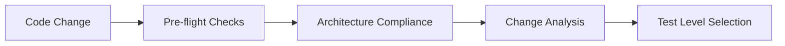
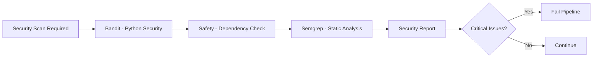
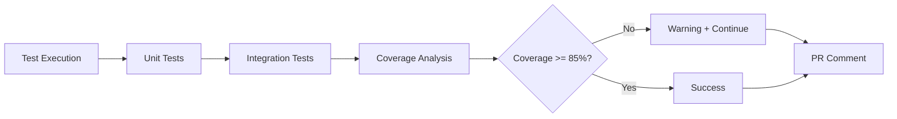
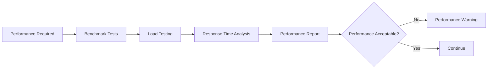
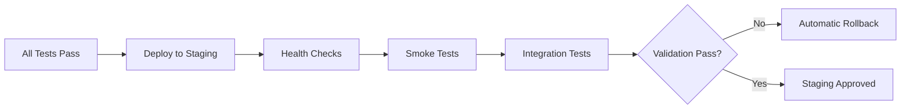
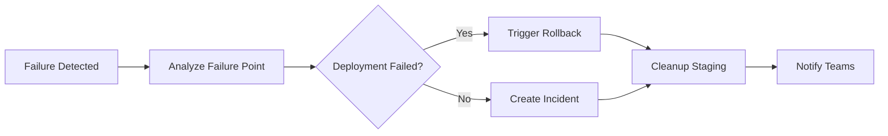
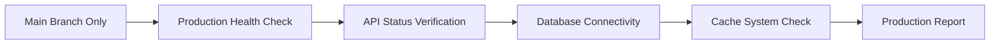

# Enhanced CI/CD Pipeline Documentation

## Overview

The Netra AI platform uses a comprehensive, reliability-focused CI/CD pipeline that ensures code quality, security, and performance at every stage of the development lifecycle. This enhanced pipeline includes automated testing, security scanning, performance monitoring, staging validation, and intelligent failure handling with automatic rollback capabilities.

## Pipeline Architecture

### Core Workflows

1. **Enhanced CI/CD Pipeline** (`ci-enhanced.yml`)
   - Primary pipeline with comprehensive testing and deployment
   - Includes security scanning, performance testing, and staging validation
   - Automatic rollback on failures
   - Production smoke tests for main branch

2. **Health Monitoring** (`health-monitoring.yml`)
   - Continuous monitoring of production and staging environments
   - Automated alert management and incident creation
   - Performance metrics collection and trending

3. **Pipeline Optimization** (`pipeline-optimization.yml`)
   - Automated analysis of pipeline performance and costs
   - Optimization recommendations and implementation planning
   - Cache strategy analysis and parallelization opportunities

4. **Workflow Orchestrator** (`orchestrator.yml`)
   - Hierarchical test execution based on change analysis
   - Intelligent test level selection
   - Resource optimization and parallel execution

## Pipeline Stages

### Stage 1: Pre-flight Checks and Architecture Compliance



**Components:**
- **Pre-flight Checks**: Analyzes changed files and determines required test levels
- **Architecture Compliance**: Runs `check_architecture_compliance.py` to ensure 300-line modules and 8-line functions
- **Change Analysis**: Categorizes changes (security-sensitive, performance-critical, etc.)
- **Test Level Selection**: Automatically selects appropriate test level (smoke, unit, integration, comprehensive)

**Triggers:**
- Security-sensitive files → Integration tests + Security scan
- Performance-critical files → Integration tests + Performance tests
- Core system files → Comprehensive tests + All validations

### Stage 2: Security Scanning



**Security Tools:**
- **Bandit**: Python security linter for common security issues
- **Safety**: Checks Python dependencies for known security vulnerabilities
- **Semgrep**: Static analysis for custom security patterns

**Failure Handling:**
- Critical security issues immediately fail the pipeline
- Detailed security reports are generated and stored
- Security incidents are automatically created for tracking

### Stage 3: Core Testing with Coverage



**Testing Strategy:**
- **Hierarchical Execution**: Smoke → Unit → Integration → Comprehensive
- **Parallel Matrix**: Multiple test environments and configurations
- **Coverage Requirements**: 85% minimum threshold with detailed reporting
- **Adaptive Testing**: Test level based on change analysis

**Coverage Features:**
- Combined coverage reports from all test runs
- HTML coverage reports with detailed file analysis
- Coverage badges and PR comments
- Historical coverage trending

### Stage 4: Performance Testing



**Performance Testing Components:**
- **Benchmark Tests**: Using pytest-benchmark for code performance
- **Load Testing**: Using Locust for API endpoint testing
- **Response Time Analysis**: Monitoring average response times
- **Performance Trending**: Historical performance data collection

**Performance Thresholds:**
- API response time: < 2 seconds average
- Database query time: < 500ms average
- Memory usage: < 512MB for typical operations

### Stage 5: Staging Deployment and Validation



**Staging Features:**
- **Automatic Deployment**: Creates isolated staging environment
- **Health Validation**: Comprehensive endpoint testing
- **Critical Path Testing**: User journey validation
- **Automatic Cleanup**: Environment cleanup after validation

**Validation Checks:**
- `/health` endpoint returns 200
- `/api/v1/status` endpoint responds correctly
- Database connectivity verified
- Cache systems operational
- Authentication systems functional

### Stage 6: Failure Handling and Rollback



**Rollback Mechanisms:**
- **Automatic Detection**: Monitors all pipeline stages
- **Fast Rollback**: < 5 minutes rollback time
- **Environment Cleanup**: Automatic resource cleanup
- **Incident Creation**: Detailed failure analysis and tracking

**Notification Channels:**
- GitHub Issues for incident tracking
- Slack/Discord webhooks for real-time alerts
- Email notifications for critical failures
- PR comments with failure analysis

### Stage 7: Production Smoke Tests



**Production Testing:**
- **Read-only Operations**: No data modifications
- **Critical Endpoints**: Health, status, and connectivity checks
- **Performance Monitoring**: Response time tracking
- **Alert Integration**: Immediate notification on failures

## Health Monitoring System

### Continuous Monitoring

The health monitoring system runs every 15 minutes and performs comprehensive checks:

```yaml
# Monitoring Schedule
- Every 15 minutes: Basic health checks
- Every 6 hours: Detailed diagnostics
- Daily: Performance trending analysis
- Weekly: Comprehensive health reports
```

**Monitored Metrics:**
- **Availability**: Endpoint response rates
- **Performance**: Response times and throughput
- **Errors**: Error rates and failure patterns
- **Resources**: CPU, memory, and storage utilization

### Alert Management

**Alert Levels:**
- **Critical**: System unavailable, immediate action required
- **Warning**: Degraded performance, monitoring required
- **Info**: Normal operations, informational only

**Automated Actions:**
- **Issue Creation**: Automatic GitHub issues for tracking
- **Escalation**: Progressive alert escalation
- **Resolution**: Automatic issue closure when resolved
- **Notification**: Multi-channel alert delivery

## Pipeline Optimization

### Performance Analysis

The optimization system analyzes pipeline performance monthly:

```python
# Optimization Metrics
- Job duration analysis
- Resource utilization patterns
- Cost analysis and projections
- Parallelization opportunities
- Cache effectiveness
```

**Optimization Categories:**
1. **Performance**: Duration reduction strategies
2. **Cost**: Resource usage optimization
3. **Parallelization**: Concurrent execution opportunities
4. **Caching**: Dependency and build artifact caching

### Automated Recommendations

The system generates actionable optimization recommendations:

```markdown
## Example Recommendations
- Parallelize test execution (30-50% faster)
- Optimize Docker layer caching (40% build time reduction)
- Use matrix strategy for multi-environment testing
- Switch to faster runners for CPU-intensive jobs
```

## Configuration and Customization

### Environment Variables

```yaml
# Core Configuration
PYTHON_VERSION: '3.11'
NODE_VERSION: '20'
SECURITY_SCAN_TIMEOUT: 15
PERFORMANCE_TEST_TIMEOUT: 20
ROLLBACK_TIMEOUT: 5

# Thresholds
ALERT_THRESHOLD_RESPONSE_TIME: 2000  # 2 seconds
ALERT_THRESHOLD_ERROR_RATE: 5        # 5% error rate
COVERAGE_THRESHOLD: 85               # 85% minimum coverage
```

### Workflow Inputs

The enhanced pipeline accepts various inputs for customization:

```yaml
# Manual Trigger Options
force_full_pipeline: boolean        # Force comprehensive testing
skip_security_scan: boolean         # Emergency security scan bypass
deploy_to_staging: boolean          # Control staging deployment
test_level: choice                  # Override automatic test level selection
```

### Secrets and Variables

Required secrets for full functionality:

```yaml
# Required Secrets
GCP_STAGING_SA_KEY                  # GCP service account for staging
TEST_DATABASE_URL                   # Test database connection
GEMINI_API_KEY                      # LLM API for AI features
SLACK_WEBHOOK_URL                   # Slack notifications
DISCORD_WEBHOOK_URL                 # Discord notifications

# Required Variables
CLOUD_PROVIDER                      # Cloud provider configuration
WORKFLOWS_AI_AUTOFIX_ENABLED        # Enable AI-powered fixes
DISCORD_WEBHOOK_URL                 # Discord webhook URL
SLACK_WEBHOOK_URL                   # Slack webhook URL
```

## Monitoring and Metrics

### Pipeline Metrics

The system tracks comprehensive pipeline metrics:

```json
{
  "pipeline_metrics": {
    "success_rate": "95.2%",
    "average_duration": "12.5 minutes",
    "failure_rate": "4.8%",
    "cost_per_run": "$2.45",
    "optimization_opportunities": 7
  }
}
```

### Health Metrics

Production and staging health metrics:

```json
{
  "health_metrics": {
    "production": {
      "availability": "99.9%",
      "avg_response_time": "245ms",
      "error_rate": "0.1%"
    },
    "staging": {
      "active_environments": 3,
      "healthy_environments": 3,
      "average_deployment_time": "4.2 minutes"
    }
  }
}
```

## Troubleshooting Guide

### Common Issues and Solutions

#### Pipeline Failures

**Architecture Compliance Failures:**
```bash
# Check for violations
python scripts/check_architecture_compliance.py --strict

# Fix common issues
- Split files > 300 lines into modules
- Decompose functions > 8 lines
- Update type annotations
```

**Security Scan Failures:**
```bash
# Review security issues
bandit -r app/ -f json -o bandit_report.json

# Fix common security issues
- Update vulnerable dependencies
- Fix hardcoded secrets
- Address SQL injection risks
```

**Test Failures:**
```bash
# Run specific test level
python test_runner.py --level unit
python test_runner.py --level integration

# Debug test failures
pytest -v --tb=long --failed-first
```

#### Staging Deployment Issues

**Health Check Failures:**
```bash
# Manual health check
curl -f "https://staging-env.example.com/health"

# Check logs
kubectl logs -n staging deployment/api-server
```

**Rollback Procedures:**
```bash
# Manual rollback trigger
gh workflow run staging-cleanup.yml \
  -f environment=staging-ci \
  -f reason="Manual rollback" \
  -f force=true
```

### Performance Optimization

**Slow Pipeline Investigation:**
1. Check job duration metrics in workflow logs
2. Review parallelization opportunities
3. Analyze cache hit rates
4. Consider runner type optimization

**Cost Optimization:**
1. Review monthly cost reports
2. Optimize expensive jobs first
3. Consider usage-based runner allocation
4. Implement intelligent caching strategies

## Best Practices

### Development Workflow

1. **Feature Branches**: Always use feature branches for development
2. **Small Commits**: Keep commits focused and atomic
3. **Test Locally**: Run `python test_runner.py --level unit` before pushing
4. **Architecture Compliance**: Ensure compliance before committing

### Pipeline Management

1. **Monitor Alerts**: Respond to health monitoring alerts promptly
2. **Review Reports**: Check weekly optimization reports
3. **Update Dependencies**: Keep security dependencies current
4. **Performance Monitoring**: Track pipeline performance trends

### Security Guidelines

1. **Secrets Management**: Never commit secrets to code
2. **Dependency Updates**: Regularly update vulnerable dependencies
3. **Access Control**: Limit production access appropriately
4. **Audit Logs**: Monitor and review security audit logs

## Future Enhancements

### Planned Features

1. **AI-Powered Debugging**: Automated failure analysis and suggestions
2. **Predictive Optimization**: ML-based pipeline optimization
3. **Advanced Security**: Dynamic security testing integration
4. **Multi-Cloud Support**: Cross-cloud deployment capabilities

### Integration Roadmap

1. **Q1**: Enhanced security scanning with custom rules
2. **Q2**: Advanced performance profiling and optimization
3. **Q3**: Multi-environment promotion pipeline
4. **Q4**: Full AI-powered pipeline management

## Support and Contact

For pipeline issues or questions:

1. **Create an Issue**: Use the GitHub issue tracker for bugs and feature requests
2. **Check Documentation**: Review this documentation and workflow files
3. **Monitor Alerts**: Watch for automated alerts and notifications
4. **Review Logs**: Check workflow run logs for detailed information

---

*This documentation is automatically updated with pipeline changes and enhancements.*