# Claude Instance Orchestrator - Planning Index & Architecture

**Created:** 2025-09-15
**Purpose:** Comprehensive index of Claude Instance Orchestrator enhancement plans with visual architecture diagrams

## Overview

This index catalogs all planning documents related to the Claude Instance Orchestrator (`scripts/claude-instance-orchestrator.py`) and provides visual representations of the proposed architectures and workflows.

## 📋 Plan Documents Index

### 1. [Claude Instance Orchestrator Enhancement Plan](claude-instance-orchestrator-enhancement-plan.md)
**Status:** Phase 0 - Discovery & Alignment
**Scope:** Multi-mode orchestrator with dependency chaining

**Key Features:**
- Single-instance execution mode
- Generic CLI command support
- Dependent command chaining with DAG validation
- Conditional logic and failure policies

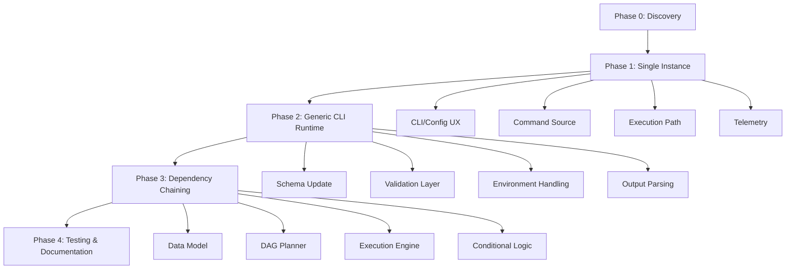

### 2. [Netra Application Integration Plan](CLAUDE_INSTANCE_ORCHESTRATOR_NETRA_INTEGRATION_PLAN.md)
**Status:** Planning Phase
**Scope:** Enterprise integration with Netra platform

**Key Features:**
- Authentication & authorization integration
- 3-tier state persistence (Redis/PostgreSQL/ClickHouse)
- Chat system integration with WebSocket events
- Dynamic optimization advice from Netra API
- Enterprise orchestration dashboard

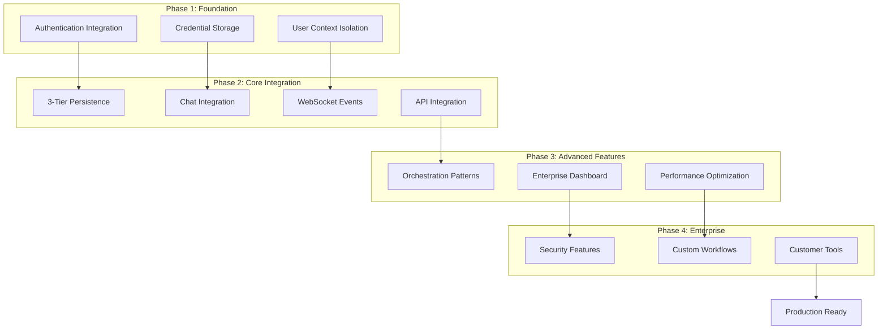

### 3. [Universal CLI Orchestrator Enhancement Plan](../scripts/universal-cli-orchestrator-enhancement-plan.md)
**Status:** Design Phase
**Scope:** Universal CLI tool orchestration platform

**Key Features:**
- Support for any CLI tool (Claude, OpenAI, Docker, etc.)
- Dependency graph execution with conditional logic
- Single command mode for one-off executions
- Cross-tool integration pipelines

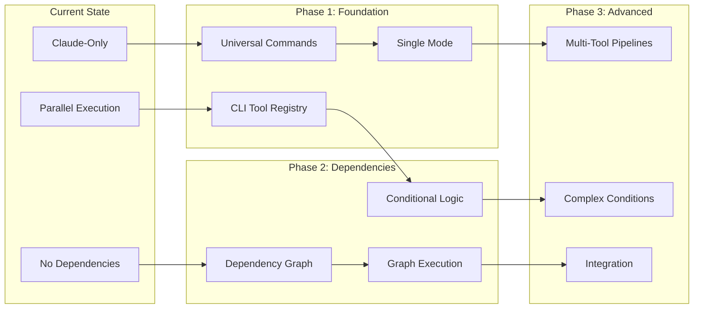

## 🏗️ Architecture Overview

### Current Architecture (claude-instance-orchestrator.py)

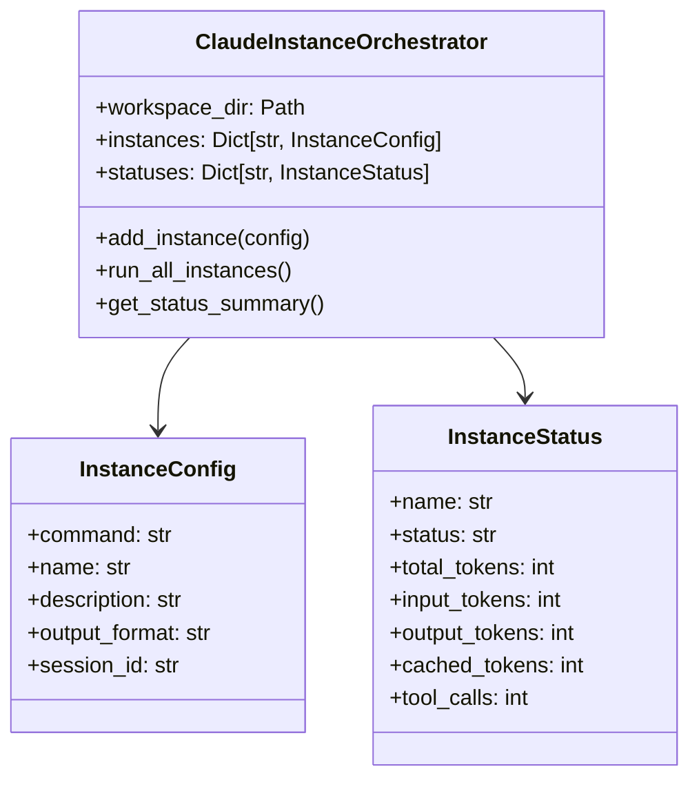

### Proposed Enhanced Architecture

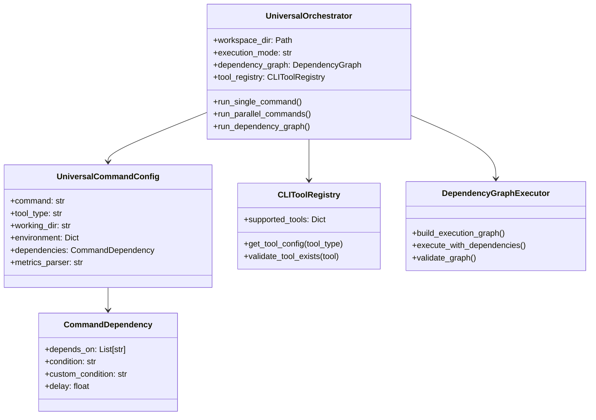

## 🔄 Execution Flow Diagrams

### Single Instance Mode

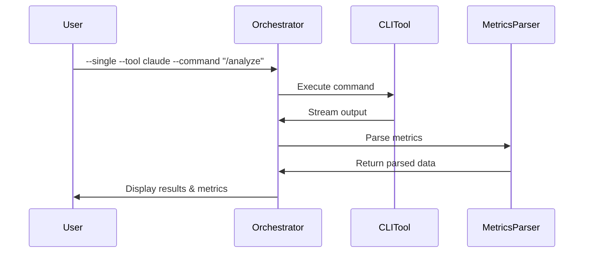

### Dependency Graph Execution

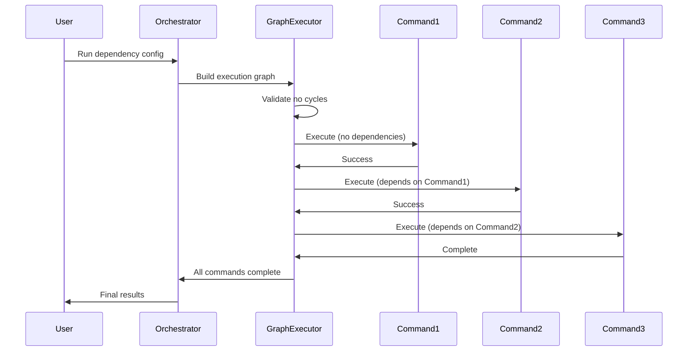

### Netra Integration Flow

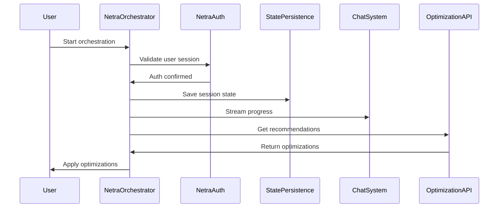

## 🔗 Cross-Plan Relationships

### Feature Matrix

| Feature | Enhancement Plan | Integration Plan | Universal Plan |
|---------|------------------|------------------|----------------|
| Single Instance Mode | ✅ Phase 1 | ➖ | ✅ Phase 1 |
| Generic CLI Support | ✅ Phase 2 | ➖ | ✅ Foundation |
| Dependency Chaining | ✅ Phase 3 | ➖ | ✅ Phase 2 |
| Netra Auth Integration | ➖ | ✅ Phase 1 | ➖ |
| State Persistence | ➖ | ✅ Phase 2 | ➖ |
| Chat Integration | ➖ | ✅ Phase 2 | ➖ |
| Enterprise Dashboard | ➖ | ✅ Phase 4 | ➖ |
| Multi-Tool Pipelines | ➖ | ➖ | ✅ Phase 3 |

### Implementation Priority

```mermaid
gantt
    title Claude Orchestrator Implementation Timeline
    dateFormat  X
    axisFormat %s

    section Foundation
    Universal CLI Support    :active, foundation, 0, 2
    Single Instance Mode     :active, single, 0, 2

    section Core Features
    Dependency Engine        :depends, 2, 4
    Graph Execution         :graph, 2, 4

    section Netra Integration
    Authentication          :auth, 4, 6
    State Persistence       :state, 4, 6
    Chat Integration        :chat, 6, 8

    section Enterprise
    Dashboard              :dashboard, 8, 10
    Advanced Patterns      :patterns, 8, 10
    Production Ready       :prod, 10, 12
```

## 📊 Metrics & Success Criteria

### Technical Metrics

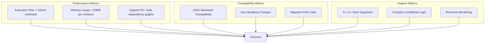

### Business Value Metrics

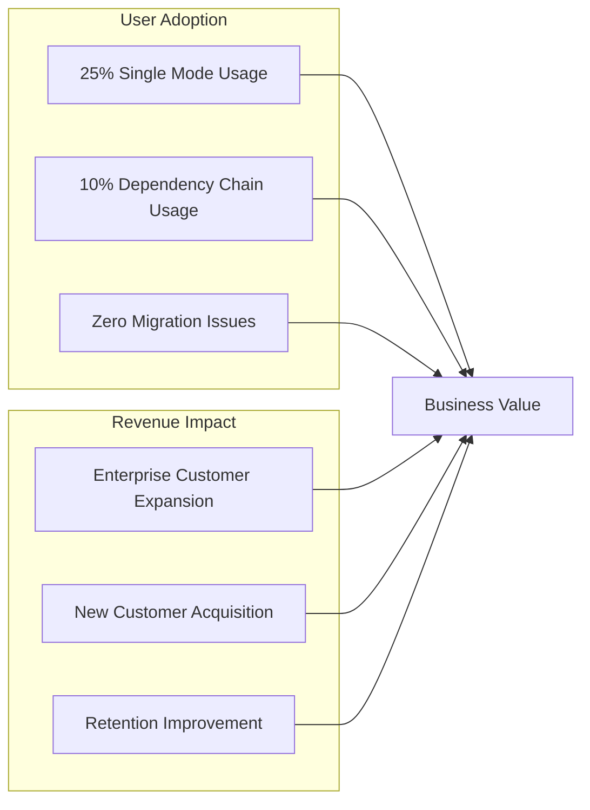

## 🚀 Next Steps

### Immediate Actions (Week 1-2)
1. **Stakeholder Alignment**: Review and approve integration strategy
2. **Technical Discovery**: Analyze current `scripts/claude` integration points
3. **Resource Allocation**: Assign development team for Phase 1 implementation
4. **Architecture Review**: Validate proposed architectures with senior engineers

### Phase Implementation Priority
1. **Universal CLI Foundation** (Weeks 1-2): Backward compatible expansion
2. **Dependency Engine** (Weeks 3-4): Core dependency execution logic
3. **Netra Integration** (Weeks 5-8): Authentication and state persistence
4. **Enterprise Features** (Weeks 9-12): Dashboard and advanced patterns

### Success Validation
- [ ] All existing workflows continue working unchanged
- [ ] New single-instance mode provides value for simple use cases
- [ ] Dependency chains enable complex automation workflows
- [ ] Netra integration delivers enterprise-grade orchestration platform

---

**Note:** This index serves as the master reference for all Claude Instance Orchestrator enhancement efforts. Each plan should be reviewed and updated as implementation progresses to ensure alignment with business goals and technical constraints.