# Claude Instance Orchestrator - Planning Index & Architecture

**Created:** 2025-09-15
**Purpose:** Comprehensive index of Claude Instance Orchestrator enhancement plans with visual architecture diagrams

## Overview

This index catalogs all planning documents related to the Claude Instance Orchestrator (`scripts/claude-instance-orchestrator.py`) and provides visual representations of the proposed architectures and workflows.

## 📋 Plan Documents Index

### A. Core Orchestrator Plans

#### 1. [Claude Instance Orchestrator Enhancement Plan](claude-instance-orchestrator-enhancement-plan.md)
**Status:** Phase 0 - Discovery & Alignment
**Scope:** Multi-mode orchestrator with dependency chaining

**Key Features:**
- Single-instance execution mode
- Generic CLI command support
- Dependent command chaining with DAG validation
- Conditional logic and failure policies


#### 2. [Universal CLI Orchestrator Enhancement Plan](../scripts/universal-cli-orchestrator-enhancement-plan.md)
**Status:** Design Phase
**Scope:** Universal CLI tool orchestration platform

**Key Features:**
- Support for any CLI tool (Claude, OpenAI, Docker, etc.)
- Dependency graph execution with conditional logic
- Single command mode for one-off executions
- Cross-tool integration pipelines


#### 3. [Modernization Summary](../scripts/claude-orchestrator-modernization-summary.md)
**Status:** Implementation Complete ✅
**Scope:** JSON-first token parsing modernization with backward compatibility

**Achievements:**
- Replaced regex-based token parsing with JSON-first approach
- 100% backward compatibility maintained
- Enhanced accuracy and reliability
- Future-proof architecture for Claude Code integration
- Performance improvements and better maintainability

```mermaid
graph TD
    subgraph "Old Architecture"
        A1[Complex Regex Patterns]
        A2[Text Line Processing]
        A3[Pattern Matching]
        A4[Token Extraction]
    end

    subgraph "New Architecture"
        B1[JSON-First Parsing]
        B2[Structured Data Access]
        B3[Fallback to Regex]
        B4[Enhanced Accuracy]
    end

    subgraph "Benefits Achieved"
        C1[✅ Improved Accuracy]
        C2[✅ Enhanced Reliability]
        C3[✅ Future-Proof]
        C4[✅ Better Performance]
        C5[✅ Maintainability]
    end

    A1 --> B1
    A2 --> B2
    A3 --> B3
    A4 --> B4
    B1 --> C1
    B2 --> C2
    B3 --> C3
    B4 --> C4
    B4 --> C5
```



### B. Deployment & Distribution Plans

#### 4. [Deployment Strategies Analysis](claude-orchestrator-deployment-strategies-plan.md)
**Status:** Comprehensive Analysis Complete
**Scope:** Six deployment strategies with security and business impact analysis

**Key Strategies Analyzed:**
- Python Pip Package (Low effort, quick deployment)
- Compiled Executable with PyInstaller/Nuitka (Security hardened)
- Language Rewrite in Rust (Maximum performance/security)
- Node.js/TypeScript Rewrite (JavaScript ecosystem alignment)
- Secure Container Distribution (Enterprise-ready)
- Hybrid Web Application (Full platform approach)

```mermaid
graph TB
    subgraph "Deployment Options"
        D1[Pip Package<br/>✅ Quick<br/>❌ Source Exposed]
        D2[PyInstaller<br/>✅ Executable<br/>⚠️ Size/Performance]
        D3[Rust Rewrite<br/>✅ Performance<br/>❌ Dev Time]
        D4[Node.js<br/>✅ Ecosystem<br/>⚠️ Runtime Deps]
        D5[Container<br/>✅ Security<br/>⚠️ Complexity]
        D6[Web App<br/>✅ Full Platform<br/>❌ Infrastructure]
    end

    subgraph "Recommended Phases"
        P1[Phase 1: PyInstaller + Pip<br/>Weeks 1-4]
        P2[Phase 2: Container + Signing<br/>Weeks 5-12]
        P3[Phase 3: Language Evaluation<br/>Months 4-8]
    end

    D1 --> P1
    D2 --> P1
    P1 --> P2
    D5 --> P2
    P2 --> P3
    D3 --> P3
    D6 --> P3
```



#### 5. [Deployment Strategy Plan](claude-orchestrator-deployment-strategy-plan.md)
**Status:** Implementation Focused
**Scope:** Tactical deployment decisions with timeline and dependencies

**Key Decision Points:**
- Alignment with existing plans from the orchestrator index
- Security vs effort trade-off analysis with quadrant mapping
- 10-week execution plan from stabilization to enterprise delivery
- Decision gates for rewrite spikes (Rust vs Node.js)


### C. Netra Platform Integration Plans

#### 6. [Netra Application Integration Plan](CLAUDE_INSTANCE_ORCHESTRATOR_NETRA_INTEGRATION_PLAN.md)
**Status:** Planning Phase
**Scope:** Enterprise integration with Netra platform

**Key Features:**
- Authentication & authorization integration
- 3-tier state persistence (Redis/PostgreSQL/ClickHouse)
- Chat system integration with WebSocket events
- Dynamic optimization advice from Netra API
- Enterprise orchestration dashboard


#### 7. [Chat Resilience Enhancement Plan](CHAT_RESILIENCE_ENHANCEMENT_PLAN.md)
**Status:** Infrastructure Design
**Scope:** Chat interface availability and resilience improvements

**Expected Improvements:**
- WebSocket uptime: 95% → 99.5%
- Response time (95th percentile): ~3s → <2s
- Recovery time from network issues: 2-3min → <30s
- Message delivery success: ~95% → 99.9%
- Zero data loss during graceful shutdowns


### D. Business Critical & Remediation Plans

#### 8. [Issue #1197 Golden Path Comprehensive Remediation Plan](ISSUE_1197_GOLDEN_PATH_COMPREHENSIVE_REMEDIATION_PLAN.md)
**Status:** P0 - Business Critical
**Scope:** $500K+ ARR Golden Path functionality validation and enterprise readiness

**Business Impact:**
- Golden Path user flow (Login → AI Responses) validation
- Comprehensive E2E test validation infrastructure
- Enterprise deployment confidence
- System health: 95% overall with "FULLY OPERATIONAL" Golden Path

```mermaid
graph TB
    subgraph "Current State Assessment"
        CSA1[✅ 95% System Health]
        CSA2[✅ Infrastructure Operational]
        CSA3[✅ 60+ Test Files Exist]
        CSA4[❌ E2E Validation Gap]
        CSA5[❌ Test Infrastructure Issues]
    end

    subgraph "Remediation Strategy"
        RS1[Validation Enhancement]
        RS2[Test Infrastructure Fix]
        RS3[Business Value Tracking]
        RS4[Comprehensive Execution]
    end

    subgraph "Expected Outcomes"
        EO1[Enterprise Ready]
        EO2[$500K+ ARR Protected]
        EO3[Complete E2E Coverage]
        EO4[Deployment Confidence]
    end

    CSA1 --> RS1
    CSA3 --> RS2
    CSA4 --> RS3
    CSA5 --> RS4
    RS1 --> EO1
    RS2 --> EO2
    RS3 --> EO3
    RS4 --> EO4
```



#### 9. [Agent Modernization Plan](agents/AGENT_MODERNIZATION_PLAN.md)
**Status:** Architecture Alignment
**Scope:** Standardize all agents to modern execution pattern

**Modern Agent Standard:**
- BaseExecutionInterface with standardized contracts
- ReliabilityManager with circuit breaker and retry logic
- ExecutionMonitor for performance tracking
- Structured error management and fallback strategies


#### 10. [SSOT Violations Remediation Plan - Issue #1065](SSOT_VIOLATIONS_REMEDIATION_PLAN_ISSUE_1065.md)
**Status:** Comprehensive Remediation
**Scope:** 27,944 SSOT violations across mock, infrastructure, and import patterns

**Violation Breakdown:**
- Mock Duplication: 22,886 violations (82% of total)
- Test Infrastructure: 2,053 violations (7% of total)
- Import Patterns: 3,005 violations (11% of total)

```mermaid
graph TD
    subgraph "Violation Types"
        VT1[Mock Duplication<br/>22,886 (82%)]
        VT2[Test Infrastructure<br/>2,053 (7%)]
        VT3[Import Patterns<br/>3,005 (11%)]
    end

    subgraph "Remediation Phases"
        RP1[Phase 1: Mock Consolidation]
        RP2[Phase 2: Infrastructure SSOT]
        RP3[Phase 3: Import Standardization]
        RP4[Phase 4: Validation & Testing]
    end

    subgraph "Expected Benefits"
        EB1[Zero Violations]
        EB2[Simplified Maintenance]
        EB3[Consistent Patterns]
        EB4[System Stability]
    end

    VT1 --> RP1
    VT2 --> RP2
    VT3 --> RP3
    RP1 --> EB1
    RP2 --> EB2
    RP3 --> EB3
    RP4 --> EB4
```

#### 11. [Unified Infrastructure Remediation Plan](UNIFIED_INFRASTRUCTURE_REMEDIATION_PLAN.md)
**Status:** Root Cause Remediation
**Scope:** Infrastructure connectivity cluster issues (#395, #372, #367)

**Critical Issues Addressed:**
- Service-to-service communication failures
- VPC networking configuration drift
- Deployment state inconsistencies
- Authentication and WebSocket connection timeouts


## 🏗️ Architecture Overview

### Current Architecture (claude-instance-orchestrator.py)


### Proposed Enhanced Architecture


## 🔄 Execution Flow Diagrams

### Single Instance Mode


### Dependency Graph Execution


### Netra Integration Flow


## 🔗 Cross-Plan Relationships

### Feature Matrix

| Feature | Core Plans | Deployment Plans | Platform Plans | Business Critical Plans |
|---------|------------|------------------|----------------|-------------------------|
| **Core Orchestrator Features** ||||
| Single Instance Mode | ✅ Enhancement Plan | ➖ | ➖ | ➖ |
| Generic CLI Support | ✅ Enhancement + Universal | ➖ | ➖ | ➖ |
| Dependency Chaining | ✅ Enhancement + Universal | ➖ | ➖ | ➖ |
| JSON Token Parsing | ✅ Modernization Complete | ➖ | ➖ | ➖ |
| Backward Compatibility | ✅ Modernization 100% | ➖ | ➖ | ➖ |
| **Deployment & Security** ||||
| Package Distribution | ➖ | ✅ 6 Strategies Analysis | ➖ | ➖ |
| Container Strategy | ➖ | ✅ Security + Timeline | ➖ | ➖ |
| Language Rewrite Options | ➖ | ✅ Rust/Node Analysis | ➖ | ➖ |
| Deployment Security | ➖ | ✅ Comprehensive Framework | ➖ | ➖ |
| **Platform Integration** ||||
| Netra Auth Integration | ➖ | ➖ | ✅ Integration Plan | ➖ |
| State Persistence | ➖ | ➖ | ✅ 3-Tier Architecture | ➖ |
| Chat Integration | ➖ | ➖ | ✅ Integration + Resilience | ➖ |
| WebSocket Resilience | ➖ | ➖ | ✅ Chat Resilience Plan | ➖ |
| Enterprise Dashboard | ➖ | ➖ | ✅ Integration Phase 4 | ➖ |
| **Business Critical & Infrastructure** ||||
| Golden Path Validation | ➖ | ➖ | ➖ | ✅ Issue #1197 Plan |
| Agent Modernization | ➖ | ➖ | ➖ | ✅ Agent Plan |
| SSOT Violations Fix | ➖ | ➖ | ➖ | ✅ Issue #1065 Plan |
| Infrastructure Remediation | ➖ | ➖ | ➖ | ✅ Unified Infrastructure |
| Multi-Tool Pipelines | ✅ Universal Plan | ➖ | ➖ | ➖ |

### Implementation Priority

```mermaid
gantt
    title Claude Orchestrator & Platform Implementation Timeline
    dateFormat  X
    axisFormat %s

    section Completed ✅
    JSON Modernization      :done, json, 0, 1

    section Immediate (Current)
    Deployment Analysis     :done, deploy-analysis, 1, 2
    Package Strategy        :active, package, 1, 3
    PyInstaller Build       :active, pyinst, 2, 4

    section Core Orchestrator
    Universal CLI Support   :foundation, 3, 5
    Single Instance Mode    :single, 3, 5
    Container Security      :container, 4, 6
    Dependency Engine       :depends, 5, 7
    Graph Execution        :graph, 5, 7

    section Business Critical
    Golden Path Validation  :critical, golden, 2, 4
    SSOT Violations Fix     :critical, ssot, 3, 5
    Infrastructure Fix      :critical, infra, 3, 6
    Agent Modernization     :agent-mod, 4, 7

    section Platform Integration
    Authentication         :auth, 6, 8
    State Persistence      :state, 6, 8
    Chat Resilience        :chat-res, 7, 9
    Chat Integration       :chat, 8, 10

    section Enterprise Ready
    Language Evaluation    :lang-eval, 8, 10
    Dashboard             :dashboard, 9, 11
    Advanced Patterns     :patterns, 9, 11
    Production Ready      :prod, 10, 12
```

## 📊 Metrics & Success Criteria

### Technical Metrics


### Business Value Metrics


## 🚀 Next Steps

### Immediate Actions (Week 1-2)
1. **✅ JSON Modernization**: Complete - Enhanced parsing with backward compatibility
2. **🔄 Deployment Strategy**: In progress - PyInstaller executable + pip package
3. **📦 Package Structure**: Create proper Python package with setup.py/pyproject.toml
4. **🔧 Build Pipeline**: Configure CI/CD for automated building and distribution

### Current Implementation Priority (Based on Analysis)
1. **🎯 Deployment Security** (Weeks 1-4):
   - PyInstaller executable for enterprise security
   - Pip package for developer convenience
   - Code signing and distribution setup
2. **🔧 Universal CLI Foundation** (Weeks 3-5):
   - Backward compatible expansion to support multiple CLI tools
   - Single instance mode for one-off executions
3. **📊 Container Strategy** (Weeks 4-6):
   - Secure container distribution with vulnerability scanning
   - Enterprise-ready deployment options
4. **🌐 Netra Integration** (Weeks 7-10):
   - Authentication and state persistence integration
   - Chat system integration for enterprise dashboard

### Updated Success Validation
- [✅] **Modernization Complete**: JSON-first parsing with 100% backward compatibility
- [ ] **Deployment Ready**: Executable and package distribution established
- [ ] **Security Hardened**: Code signing and vulnerability scanning operational
- [ ] **Universal Support**: Multiple CLI tools supported beyond Claude
- [ ] **Enterprise Integration**: Netra platform integration functional
- [ ] **Performance Validated**: All solutions meet performance and security requirements

### Decision Points Ahead
1. **Week 4**: Evaluate PyInstaller vs container-first approach based on early results
2. **Week 6**: Decision gate for language rewrite spike (Rust vs Node.js)
3. **Week 8**: Finalize Netra integration scope based on deployment strategy success
4. **Week 10**: Choose long-term platform direction (Python evolution vs rewrite)

## 📊 Document Status Summary

### Implementation Status Overview


### Plan Completion Matrix

| Document | Status | Completion % | Next Actions |
|----------|--------|--------------|--------------|
| **Enhancement Plan** | ✅ Complete | 100% | Ready for implementation |
| **Integration Plan** | ✅ Complete | 100% | Awaiting deployment foundation |
| **Universal CLI Plan** | ✅ Complete | 100% | Dependent on package structure |
| **Deployment Strategies** | ✅ Complete | 100% | Implementation guidelines ready |
| **Strategy Plan** | ✅ Complete | 100% | Decision framework established |
| **Modernization Summary** | ✅ Complete | 100% | Implementation complete |
| **Package Implementation** | 🔄 In Progress | 25% | Setup.py and PyInstaller config |
| **Security Hardening** | ⏳ Planned | 0% | Code signing and scanning |
| **Universal CLI Implementation** | ⏳ Planned | 0% | CLI tool registry and single mode |
| **Netra Integration Implementation** | ⏳ Planned | 0% | Authentication and persistence |

### Key Achievements to Date
- ✅ **Comprehensive Planning**: All major enhancement paths documented
- ✅ **Deployment Strategy**: Six strategies analyzed with recommendations
- ✅ **JSON Modernization**: Core parsing infrastructure upgraded
- ✅ **Backward Compatibility**: 100% maintained throughout modernization
- ✅ **Security Analysis**: Enterprise security requirements identified
- ✅ **Timeline Established**: Clear 12-week implementation roadmap

---

**Note:** This index serves as the master reference for all Claude Instance Orchestrator enhancement efforts. Each plan should be reviewed and updated as implementation progresses to ensure alignment with business goals and technical constraints.

**Last Updated:** 2025-09-15 with deployment analysis and modernization completion