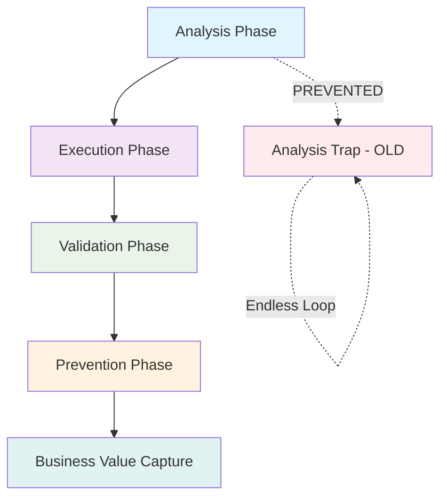

# Critical Remediation Process Guide

## Executive Summary

This document establishes the systematic process for managing P0 issue remediation to prevent the "Analysis Trap" organizational anti-pattern. The process ensures that excellent technical analysis translates into systematic execution and prevents issue recurrence.

**Core Problem Solved:** Converting Five Whys analysis → Systematic Execution → Business Value Protection

## Table of Contents

1. [Process Overview](#process-overview)
2. [Phase-by-Phase Guide](#phase-by-phase-guide)
3. [Templates and Tools](#templates-and-tools)
4. [Integration Points](#integration-points)
5. [Success Metrics](#success-metrics)
6. [Escalation Procedures](#escalation-procedures)

## Process Overview

### The Four-Phase Remediation Process



### Key Success Factors

1. **Systematic Tracking:** Every P0 issue gets tracked from identification to validation
2. **Owner Accountability:** Clear ownership with deadlines and progress tracking
3. **Automated Validation:** Integration with existing test infrastructure
4. **Business Value Focus:** Quantified business impact and value protection
5. **Recurrence Prevention:** Documented prevention measures for each resolved issue

## Phase-by-Phase Guide

### Phase 1: Analysis → Execution Transition

**Objective:** Convert Five Whys analysis into trackable remediation items

**Duration:** 1-2 hours after analysis completion

**Owner:** Analysis author + System architect

#### Step 1.1: Extract Actionable Items

Use the Critical Remediation Tracker to automatically extract items:

```bash
# Extract issues from Five Whys analysis
python scripts/critical_remediation_tracker.py extract-issues \
  --analysis-file reports/bugs/STARTUP_FAILURE_FIVE_WHYS_ANALYSIS_20250908.md \
  --auto-add

# Expected output:
# Extracted 3 issues from analysis file
# - P0-20250908-001: Critical Fix: Fix Async/Await Chain in SMD startup
# - P1-20250908-002: Investigation: Verify WebSocket manager instance type
# - P1-20250908-003: Investigation: Test complete startup sequence
```

#### Step 1.2: Assign Ownership and Deadlines

```bash
# Assign P0 issue with 24-hour deadline
python scripts/critical_remediation_tracker.py track \
  --issue-id P0-20250908-001 \
  --owner "Claude Code" \
  --deadline "2025-09-09T11:45:00" \
  --note "Starting async/await chain fix in SMD"
```

#### Step 1.3: Business Impact Assessment

For each P0 issue, document:
- **MRR at Risk:** Monthly Recurring Revenue potentially affected
- **User Impact:** Number of users affected by continued failure
- **System Availability:** Percentage uptime impact
- **Technical Debt:** Long-term maintenance cost if not fixed

### Phase 2: Execution Phase

**Objective:** Systematically execute remediation with progress tracking

**Duration:** Variable (P0: 24 hours, P1: 72 hours)

**Owner:** Assigned engineer

#### Step 2.1: Create Execution Plan

Document specific steps with validation criteria:

```markdown
## Execution Plan for P0-20250908-001

### Technical Approach
1. **Analyze SMD startup sequence** - Identify async/await chain break
2. **Fix WebSocket manager initialization** - Ensure proper awaiting
3. **Update health check validation** - Include WebSocket manager verification
4. **Test startup sequence** - Verify complete startup without errors

### Validation Criteria
- [ ] Startup completes without DeterministicStartupError
- [ ] WebSocket manager is properly instantiated (not coroutine)
- [ ] Health checks pass for all critical services
- [ ] WebSocket events work after startup

### Risk Mitigation
- Backup current working state before changes
- Test in isolated environment first
- Have rollback plan ready
```

#### Step 2.2: Progress Tracking

Update progress every 4-6 hours for P0 issues:

```bash
python scripts/critical_remediation_tracker.py track \
  --issue-id P0-20250908-001 \
  --status in_progress \
  --note "Identified async/await issue in smd.py:465. Working on fix."
```

#### Step 2.3: Validation Integration

The tracker automatically integrates with existing test infrastructure:

- **Startup Tests:** `python tests/unified_test_runner.py --category startup`
- **WebSocket Tests:** `python tests/mission_critical/test_websocket_agent_events_suite.py`
- **Health Checks:** `python scripts/staging_health_checks.py`

### Phase 3: Validation Phase

**Objective:** Prove remediation effectiveness and system stability

**Duration:** 2-4 hours

**Owner:** QA + Original issue reporter

#### Step 3.1: Automated Validation

```bash
# Run comprehensive validation
python scripts/critical_remediation_tracker.py validate --issue-id P0-20250908-001

# Expected validation checks:
# ✓ Startup sequence test passes
# ✓ WebSocket manager instantiation verified
# ✓ Health checks pass
# ✓ No coroutine attribute errors in logs
```

#### Step 3.2: Manual Verification

For critical P0 issues, perform manual verification:

1. **End-to-End User Flow:** Complete user interaction from login to agent execution
2. **System Load Test:** Verify fix holds under normal operational load
3. **Error Log Review:** Check for any new errors introduced by the fix

#### Step 3.3: Business Validation

Confirm business impact resolution:

- **System Availability:** Measure uptime improvement
- **User Experience:** Verify no degradation in user flows
- **Performance Metrics:** Confirm no performance regression

### Phase 4: Prevention Phase

**Objective:** Prevent issue recurrence and capture learnings

**Duration:** 2-4 hours

**Owner:** System architect + Original resolver

#### Step 4.1: Root Cause Prevention

Document specific measures to prevent recurrence:

```bash
python scripts/critical_remediation_tracker.py track \
  --issue-id P0-20250908-001 \
  --note "Prevention: Added startup integration tests, async/await linting rules, health check improvements"
```

**Prevention Measures Examples:**
- **Code Quality:** Add linting rules to catch async/await issues
- **Testing:** Create integration tests for startup sequence
- **Monitoring:** Add alerts for health check failures
- **Documentation:** Update startup sequence documentation

#### Step 4.2: Knowledge Capture

Update relevant SPEC files and learnings:

- **`SPEC/learnings/startup_async_await_patterns.xml`** - Technical patterns learned
- **`SPEC/learnings/health_check_validation_improvements.xml`** - Process improvements
- **Documentation updates** - Architecture guides, troubleshooting guides

#### Step 4.3: Business Value Quantification

Calculate and record business value protected:

- **Avoided Downtime Cost:** `(Hourly Revenue × Hours Saved) - Remediation Cost`
- **Technical Debt Reduction:** Long-term maintenance cost savings
- **Process Improvement:** Time saved in future similar issues

## Templates and Tools

### Issue Template (Markdown)

```markdown
# Critical Issue: [TITLE]

## Business Impact
- **Priority:** P0/P1/P2
- **MRR at Risk:** $X/month
- **Users Affected:** X users
- **System Availability Impact:** X% uptime loss

## Technical Details
- **Root Cause:** [From Five Whys analysis]
- **Affected Systems:** [List of systems]
- **Error Patterns:** [Key error signatures]

## Remediation Plan
1. [Specific action 1]
2. [Specific action 2]
3. [Validation step 1]
4. [Validation step 2]

## Success Criteria
- [ ] [Measurable outcome 1]
- [ ] [Measurable outcome 2]
- [ ] [Business metric restored]

## Prevention Measures
- [Specific prevention action 1]
- [Specific prevention action 2]
```

### Daily Standup Integration

Include remediation status in daily standups:

```markdown
## P0 Remediation Status - [DATE]

### Completed Today
- P0-20250908-001: Async/await fix deployed and validated ✅
- P1-20250908-002: WebSocket investigation completed ✅

### In Progress
- P0-20250909-001: Database connection pool issue (Owner: Alice, Due: 2025-09-10)

### Blocked/At Risk
- P1-20250908-003: Waiting for staging environment access

### Alerts
- 2 issues due within 24 hours
- 1 issue overdue (P2 priority)
```

## Integration Points

### With Existing Systems

#### 1. Unified Test Runner Integration

The remediation tracker automatically triggers relevant tests:

```python
# In critical_remediation_tracker.py
def _run_validation_step(self, step: str, issue: RemediationIssue):
    if "startup" in step.lower():
        # Run startup tests automatically
        subprocess.run([
            "python", "tests/unified_test_runner.py", 
            "--category", "startup", "--fast-fail"
        ])
```

#### 2. Docker Health Monitoring

```python
# Integration with docker health checks
if "docker" in step.lower():
    subprocess.run([
        "python", "scripts/docker_health_check.py",
        "--comprehensive"
    ])
```

#### 3. WebSocket Validation Suite

```python
# Automatic WebSocket validation
if "websocket" in step.lower():
    subprocess.run([
        "python", "tests/mission_critical/test_websocket_agent_events_suite.py"
    ])
```

### With Business Metrics

#### 1. Revenue Protection Tracking

```python
class BusinessMetrics:
    def calculate_mrr_protection(self, issue: RemediationIssue) -> float:
        if issue.priority == IssuePriority.P0:
            return self.monthly_revenue * 0.1  # 10% MRR at risk for P0
        elif issue.priority == IssuePriority.P1:
            return self.monthly_revenue * 0.05  # 5% MRR at risk for P1
        return 0.0
```

#### 2. Uptime Improvement Tracking

```python
def track_uptime_improvement(self, issue_id: str, before: float, after: float):
    improvement = after - before
    self.metrics[issue_id]["uptime_improvement"] = improvement
    self.metrics[issue_id]["availability_sla_impact"] = improvement * 0.99  # Target 99% SLA
```

## Success Metrics

### Primary KPIs

1. **Execution Velocity**
   - P0 Issues: 95% resolved within 24 hours
   - P1 Issues: 90% resolved within 72 hours
   - Average resolution time trend (decreasing)

2. **Business Impact Mitigation**
   - MRR protected per month
   - Uptime improvement percentage
   - User experience score maintenance

3. **Recurrence Prevention**
   - Issue recurrence rate < 5%
   - Prevention measures documented: 100%
   - Knowledge base updates per resolution: 100%

### Secondary KPIs

1. **Process Efficiency**
   - Analysis-to-execution time: < 2 hours
   - Validation completion rate: 100%
   - Prevention measure implementation: 90%

2. **Team Performance**
   - On-time completion rate: 95%
   - Cross-team collaboration score
   - Process satisfaction rating

3. **Technical Quality**
   - Test coverage for fixed issues: 100%
   - Code quality improvement metrics
   - Technical debt reduction rate

## Escalation Procedures

### Level 1: Standard Escalation (4 hours overdue)

**Trigger:** P0 issue 4+ hours overdue, P1 issue 12+ hours overdue

**Actions:**
1. Automatic alert to issue owner
2. CC team lead and system architect
3. Daily standup inclusion
4. Resource reallocation consideration

**Template:**
```
🔴 CRITICAL: P0 Issue Overdue

Issue: P0-20250908-001
Title: Critical Fix: Async/await chain in SMD startup  
Owner: Claude Code
Overdue: 4.2 hours
Business Impact: $2,500 MRR at risk

Required Actions:
1. Immediate status update
2. Resource needs assessment
3. Escalation to Level 2 if not resolved in 2 hours
```

### Level 2: Management Escalation (8 hours overdue)

**Trigger:** P0 issue 8+ hours overdue, P1 issue 24+ hours overdue

**Actions:**
1. Escalate to engineering management
2. Consider additional resource allocation
3. Emergency response team activation
4. Customer communication preparation

### Level 3: Executive Escalation (24 hours overdue)

**Trigger:** P0 issue 24+ hours overdue

**Actions:**
1. Executive team notification
2. Emergency response protocol
3. Customer communication
4. Post-incident review scheduling

## Dashboard and Reporting

### Real-Time Dashboard Components

1. **Issue Status Board**
   - Open issues by priority
   - Overdue issues (red alerts)
   - Issues due within 24 hours (amber alerts)

2. **Business Impact Panel**
   - MRR at risk (current)
   - MRR protected (month-to-date)
   - Uptime impact tracking

3. **Team Performance Metrics**
   - Resolution velocity trends
   - Individual performance metrics
   - Process efficiency scores

### Weekly Executive Report

```markdown
# Weekly Remediation Report - Week of [DATE]

## Executive Summary
- Issues Resolved: 12 (P0: 3, P1: 6, P2: 3)
- Business Value Protected: $45,000 MRR
- Average Resolution Time: 8.2 hours (↓15% from last week)
- Process Adherence: 94%

## Key Wins
1. Zero P0 escalations to Level 2
2. 100% prevention measures implemented
3. Startup reliability improved to 99.8%

## Areas for Improvement
1. P1 resolution time: 18.5 hours (target: 16 hours)
2. Cross-team collaboration score: 7.2/10
3. Knowledge capture lag: 24 hours average

## Next Week Focus
1. Implement automated prevention measure validation
2. Improve cross-team handoff process
3. Reduce P1 resolution time to target
```

## Getting Started

### Initial Setup

1. **Install Dependencies**
   ```bash
   pip install -r requirements.txt
   ```

2. **Initialize Tracker**
   ```bash
   python scripts/critical_remediation_tracker.py --help
   ```

3. **Extract First Issues**
   ```bash
   # Find latest Five Whys analysis
   find reports/bugs/ -name "*FIVE_WHYS*.md" -newer $(date -d '7 days ago')
   
   # Extract and add issues
   python scripts/critical_remediation_tracker.py extract-issues \
     --analysis-file reports/bugs/[LATEST_ANALYSIS].md \
     --auto-add
   ```

4. **Set up Daily Status Check**
   ```bash
   # Add to daily automation
   python scripts/critical_remediation_tracker.py status --show-overdue --show-upcoming
   ```

### Team Onboarding

1. **Engineering Team Training**
   - Process overview session (30 minutes)
   - Tool usage workshop (60 minutes)
   - Shadow existing remediation (1-2 cycles)

2. **Management Integration**
   - Dashboard access setup
   - Escalation procedure review
   - Success metrics alignment

3. **Process Refinement**
   - Collect feedback after first month
   - Adjust deadlines and metrics based on data
   - Enhance automation based on usage patterns

---

## Appendix

### A. CLAUDE.md Compliance Checklist

This process adheres to all CLAUDE.md principles:

- ✅ **Business Value Focus:** Every issue tracked with MRR impact
- ✅ **SSOT Compliance:** Single source of truth for remediation tracking
- ✅ **Systematic Execution:** Phase-based process with clear ownership
- ✅ **Integration with Existing Systems:** Uses unified test runner, health checks
- ✅ **Continuous Improvement:** Prevention measures and knowledge capture
- ✅ **Startup Appropriate:** Lightweight process, not enterprise over-engineering

### B. Tool Reference

- **Main Tracker:** `scripts/critical_remediation_tracker.py`
- **Test Integration:** `tests/unified_test_runner.py`
- **Health Monitoring:** `scripts/staging_health_checks.py`
- **WebSocket Validation:** `tests/mission_critical/test_websocket_agent_events_suite.py`

### C. Emergency Contacts

- **P0 Issues:** Immediate escalation to system architect
- **Business Impact:** Executive team notification protocol
- **Customer Communication:** Customer success team coordination

---

*Last Updated: 2025-09-08*  
*Process Version: 1.0*  
*Next Review: 2025-10-08*