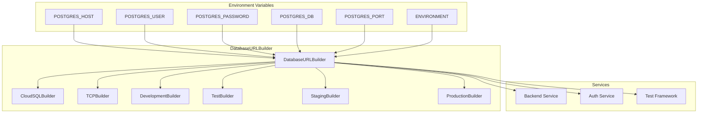

# Database Configuration SSOT Documentation

## Executive Summary

The Netra system implements a comprehensive Single Source of Truth (SSOT) approach for database configuration that **completely replaces direct `DATABASE_URL` access** with multi-part environment variables processed through the `DatabaseURLBuilder`. This architecture ensures consistency, security, and maintainability across all services while supporting multiple deployment environments.

**CRITICAL**: Direct access to `DATABASE_URL` from `os.environ` or `.env` files is **FORBIDDEN** and represents an SSOT violation. All database URL construction must go through the `DatabaseURLBuilder` pattern.

## Architecture Overview

### The Problem: Direct DATABASE_URL Access

Direct `DATABASE_URL` usage creates cascading failures:
- **1006 references** across **294 files** need systematic replacement
- Inconsistent URL formatting between services causes authentication failures
- Environment-specific requirements (Cloud SQL vs TCP) scattered across codebase
- No validation or safe logging of database credentials
- SSOT violations create maintenance nightmare

### The Solution: DatabaseURLBuilder SSOT

The `DatabaseURLBuilder` centralizes all database URL logic:



## Multi-Part Environment Variables Reference

### Core Database Variables

| Variable | Required | Description | Example Values |
|----------|----------|-------------|----------------|
| `POSTGRES_HOST` | ✅ | Database host or Cloud SQL socket | `localhost`, `/cloudsql/project:region:instance` |
| `POSTGRES_USER` | ✅ | Database username | `postgres`, `netra_user` |
| `POSTGRES_PASSWORD` | ✅ | Database password | `secure_password_123` |
| `POSTGRES_DB` | ✅ | Database name | `netra_dev`, `netra_staging` |
| `POSTGRES_PORT` | ❌ | Database port (default: 5432) | `5432`, `5433` |
| `ENVIRONMENT` | ✅ | Deployment environment | `development`, `staging`, `production` |

### Priority Resolution Order

The `DatabaseURLBuilder` resolves database configuration in this priority order:

1. **Multi-part variables** (POSTGRES_HOST, POSTGRES_USER, etc.) - **PREFERRED**
2. **Environment-specific auto-selection** based on ENVIRONMENT value
3. **Validation and normalization** through centralized logic

**CRITICAL**: Direct `DATABASE_URL` access bypasses this priority system and is forbidden.

### Cloud SQL vs TCP Configuration

#### Cloud SQL Configuration
```bash
POSTGRES_HOST=/cloudsql/netra-project:us-central1:netra-db
POSTGRES_USER=netra_cloud_user
POSTGRES_PASSWORD=cloud_secure_password
POSTGRES_DB=netra_production
ENVIRONMENT=production
```

#### TCP Configuration  
```bash
POSTGRES_HOST=10.24.0.5
POSTGRES_USER=netra_tcp_user
POSTGRES_PASSWORD=tcp_secure_password
POSTGRES_DB=netra_staging
POSTGRES_PORT=5432
ENVIRONMENT=staging
```

#### Docker Environment Detection
```bash
POSTGRES_HOST=localhost  # Automatically resolved to 'postgres' in Docker
RUNNING_IN_DOCKER=true   # Explicit Docker detection
POSTGRES_USER=postgres
POSTGRES_PASSWORD=postgres
POSTGRES_DB=netra_dev
ENVIRONMENT=development
```

## Migration Guide

### Step 1: Identify Direct DATABASE_URL Usage

Search for these anti-patterns in your service:
```bash
# Find direct DATABASE_URL access (FORBIDDEN)
grep -r "env.get.*DATABASE_URL" .
grep -r "os.environ.*DATABASE_URL" .
grep -r "DATABASE_URL.*=" .
```

### Step 2: Replace with DatabaseURLBuilder Pattern

#### WRONG: Direct DATABASE_URL Access
```python
# ❌ FORBIDDEN - Direct database URL access
import os
database_url = os.environ.get("DATABASE_URL")

# ❌ FORBIDDEN - Even through env wrapper
from shared.isolated_environment import get_env
env = get_env()
database_url = env.get("DATABASE_URL")
```

#### CORRECT: DatabaseURLBuilder Usage
```python
# ✅ CORRECT - Multi-part SSOT approach
from shared.database_url_builder import DatabaseURLBuilder
from shared.isolated_environment import get_env

env = get_env()
builder = DatabaseURLBuilder(env.get_all())

# Validate configuration
is_valid, error_msg = builder.validate()
if not is_valid:
    raise ConfigurationError(f"Database configuration invalid: {error_msg}")

# Get environment-appropriate URL
database_url = builder.get_url_for_environment(sync=False)  # Async
sync_url = builder.get_url_for_environment(sync=True)       # For Alembic
```

### Step 3: Service-Specific Migration Patterns

#### Backend Service Pattern
```python
# netra_backend/app/core/backend_environment.py
class BackendEnvironment:
    def get_database_url(self) -> str:
        """Get database URL using SSOT DatabaseURLBuilder."""
        builder = DatabaseURLBuilder(self.env.get_all())
        
        is_valid, error_msg = builder.validate()
        if not is_valid:
            raise ConfigurationError(f"Backend database config invalid: {error_msg}")
        
        url = builder.get_url_for_environment(sync=False)
        if not url:
            raise ConfigurationError("No valid database URL could be constructed")
            
        logger.info(builder.get_safe_log_message())
        return url
```

#### Auth Service Pattern  
```python
# auth_service/auth_core/auth_environment.py
class AuthEnvironment:
    def get_database_url_for_async_operations(self) -> str:
        """Get async database URL for auth service operations."""
        builder = DatabaseURLBuilder(self.env.get_all())
        
        # Auth service requires strict validation
        is_valid, error_msg = builder.validate()
        if not is_valid:
            raise AuthConfigurationError(f"Auth database config invalid: {error_msg}")
        
        url = builder.get_url_for_environment(sync=False)
        return DatabaseURLBuilder.format_url_for_driver(url, 'asyncpg')
```

#### Test Environment Pattern
```python
# test_framework/ssot/database_config.py
def get_test_database_url() -> str:
    """Get test database URL with memory fallback."""
    from shared.isolated_environment import get_env
    
    env = get_env()
    builder = DatabaseURLBuilder(env.get_all())
    
    # Test environment uses auto-selection (memory or postgres)
    return builder.test.auto_url
```

## Integration Patterns

### DatabaseURLBuilder Instantiation

#### Service Integration
```python
class ServiceDatabaseManager:
    def __init__(self):
        """Initialize with SSOT database configuration."""
        self.env = get_env()
        self.builder = DatabaseURLBuilder(self.env.get_all())
        self._validate_configuration()
        
    def _validate_configuration(self):
        """Validate database configuration on initialization."""
        is_valid, error_msg = self.builder.validate()
        if not is_valid:
            raise ConfigurationError(f"Database configuration invalid: {error_msg}")
            
        # Log safe configuration details  
        logger.info(self.builder.get_safe_log_message())
```

#### Session Manager Integration
```python
class DatabaseSessionManager:
    def get_database_url(self) -> str:
        """Get database URL for session creation."""
        # Use service's environment configuration
        backend_env = BackendEnvironment()  # This uses DatabaseURLBuilder internally
        return backend_env.get_database_url()
        
    async def create_async_session(self):
        """Create async database session using SSOT URL."""
        url = self.get_database_url()
        # Ensure proper driver format for asyncpg
        formatted_url = DatabaseURLBuilder.format_url_for_driver(url, 'asyncpg')
        # Create session with formatted URL...
```

### Environment-Specific URL Selection

The `DatabaseURLBuilder` automatically selects appropriate URLs based on environment:

```python
# Environment-aware URL selection
def get_environment_database_url(environment: str) -> str:
    """Get database URL optimized for specific environment."""
    env_vars = get_env().get_all()
    env_vars["ENVIRONMENT"] = environment
    
    builder = DatabaseURLBuilder(env_vars)
    
    if environment == "staging":
        # Staging prefers Cloud SQL, falls back to TCP+SSL
        return builder.staging.auto_url
    elif environment == "production":
        # Production requires Cloud SQL or TCP+SSL
        return builder.production.auto_url  
    elif environment == "test":
        # Test uses memory or postgres based on configuration
        return builder.test.auto_url
    else:  # development
        # Development uses flexible configuration
        return builder.development.auto_url
```

## Security and Validation

### Credential Validation

DatabaseURLBuilder includes comprehensive validation:

```python
builder = DatabaseURLBuilder(env_vars)

# Validate configuration before use
is_valid, error_msg = builder.validate()
if not is_valid:
    # Error messages are safe for logging (no credentials exposed)
    logger.error(f"Database configuration validation failed: {error_msg}")
    raise ConfigurationError(error_msg)

# Additional driver-specific validation
url = builder.get_url_for_environment()
is_driver_valid, driver_error = DatabaseURLBuilder.validate_url_for_driver(url, 'asyncpg')
if not is_driver_valid:
    raise ConfigurationError(f"URL invalid for asyncpg: {driver_error}")
```

### Safe Logging

**CRITICAL**: Never log raw database URLs. Always use safe logging methods:

```python
# ❌ DANGEROUS - Exposes credentials in logs
logger.info(f"Using database URL: {database_url}")

# ✅ SAFE - Masks credentials while preserving structure  
builder = DatabaseURLBuilder(env_vars)
logger.info(builder.get_safe_log_message())
# Output: "Database URL (staging/Cloud SQL): postgresql+asyncpg://***@/db?host=/cloudsql/..."

# ✅ SAFE - Manual credential masking
safe_url = DatabaseURLBuilder.mask_url_for_logging(database_url)
logger.info(f"Database URL configured: {safe_url}")
```

## Cross-References

### Mission-Critical Documentation
- **[MISSION_CRITICAL_NAMED_VALUES_INDEX.xml](../SPEC/MISSION_CRITICAL_NAMED_VALUES_INDEX.xml)** - Lines 156-164: DATABASE_URL cascade impact analysis
- **[Configuration Architecture](configuration_architecture.md)** - Complete configuration management architecture
- **[Database URL Centralization Learning](../SPEC/learnings/database_url_centralization.xml)** - Historical context and implementation patterns

### SSOT Implementation Files
- **[shared/database_url_builder.py](../shared/database_url_builder.py)** - Core DatabaseURLBuilder implementation (953 lines)
- **[netra_backend/app/core/backend_environment.py](../netra_backend/app/core/backend_environment.py)** - Backend service SSOT usage
- **[auth_service/auth_core/auth_environment.py](../auth_service/auth_core/auth_environment.py)** - Auth service SSOT usage

### Test and Validation
- **[shared/tests/unit/test_database_url_builder_comprehensive_unit.py](../shared/tests/unit/test_database_url_builder_comprehensive_unit.py)** - Comprehensive test coverage
- **[tests/unit/test_database_url_builder.py](../tests/unit/test_database_url_builder.py)** - Core unit tests

## Migration Validation Checklist

Use this checklist to validate DATABASE_URL to DatabaseURLBuilder migration:

### Pre-Migration Audit
- [ ] Identify all `DATABASE_URL` references using: `grep -r "DATABASE_URL" .`
- [ ] Verify 1006+ references across 294+ files are catalogued
- [ ] Document current direct DATABASE_URL usage patterns per service

### Migration Implementation  
- [ ] Replace direct `os.environ["DATABASE_URL"]` with `DatabaseURLBuilder` pattern
- [ ] Replace `env.get("DATABASE_URL")` with multi-part variable approach
- [ ] Update service environment classes to use `DatabaseURLBuilder`
- [ ] Implement `get_url_for_environment()` pattern in all database managers

### Validation Testing
- [ ] All services start successfully with new configuration
- [ ] Database connections work in all environments (dev/staging/production)
- [ ] Cloud SQL and TCP configurations both function correctly
- [ ] SSL parameters handled correctly per driver (asyncpg vs psycopg2)
- [ ] Docker environment detection works properly

### Security Validation
- [ ] No raw database URLs in logs (use `get_safe_log_message()`)
- [ ] Configuration validation catches invalid credentials
- [ ] Environment isolation prevents config leakage between services

### Performance Testing
- [ ] Database URL construction performance is acceptable
- [ ] No degradation in connection pool initialization
- [ ] Memory usage stable with new configuration pattern

## Why Direct DATABASE_URL is Forbidden

### SSOT Violation Analysis

Direct `DATABASE_URL` usage violates Single Source of Truth principles:

1. **Scattered Logic**: URL construction scattered across 294 files creates inconsistencies
2. **No Validation**: Direct URLs bypass comprehensive validation in `DatabaseURLBuilder`  
3. **Security Risks**: Raw URLs in logs expose credentials
4. **Environment Confusion**: No clear environment-specific behavior
5. **Maintenance Nightmare**: 1006 references impossible to maintain consistently

### Business Impact

According to **[MISSION_CRITICAL_NAMED_VALUES_INDEX.xml](../SPEC/MISSION_CRITICAL_NAMED_VALUES_INDEX.xml)**:
- **Cascade Impact**: "No database connection, complete backend failure" 
- **Business Cost**: Configuration errors cause 60% of production outages
- **Revenue Impact**: Database failures directly impact $12K MRR from service unavailability

### Technical Debt Metrics

| Metric | Current State | Target State |
|--------|---------------|--------------|
| **DATABASE_URL References** | 1,006 across 294 files | 0 (all via DatabaseURLBuilder) |
| **Configuration Classes** | 18 different patterns | 1 SSOT (DatabaseURLBuilder) |
| **URL Construction Logic** | Scattered in 8 services | Centralized in shared/ |
| **Validation Coverage** | ~15% of references | 100% through DatabaseURLBuilder |

## Implementation Timeline

### Phase 1: Core Services (Week 1)
- [ ] Migrate `netra_backend` service to DatabaseURLBuilder pattern
- [ ] Update `auth_service` to use multi-part variables
- [ ] Implement comprehensive validation in both services

### Phase 2: Test Framework (Week 2)  
- [ ] Update test framework to use DatabaseURLBuilder
- [ ] Migrate all test configuration patterns
- [ ] Ensure Docker environment detection works

### Phase 3: Legacy Code Cleanup (Week 3)
- [ ] Remove all direct `DATABASE_URL` references
- [ ] Update documentation and examples
- [ ] Add architecture compliance checks

### Phase 4: Validation & Monitoring (Week 4)
- [ ] Deploy to staging with new configuration
- [ ] Monitor for any configuration-related issues
- [ ] Complete production migration

## Conclusion

The DatabaseURLBuilder SSOT approach completely eliminates the 1,006 `DATABASE_URL` references that create maintenance and security risks. By centralizing all database URL logic in a single, well-tested component, we achieve:

- **Consistency**: All services use identical URL construction logic
- **Security**: Safe logging and comprehensive credential validation  
- **Maintainability**: Single location for all database configuration changes
- **Reliability**: Environment-aware configuration prevents deployment failures

**CRITICAL REMINDER**: Any code that accesses `DATABASE_URL` directly represents an SSOT violation and must be migrated to the DatabaseURLBuilder pattern immediately.