# Data Ingestion Architecture Diagrams

## 1. Current State Architecture - With Known Limitations

```mermaid
graph TB
    subgraph "Data Sources (Limited)"
        DS_JSON["JSON Files<br/>✅ Implemented"]
        DS_PDF["PDFs<br/>⚠️ Basic Handler Only"]
        DS_TXT["Text Files<br/>⚠️ Limited Processing"]
        DS_PROMPT["User Prompts<br/>❌ No Direct Path"]
        DS_LOGS["Log Files<br/>❌ Not Implemented"]
        DS_COPY["Copy/Paste<br/>❌ Not Implemented"]
        DS_CLICKHOUSE["ClickHouse Direct<br/>⚠️ Manual Only"]
        DS_API["External APIs<br/>❌ Not Implemented"]
        DS_STREAM["Streaming Data<br/>❌ Not Implemented"]
    end
    
    subgraph "Current Ingestion Layer"
        ING_SERVICE["DataIngestionService<br/>📊 Basic Implementation"]
        FILE_UPLOAD["FileStorageService<br/>📁 S3/Local Storage"]
        CORPUS_UPLOAD["CorpusUploadHandlers<br/>📄 Document Processing"]
        MANUAL_CLICK["Manual ClickHouse<br/>🔧 Direct Queries"]
    end
    
    subgraph "Processing (Minimal)"
        VAL["Validation<br/>⚠️ Basic Only"]
        TRANS["Transform<br/>❌ Not Implemented"]
        BATCH["Batch Processing<br/>⚠️ Fixed Size Only"]
        ERROR["Error Handling<br/>⚠️ Basic Retry"]
    end
    
    subgraph "Storage"
        CLICKHOUSE["ClickHouse<br/>📊 Primary Storage"]
        POSTGRES["PostgreSQL<br/>🗄️ Metadata Only"]
        S3["S3/Local Files<br/>☁️ Raw Documents"]
    end
    
    subgraph "Consumption"
        AGENTS["AI Agents<br/>🤖 Limited Access"]
        CORPUS["Corpus Service<br/>📚 Search Only"]
        REPORTING["Analytics<br/>📈 Not Connected"]
    end
    
    %% Current Working Paths
    DS_JSON --> ING_SERVICE
    DS_PDF --> FILE_UPLOAD
    DS_TXT --> FILE_UPLOAD
    FILE_UPLOAD --> CORPUS_UPLOAD
    CORPUS_UPLOAD --> VAL
    ING_SERVICE --> VAL
    VAL --> BATCH
    BATCH --> CLICKHOUSE
    BATCH --> POSTGRES
    FILE_UPLOAD --> S3
    DS_CLICKHOUSE -.->|Manual| MANUAL_CLICK
    MANUAL_CLICK -.-> CLICKHOUSE
    
    %% Storage to Consumption
    CLICKHOUSE --> AGENTS
    POSTGRES --> CORPUS
    S3 --> CORPUS
    
    %% Missing Connections (Red)
    DS_PROMPT -.->|❌ Missing| ING_SERVICE
    DS_LOGS -.->|❌ Missing| ING_SERVICE
    DS_COPY -.->|❌ Missing| ING_SERVICE
    DS_API -.->|❌ Missing| ING_SERVICE
    DS_STREAM -.->|❌ Missing| ING_SERVICE
    TRANS -.->|❌ Missing| BATCH
    CLICKHOUSE -.->|❌ Missing| REPORTING
    
    style DS_PROMPT fill:#ffcccc
    style DS_LOGS fill:#ffcccc
    style DS_COPY fill:#ffcccc
    style DS_API fill:#ffcccc
    style DS_STREAM fill:#ffcccc
    style DS_PDF fill:#fff3cd
    style DS_TXT fill:#fff3cd
    style DS_CLICKHOUSE fill:#fff3cd
    style TRANS fill:#ffcccc
    style ERROR fill:#fff3cd
```

### Current State Limitations

| Component | Status | Limitations |
|-----------|--------|-------------|
| **JSON Ingestion** | ✅ Working | - Fixed schema only - No streaming support - Limited validation |
| **PDF Processing** | ⚠️ Partial | - Basic upload only - No text extraction - No OCR capability |
| **Text Files** | ⚠️ Partial | - Simple upload - No parsing/chunking - No encoding detection |
| **User Prompts** | ❌ Missing | - No direct ingestion path - Manual copy required |
| **Log Files** | ❌ Missing | - No parser - No structured extraction |
| **Copy/Paste** | ❌ Missing | - No UI integration - No format detection |
| **ClickHouse Query** | ⚠️ Manual | - No automated pipeline - Manual query execution |
| **External APIs** | ❌ Missing | - No webhook support - No polling mechanism |
| **Streaming** | ❌ Missing | - No real-time ingestion - No Kafka/Redis Streams |
| **Transformation** | ❌ Missing | - No ETL pipeline - No data enrichment |
| **Embedding/RAG** | ❌ Missing | - No vector generation - No semantic search |
| **Data Quality** | ⚠️ Basic | - Simple validation only - No profiling |

---

## 2. Ideal State Architecture - Full "All Source" Capability

```mermaid
graph TB
    subgraph "Universal Data Sources"
        subgraph "Documents"
            PDF["PDFs with OCR"]
            DOCX["Word Documents"]
            TXT["Text Files"]
            MD["Markdown"]
            HTML["Web Pages"]
        end
        
        subgraph "Structured"
            JSON_API["JSON/APIs"]
            CSV["CSV/Excel"]
            XML["XML"]
            PARQUET["Parquet"]
        end
        
        subgraph "Interactive"
            PROMPT["User Prompts"]
            COPY["Copy/Paste"]
            DRAG["Drag & Drop"]
            CHAT["Chat Upload"]
        end
        
        subgraph "Systems"
            LOGS["Log Files"]
            METRICS["Metrics"]
            TRACES["Traces"]
            EVENTS["Events"]
        end
        
        subgraph "Databases"
            CLICK_Q["ClickHouse"]
            PG_Q["PostgreSQL"]
            MONGO["MongoDB"]
            ELASTIC["Elasticsearch"]
        end
        
        subgraph "Streaming"
            KAFKA["Kafka"]
            REDIS_S["Redis Streams"]
            WEBHOOK["Webhooks"]
            SSE["Server-Sent Events"]
        end
    end
    
    subgraph "Intelligent Ingestion Gateway"
        DETECTOR["Format Detector<br/>🔍 Auto-detect type"]
        ROUTER["Smart Router<br/>🔀 Route by type"]
        SCHEDULER["Scheduler<br/>⏰ Batch/Stream"]
        MONITOR["Monitor<br/>📊 Track health"]
    end
    
    subgraph "Processing Pipeline"
        subgraph "Extract"
            OCR["OCR Engine"]
            PARSE["Parser Library"]
            EXTRACT["Text Extractor"]
            STRUCT["Structure Analyzer"]
        end
        
        subgraph "Transform"
            CLEAN["Data Cleaner"]
            NORM["Normalizer"]
            ENRICH["Enricher"]
            CHUNK["Chunker"]
        end
        
        subgraph "Enhance"
            EMBED["Embedding Generator"]
            NER["Entity Recognition"]
            CLASSIFY["Classifier"]
            SUMMARY["Summarizer"]
        end
        
        subgraph "Quality"
            VALIDATE["Validator"]
            PROFILE["Profiler"]
            DEDUPE["Deduplicator"]
            QUALITY["Quality Scorer"]
        end
    end
    
    subgraph "Storage Layer"
        subgraph "Primary"
            CH_MAIN["ClickHouse<br/>Analytics"]
            PG_MAIN["PostgreSQL<br/>Transactional"]
            VECTOR["Vector DB<br/>Embeddings"]
        end
        
        subgraph "Cache"
            REDIS["Redis<br/>Hot Data"]
            CDN["CDN<br/>Static Assets"]
        end
        
        subgraph "Archive"
            S3_ARCH["S3<br/>Raw Files"]
            GLACIER["Glacier<br/>Cold Storage"]
        end
    end
    
    subgraph "Intelligent Consumption"
        subgraph "AI Services"
            RAG_ENGINE["RAG Engine<br/>🧠 Semantic Search"]
            AGENTS_ADV["AI Agents<br/>🤖 Full Access"]
            ANALYTICS["Analytics<br/>📈 Real-time"]
        end
        
        subgraph "APIs"
            REST["REST API"]
            GRAPHQL["GraphQL"]
            GRPC["gRPC"]
        end
        
        subgraph "UI"
            DASHBOARD["Dashboard"]
            EXPLORER["Data Explorer"]
            NOTEBOOK["Notebooks"]
        end
    end
    
    %% Flow connections
    Documents --> DETECTOR
    Structured --> DETECTOR
    Interactive --> DETECTOR
    Systems --> DETECTOR
    Databases --> DETECTOR
    Streaming --> SCHEDULER
    
    DETECTOR --> ROUTER
    ROUTER --> PARSE
    ROUTER --> OCR
    SCHEDULER --> ROUTER
    
    PARSE --> EXTRACT
    OCR --> EXTRACT
    EXTRACT --> STRUCT
    STRUCT --> CLEAN
    CLEAN --> NORM
    NORM --> ENRICH
    ENRICH --> CHUNK
    
    CHUNK --> EMBED
    CHUNK --> NER
    CHUNK --> CLASSIFY
    CHUNK --> SUMMARY
    
    EMBED --> VALIDATE
    NER --> VALIDATE
    CLASSIFY --> VALIDATE
    SUMMARY --> VALIDATE
    
    VALIDATE --> PROFILE
    PROFILE --> DEDUPE
    DEDUPE --> QUALITY
    
    QUALITY --> CH_MAIN
    QUALITY --> PG_MAIN
    EMBED --> VECTOR
    QUALITY --> REDIS
    EXTRACT --> S3_ARCH
    
    CH_MAIN --> RAG_ENGINE
    VECTOR --> RAG_ENGINE
    PG_MAIN --> AGENTS_ADV
    REDIS --> AGENTS_ADV
    
    RAG_ENGINE --> REST
    AGENTS_ADV --> GRAPHQL
    ANALYTICS --> DASHBOARD
    
    MONITOR -.-> ROUTER
    MONITOR -.-> QUALITY
    
    style DETECTOR fill:#d4f1d4
    style ROUTER fill:#d4f1d4
    style RAG_ENGINE fill:#d4f1d4
    style EMBED fill:#d4f1d4
    style VECTOR fill:#d4f1d4
```

### Ideal State Capabilities

| Component | Capabilities | Benefits |
|-----------|-------------|----------|
| **Format Detector** | - Auto-detect 50+ formats - Content-based detection - Encoding detection | Seamless ingestion from any source |
| **Smart Router** | - Type-based routing - Load balancing - Priority queuing | Optimized processing paths |
| **OCR Engine** | - Multi-language OCR - Table extraction - Handwriting recognition | Extract from any document |
| **Parser Library** | - 100+ file formats - Nested structure support - Schema inference | Universal data support |
| **Chunking** | - Semantic chunking - Overlapping windows - Context preservation | Better RAG performance |
| **Embedding Generator** | - Multiple models - Batch processing - GPU acceleration | Fast semantic search |
| **RAG Engine** | - Hybrid search - Re-ranking - Context assembly | Accurate retrieval |
| **Quality Scoring** | - Data profiling - Anomaly detection - Completeness checks | Trust in data |
| **Real-time Processing** | - Stream processing - Event-driven - Low latency | Immediate insights |
| **Vector Database** | - Billion-scale - Hybrid search - Metadata filtering | Semantic capabilities |

### Key Improvements from Current to Ideal

1. **Universal Input Support**
   - From: 3 partial formats → To: 50+ full formats
   - From: Manual upload → To: Drag-drop, paste, API, streaming
   
2. **Intelligent Processing**
   - From: Basic validation → To: AI-powered extraction, NER, classification
   - From: No embeddings → To: Multi-model embedding generation
   
3. **Semantic Capabilities**
   - From: Keyword search → To: Full RAG with re-ranking
   - From: No vectors → To: Billion-scale vector search
   
4. **Quality & Governance**
   - From: Basic retry → To: Full quality scoring and profiling
   - From: No deduplication → To: Smart deduplication with fuzzy matching
   
5. **Performance & Scale**
   - From: Batch only → To: Real-time streaming
   - From: Single storage → To: Tiered storage with caching
   
6. **Developer Experience**
   - From: Limited API → To: REST, GraphQL, gRPC
   - From: No exploration → To: Notebooks, Explorer, Dashboard