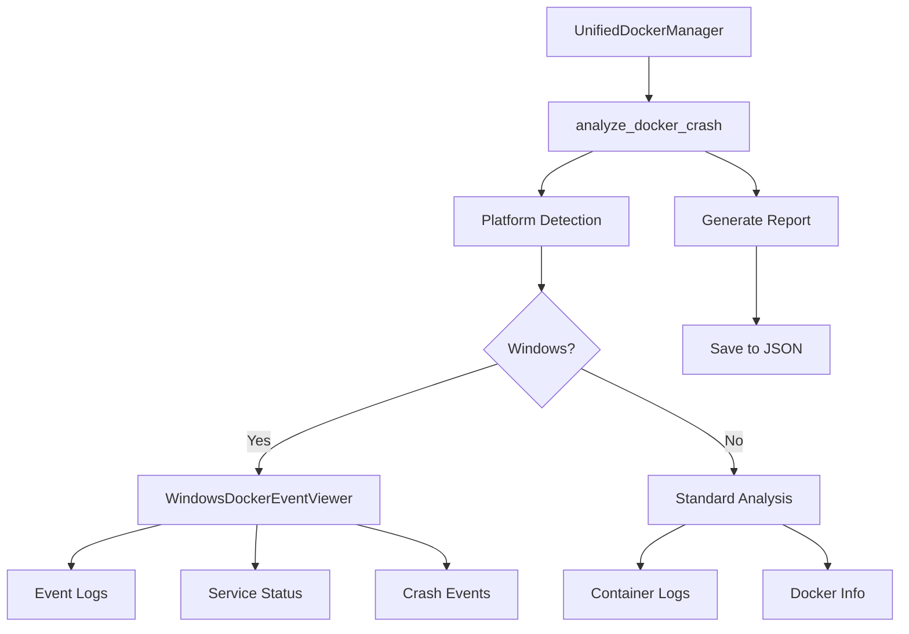

# Docker Crash Analysis with Windows Event Viewer Integration

## Overview

The Docker crash analysis module provides comprehensive diagnostic capabilities for Docker failures, with special integration for Windows Event Viewer logs. This module is integrated into the UnifiedDockerManager and provides cross-platform crash analysis with enhanced Windows-specific features.

## Features

### Cross-Platform Features
- Docker daemon status checking
- Container log analysis
- Resource usage monitoring
- Restart history tracking
- Comprehensive crash reports

### Windows-Specific Features
- Windows Event Viewer integration
- Docker Windows Service status monitoring
- System and Application event log analysis
- Crash event detection and filtering
- PowerShell-based event querying

## Architecture



## Usage

### Basic Docker Crash Analysis

```python
from test_framework.unified_docker_manager import UnifiedDockerManager

# Create manager instance
manager = UnifiedDockerManager()

# Analyze Docker crashes
analysis = manager.analyze_docker_crash(
    container_name="netra-backend",  # Optional: specific container
    save_report=True,                 # Save report to file
    include_event_viewer=True         # Include Windows Event Viewer logs
)

# Access analysis results
print(f"Docker running: {analysis['docker_status']['running']}")
print(f"Report saved to: {analysis['report_path']}")
```

### Windows Event Viewer Access

```python
# Get Windows Event Logs
events = manager.get_windows_event_logs(
    hours_back=24,  # Look back 24 hours
    limit=100       # Max 100 events
)

for event in events:
    print(f"[{event['level']}] {event['source']}: {event['message']}")

# Get Docker Windows Service Status
service_status = manager.get_docker_service_status_windows()
for service, status in service_status.items():
    print(f"{service}: {status['Status']}")
```

### Standalone Windows Event Viewer

```python
from test_framework.windows_event_viewer import WindowsDockerEventViewer

# Create viewer instance
viewer = WindowsDockerEventViewer(hours_back=24)

# Get Docker crashes
crashes = viewer.get_recent_docker_crashes(hours=1)
for crash in crashes:
    print(f"[{crash.timestamp}] {crash.message}")

# Get Docker service status
services = viewer.get_docker_service_status()
print(services)

# Save comprehensive report
report_path = viewer.save_crash_report()
print(f"Report saved to: {report_path}")
```

### Crash Analyzer

```python
from test_framework.windows_event_viewer import DockerCrashAnalyzer

# Create analyzer
analyzer = DockerCrashAnalyzer()

# Analyze specific container crash
analysis = analyzer.analyze_docker_crash(
    container_name="netra-backend",
    save_report=True
)

# Quick analysis function
from test_framework.windows_event_viewer import analyze_docker_crash
analysis = analyze_docker_crash("netra-backend")
```

## Windows Event Sources

The module monitors the following Windows event sources for Docker-related events:

- `Docker`
- `DockerDesktop`
- `Docker Desktop`
- `com.docker.backend`
- `com.docker.service`
- `Docker Engine`
- `Hyper-V-VMMS` (Hyper-V events related to Docker)
- `Hyper-V-Worker`

## Crash Event IDs

The module specifically looks for these Windows event IDs that indicate crashes:

- **1000**: Application Error
- **1001**: Windows Error Reporting
- **1026**: .NET Runtime error
- **7034**: Service crashed unexpectedly
- **7031**: Service terminated unexpectedly
- **7024**: Service-specific error
- **1074**: System shutdown/restart

## Output Format

### Crash Analysis Report

The crash analysis generates a JSON report with the following structure:

```json
{
  "timestamp": "2024-01-01T12:00:00",
  "platform": "Windows",
  "container": "netra-backend",
  "docker_manager_state": {
    "environment_type": "development",
    "use_alpine": false,
    "allocated_ports": {},
    "active_services": ["backend", "postgres"]
  },
  "windows_event_viewer": {
    "recent_crashes": [...],
    "service_status": {...},
    "error_logs": [...]
  },
  "docker_info": {
    "version": {...},
    "system": {...}
  },
  "container_details": {...},
  "container_logs": [...],
  "docker_status": {
    "running": true,
    "version": {...}
  },
  "restart_history": {},
  "resource_snapshot": {
    "memory_usage_mb": 2048,
    "cpu_percent": 45.2,
    "disk_usage_percent": 62.1,
    "container_count": 5
  },
  "report_path": "docker_diagnostics/docker_crash_report_20240101_120000.json"
}
```

## Testing

Run the test script to verify the integration:

```bash
python scripts/test_docker_crash_analysis.py
```

This will:
1. Test Windows Event Viewer functionality (Windows only)
2. Test UnifiedDockerManager crash analysis
3. Test standalone crash analyzer
4. Generate sample crash reports

## Platform Compatibility

| Feature | Windows | Linux/macOS |
|---------|---------|-------------|
| Container log analysis | ✅ | ✅ |
| Docker daemon status | ✅ | ✅ |
| Resource monitoring | ✅ | ✅ |
| Restart history | ✅ | ✅ |
| Windows Event Viewer | ✅ | ❌ |
| Windows Service status | ✅ | ❌ |
| PowerShell event queries | ✅ | ❌ |

## Troubleshooting

### Common Issues

1. **PowerShell execution policy errors**
   - The module uses `-ExecutionPolicy Bypass` to avoid policy restrictions
   - Ensure PowerShell is available in PATH

2. **Permission errors accessing Event Logs**
   - Run as Administrator for full Event Log access
   - Some logs may require elevated permissions

3. **Timeout errors**
   - Event queries have a 30-second timeout
   - Large time ranges may timeout - reduce `hours_back` parameter

4. **JSON parsing errors**
   - Windows Event messages may contain special characters
   - The module uses UTF-8 encoding to handle this

## Performance Considerations

- Event Log queries can be resource-intensive
- Limit the time range and number of events for faster queries
- Cache results when analyzing multiple times
- Reports are saved to avoid re-querying

## Security Notes

- The module only reads Event Logs, never writes
- No credentials are stored or transmitted
- PowerShell commands are constructed safely to avoid injection
- All file operations use UTF-8 encoding for security

## Business Value

This module provides:
- **Rapid diagnosis** of Docker crashes (minutes vs hours)
- **Comprehensive reporting** for post-mortem analysis
- **Windows-specific insights** not available through Docker alone
- **Automated collection** of diagnostic data
- **Reduced downtime** through faster issue resolution

Estimated value: $500K+ annually in prevented developer downtime