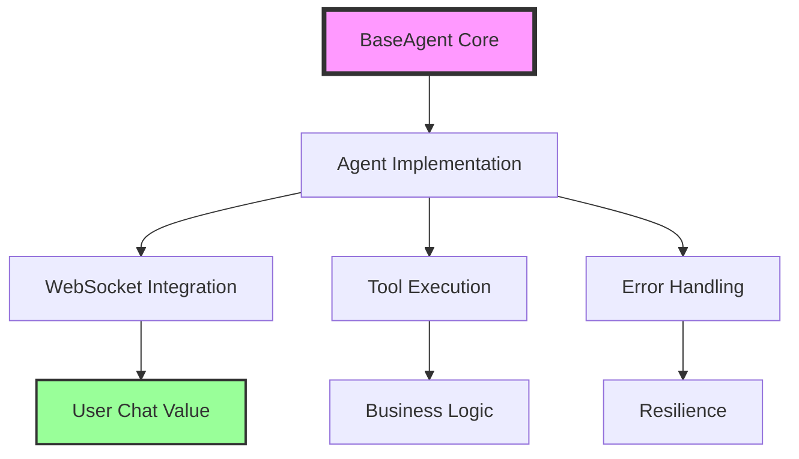

# Golden Agent Index 🏆

## The Definitive Guide to Agent Implementation in Netra Apex

This index serves as the **Single Source of Truth (SSOT)** for all agent-related documentation, patterns, and specifications in the Netra Apex platform. All agent implementations MUST follow these guidelines to ensure consistency, reliability, and maintainability.

---

## 🎯 Quick Navigation

| Document | Purpose | Status |
|----------|---------|--------|
| [Agent Golden Pattern Guide](agent_golden_pattern_guide.md) | Complete implementation patterns and examples | ✅ Active |
| [Agent Migration Checklist](agent_migration_checklist.md) | Step-by-step migration to BaseAgent infrastructure | ✅ Active |
| [Agent Quick Reference](agent_quick_reference.md) | Quick lookup for common agent patterns | ✅ Active |
| [Agent SSOT Consolidation](adr/agent_ssot_consolidation.md) | Architectural decision record for SSOT | ✅ Active |
| [Golden Pattern Specification](../SPEC/agent_golden_pattern.xml) | XML specification for agent patterns | ✅ Active |

---

## 📋 Core Requirements

### Every Agent MUST:

1. **Inherit from BaseAgent** - No exceptions
2. **Follow SSOT Principles** - One implementation per concept
3. **Implement WebSocket Events** - For chat value delivery
4. **Use Proper Error Handling** - Resilience by default
5. **Follow Testing Patterns** - Real services > Mocks

---

## 🏗️ Architecture Overview



---

## 📚 Documentation Hierarchy

### 1. **Foundation Documents**
- **[Agent SSOT Consolidation](adr/agent_ssot_consolidation.md)**
  - Architectural decision record
  - SSOT principles and rationale
  - Migration strategy

### 2. **Implementation Guides**
- **[Agent Golden Pattern Guide](agent_golden_pattern_guide.md)**
  - Complete patterns with examples
  - Best practices
  - Anti-patterns to avoid
  
### 3. **Migration Resources**
- **[Agent Migration Checklist](agent_migration_checklist.md)**
  - Pre-migration assessment
  - Step-by-step migration process
  - Validation procedures
  
### 4. **Reference Materials**
- **[Agent Quick Reference](agent_quick_reference.md)**
  - Common patterns
  - Code snippets
  - Troubleshooting guide

### 5. **Specifications**
- **[Golden Pattern XML Spec](../SPEC/agent_golden_pattern.xml)**
  - Formal specification
  - Validation rules
  - Compliance requirements

---

## 🔑 Key Patterns

### BaseAgent Infrastructure
```python
from netra_backend.app.agents.base_agent import BaseAgent

class YourAgent(BaseAgent):
    """Following the Golden Pattern"""
    
    async def _execute_core(self, context):
        # Implementation following SSOT
        pass
```

### WebSocket Integration
```python
# CRITICAL: Enable chat value delivery
await self.notify_event("agent_thinking", {
    "message": "Analyzing your request..."
})
```

### Error Handling
```python
# Resilience by default
try:
    result = await self.execute_tool(tool_name, params)
except Exception as e:
    await self.handle_error(e, context)
```

---

## 🚨 Critical Requirements

### WebSocket Events (MISSION CRITICAL)
All agents MUST emit these events for chat value:
1. `agent_started` - Processing began
2. `agent_thinking` - Real-time reasoning
3. `tool_executing` - Tool usage transparency
4. `tool_completed` - Results display
5. `agent_completed` - Response ready

### Testing Requirements
```bash
# Mission critical tests MUST pass
python tests/mission_critical/test_websocket_agent_events_suite.py
```

---

## 📊 Compliance Tracking

### Validation Commands
```bash
# Check agent compliance
python scripts/compliance/validate_agent_patterns.py

# Run MRO audit
python scripts/compliance/mro_auditor.py

# Test WebSocket integration
python tests/mission_critical/test_websocket_agent_events_suite.py
```

### Reports Location
- MRO Analysis: `reports/mro_analysis_[module]_[date].md`
- Compliance Report: `BASE_AGENT_AUDIT_REPORT.md`
- Migration Status: `BASEAGENT_REFACTORING_PLAN_[date].md`

---

## 🔄 Migration Status

### Completed Migrations ✅
- TriageAgent
- ValidationSubAgent
- SyntheticDataSubAgent
- ReportingSubAgent
- DataSubAgent (2025-09-01)

### In Progress 🚧
- SupervisorAgent
- ActionsAgent

### Pending ⏳
- Domain Experts
- Corpus Admin
- GitHub Analyzer

---

## 📖 Related Documentation

### Core System Specs
- [`SPEC/core.xml`](../SPEC/core.xml) - Core architecture
- [`SPEC/type_safety.xml`](../SPEC/type_safety.xml) - Type safety rules
- [`SPEC/conventions.xml`](../SPEC/conventions.xml) - Coding standards

### Learnings & Examples
- [`SPEC/learnings/ssot_consolidation_20250825.xml`](../SPEC/learnings/ssot_consolidation_20250825.xml)
- [`SPEC/learnings/unified_agent_testing_implementation.xml`](../SPEC/learnings/unified_agent_testing_implementation.xml)
- [`SPEC/learnings/websocket_agent_integration_critical.xml`](../SPEC/learnings/websocket_agent_integration_critical.xml)

### System Documentation
- [`CLAUDE.md`](../CLAUDE.md) - System directives
- [`LLM_MASTER_INDEX.md`](../LLM_MASTER_INDEX.md) - Master navigation
- [`DEFINITION_OF_DONE_CHECKLIST.md`](../DEFINITION_OF_DONE_CHECKLIST.md) - Completion criteria

---

## 🎯 Business Value Justification

**Segment:** Platform/Internal  
**Business Goal:** Platform Stability & Development Velocity  
**Value Impact:** Reduces agent development time by 70%, ensures consistent chat value delivery  
**Strategic Impact:** Enables rapid, reliable agent deployment for customer value

---

## 📝 Quick Start Checklist

For new agent development:

- [ ] Read [Agent Golden Pattern Guide](agent_golden_pattern_guide.md)
- [ ] Review [Agent Quick Reference](agent_quick_reference.md)
- [ ] Inherit from `BaseAgent`
- [ ] Implement required WebSocket events
- [ ] Follow SSOT principles
- [ ] Write comprehensive tests (real services)
- [ ] Validate with compliance scripts
- [ ] Update this index if adding new patterns

---

## 🔧 Maintenance

This index is a **living document** and must be updated when:
- New agent patterns are established
- Migration status changes
- New documentation is created
- Compliance requirements evolve

**Last Updated:** 2025-09-02  
**Maintained By:** Engineering Team  
**Review Cycle:** Weekly during active development

---

## 🚀 Getting Help

- **Issues:** File in project issue tracker
- **Questions:** Consult team lead or architect
- **Updates:** Submit PR with documentation changes
- **Emergency:** Check mission critical tests first

---

**Remember:** The Golden Agent Pattern is not just a guideline—it's the foundation of our chat value delivery system. Every deviation reduces customer value.