# Netra Apex Golden Path: Complete User Flow Analysis

## Executive Summary

This document presents the complete "golden path" analysis of Netra Apex's user journey from initial connection through agent execution to final response delivery. It includes both the ideal state implementation and critical current state issues affecting our $500K+ ARR chat functionality.

**Business Impact**: Chat functionality represents 90% of our delivered value to users. Any break in this flow directly impacts revenue and user experience.

## Table of Contents

1. [Ideal State: Golden Path Flow](#ideal-state-golden-path-flow)
2. [Current State: Issues and Breaks](#current-state-issues-and-breaks)
3. [Persistence and Exit Points](#persistence-and-exit-points)
4. [Critical Fix Recommendations](#critical-fix-recommendations)
5. [Testing Strategy](#testing-strategy)

---

## Ideal State: Golden Path Flow

### Overview: The Perfect User Journey

```mermaid
flowchart TD
    subgraph "Frontend Layer"
        U[User Opens Chat Interface]
        UI[Chat UI Loads]
        WS_INIT[WebSocket Connection Initiated]
    end
    
    subgraph "Connection & Authentication"
        WS_CONNECT[WebSocket Connection Established]
        JWT_AUTH[JWT Authentication]
        USER_CTX[UserExecutionContext Created]
        WS_READY[Connection Ready - Welcome Message Sent]
    end
    
    subgraph "Message Flow"
        USER_MSG[User Sends Message]
        MSG_ROUTE[Message Routed to AgentHandler]
        AGENT_START[Agent Execution Begins]
    end
    
    subgraph "Agent Execution Pipeline"
        FACTORY[ExecutionEngineFactory Creates User Engine]
        SUPERVISOR[SupervisorAgent Orchestrates]
        SUB_AGENTS[Sub-Agents Execute in Order]
        TOOLS[Tool Execution with Notifications]
        WEBSOCKET_EVENTS[Critical WebSocket Events Sent]
    end
    
    subgraph "Response & Persistence"
        RESULTS[Agent Results Compiled]
        PERSIST[Results Persisted to Database]
        FINAL_MSG[Final Response to User]
        CLEANUP[Resource Cleanup]
    end
    
    U --> UI
    UI --> WS_INIT
    WS_INIT --> WS_CONNECT
    WS_CONNECT --> JWT_AUTH
    JWT_AUTH --> USER_CTX
    USER_CTX --> WS_READY
    WS_READY --> USER_MSG
    USER_MSG --> MSG_ROUTE
    MSG_ROUTE --> AGENT_START
    AGENT_START --> FACTORY
    FACTORY --> SUPERVISOR
    SUPERVISOR --> SUB_AGENTS
    SUB_AGENTS --> TOOLS
    TOOLS --> WEBSOCKET_EVENTS
    WEBSOCKET_EVENTS --> RESULTS
    RESULTS --> PERSIST
    PERSIST --> FINAL_MSG
    FINAL_MSG --> CLEANUP
    
    style U fill:#e1f5fe
    style WEBSOCKET_EVENTS fill:#fff3e0
    style PERSIST fill:#f3e5f5
    style CLEANUP fill:#e8f5e8
```

### Detailed Golden Path Sequence

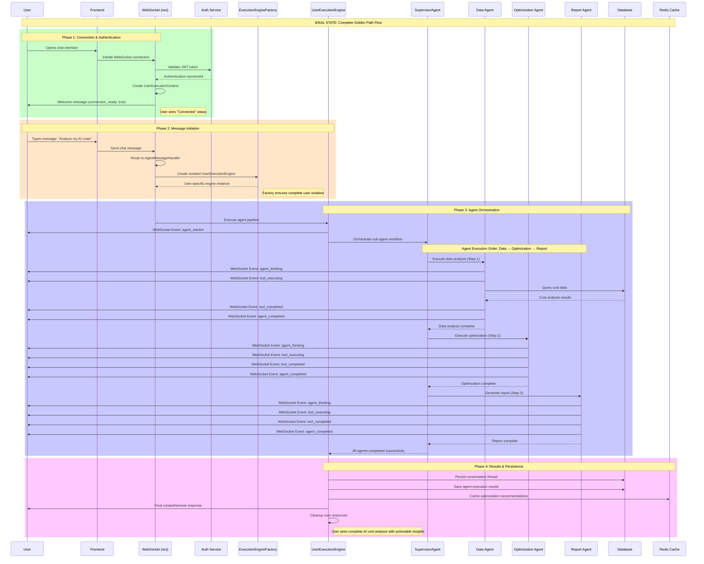

### Critical WebSocket Events (Business Value)

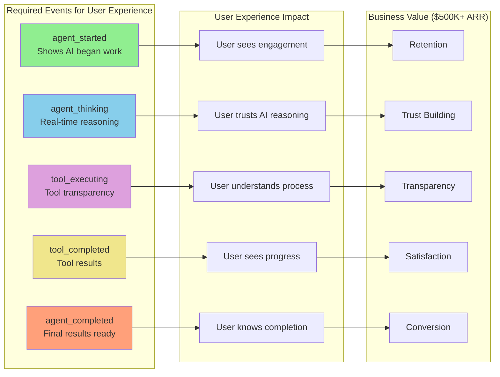

---

## Current State: Issues and Breaks

### Critical Issue #1: Race Conditions in WebSocket Handshake

**Problem**: Cloud Run environments experience race conditions where message handling starts before WebSocket handshake completion.

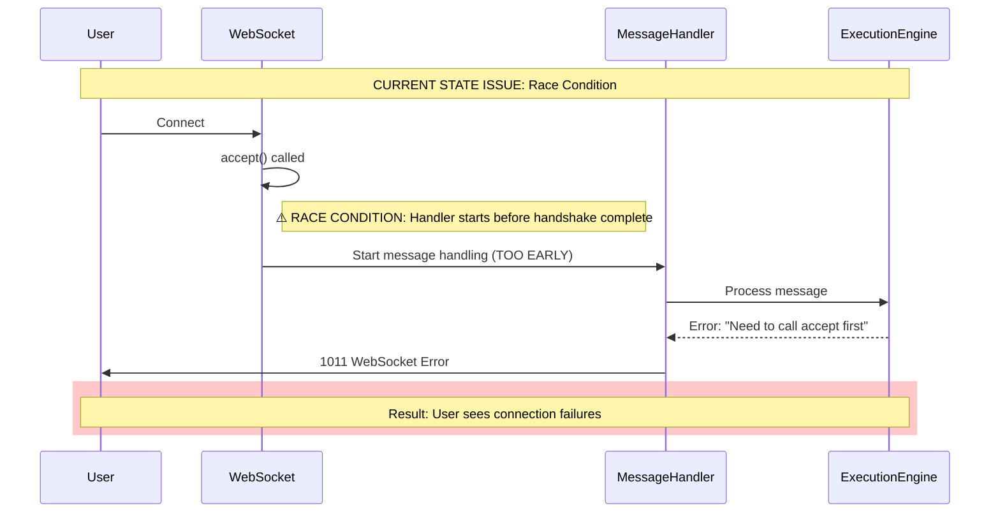

**Current Fix**: Progressive delays and handshake validation in staging/production environments.

### Critical Issue #2: Missing Service Dependencies

**Problem**: Agent supervisor and thread service not always available during WebSocket connection.

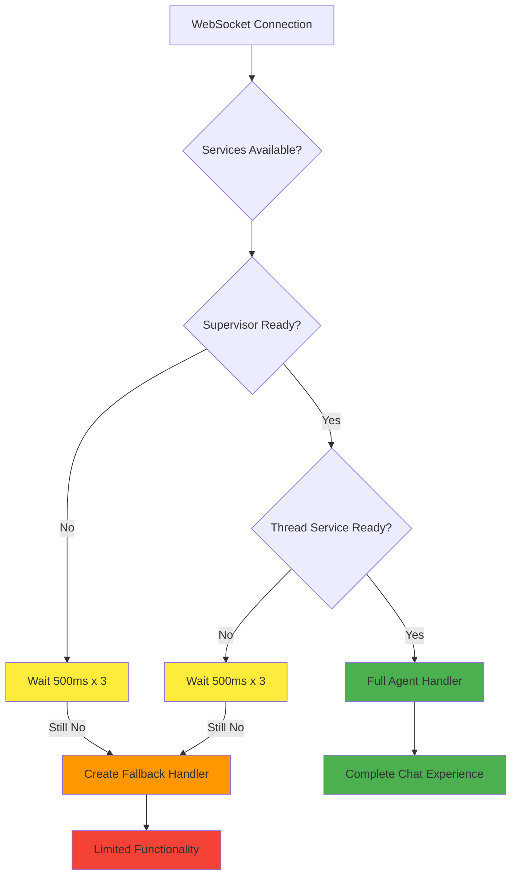

### Critical Issue #3: Factory Initialization Failures

**Problem**: WebSocket manager factory can fail SSOT validation causing 1011 errors.

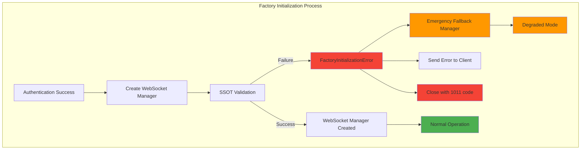

### Critical Issue #4: Missing WebSocket Events

**Problem**: Not all required WebSocket events are sent, breaking user experience.

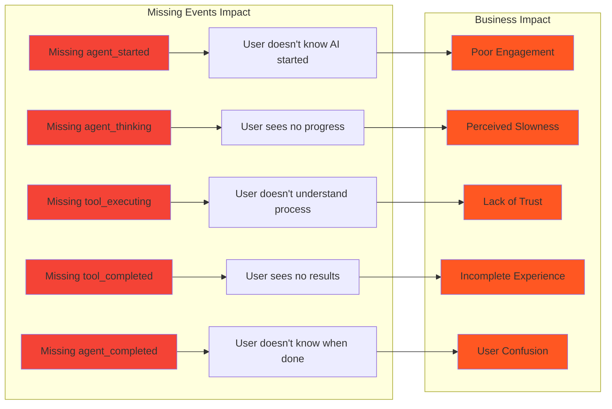

---

## Persistence and Exit Points

### Data Persistence Points

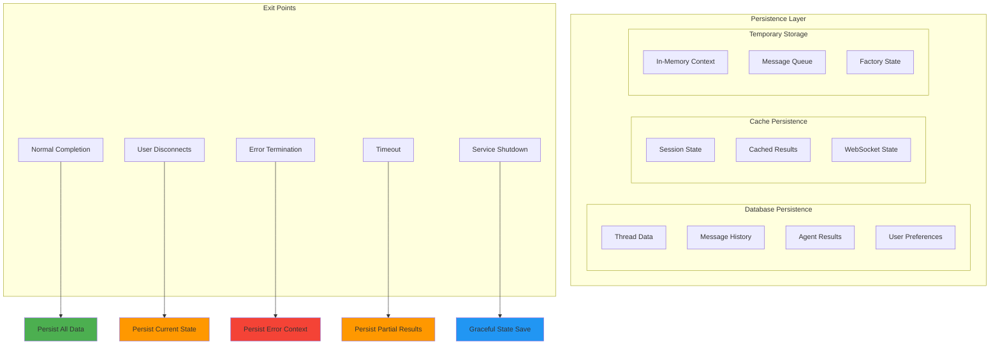

### Exit Point Details

#### 1. Normal Completion Exit
- **Trigger**: Agent pipeline completes successfully
- **Actions**: 
  - Persist conversation thread to database
  - Save agent execution results
  - Cache optimization recommendations in Redis
  - Send final response to user
  - Clean up user-specific resources
  - Log success metrics

#### 2. User Disconnect Exit
- **Trigger**: User closes browser/tab or loses connection
- **Actions**:
  - Save current conversation state
  - Preserve agent execution progress
  - Queue any pending messages
  - Mark session for recovery
  - Clean up WebSocket connection
  - Maintain session data for reconnection

#### 3. Error Termination Exit
- **Trigger**: Unhandled exception or system error
- **Actions**:
  - Log error context and stack trace
  - Save partial conversation state
  - Send error notification to user (if possible)
  - Alert monitoring systems
  - Clean up resources to prevent leaks
  - Generate error report for debugging

#### 4. Timeout Exit
- **Trigger**: Operation exceeds maximum execution time
- **Actions**:
  - Save partial results if available
  - Log timeout details for optimization
  - Send timeout message to user
  - Clean up active operations
  - Update performance metrics

#### 5. Service Shutdown Exit
- **Trigger**: Planned service maintenance or deployment
- **Actions**:
  - Gracefully complete active operations
  - Save all user session states
  - Send maintenance notification to connected users
  - Ensure data consistency before shutdown
  - Log shutdown process for audit

---

## Critical Fix Recommendations

### Priority 1: Fix WebSocket Race Conditions

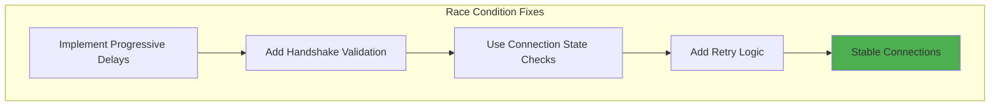

**Implementation**:
1. Add progressive delays in Cloud Run environments
2. Validate handshake completion before message handling
3. Implement connection state verification
4. Add retry logic for failed handshakes

### Priority 2: Ensure All WebSocket Events

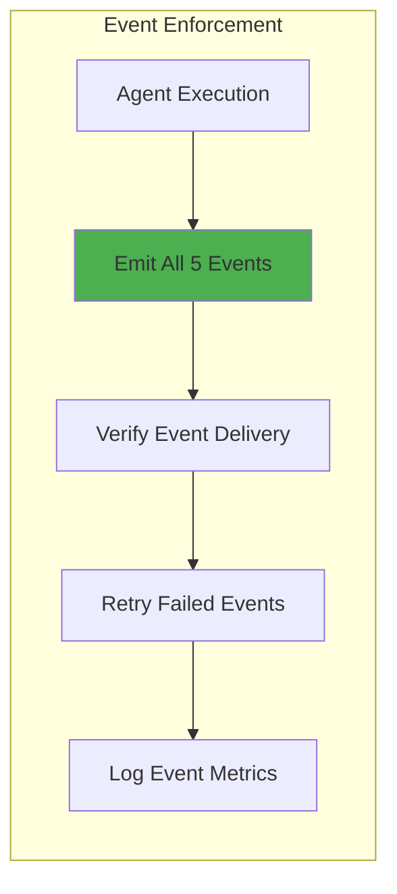

**Required Events**:
1. `agent_started` - When agent begins processing
2. `agent_thinking` - Real-time reasoning updates
3. `tool_executing` - Tool usage transparency
4. `tool_completed` - Tool results display
5. `agent_completed` - Final response ready

### Priority 3: Implement Graceful Degradation

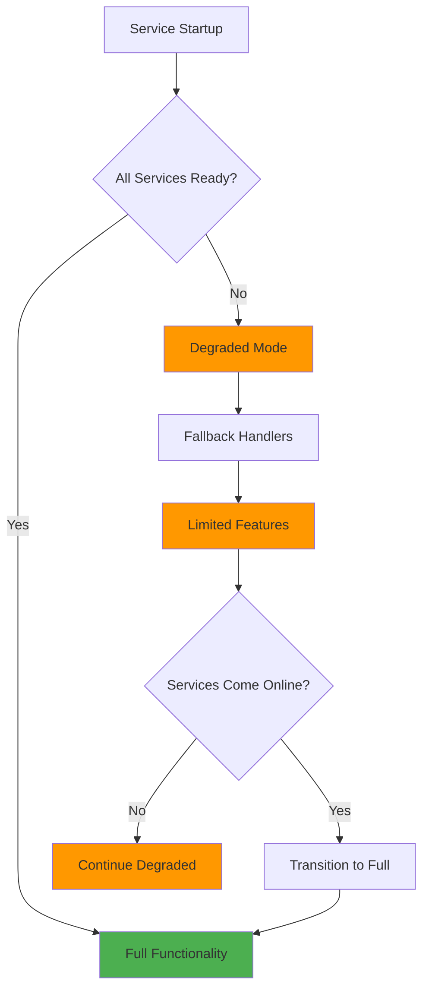

---

## Testing Strategy

### E2E Testing Requirements

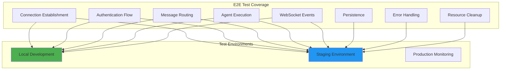

### Critical Test Scenarios

1. **Happy Path Test**: Complete user flow from connection to final response
2. **Race Condition Test**: Rapid connection attempts in Cloud Run environment
3. **Service Dependency Test**: WebSocket connection when services are unavailable
4. **WebSocket Events Test**: Verify all 5 critical events are sent
5. **Error Recovery Test**: System behavior during various failure modes
6. **Load Test**: Multiple concurrent users (10+ simultaneously)
7. **Persistence Test**: Data integrity during normal and abnormal exits
8. **Authentication Test**: JWT validation and user context creation

---

## Conclusion

The golden path represents our core business value delivery mechanism. Current issues primarily center around WebSocket connection reliability and service dependency management. The comprehensive fix strategy focuses on:

1. **Stability**: Eliminate race conditions and connection failures
2. **Completeness**: Ensure all required WebSocket events are sent
3. **Resilience**: Implement graceful degradation for service dependencies
4. **Observability**: Complete logging and monitoring of the user journey

**Business Impact**: Successful implementation will restore the reliable chat experience that drives our $500K+ ARR and enables continued growth.