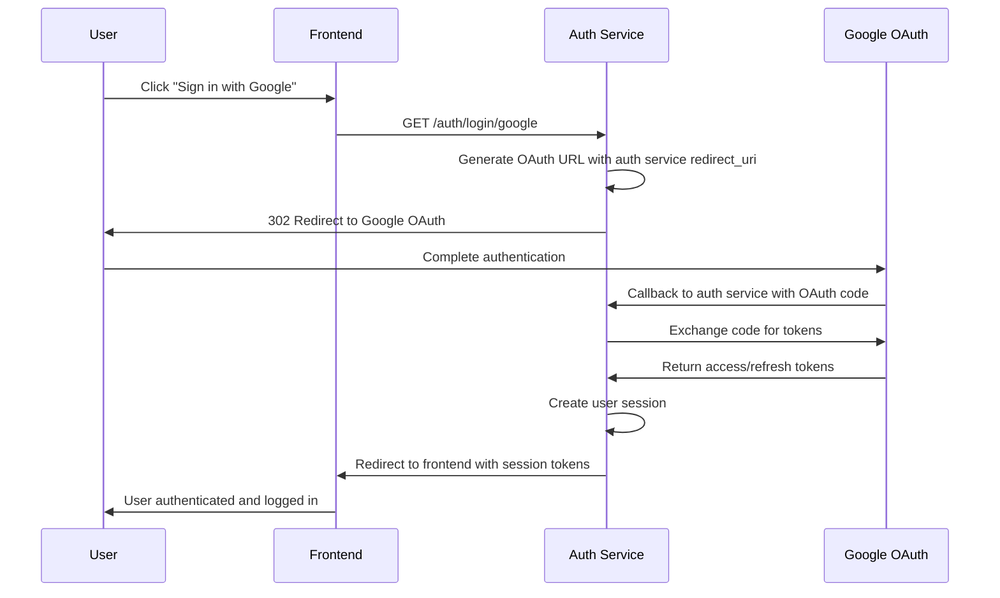
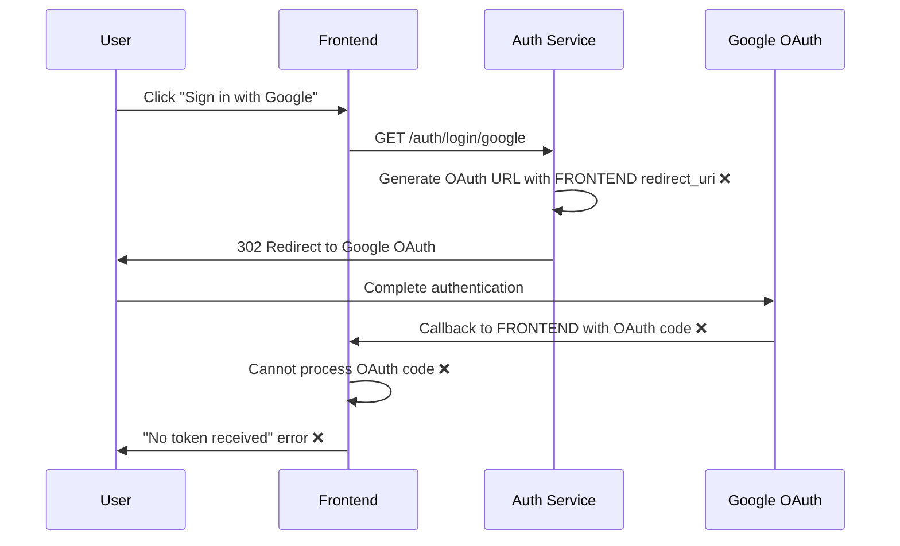

# Google OAuth Console Configuration Guide

## Critical OAuth Redirect URI Configuration

**CRITICAL ISSUE RESOLVED**: The auth service was misconfigured to tell Google OAuth to redirect to frontend URLs instead of auth service URLs, causing complete OAuth authentication failure with "No token received" error.

**ROOT CAUSE**: Lines 242, 676, 906 in `auth_service/auth_core/routes/auth_routes.py` used `_determine_urls()[1]` (frontend URL) instead of `_determine_urls()[0]` (auth service URL) for OAuth redirect URIs.

## Required Google OAuth Console Configuration

### Development Environment

**Google Cloud Project**: Use development/testing project  
**OAuth Application**: Netra AI Platform (Development)

**Authorized Redirect URIs** (ADD THESE):
```
http://localhost:8081/auth/callback
http://localhost:8081/auth/callback/google
```

**Prohibited URLs** (DO NOT ADD):
```
❌ http://localhost:3000/auth/callback
❌ http://localhost:3000/auth/callback/google
```

### Staging Environment  

**Google Cloud Project**: Use staging project  
**OAuth Application**: Netra AI Platform (Staging)

**Authorized Redirect URIs** (ADD THESE):
```
https://auth.staging.netrasystems.ai/auth/callback
https://auth.staging.netrasystems.ai/auth/callback/google
```

**Prohibited URLs** (DO NOT ADD):
```
❌ https://app.staging.netrasystems.ai/auth/callback
❌ https://app.staging.netrasystems.ai/auth/callback/google
```

### Production Environment

**Google Cloud Project**: Use production project  
**OAuth Application**: Netra AI Platform (Production)

**Authorized Redirect URIs** (ADD THESE):
```
https://auth.netrasystems.ai/auth/callback
https://auth.netrasystems.ai/auth/callback/google
```

**Prohibited URLs** (DO NOT ADD):
```
❌ https://netrasystems.ai/auth/callback
❌ https://netrasystems.ai/auth/callback/google
```

## Why Frontend URLs Must NOT Be Used

1. **Frontend Cannot Process OAuth**: Frontend applications cannot exchange OAuth codes for tokens
2. **Security Architecture**: Auth service is the only component designed to handle OAuth callbacks
3. **Token Management**: Only auth service can securely store and manage access/refresh tokens
4. **Session Creation**: Auth service creates user sessions after successful OAuth authentication

## OAuth Flow (Correct Configuration)



## OAuth Flow (Broken Configuration)



## Google OAuth Console Access

1. **URL**: https://console.cloud.google.com/apis/credentials
2. **Select Project**: Choose appropriate GCP project for environment
3. **OAuth 2.0 Client IDs**: Find or create OAuth application
4. **Authorized redirect URIs**: Add ONLY auth service URLs from lists above

## Validation Commands

Before deploying to any environment, run these validation commands:

```bash
# Validate OAuth configuration for staging
python scripts/validate_oauth_configuration.py --env staging

# Run OAuth redirect URI tests
python -m pytest auth_service/tests/test_critical_oauth_redirect_uri_misconfiguration.py -v

# Run regression prevention tests  
python -m pytest auth_service/tests/test_oauth_redirect_uri_regression_prevention.py -v
```

## Pre-Deployment Checklist

Before deploying OAuth changes:

- [ ] ✅ OAuth redirect URIs use `_determine_urls()[0]` (auth service URL)  
- [ ] ✅ OAuth redirect URIs do NOT use `_determine_urls()[1]` (frontend URL)
- [ ] ✅ Google OAuth Console has correct authorized redirect URIs
- [ ] ✅ Google OAuth Console does NOT have frontend URLs
- [ ] ✅ OAuth validation script passes: `python scripts/validate_oauth_configuration.py --env <environment>`
- [ ] ✅ OAuth tests pass in staging: `pytest -k oauth_redirect_uri --env staging`
- [ ] ✅ Manual OAuth flow test completed successfully in staging

## Error Messages to Watch For

If OAuth is misconfigured, users will see these errors:

- **Frontend Error**: "No token received" 
- **Google OAuth Error**: "redirect_uri_mismatch"
- **Network Error**: 404 on frontend `/auth/callback` endpoint
- **Console Error**: "Failed to exchange authorization code"

## Monitoring

Monitor these metrics to detect OAuth redirect URI issues:

- OAuth authentication success rate (target: >95%)
- "No token received" error count (target: 0 per hour)  
- OAuth callback completion rate (target: >95%)
- redirect_uri_mismatch error count (target: 0 per day)

## Support Contact

If you encounter issues with OAuth configuration:

1. Run the validation script first: `python scripts/validate_oauth_configuration.py`
2. Check Google OAuth Console authorized redirect URIs match this document  
3. Verify auth service deployment is healthy: `curl https://auth.staging.netrasystems.ai/health`
4. Check auth service logs for OAuth callback errors

---

**Last Updated**: 2025-08-25  
**Critical Priority**: Fix OAuth redirect URI misconfiguration before any production deployment