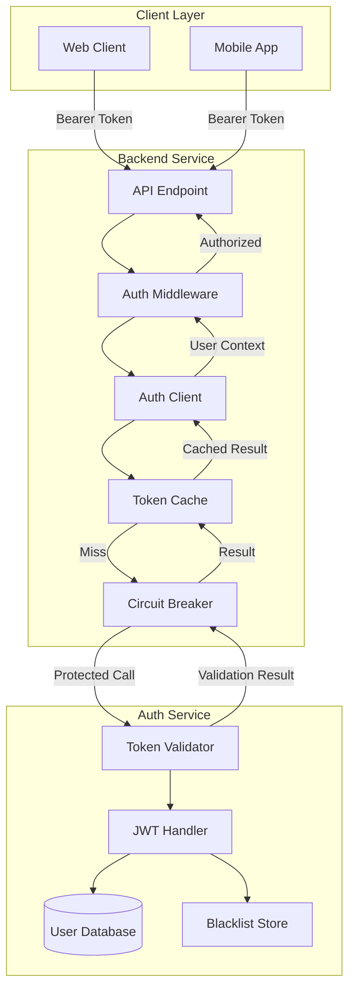
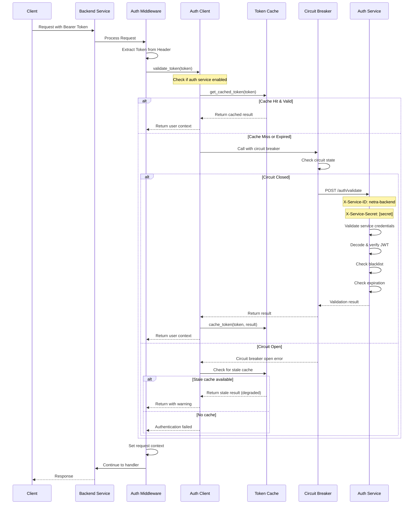
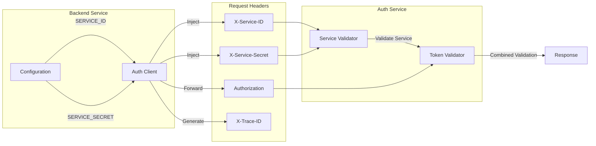
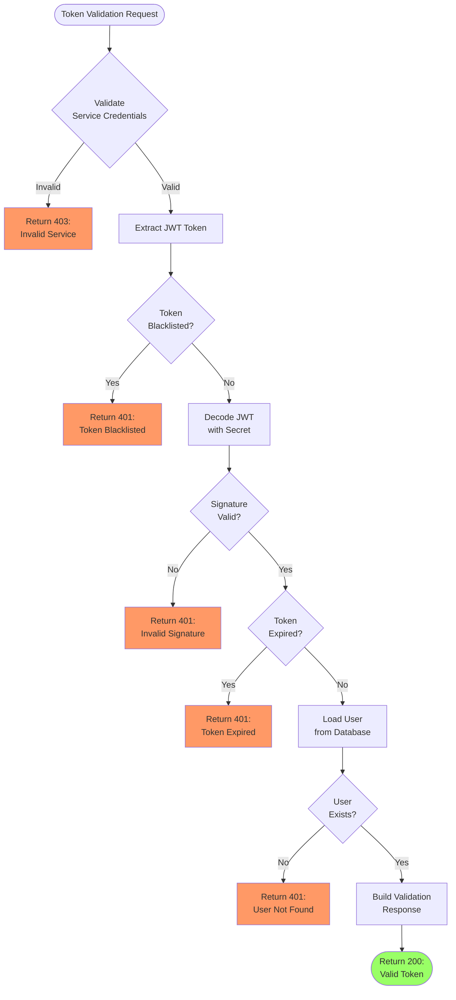
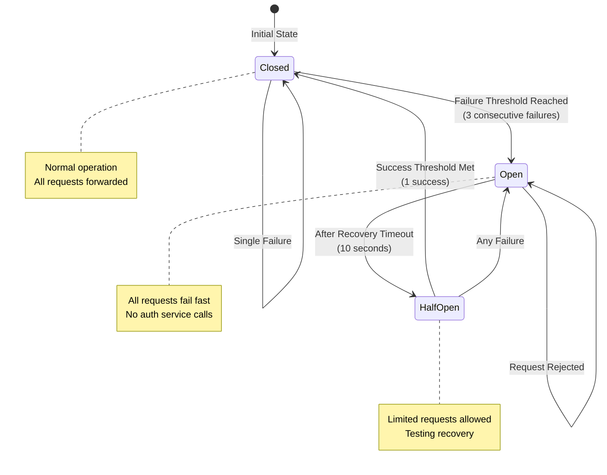
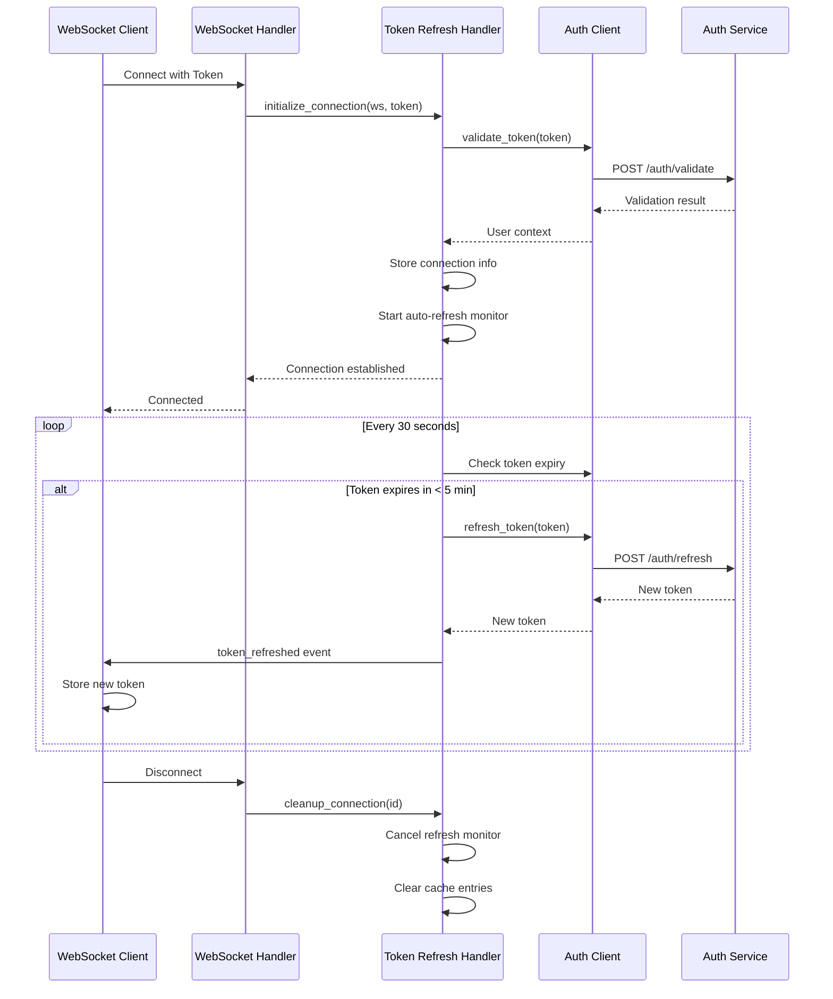
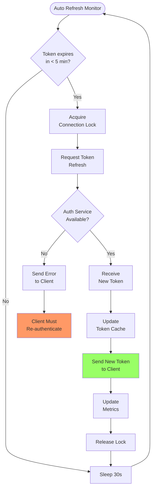
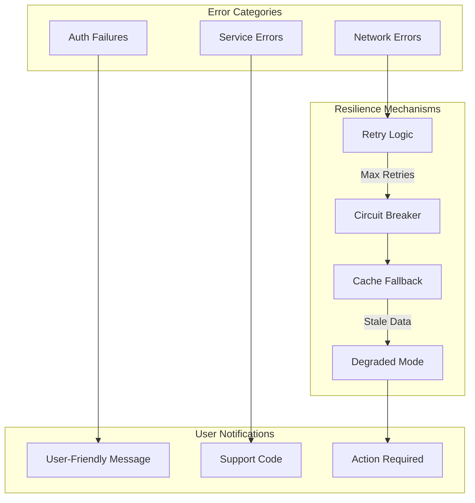
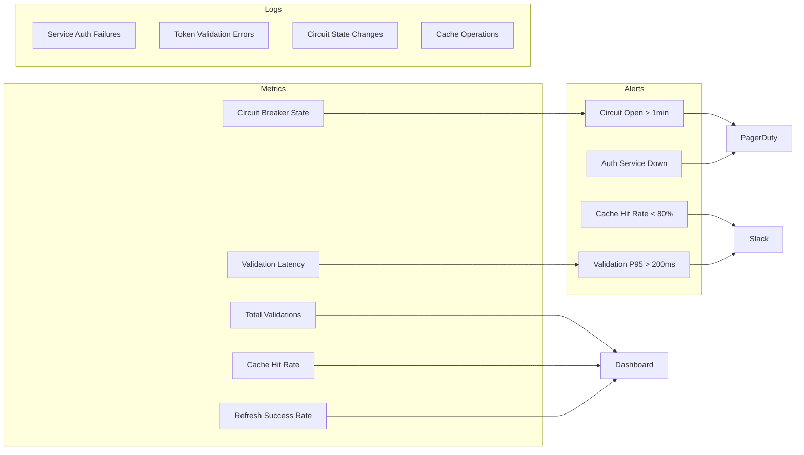

# Interservice Authentication Architecture

## Overview

This document provides comprehensive documentation of the authentication architecture in the Netra platform, focusing on how the backend service delegates authentication responsibilities to the dedicated auth service. The architecture follows a **Single Source of Truth (SSOT)** principle where the auth service is the canonical authority for all authentication and authorization decisions.

## Core Principles

1. **SSOT Compliance**: Auth service is the single source of truth for all JWT operations
2. **Service Delegation**: Backend delegates ALL authentication to auth service
3. **No Local Validation**: Backend NEVER validates JWTs locally (security requirement)
4. **Caching Strategy**: Token validation results are cached for performance
5. **Circuit Breaker**: Protects against auth service failures
6. **Service-to-Service Auth**: Uses SERVICE_ID and SERVICE_SECRET headers

## Authentication Flow Overview



## Detailed Authentication Delegation Flow



## Service-to-Service Authentication



## JWT Validation Process (Auth Service Internal)



## Token Caching Strategy

```mermaid
graph TB
    subgraph "Cache Layers"
        L1[User-Scoped Cache]
        L2[Token Validation Cache]
        TTL[TTL Management]
    end
    
    subgraph "Cache Operations"
        Get[Cache Get]
        Set[Cache Set]
        Inv[Cache Invalidate]
    end
    
    subgraph "Cache Keys"
        UK[user:{user_id}]
        TK[validated_token:{token}]
        BK[blacklist:{token}]
    end
    
    Get --> L1
    Get --> L2
    L1 --> UK
    L2 --> TK
    L2 --> BK
    
    Set --> TTL
    TTL -->|5 min default| L1
    TTL -->|Token TTL - 60s| L2
    
    Inv -->|Logout| L1
    Inv -->|Blacklist| L2
    Inv -->|Refresh| L2
```

## Circuit Breaker States and Transitions



## Timing and Performance Expectations

```mermaid
gantt
    title Token Validation Timeline
    dateFormat X
    axisFormat %L
    
    section Cache Hit
    Check Cache           :done, cache1, 0, 5
    Return Cached Result  :done, cache2, 5, 10
    
    section Cache Miss (Success)
    Check Cache           :done, miss1, 0, 5
    Circuit Breaker Check :done, miss2, 5, 10
    Service Auth Headers  :done, miss3, 10, 15
    Network Call to Auth  :active, miss4, 15, 100
    JWT Validation        :active, miss5, 100, 120
    Database Lookup       :active, miss6, 120, 140
    Response Processing   :done, miss7, 140, 145
    Cache Result          :done, miss8, 145, 150
    
    section Circuit Open
    Check Cache           :done, open1, 0, 5
    Circuit Check (Open)  :crit, open2, 5, 10
    Stale Cache Lookup    :done, open3, 10, 15
    Return Degraded       :done, open4, 15, 20
```



### Performance Targets

| Operation | Target | Maximum | Notes |
|-----------|--------|---------|-------|
| Cache Hit | < 5ms | 10ms | In-memory lookup |
| Cache Miss (Success) | < 150ms | 200ms | Full auth service call |
| Circuit Open (Stale Cache) | < 20ms | 30ms | Degraded mode |
| Circuit Open (No Cache) | < 10ms | 15ms | Fast failure |
| Token Refresh | < 200ms | 300ms | New token generation |
| WebSocket Auth | < 100ms | 150ms | Initial connection |

## WebSocket Authentication Flow



## Token Refresh Strategy



## Error Handling and Resilience



## Configuration Requirements

### Backend Service Configuration

```yaml
# Required Environment Variables
SERVICE_ID: netra-backend
SERVICE_SECRET: [32+ character secret]
AUTH_SERVICE_URL: http://auth-service:8081
AUTH_SERVICE_ENABLED: true
AUTH_CLIENT_TIMEOUT: 10
AUTH_CLIENT_MAX_RETRIES: 3
AUTH_CLIENT_CACHE_TTL: 300
AUTH_CLIENT_CIRCUIT_BREAKER: true
```

### Auth Service Configuration

```yaml
# Required Environment Variables
JWT_SECRET: [32+ character secret, must match across services]
JWT_ALGORITHM: HS256
TOKEN_EXPIRY_MINUTES: 60
REFRESH_TOKEN_EXPIRY_DAYS: 7
BLACKLIST_CHECK_ENABLED: true
SERVICE_AUTH_ENABLED: true
```

## Security Considerations

1. **JWT Secret Synchronization**: JWT_SECRET must be identical across all environments for a given deployment
2. **Service Credentials**: SERVICE_SECRET should be unique per service and rotated regularly
3. **No Local Validation**: Backend must NEVER decode JWTs locally - security vulnerability
4. **Blacklist Checking**: Auth service checks blacklist before ANY validation
5. **Atomic Operations**: Blacklist checks are atomic to prevent race conditions
6. **Cache Invalidation**: Tokens are immediately invalidated in cache upon logout/blacklist

## Monitoring and Observability



## Common Issues and Solutions

| Issue | Symptoms | Solution |
|-------|----------|----------|
| SERVICE_SECRET not set | 403 errors, "Inter-service auth failed" | Set SERVICE_SECRET env var |
| JWT_SECRET mismatch | All tokens invalid | Ensure JWT_SECRET identical across services |
| Circuit breaker stuck open | All auth fails after errors | Wait for recovery timeout (10s) or restart |
| High cache miss rate | Slow performance | Increase cache TTL or check token expiry |
| WebSocket token refresh fails | Connection drops after 1 hour | Check refresh endpoint and network |

## Testing Strategies

1. **Unit Tests**: Mock auth service responses, test cache behavior
2. **Integration Tests**: Use real auth service, test service-to-service auth
3. **E2E Tests**: Full flow with real JWT tokens, test WebSocket refresh
4. **Load Tests**: Verify cache effectiveness under load
5. **Chaos Tests**: Test circuit breaker behavior with auth service failures

## Migration Notes

### From Local JWT Validation
1. Remove all `import jwt` statements
2. Replace `jwt.decode()` with `auth_client.validate_token()`
3. Update error handling for auth service failures
4. Add circuit breaker configuration
5. Test degraded mode behavior

### WebSocket Token Refresh
1. Initialize TokenRefreshHandler with WebSocket manager
2. Call `initialize_connection()` on connect
3. Handle `token_refreshed` events in client
4. Call `cleanup_connection()` on disconnect
5. Monitor refresh metrics

## Conclusion

This architecture ensures secure, scalable, and resilient authentication across the Netra platform. By delegating all authentication to a dedicated service with proper caching and circuit breaker patterns, we achieve:

- **Security**: No JWT secrets in backend service
- **Performance**: Sub-10ms cache hits for most requests
- **Resilience**: Graceful degradation during auth service issues
- **Scalability**: Stateless backend can scale horizontally
- **Maintainability**: Single source of truth for auth logic