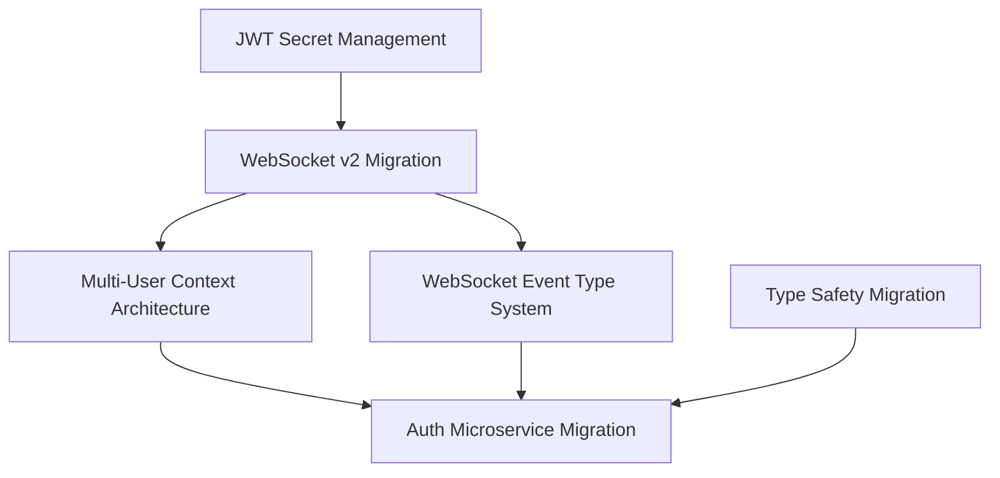

# Migration Paths Consolidated Guide

> **Last Updated:** 2025-01-08 | **Focus:** Separate migration tracks with clear dependencies and validation

**Quick Navigation:** [Migration Tracks](#migration-tracks) | [Status Dashboard](#status-dashboard) | [Implementation Guidelines](#implementation-guidelines) | [Validation Framework](#validation-framework)

---

## Executive Summary

The Netra Apex platform has multiple **separate migration tracks** that require distinct approaches, validation methods, and timelines. This consolidated guide organizes all migrations into focused tracks to prevent conflicts and ensure systematic progression.

### Key Principles

1. **Separate Tracks:** Different migration types require different approaches and timelines
2. **Dependency Management:** Clear mapping of inter-track dependencies 
3. **Business Value Priority:** Migrations ordered by impact on core business value (Chat/WebSocket functionality)
4. **SSOT Compliance:** All migrations must follow Single Source of Truth principles
5. **Feature Freeze Compliance:** ZERO new features - only make existing features work better

---

## Migration Tracks

### Track 1: Security & Isolation Migrations 🔒
**Business Impact:** CRITICAL - Enables multi-user platform scaling ($120K+ MRR protection)
**Status:** ACTIVE - High priority security migrations

#### 1.1 WebSocket v2 Factory Pattern Migration
- **Scope:** 17 critical services require migration from singleton to factory pattern
- **Business Justification:** Prevents user data bleeding between sessions
- **Current Status:** IN PROGRESS - 6 of 17 services migrated
- **Dependencies:** None (foundational)
- **Timeline:** 2-3 weeks for completion

**Key Files:**
- `netra_backend/app/websocket_core/websocket_manager_factory.py`
- `netra_backend/app/routes/websocket.py` 
- See: [WebSocket v2 Critical Miss](../SPEC/learnings/websocket_v2_migration_critical_miss_20250905.xml)

#### 1.2 Multi-User Context Architecture
- **Scope:** Factory-based user isolation patterns
- **Business Justification:** Enables reliable concurrent execution for 10+ users
- **Current Status:** PHASE 1 COMPLETE - Core agents migrated
- **Dependencies:** WebSocket v2 migration must be completed first
- **Timeline:** Phase 2 pending WebSocket completion

**Key Files:**
- See: [User Context Architecture](../reports/archived/USER_CONTEXT_ARCHITECTURE.md)

#### 1.3 JWT Secret Management Unification
- **Scope:** Atomic JWT secret synchronization across services
- **Business Justification:** Prevents WebSocket authentication failures in staging/production
- **Current Status:** PLANNED - Solution designed
- **Dependencies:** None (parallel with other tracks)
- **Timeline:** 1 week implementation

---

### Track 2: Type Safety & Data Integrity 🛡️
**Business Impact:** HIGH - Prevents runtime errors and data corruption
**Status:** CRITICAL NEED IDENTIFIED - Requires immediate action

#### 2.1 String ID to Strongly Typed ID Migration
- **Scope:** User, Thread, Run, Request IDs across all services
- **Business Justification:** Prevents ID mixing errors that could break user sessions
- **Current Status:** TYPE DRIFT IDENTIFIED - 110+ duplicate type definitions found
- **Dependencies:** Service isolation must be maintained
- **Timeline:** 2 weeks systematic replacement

**Implementation Plan:**
```python
# BEFORE (Type Drift)
user_id = "user-12345"  # String - error prone
thread_id = request.get("id")  # Any type

# AFTER (Strongly Typed)
from shared.types import UserID, ThreadID
user_id = UserID("user-12345")  # Type safe
thread_id = ThreadID.from_request(request)  # Validated
```

#### 2.2 Authentication Data Structure Migration
- **Scope:** Raw dictionaries → strongly typed auth results
- **Business Justification:** Prevents auth bypass vulnerabilities
- **Current Status:** AUDIT NEEDED - Type drift analysis required
- **Dependencies:** Track 1 security migrations
- **Timeline:** 1 week after Track 1 security completion

#### 2.3 WebSocket Event Type System Migration
- **Scope:** String-based events → enum-based type system
- **Business Justification:** Ensures WebSocket event delivery reliability (critical for Chat value)
- **Current Status:** DESIGN PHASE - Requirements gathering
- **Dependencies:** WebSocket v2 migration completion
- **Timeline:** 1 week implementation

---

### Track 3: Service Architecture Evolution 🏗️
**Business Impact:** MEDIUM - Enables platform scaling and compliance
**Status:** PLANNED - Detailed plans exist, implementation not started

#### 3.1 Auth Microservice Migration
- **Scope:** Complete separation of auth from main backend
- **Business Justification:** Enables OAuth compliance and service scaling
- **Current Status:** COMPREHENSIVE PLAN EXISTS - Implementation not started
- **Dependencies:** Tracks 1 & 2 must be completed first
- **Timeline:** 6 phases, 4-6 weeks total

**Migration Phases:**
1. **Phase 1:** API interface separation (1 week)
2. **Phase 2:** Database isolation (1 week)
3. **Phase 3:** Service-to-service authentication (1 week)
4. **Phase 4:** OAuth isolation (1 week)
5. **Phase 5:** Performance optimization (1 week)
6. **Phase 6:** Legacy cleanup (1 week)

#### 3.2 Configuration System Enhancement
- **Scope:** GCP Secret Manager integration completion
- **Business Justification:** Prevents configuration regression cascades
- **Current Status:** ✅ LARGELY COMPLETE - Minor enhancements needed
- **Dependencies:** None
- **Timeline:** Maintenance mode

---

### Track 4: Infrastructure & Operations ⚙️
**Business Impact:** LOW-MEDIUM - Developer efficiency and deployment reliability
**Status:** MOSTLY COMPLETE - Maintenance and optimization focus

#### 4.1 Database Migration Management
- **Scope:** Alembic-based schema migrations and rollback procedures
- **Business Justification:** Prevents data loss during deployments
- **Current Status:** ✅ OPERATIONAL - Ongoing maintenance
- **Dependencies:** None
- **Timeline:** Continuous maintenance

#### 4.2 Container Orchestration Optimization
- **Scope:** Alpine containers and resource optimization
- **Business Justification:** 50% faster testing, 40% lower memory usage
- **Current Status:** ✅ COMPLETE - Production ready
- **Dependencies:** None
- **Timeline:** Complete

#### 4.3 Testing Infrastructure Modernization
- **Scope:** Real service testing and mock elimination
- **Business Justification:** Prevents test/production behavior divergence
- **Current Status:** ✅ COMPLETE - 83% memory reduction achieved
- **Dependencies:** None
- **Timeline:** Complete

---

## Status Dashboard

### High Priority Tracks (Business Critical)

| Track | Status | Progress | Business Risk | Next Action |
|-------|--------|----------|---------------|-------------|
| **Security & Isolation** | 🟡 ACTIVE | 40% | HIGH ($120K+ MRR) | Complete WebSocket v2 |
| **Type Safety** | 🔴 CRITICAL | 10% | MEDIUM | Start type drift audit |
| **Auth Microservice** | 🟠 PLANNED | 0% | LOW | Wait for dependencies |
| **Infrastructure** | ✅ COMPLETE | 95% | LOW | Maintenance only |

### Migration Dependencies



---

## Implementation Guidelines

### Migration Execution Process

1. **Pre-Migration Checklist**
   - [ ] Review [Getting Stuck Log](../reports/getting_stuck_log.md) for similar patterns
   - [ ] Check [MISSION_CRITICAL_NAMED_VALUES_INDEX.xml](../SPEC/MISSION_CRITICAL_NAMED_VALUES_INDEX.xml)
   - [ ] Validate no conflicts with ongoing migrations
   - [ ] Confirm business value justification

2. **Migration Implementation**
   - [ ] Create dedicated sub-agents for complex migrations
   - [ ] Follow MRO analysis for inheritance changes
   - [ ] Maintain SSOT compliance throughout
   - [ ] Generate comprehensive test coverage

3. **Validation Requirements**
   - [ ] Mission critical tests must pass: `python tests/mission_critical/test_websocket_agent_events_suite.py`
   - [ ] Real service testing (NO MOCKS in E2E/Integration)
   - [ ] Multi-user isolation verification
   - [ ] Performance regression testing

### Migration Risk Assessment

#### High Risk Migrations
- **WebSocket v2:** 17 services, user session isolation critical
- **Type Safety:** 110+ files, runtime error prevention
- **Auth Microservice:** Cross-service dependencies, OAuth compliance

#### Risk Mitigation Strategies
1. **Phased Rollout:** Critical migrations broken into phases
2. **Feature Flags:** Enable gradual activation of new patterns
3. **Rollback Plans:** Detailed rollback procedures for each phase
4. **Comprehensive Testing:** Real service validation at each step

---

## Validation Framework

### Migration Testing Strategy

#### 1. Pre-Migration Testing
```bash
# Validate current system state
python tests/unified_test_runner.py --category integration --real-services
python tests/mission_critical/test_websocket_agent_events_suite.py
```

#### 2. During Migration Testing
```bash
# Continuous validation during migration
python tests/unified_test_runner.py --category unit integration --fast-fail
python scripts/type_drift_migration_utility.py --scan  # For type migrations
```

#### 3. Post-Migration Validation
```bash
# Comprehensive system validation
python tests/unified_test_runner.py --categories smoke unit integration api e2e --real-services --real-llm
python tests/mission_critical/test_no_ssot_violations.py
```

### Success Metrics

#### Security & Isolation Track
- [ ] Zero user data bleeding incidents
- [ ] 100% multi-user test isolation
- [ ] WebSocket connection reliability >99.9%

#### Type Safety Track  
- [ ] Zero runtime type errors in production
- [ ] 100% strongly typed ID usage
- [ ] Authentication structure validation

#### Service Architecture Track
- [ ] Independent service deployability
- [ ] OAuth compliance certification
- [ ] Cross-service performance <100ms

---

## Outdated Documentation to Refresh

### Immediate Updates Needed
1. **`docs/configuration-migration.md`** - Remove outdated references to deleted systems
2. **Various Phase 2 agent migration status** - Update with current completion state
3. **WebSocket v2 migration progress tracking** - Real-time status dashboard
4. **Type safety migration timeline** - Specific implementation roadmap

### Documentation Consolidation
1. **User Context Architecture Docs** - Single comprehensive guide
2. **Service Architecture Evolution Roadmap** - Timeline for microservice migrations
3. **Testing Migration Best Practices** - Document successful patterns
4. **Migration Lessons Learned** - Extract patterns from 486+ learning files

---

## Emergency Rollback Procedures

### Track 1: Security & Isolation
- **WebSocket v2 Rollback:** Revert to singleton pattern, disable factory features
- **Context Architecture Rollback:** Fall back to legacy DeepAgentState patterns
- **JWT Rollback:** Revert to original secret management

### Track 2: Type Safety
- **Type System Rollback:** Revert to string-based IDs with validation disabled
- **Auth Structure Rollback:** Fall back to dictionary-based auth results

### All Tracks
- **Database Rollback:** Use Alembic downgrade procedures
- **Configuration Rollback:** GCP Secret Manager version rollback
- **Docker Rollback:** Use previous image tags via UnifiedDockerManager

---

## Getting Started

### For Developers Starting Migration Work

1. **Choose Your Track:** Review business impact and dependencies
2. **Read Track-Specific Documentation:** Each track has detailed implementation guides
3. **Set Up Validation Environment:** Ensure all testing tools are working
4. **Create Sub-Agent Plan:** For complex migrations, plan sub-agent delegation
5. **Follow SSOT Principles:** Maintain single source of truth throughout

### For System Architects

1. **Review Dependency Map:** Understand cross-track dependencies
2. **Validate Business Justifications:** Ensure migrations align with business goals
3. **Monitor Risk Factors:** Track high-risk migration progress closely
4. **Plan Resource Allocation:** Stagger migrations to prevent team overload

---

**🚨 CRITICAL REMINDER:** All migrations must maintain the feature freeze principle - we are making existing features work better, NOT adding new features. Every migration must have clear business value justification and contribute to platform stability and user experience.

---

*This document serves as the master migration coordination guide. Individual track documentation provides detailed implementation specifics.*