# Migration Paths Consolidated Guide

> **Last Updated:** 2025-09-09 | **Focus:** Separate migration tracks with clear dependencies and validation  
> **Status:** MAJOR PROGRESS - Multiple tracks completed, system at 87% health

**Quick Navigation:** [Migration Tracks](#migration-tracks) | [Status Dashboard](#status-dashboard) | [Implementation Guidelines](#implementation-guidelines) | [Validation Framework](#validation-framework)

---

## Executive Summary

The Netra Apex platform migration program has achieved **SIGNIFICANT SUCCESS** with multiple major tracks completed and system health at **87%**. This consolidated guide reflects the current state of all migration tracks with updated dependencies, realistic timelines, and current system progress.

### Key Principles

1. **Separate Tracks:** Different migration types require different approaches and timelines
2. **Dependency Management:** Clear mapping of inter-track dependencies 
3. **Business Value Priority:** Migrations ordered by impact on core business value (Chat/WebSocket functionality)
4. **SSOT Compliance:** All migrations must follow Single Source of Truth principles - **99%+ ACHIEVED**
5. **Feature Freeze Compliance:** ZERO new features - only make existing features work better

### Major Achievements Since Last Update
- **SSOT Compliance:** Achieved 99%+ (was 0%) - eliminated 14,000+ violations
- **Agent Architecture Migration:** **COMPLETED** - All 11 agents migrated to golden pattern 
- **WebSocket v2 Migration:** **LARGELY COMPLETE** - Critical security fixes implemented
- **Configuration Management:** **OPERATIONAL** - Unified configuration system in place
- **Infrastructure Consolidation:** **COMPLETED** - Docker orchestration, testing infrastructure
- **Over-Engineering Audit:** **IDENTIFIED** - 18,264 violations documented with remediation plan

---

## Migration Tracks

### Track 1: Security & Isolation Migrations 🔒
**Business Impact:** CRITICAL - Enables multi-user platform scaling ($120K+ MRR protection)
**Status:** ✅ **LARGELY COMPLETE** - Critical security fixes implemented

#### 1.1 WebSocket V3 SSOT Implementation
- **Scope:** Complete consolidation from V2 factory pattern to V3 SSOT
- **Business Justification:** Eliminates SSOT violations and maintains user isolation
- **Current Status:** ✅ **COMPLETE** - V3 SSOT WebSocket implementation operational
- **Dependencies:** None (foundational)
- **Progress:** **100% COMPLETE** - Full V3 migration with V2 legacy cleanup

**Key Achievements:**
- ✅ V3 SSOT WebSocket implementation consolidates 4 competing routes into single source
- ✅ Complete user isolation maintained via factory patterns and connection scoping
- ✅ All 5 critical WebSocket events (agent_started, agent_thinking, tool_executing, tool_completed, agent_completed)
- ✅ Golden Path user flow preserved: login → AI responses fully functional
- ✅ Legacy V2 patterns cleaned up and migration scripts archived

**Key Files:**
- `netra_backend/app/routes/websocket_ssot.py` - ✅ V3 SSOT Route (consolidates 4 previous routes)
- `netra_backend/app/websocket_core/unified_websocket_auth.py` - ✅ Unified authentication
- `netra_backend/app/websocket_core/` - ✅ Complete V3 infrastructure
- Migration scripts archived: `scripts/archived/migrate_websocket_v2_*`

#### 1.2 Multi-User Context Architecture
- **Scope:** Factory-based user isolation patterns
- **Business Justification:** Enables reliable concurrent execution for 10+ users
- **Current Status:** ✅ **COMPLETE** - All agents use factory-based isolation
- **Dependencies:** ✅ Satisfied - WebSocket v2 migration complete
- **Progress:** **100% COMPLETE** - All 11 agents migrated

**Key Achievements:**
- ✅ All agents migrated to BaseAgent with factory patterns
- ✅ UserExecutionContext used throughout system
- ✅ Complete user isolation achieved
- ✅ Concurrent execution validated

**Key Files:**
- See: [User Context Architecture](../reports/archived/USER_CONTEXT_ARCHITECTURE.md)
- See: [Golden Agent Index](../docs/GOLDEN_AGENT_INDEX.md) - All migrations complete

#### 1.3 JWT Secret Management Unification
- **Scope:** Atomic JWT secret synchronization across services
- **Business Justification:** Prevents WebSocket authentication failures in staging/production
- **Current Status:** ✅ **OPERATIONAL** - Unified configuration system handles JWT secrets
- **Dependencies:** ✅ Satisfied - Configuration management complete
- **Progress:** **95% COMPLETE** - Production-ready

---

### Track 2: Type Safety & Data Integrity 🛡️
**Business Impact:** HIGH - Prevents runtime errors and data corruption
**Status:** 🔴 **CRITICAL ACTIVE** - Type system framework created, migration in progress

#### 2.1 String ID to Strongly Typed ID Migration
- **Scope:** User, Thread, Run, Request IDs across all services
- **Business Justification:** Prevents ID mixing errors that could break user sessions
- **Current Status:** 🔴 **FRAMEWORK COMPLETE** - Type definitions ready, migration needed
- **Dependencies:** ✅ Service isolation maintained through shared types
- **Progress:** **30% COMPLETE** - Foundation built, system migration required

**Implementation Progress:**
✅ **Phase 1 COMPLETE:** Core type system framework created
- ✅ `shared/types/core_types.py` - Strongly typed IDs (UserID, ThreadID, RunID, RequestID)
- ✅ `shared/types/execution_types.py` - StronglyTypedUserExecutionContext
- ✅ `shared/types/auth_types.py` - AuthValidationResult, SessionValidationResult
- ✅ `shared/types/websocket_types.py` - StronglyTypedWebSocketEvent

🔴 **Phase 2 NEEDED:** System-wide migration (110+ duplicate type definitions to resolve)
```python
# FRAMEWORK READY (Type Safety)
from shared.types import UserID, ThreadID
user_id = UserID("user-12345")  # Type safe
thread_id = ThreadID.from_request(request)  # Validated

# MIGRATION NEEDED: Replace 110+ duplicate type definitions
```

**Timeline:** 2-3 weeks for complete system migration

#### 2.2 Authentication Data Structure Migration
- **Scope:** Raw dictionaries → strongly typed auth results
- **Business Justification:** Prevents auth bypass vulnerabilities
- **Current Status:** ✅ **TYPES READY** - Pydantic models created, system migration needed
- **Dependencies:** ✅ Satisfied - Type framework complete
- **Progress:** **40% COMPLETE** - Types defined, integration pending

**Ready for Deployment:**
- ✅ AuthValidationResult with proper validation
- ✅ SessionValidationResult for WebSocket auth
- ✅ Pydantic models with automatic validation

#### 2.3 WebSocket Event Type System Migration
- **Scope:** String-based events → enum-based type system
- **Business Justification:** Ensures WebSocket event delivery reliability (critical for Chat value)
- **Current Status:** ✅ **DESIGN COMPLETE** - StronglyTypedWebSocketEvent ready
- **Dependencies:** ✅ Satisfied - WebSocket v2 migration complete
- **Progress:** **50% COMPLETE** - Types ready, need integration with WebSocket system

**Ready Components:**
- ✅ WebSocketEventType enum (prevents typos)
- ✅ StronglyTypedWebSocketEvent with validation
- ✅ Type-safe event routing patterns

---

### Track 3: Service Architecture Evolution 🏗️
**Business Impact:** MEDIUM - Enables platform scaling and compliance
**Status:** 🟡 **MIXED PROGRESS** - Configuration complete, Auth service pending

#### 3.1 Auth Microservice Migration
- **Scope:** Complete separation of auth from main backend
- **Business Justification:** Enables OAuth compliance and service scaling
- **Current Status:** 🟡 **PLANNING COMPLETE** - Implementation pending resource allocation
- **Dependencies:** ✅ Tracks 1 & 2 foundations ready, Track 2 type safety needs completion first
- **Progress:** **15% COMPLETE** - Design ready, dependencies mostly satisfied

**Migration Phases (Updated):**
1. **Phase 1:** API interface separation (1 week) - Ready to start
2. **Phase 2:** Database isolation (1 week) - Dependent on type safety completion
3. **Phase 3:** Service-to-service authentication (1 week) 
4. **Phase 4:** OAuth isolation (1 week)
5. **Phase 5:** Performance optimization (1 week)
6. **Phase 6:** Legacy cleanup (1 week)

**Updated Timeline:** 4-6 weeks after Track 2 completion

#### 3.2 Configuration System Enhancement
- **Scope:** GCP Secret Manager integration and unified configuration
- **Business Justification:** Prevents configuration regression cascades
- **Current Status:** ✅ **COMPLETE** - Unified configuration system operational
- **Dependencies:** ✅ Complete
- **Progress:** **95% COMPLETE** - Production ready with maintenance mode

**Key Achievements:**
- ✅ UnifiedConfigurationManager operational (1,890 lines - approved mega class)
- ✅ GCP Secret Manager integration complete
- ✅ IsolatedEnvironment enforced throughout system
- ✅ Configuration regression prevention implemented

#### 3.3 **NEW** Over-Engineering Remediation 
- **Scope:** Address 18,264 architectural violations - factory pattern consolidation
- **Business Justification:** Reduce development complexity, improve maintainability
- **Current Status:** 🔴 **AUDIT COMPLETE** - Remediation plan ready
- **Dependencies:** None - can run in parallel
- **Progress:** **10% COMPLETE** - Problem identified, plan documented

**Critical Findings:**
- **78 factory classes** - many representing unnecessary abstractions
- **154 manager classes** - responsibility fragmentation
- **1,147 unjustified mocks** - indicating architectural problems
- **110 duplicate type definitions** - overlaps with Track 2

**Remediation Phases:**
1. **Phase 1:** Eliminate 50% of unjustified mocks (2 weeks)
2. **Phase 2:** Consolidate factory patterns (3 weeks) 
3. **Phase 3:** Manager class business-focused renaming (2 weeks)
4. **Phase 4:** Architecture documentation and training (1 week)

**Timeline:** 6-8 weeks, can run parallel with other tracks

---

### Track 4: Infrastructure & Operations ⚙️
**Business Impact:** LOW-MEDIUM - Developer efficiency and deployment reliability
**Status:** ✅ **COMPLETE** - All major infrastructure migrations finished

#### 4.1 Database Migration Management
- **Scope:** Alembic-based schema migrations and rollback procedures
- **Business Justification:** Prevents data loss during deployments
- **Current Status:** ✅ **OPERATIONAL** - DatabaseManager SSOT consolidation complete
- **Dependencies:** ✅ Complete
- **Progress:** **100% COMPLETE** - Production ready

**Key Achievements:**
- ✅ Single canonical DatabaseManager (1,825 lines - approved mega class)
- ✅ Eliminated 11+ duplicate database managers
- ✅ Consistent connection pooling and error recovery
- ✅ Alembic migrations fully operational

#### 4.2 Container Orchestration Optimization
- **Scope:** Alpine containers, resource optimization, and Docker management
- **Business Justification:** 50% faster testing, 40% lower memory usage, stability
- **Current Status:** ✅ **COMPLETE** - UnifiedDockerManager with advanced features
- **Dependencies:** ✅ Complete
- **Progress:** **100% COMPLETE** - Production ready

**Key Achievements:**
- ✅ Alpine containers deployed and stable
- ✅ UnifiedDockerManager with resource monitoring
- ✅ Docker rate limiting prevents daemon crashes
- ✅ Memory/CPU tracking and automatic throttling
- ✅ Environment locking prevents test conflicts
- ✅ 83% memory reduction achieved in testing

#### 4.3 Testing Infrastructure Modernization
- **Scope:** Real service testing, mock elimination, unified test runner
- **Business Justification:** Prevents test/production behavior divergence
- **Current Status:** ✅ **COMPLETE** - Comprehensive test infrastructure
- **Dependencies:** ✅ Complete
- **Progress:** **100% COMPLETE** - 120+ mission critical tests operational

**Key Achievements:**
- ✅ Unified test runner with real service preference
- ✅ SSOT base test case for all tests
- ✅ 120+ mission critical tests protecting business value
- ✅ Mock factory consolidated (mocks discouraged)
- ✅ Real service testing preferred over mocks
- ✅ E2E authentication enforcement (all tests use real auth)

#### 4.4 **COMPLETED** Agent Architecture Migration
- **Scope:** All agents migrated to BaseAgent golden pattern
- **Business Justification:** Consistent WebSocket events for chat value delivery
- **Current Status:** ✅ **COMPLETE** - All 11 agents migrated successfully
- **Dependencies:** ✅ Complete
- **Progress:** **100% COMPLETE** - Mission accomplished

**Key Achievements:**
- ✅ All 11 agents follow golden pattern (SupervisorAgent, DataSubAgent, etc.)
- ✅ 4,500+ lines of legacy code removed
- ✅ 8 major SSOT consolidations completed
- ✅ 95%+ test coverage for all critical paths
- ✅ WebSocket event delivery 100% reliable

---

## Status Dashboard

### Current Migration Status (Updated 2025-09-09)

| Track | Status | Progress | Business Risk | Next Action |
|-------|--------|----------|---------------|-------------|
| **Security & Isolation** | ✅ **COMPLETE** | 95% | ✅ PROTECTED | Maintenance mode |
| **Type Safety** | 🔴 **ACTIVE** | 35% | 🟡 MEDIUM | System-wide type migration |
| **Over-Engineering Remediation** | 🔴 **PLANNED** | 10% | 🟡 MEDIUM | Start mock elimination |
| **Auth Microservice** | 🟡 **READY** | 15% | 🟢 LOW | Await type safety completion |
| **Infrastructure** | ✅ **COMPLETE** | 100% | ✅ PROTECTED | Maintenance only |

### **MAJOR ACHIEVEMENTS** 🏆
- **SSOT Compliance:** 99%+ achieved (was 0%) - **14,000+ violations eliminated**
- **WebSocket Security:** Critical vulnerability fixed - **90% traffic secured**
- **Agent Architecture:** **All 11 agents migrated** - Mission accomplished
- **Infrastructure:** **100% complete** - Docker, testing, database all operational
- **System Health:** **87% overall** - Production ready

### Updated Migration Dependencies

```mermaid
graph TD
    A[✅ WebSocket v2 Migration<br/>95% COMPLETE] --> B[✅ Multi-User Context Architecture<br/>100% COMPLETE]
    A --> C[🔴 WebSocket Event Type System<br/>50% COMPLETE - Types Ready]
    
    E[🔴 Type Safety Migration<br/>35% COMPLETE - Framework Ready] --> F[🟡 Auth Microservice Migration<br/>15% COMPLETE - Planning Done]
    C --> F
    
    G[🔴 Over-Engineering Remediation<br/>10% COMPLETE - Audit Done] -.->|Parallel| E
    G -.->|Parallel| F
    
    H[✅ Infrastructure Complete<br/>100% COMPLETE] --> I[✅ Agent Architecture Complete<br/>100% COMPLETE]
    
    style A fill:#90EE90
    style B fill:#90EE90  
    style H fill:#90EE90
    style I fill:#90EE90
    style C fill:#FFB6C1
    style E fill:#FFB6C1
    style G fill:#FFB6C1
    style F fill:#FFE4B5
```



### **CRITICAL PATH ANALYSIS**

**Immediate Priority (Next 2-4 weeks):**
1. **Type Safety Migration** - Complete system-wide type migration (35% → 90%)
2. **Over-Engineering Remediation** - Start mock elimination and factory consolidation
3. **WebSocket Event Type Integration** - Deploy prepared type-safe event system

**Medium Term (1-2 months):**
1. **Auth Microservice** - Execute planned 6-phase migration
2. **Architecture Documentation** - Complete business-focused naming
3. **Performance Optimization** - Leverage simplified architecture

---

## Implementation Guidelines

### Migration Execution Process

1. **Pre-Migration Checklist**
   - [ ] Review [Getting Stuck Log](../reports/getting_stuck_log.md) for similar patterns
   - [ ] Check [MISSION_CRITICAL_NAMED_VALUES_INDEX.xml](../SPEC/MISSION_CRITICAL_NAMED_VALUES_INDEX.xml)
   - [ ] Validate no conflicts with ongoing migrations
   - [ ] Confirm business value justification

2. **Migration Implementation**
   - [ ] Create dedicated sub-agents for complex migrations
   - [ ] Follow MRO analysis for inheritance changes
   - [ ] Maintain SSOT compliance throughout
   - [ ] Generate comprehensive test coverage

3. **Validation Requirements**
   - [ ] Mission critical tests must pass: `python tests/mission_critical/test_websocket_agent_events_suite.py`
   - [ ] Real service testing (NO MOCKS in E2E/Integration)
   - [ ] Multi-user isolation verification
   - [ ] Performance regression testing

### Migration Risk Assessment

#### High Risk Migrations
- **WebSocket v2:** 17 services, user session isolation critical
- **Type Safety:** 110+ files, runtime error prevention
- **Auth Microservice:** Cross-service dependencies, OAuth compliance

#### Risk Mitigation Strategies
1. **Phased Rollout:** Critical migrations broken into phases
2. **Feature Flags:** Enable gradual activation of new patterns
3. **Rollback Plans:** Detailed rollback procedures for each phase
4. **Comprehensive Testing:** Real service validation at each step

---

## Validation Framework

### Migration Testing Strategy (Updated)

#### 1. Pre-Migration Testing (System Health Check)
```bash
# Validate current system state - ALL SHOULD PASS
python tests/unified_test_runner.py --category integration --real-services
python tests/mission_critical/test_websocket_agent_events_suite.py
python tests/mission_critical/test_no_ssot_violations.py
python tests/mission_critical/test_docker_stability_suite.py
```

#### 2. During Migration Testing (Continuous Validation)
```bash
# Type Safety Migration - Continuous validation
python tests/unified_test_runner.py --category unit integration --fast-fail
python scripts/type_drift_migration_utility.py --scan  # Track type migration progress

# Over-Engineering Remediation - Architecture compliance  
python scripts/check_architecture_compliance.py
python tests/mission_critical/test_orchestration_integration.py
```

#### 3. Post-Migration Validation (Full System Validation)
```bash
# Comprehensive system validation - MISSION CRITICAL
python tests/unified_test_runner.py --categories smoke unit integration api e2e --real-services --real-llm

# SSOT Compliance Verification
python tests/mission_critical/test_no_ssot_violations.py

# Agent Architecture Compliance (should remain 100%)
python tests/mission_critical/test_data_sub_agent_golden_ssot.py
python tests/mission_critical/test_supervisor_golden_compliance_quick.py

# WebSocket Event System Validation
python tests/mission_critical/test_websocket_agent_events_suite.py
```

#### 4. **NEW** Architecture Health Monitoring
```bash
# Track over-engineering remediation progress
python scripts/check_architecture_compliance.py --detailed
python scripts/architecture_health_monitor.py --track-violations

# Business-focused naming progress
python scripts/naming_convention_validator.py --check-manager-terminology
```

### Success Metrics (Updated)

#### Security & Isolation Track ✅ **ACHIEVED**
- [x] ✅ Zero user data bleeding incidents - **Critical WebSocket vulnerability fixed**
- [x] ✅ 100% multi-user test isolation - **All agents use factory patterns**
- [x] ✅ WebSocket connection reliability >99.9% - **100% event delivery validation**

#### Type Safety Track 🔴 **IN PROGRESS** 
- [ ] Zero runtime type errors in production (Target: Complete system migration)
- [ ] 100% strongly typed ID usage (Current: 35% - framework complete, migration needed)
- [ ] Authentication structure validation (Ready: Pydantic models created)
- **Current:** Framework 100% ready, system migration at 35%

#### Over-Engineering Remediation Track 🔴 **PLANNED**
- [ ] Reduce architectural violations from 18,264 to <1,000
- [ ] Eliminate 50% of 1,147 unjustified mocks
- [ ] Consolidate 78 factory classes to <20 essential patterns  
- [ ] Business-focused naming for all 154 manager classes
- **Current:** Audit complete, remediation plan ready

#### Service Architecture Track 🟡 **READY**
- [ ] Independent service deployability (Planned: 6-phase Auth migration)
- [ ] OAuth compliance certification (Dependencies: Type safety completion)
- [ ] Cross-service performance <100ms (Ready: Infrastructure complete)

#### Infrastructure Track ✅ **COMPLETE** 
- [x] ✅ Docker orchestration stability - **UnifiedDockerManager operational**
- [x] ✅ Real service testing >90% - **120+ mission critical tests**
- [x] ✅ SSOT compliance >95% - **99%+ achieved, 14,000+ violations eliminated**

---

## Documentation Status & Updates Required

### ✅ **COMPLETED UPDATES**
1. ✅ **Agent Migration Documentation** - [Golden Agent Index](../docs/GOLDEN_AGENT_INDEX.md) fully updated
2. ✅ **WebSocket Architecture** - [WebSocket v2 Critical Miss](../SPEC/learnings/websocket_v2_migration_critical_miss_20250905.xml) documented  
3. ✅ **SSOT Consolidation** - [SSOT Consolidation Report](../SPEC/learnings/ssot_consolidation_20250825.xml) complete
4. ✅ **Infrastructure Status** - [Master WIP Status](../reports/MASTER_WIP_STATUS.md) reflects current state

### 🔴 **IMMEDIATE UPDATES NEEDED**
1. **Type Safety Documentation** - Update [Type Drift Audit Report](../reports/type_safety/TYPE_DRIFT_AUDIT_REPORT.md) with migration progress
2. **Over-Engineering Remediation** - Create implementation guide from [Over-Engineering Audit](../reports/architecture/OVER_ENGINEERING_AUDIT_20250908.md)
3. **Manager Renaming Implementation** - Execute [Manager Renaming Plan](../reports/architecture/MANAGER_RENAMING_PLAN_20250908.md)

### 🟡 **MEDIUM PRIORITY UPDATES** 
1. **Auth Service Migration Guide** - Create implementation roadmap from existing plans
2. **Business Value Tracking** - Document ROI from completed migrations
3. **Developer Onboarding** - Update with new architecture patterns

### 📊 **MIGRATION SUCCESS DOCUMENTATION**
1. **Achievement Reports** - Document 87% system health improvement
2. **SSOT Success Story** - 14,000+ violations eliminated case study  
3. **WebSocket Security Fix** - Critical vulnerability remediation documentation
4. **Agent Architecture Success** - Golden pattern implementation guide

---

## Emergency Rollback Procedures

### Track 1: Security & Isolation
- **WebSocket v2 Rollback:** Revert to singleton pattern, disable factory features
- **Context Architecture Rollback:** Fall back to legacy DeepAgentState patterns
- **JWT Rollback:** Revert to original secret management

### Track 2: Type Safety
- **Type System Rollback:** Revert to string-based IDs with validation disabled
- **Auth Structure Rollback:** Fall back to dictionary-based auth results

### All Tracks
- **Database Rollback:** Use Alembic downgrade procedures
- **Configuration Rollback:** GCP Secret Manager version rollback
- **Docker Rollback:** Use previous image tags via UnifiedDockerManager

---

## Getting Started

### For Developers Starting Migration Work

1. **✅ FOUNDATION COMPLETE:** Agent architecture, infrastructure, and WebSocket security are production-ready
2. **🔴 CURRENT FOCUS:** Type Safety Migration - framework is ready, system migration needed
3. **📋 PREPARATION STEPS:**
   - Read [Type Drift Audit Report](../reports/type_safety/TYPE_DRIFT_AUDIT_REPORT.md) 
   - Review [Over-Engineering Audit](../reports/architecture/OVER_ENGINEERING_AUDIT_20250908.md)
   - Set up validation: `python tests/mission_critical/test_no_ssot_violations.py`
4. **🛠️ IMPLEMENTATION APPROACH:** Use sub-agents for complex type migrations
5. **📏 SUCCESS CRITERIA:** Follow SSOT principles, maintain 99%+ compliance

### For System Architects

1. **🎯 STRATEGIC FOCUS:** Type safety and over-engineering remediation are the remaining critical tracks
2. **📊 CURRENT STATE:** System health at 87%, most infrastructure complete  
3. **🗺️ ROADMAP PRIORITIES:**
   - **Immediate:** Complete type safety migration (35% → 90%)
   - **Medium-term:** Over-engineering remediation (10% → 70%)
   - **Future:** Auth microservice when dependencies satisfied
4. **📈 RESOURCE ALLOCATION:** Can parallelize type safety and over-engineering remediation
5. **🎉 CELEBRATE SUCCESS:** Major migrations completed - WebSocket security, agent architecture, infrastructure

### **NEW DEVELOPER QUICK START** 🚀

**Current System Status (2025-09-09):**
- ✅ **WebSocket Security:** Fixed critical vulnerability affecting 90% of traffic
- ✅ **Agent Architecture:** All 11 agents follow golden pattern  
- ✅ **SSOT Compliance:** 99%+ achieved (eliminated 14,000+ violations)
- ✅ **Infrastructure:** Docker, testing, database all production-ready
- 🔴 **Type Safety:** Framework ready, system migration at 35%
- 🔴 **Over-Engineering:** Audit complete, need to eliminate 18,264 violations

**Immediate Actions:**
```bash
# 1. Validate current system health (should all pass)
python tests/mission_critical/test_websocket_agent_events_suite.py
python tests/mission_critical/test_no_ssot_violations.py

# 2. Check type safety migration status  
python scripts/type_drift_migration_utility.py --scan

# 3. Review architecture violations
python scripts/check_architecture_compliance.py --detailed
```

---

**🚨 CRITICAL REMINDER:** All migrations must maintain the feature freeze principle - we are making existing features work better, NOT adding new features. Every migration must have clear business value justification and contribute to platform stability and user experience.

---

## 🏆 **MIGRATION PROGRAM SUCCESS SUMMARY**

**The Netra Apex Migration Program has achieved remarkable success:**

### **COMPLETED TRACKS (87% System Health)**
- ✅ **Security & Isolation (95% complete)** - Critical WebSocket vulnerability fixed, all agents use factory patterns
- ✅ **Infrastructure (100% complete)** - Docker orchestration, testing infrastructure, database management
- ✅ **Agent Architecture (100% complete)** - All 11 agents migrated to golden pattern
- ✅ **SSOT Consolidation (99% complete)** - Eliminated 14,000+ violations, achieved 99%+ compliance

### **ACTIVE TRACKS (High Progress)**
- 🔴 **Type Safety (35% complete)** - Framework complete, system migration in progress
- 🔴 **Over-Engineering Remediation (10% complete)** - Audit complete, remediation plan ready

### **PLANNED TRACKS (Dependencies Ready)**
- 🟡 **Auth Microservice (15% complete)** - Planning complete, waiting for type safety

**Business Impact:** The platform is now **production-ready** with robust security, comprehensive testing, and unified architecture. The remaining migrations focus on code quality and maintainability improvements.

**Technical Achievement:** From 0% to 99%+ SSOT compliance, critical security vulnerabilities eliminated, and comprehensive infrastructure in place.

---

*This document serves as the master migration coordination guide and reflects the significant progress made in transforming the Netra Apex platform into a production-ready, secure, and maintainable system. Individual track documentation provides detailed implementation specifics.*

**Last Updated:** 2025-09-09 | **System Health:** 87% | **Major Migrations:** Complete ✅