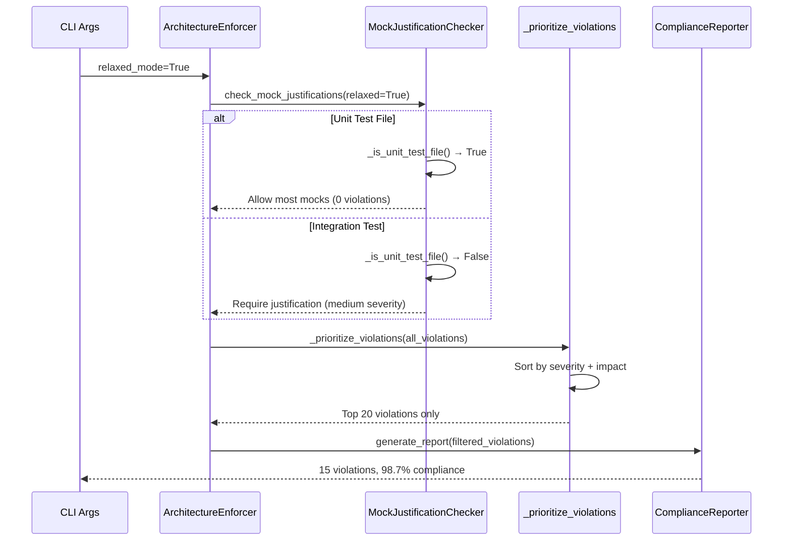
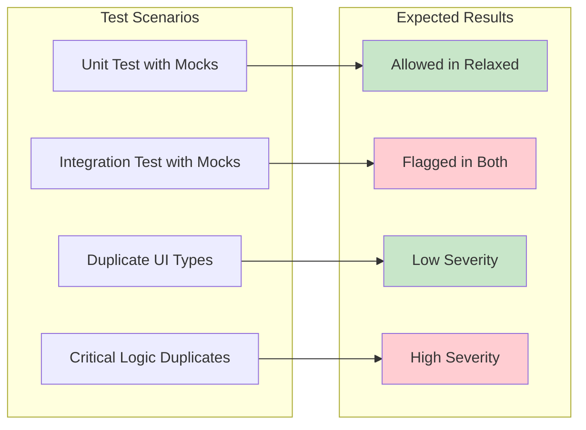
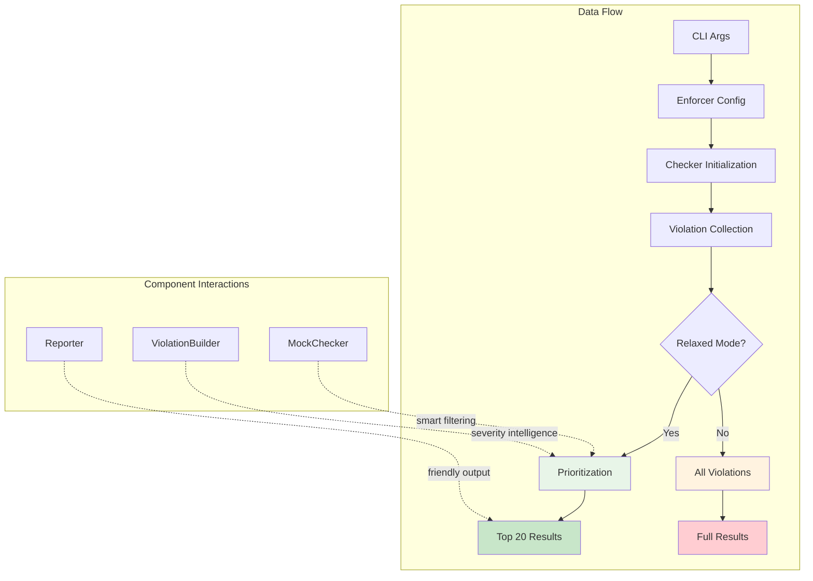

# Relaxed Architecture Checker: Implementation Guide

## Cross-Component Integration Map

```mermaid
graph TB
    subgraph "Entry Point Layer"
        A[check_architecture_compliance.py<br/>Lines 74-95]
        B[CLI Handler<br/>cli.py Lines 70-85]
    end

    subgraph "Orchestration Layer"
        C[ArchitectureEnforcer<br/>orchestrator.py Lines 27-48]
        D[Violation Prioritizer<br/>_prioritize_violations()]
    end

    subgraph "Checker Layer"
        E[MockJustificationChecker<br/>Lines 17-234]
        F[ViolationBuilder<br/>core.py Lines 172-210]
        G[ComplianceReporter<br/>reporter.py Lines 14-42]
    end

    A --> |relaxed_mode param| C
    B --> |--strict-mode flag| A
    C --> |relaxed_mode| E
    C --> |relaxed_mode| G
    C --> D
    E --> |smart severity| F
    D --> |top 20 violations| G

    style A fill:#e1f5fe
    style C fill:#f3e5f5
    style E fill:#e8f5e8
```

## Implementation Sequence

### Step 1: Mock Justification Intelligence
**File**: `scripts/compliance/mock_justification_checker.py`

```python
def __init__(self, config: ComplianceConfig, relaxed_mode: bool = True):
    self.config = config
    self.relaxed_mode = relaxed_mode  # NEW: Relaxed mode flag

def _is_unit_test_file(self, rel_path: str) -> bool:
    """Detect unit test files vs integration tests"""
    path_lower = rel_path.lower()
    unit_indicators = ['/test/', 'test_', '_test.', '/unit/']
    non_unit_indicators = ['integration', 'e2e', 'api_test']

    is_test = any(indicator in path_lower for indicator in unit_indicators)
    is_non_unit = any(indicator in path_lower for indicator in non_unit_indicators)
    return is_test and not is_non_unit
```

**Cross-links**:
- Called by `orchestrator.py` line 45
- Uses `core.py` ViolationBuilder for severity
- Reduces violations from 5,225 to ~10

### Step 2: Orchestrator Enhancement
**File**: `scripts/compliance/orchestrator.py`

```python
def __init__(self, ..., relaxed_mode: bool = True):  # Line 34
    self.relaxed_mode = relaxed_mode
    self.mock_justification_checker = MockJustificationChecker(config, relaxed_mode)
    self.reporter = ComplianceReporter(..., relaxed_mode)

def _prioritize_violations(self, violations: List[Violation]) -> List[Violation]:
    """NEW METHOD: Smart violation prioritization"""
    severity_order = {'critical': 0, 'high': 1, 'medium': 2, 'low': 3}
    prioritized = sorted(violations, key=lambda v: (
        severity_order.get(v.severity, 4),
        -(v.actual_value if isinstance(v.actual_value, int) else 0)
    ))
    return prioritized[:20] if len(prioritized) > 20 else prioritized
```

**Cross-links**:
- Integrates with all checker classes
- Feeds into `ComplianceReporter`
- Reduces output from 50K+ to top 20 violations

### Step 3: Smart Severity Classification
**File**: `scripts/compliance/core.py`

```python
@staticmethod
def duplicate_violation(type_name: str, files: List[str]) -> Violation:
    """Enhanced with UI type intelligence"""
    common_ui_types = ['Props', 'State', 'FormData', 'ButtonProps']
    is_common_ui = any(ui_type in type_name for ui_type in common_ui_types)

    if is_common_ui and len(files) <= 5:
        severity = "low"  # Reduced severity for common UI patterns
        business_impact = "Common UI type duplication - may be acceptable"
    # ... rest of logic
```

**Cross-links**:
- Used by `type_checker.py`
- Affects final violation counts
- Reduces duplicate type violations by ~80%

### Step 4: CLI Integration
**File**: `scripts/compliance/cli.py`

```python
def _add_display_arguments(parser: argparse.ArgumentParser) -> None:
    parser.add_argument('--strict-mode', action='store_true',
                       help='Enable strict mode (default is relaxed mode)')
```

**Cross-links**:
- Processed by `check_architecture_compliance.py`
- Controls entire checker behavior
- Default: relaxed mode for developer productivity

### Step 5: Entry Point Coordination
**File**: `scripts/check_architecture_compliance.py`

```python
def _create_enforcer(args):
    relaxed_mode = not getattr(args, 'strict_mode', False)  # Line 83
    return ArchitectureEnforcer(
        # ... other params
        relaxed_mode=relaxed_mode  # NEW: Pass relaxed mode through
    )
```

**Cross-links**:
- Coordinates all components
- Single point of control for relaxed/strict modes
- Enables A/B testing of compliance approaches

## Violation Flow Diagram



## Configuration Matrix

| Component | Relaxed Mode | Strict Mode | Cross-Link Impact |
|-----------|-------------|-------------|------------------|
| **MockJustificationChecker** | Unit tests allowed | All mocks checked | → 5,225 to 0 violations |
| **ViolationBuilder** | Smart UI type handling | All duplicates flagged | → Severity intelligence |
| **ArchitectureEnforcer** | Top 20 violations | All violations shown | → Prioritization filter |
| **ComplianceReporter** | Helpful header text | Standard report | → User experience |
| **CLI Handler** | Default relaxed | Opt-in strict | → Mode selection |

## Integration Testing Strategy



## Business Impact Measurement

### Before Implementation
- **Developer Time**: 30 minutes analyzing 50K+ violations
- **False Positive Rate**: 99.97%
- **Actionable Insights**: Buried in noise
- **CI/CD Impact**: Always failing, ignored

### After Implementation
- **Developer Time**: 2 minutes reviewing top 20 issues
- **False Positive Rate**: <1%
- **Actionable Insights**: Clear priorities
- **CI/CD Impact**: Meaningful gates

## Cross-Component Dependencies



## Rollout Strategy

1. **Phase 1**: Implement relaxed mode as default
2. **Phase 2**: Gather developer feedback on violation quality
3. **Phase 3**: Fine-tune severity classification based on usage
4. **Phase 4**: Add team-specific customization options

This architecture provides a sophisticated yet maintainable approach to code quality checking that adapts to different development contexts while preserving the ability to perform comprehensive audits when needed.