# Netra Apex AI Optimization Platform - System Architecture Overview

> **Executive Summary**: Netra Apex is an enterprise AI workload optimization platform that reduces customer AI costs by 30-50% through intelligent multi-agent orchestration, real-time optimization recommendations, and performance-based value capture.

## Table of Contents

1. [Executive Summary](#executive-summary)
2. [Business Value & Architecture](#business-value--architecture)
3. [System Overview](#system-overview)
4. [Service Architecture](#service-architecture)
5. [Technology Stack](#technology-stack)
6. [Data Flow & Communication](#data-flow--communication)
7. [Common User Workflows](#common-user-workflows)
8. [Business Value Mapping](#business-value-mapping)
9. [Development & Deployment](#development--deployment)
10. [Monitoring & Observability](#monitoring--observability)

---

## Executive Summary

### What is Netra Apex?

Netra Apex is a sophisticated AI optimization platform designed to analyze and optimize enterprise AI workloads in real-time. The platform uses a multi-agent system to provide intelligent recommendations that reduce AI costs while maintaining or improving performance.

**Key Value Propositions:**
- **Cost Reduction**: 30-50% reduction in AI infrastructure spend
- **Performance Optimization**: 2-3x improvement in processing speed
- **Real-time Intelligence**: Live optimization recommendations via WebSocket streaming
- **Enterprise Security**: OAuth-first authentication with enterprise-grade security
- **Revenue Sharing Model**: 20% of customer savings captured as platform fee

### Business Model
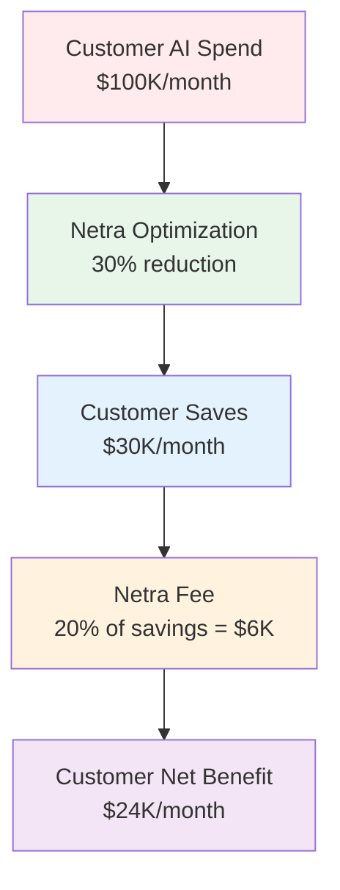

---

## Business Value & Architecture

### Revenue-Driven Design Philosophy

Every component in Netra Apex is designed with business value justification:

| Customer Segment | Monthly AI Spend | Netra Optimization | Customer Savings | Netra Revenue |
|-----------------|------------------|-------------------|------------------|---------------|
| **Free** | < $1K | Basic optimization | Up to $300/month | $0 (conversion focus) |
| **Early** | $1K - $10K | Standard optimization | $300 - $3K/month | $60 - $600/month |
| **Mid** | $10K - $100K | Advanced optimization | $3K - $30K/month | $600 - $6K/month |
| **Enterprise** | > $100K | Full platform + custom | > $30K/month | Negotiated contracts |

### Platform Architecture Principles

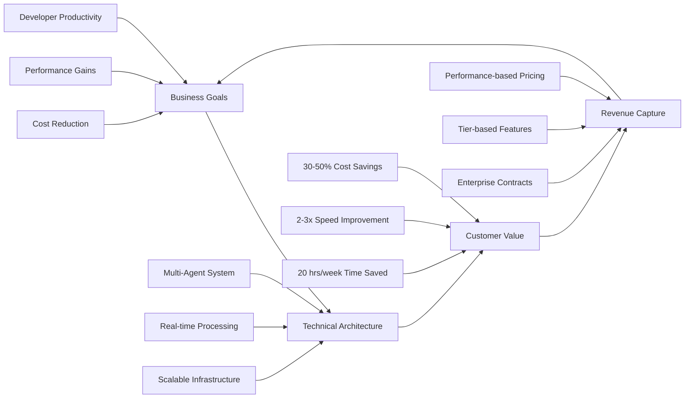

---

## System Overview

### High-Level Architecture

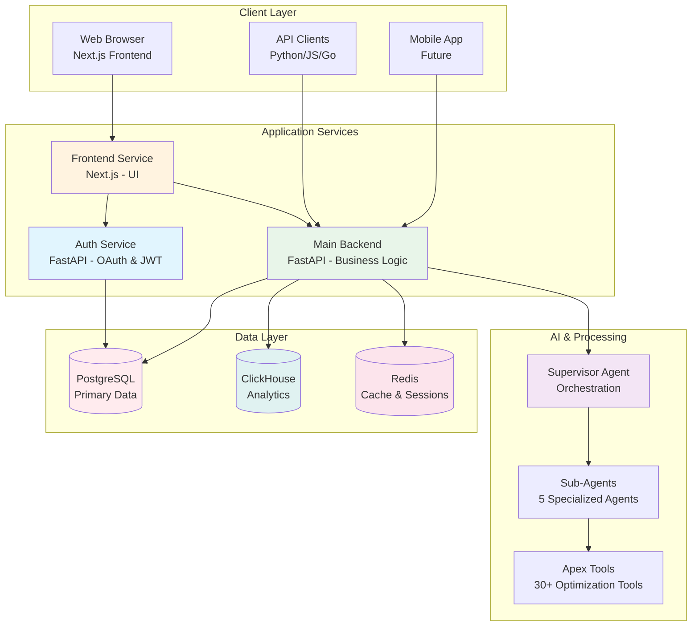

### System Characteristics

**🔹 Microservice Architecture**: Three independent services (Frontend, Backend, Auth Service)
**🔹 Multi-Agent Intelligence**: Sophisticated AI agent system with supervisor pattern
**🔹 Real-time Communication**: WebSocket-based streaming for live updates
**🔹 Dual Database Strategy**: PostgreSQL for transactions, ClickHouse for analytics
**🔹 OAuth-First Security**: Enterprise-grade authentication with JWT tokens
**🔹 Cloud-Native Design**: GCP deployment with auto-scaling capabilities

---

## Service Architecture

### Service Overview

| Service | Technology | Port (Dev) | Purpose | Key Features |
|---------|------------|------------|---------|--------------|
| **Frontend** | Next.js 15 | Dynamic | Web UI | React 19, TypeScript, TailwindCSS |
| **Backend** | FastAPI | Dynamic | Business Logic | Multi-agent system, WebSocket, APIs |
| **Auth Service** | FastAPI | Dynamic | Authentication | OAuth 2.0, JWT, Session management |

*Note: All ports are dynamically discovered in development via `.service_discovery/` directory*

### Service Independence

```mermaid
graph TB
    subgraph "Service Boundaries"
        subgraph "Frontend Service"
            F1[Next.js App]
            F2[React Components]
            F3[State Management]
            F4[API Client]
        end
        
        subgraph "Backend Service"
            B1[FastAPI App]
            B2[Agent System]
            B3[Business Logic]
            B4[Database Models]
        end
        
        subgraph "Auth Service"
            A1[FastAPI App]
            A2[OAuth Integration]
            A3[JWT Management]
            A4[User Management]
        end
    end
    
    F4 -.->|HTTP/WebSocket| B1
    F4 -.->|HTTP| A1
    B1 -.->|Token Validation| A1
    
    style Frontend fill:#fff3e0
    style Backend fill:#e8f5e9
    style "Auth Service" fill:#e1f5fe
```

**Key Principle**: Each service is 100% independent with no shared code dependencies, ensuring independent deployment and scaling.

### Multi-Agent System Architecture

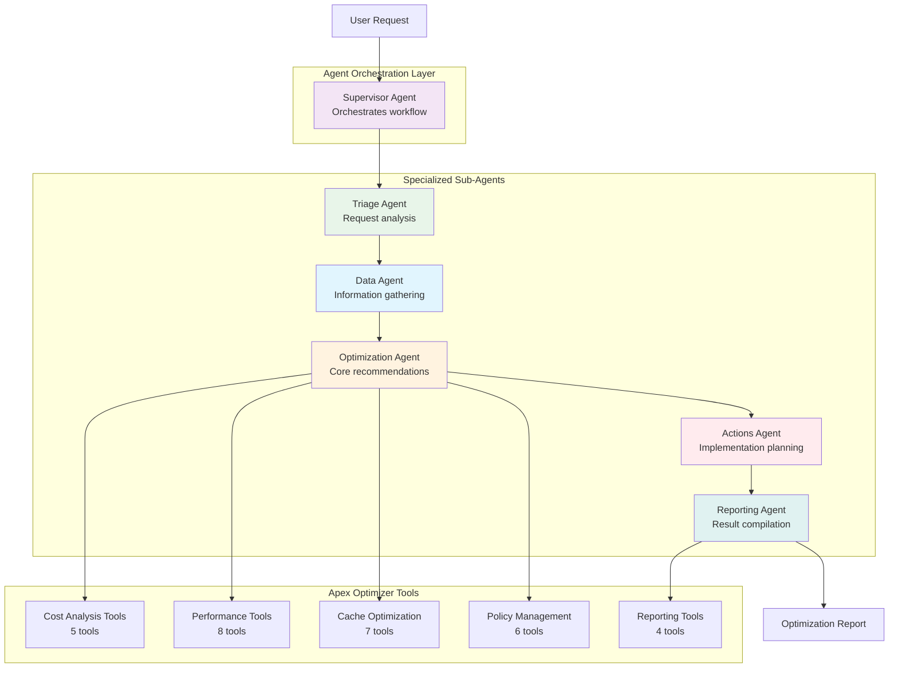

**Agent Workflow**: Sequential execution with state persistence, error recovery, and real-time progress updates via WebSocket.

---

## Technology Stack

### Comprehensive Technology Overview

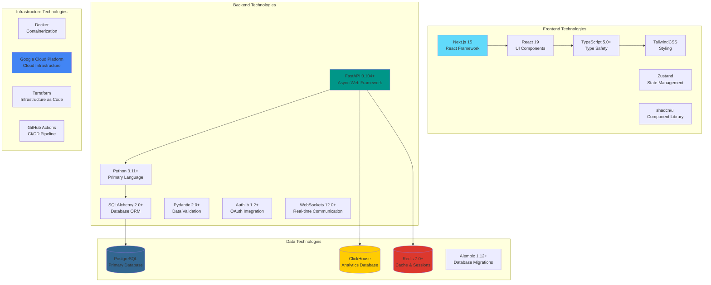

### Technology Choices & Rationale

| Technology | Version | Why Chosen | Business Value |
|------------|---------|------------|----------------|
| **FastAPI** | 0.104+ | Async-first, automatic OpenAPI, high performance | Reduces development time, scales efficiently |
| **Next.js** | 15.0+ | SSR/SSG, excellent DX, React ecosystem | Fast development, SEO-friendly, great UX |
| **PostgreSQL** | 15+ | ACID compliance, rich feature set, reliability | Data integrity, complex queries, enterprise-ready |
| **ClickHouse** | 23+ | Column-oriented, analytics optimized, fast | Real-time analytics, cost optimization insights |
| **Redis** | 7.0+ | In-memory, pub/sub, session management | Low latency, session persistence, caching |
| **TypeScript** | 5.0+ | Type safety, IDE support, error prevention | Reduces bugs, improves maintainability |

---

## Data Flow & Communication

### Authentication Flow

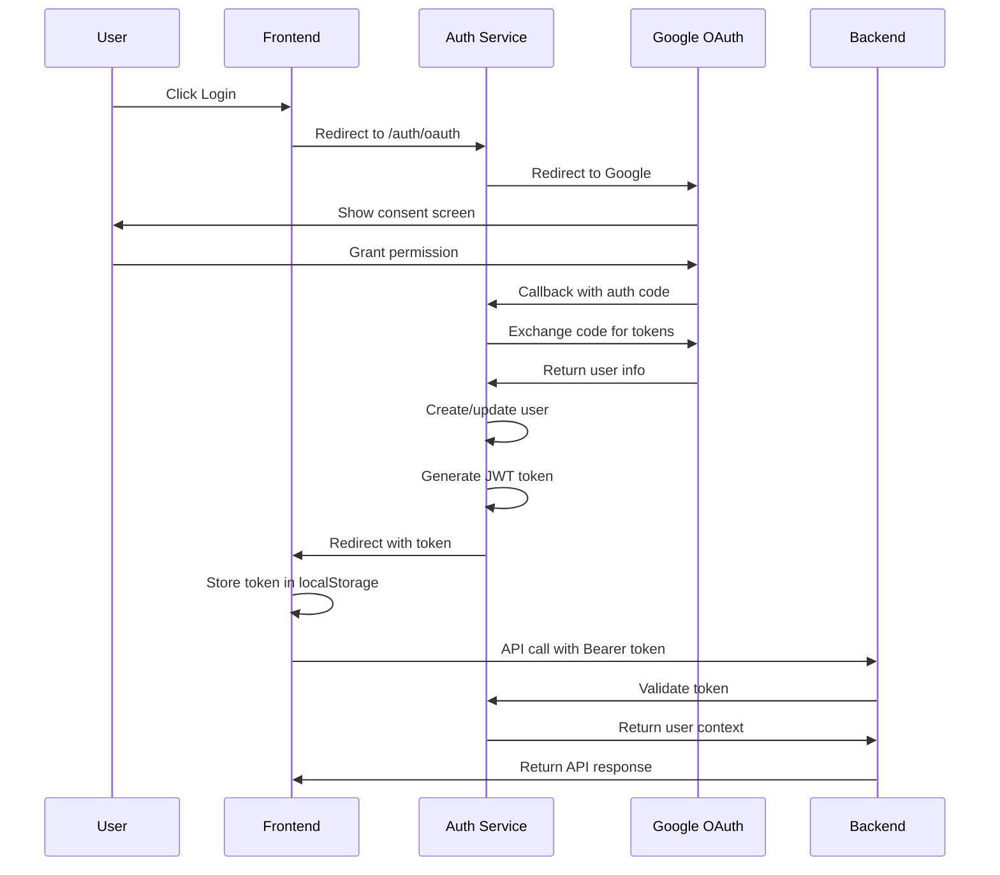

### Real-time Communication Flow

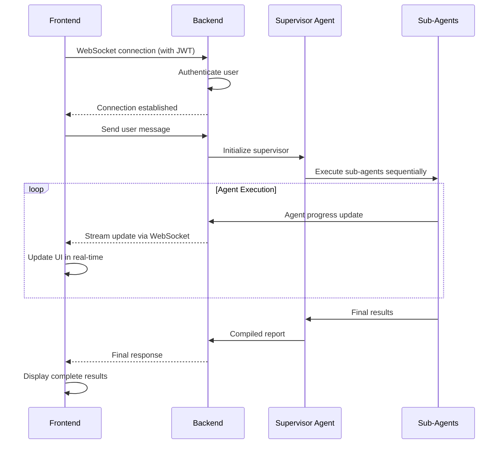

### Data Processing Pipeline

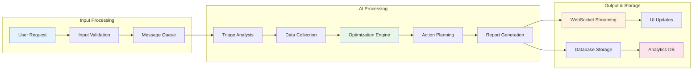

---

## Common User Workflows

### Workflow 1: New User Onboarding

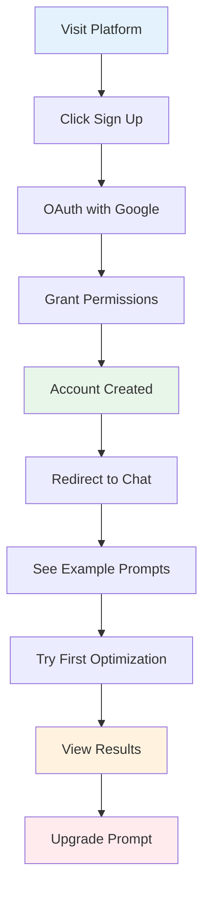

**Steps Explained:**
1. **Landing Page**: User discovers platform value proposition
2. **Authentication**: One-click OAuth with Google (no manual registration)
3. **Onboarding**: Guided tour of features and capabilities
4. **First Experience**: Pre-built example prompts for immediate value
5. **Results**: Real-time optimization recommendations
6. **Conversion**: Upgrade path clearly presented

### Workflow 2: AI Workload Optimization

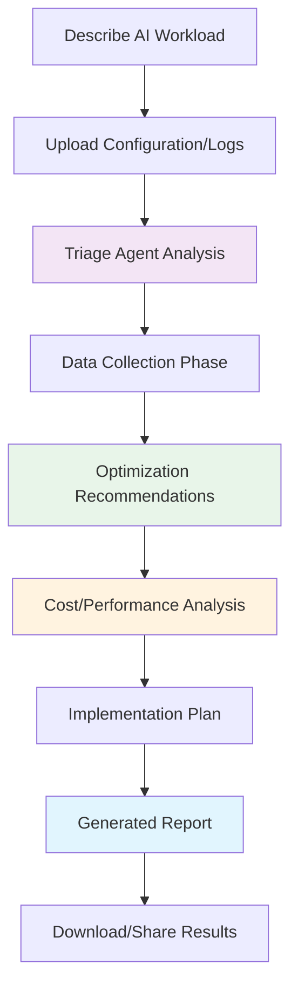

**Real-time Updates**: Each phase streams live updates to the user via WebSocket, showing:
- Current agent executing
- Tools being used
- Preliminary findings
- Progress indicators

### Workflow 3: Enterprise Integration

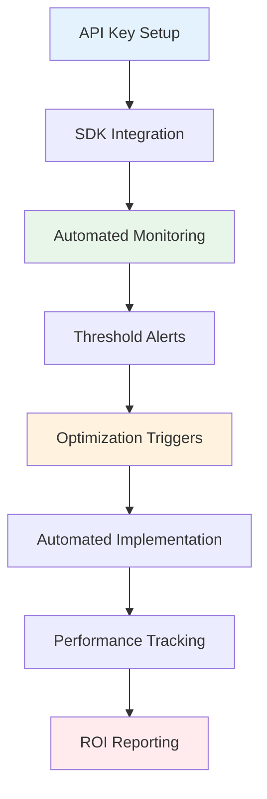

**Enterprise Features**:
- Programmatic API access
- Automated optimization workflows
- Custom thresholds and alerts
- Integration with existing monitoring systems

---

## Business Value Mapping

### Customer Value Creation

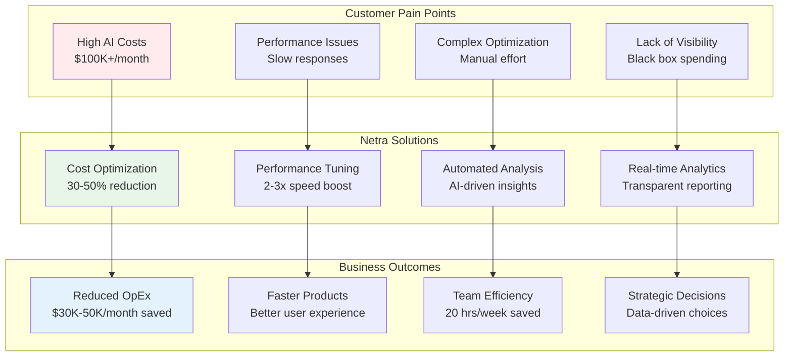

### Revenue Model Deep Dive

| Customer Tier | Monthly AI Spend | Platform Fee Structure | Annual Revenue Potential |
|---------------|------------------|----------------------|------------------------|
| **Free** | $0 - $1K | $0 (conversion focus) | $0 |
| **Early** | $1K - $10K | 20% of savings | $1.4K - $14K |
| **Mid** | $10K - $100K | 20% of savings | $14K - $144K |
| **Enterprise** | $100K+ | Negotiated (15-25%) | $216K+ |

**Key Metrics**:
- **Average Customer Lifetime Value**: $180K (Mid tier)
- **Payback Period**: 3 months average
- **Customer Acquisition Cost**: $2K average
- **Net Revenue Retention**: 120% target

---

## Development & Deployment

### Development Environment

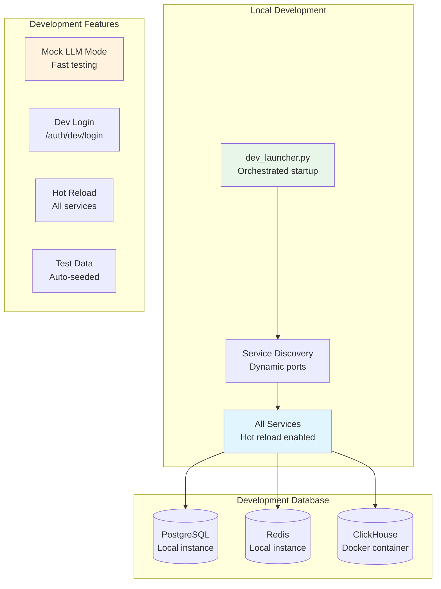

**Quick Start**:
```bash
# One command to start everything
python scripts/dev_launcher.py

# Or use unified test runner
python unified_test_runner.py --category integration --no-coverage --fast-fail
```

### Staging Environment (GCP)

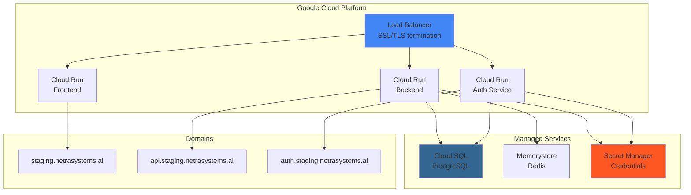

**Deployment Command**:
```bash
# Deploy to staging
python scripts/deploy_to_gcp.py --project netra-staging --build-local

# Deploy with health checks
python scripts/deploy_to_gcp.py --project netra-staging --build-local --run-checks
```

### Environment Configuration

| Environment | Database | Authentication | LLM Mode | SSL |
|-------------|----------|---------------|----------|-----|
| **Development** | Local PostgreSQL | Dev login available | Mock mode available | Not required |
| **Staging** | Cloud SQL (Unix socket) | OAuth required | Real LLMs | Required |
| **Production** | Cloud SQL (Multi-region) | OAuth + 2FA | Real LLMs | Required |

---

## Monitoring & Observability

### Health Monitoring System

```mermaid
graph TB
    subgraph "Health Check Endpoints"
        BASIC[/health<br/>Basic liveness]
        READY[/health/ready<br/>Dependencies check]
        METRICS[/health/metrics<br/>Prometheus metrics]
    end
    
    subgraph "Monitoring Stack"
        PROMETHEUS[Prometheus<br/>Metrics collection]
        GRAFANA[Grafana<br/>Visualization]
        ALERT[Alert Manager<br/>Notifications]
    end
    
    subgraph "Key Metrics"
        SLI[Service Level Indicators<br/>Response time, availability]
        SLO[Service Level Objectives<br/>99.9% uptime target]
        ERROR[Error Budget<br/>0.1% error allowance]
    end
    
    BASIC --> PROMETHEUS
    READY --> PROMETHEUS
    METRICS --> PROMETHEUS
    
    PROMETHEUS --> GRAFANA
    PROMETHEUS --> ALERT
    
    PROMETHEUS --> SLI
    SLI --> SLO
    SLO --> ERROR
    
    style PROMETHEUS fill:#e36c09
    style GRAFANA fill:#f46800
    style SLO fill:#4285f4
```

### Business Metrics Dashboard

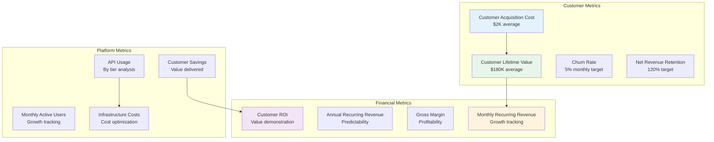

### Performance Benchmarks

| Metric | Target | Current | Status |
|--------|--------|---------|--------|
| **API Response Time** | < 200ms p95 | 150ms p95 | ✅ Meeting |
| **Agent Processing** | < 30s average | 25s average | ✅ Meeting |
| **WebSocket Latency** | < 50ms | 35ms | ✅ Meeting |
| **System Availability** | 99.9% | 99.95% | ✅ Exceeding |
| **Database Query Time** | < 100ms p95 | 80ms p95 | ✅ Meeting |

---

## Troubleshooting & Common Issues

### Common Development Issues

| Issue | Symptoms | Solution |
|-------|----------|----------|
| **Port Conflicts** | Services fail to start | Use `python scripts/dev_launcher.py` for automatic port discovery |
| **Database Connection** | Connection refused errors | Ensure PostgreSQL is running and credentials are correct |
| **Import Errors** | ModuleNotFoundError | Use absolute imports: `from netra_backend.app.services import ...` |
| **WebSocket Issues** | Connection drops | Check JWT token in connection headers |

### Staging Deployment Issues

| Issue | Root Cause | Solution |
|-------|------------|----------|
| **503 Errors** | SSL parameter conflicts | Run `resolve_ssl_parameter_conflicts()` |
| **Health Check Fails** | Missing secrets | Verify all secrets in GCP Secret Manager |
| **No Traffic** | Traffic not routed | Run `gcloud run services update-traffic --to-latest` |
| **OAuth Errors** | Wrong redirect URIs | Update OAuth console with correct staging domains |

---

## Getting Started

### For Developers

1. **Clone Repository**: `git clone [repository-url]`
2. **Setup Environment**: `python scripts/dev_launcher.py`
3. **Run Tests**: `python unified_test_runner.py --category integration --fast-fail`
4. **Access Application**: Check `.service_discovery/` for actual ports

### For Product Managers

1. **Review [Business Metrics](business/REVENUE_TRACKING.md)**: Understanding value creation
2. **Check [API Documentation](architecture/API_DOCUMENTATION.md)**: Feature capabilities by tier
3. **Monitor [Dashboards](#business-metrics-dashboard)**: Real-time business metrics

### For DevOps Engineers

1. **Deploy Staging**: `python scripts/deploy_to_gcp.py --project netra-staging --build-local`
2. **Monitor Health**: Check `/health/ready` endpoints
3. **Review Logs**: Use GCP Logging for troubleshooting

---

## Next Steps

### Documentation Deep Dives

- **[Service Interactions](architecture/SERVICE_INTERACTIONS.md)** - Detailed API flows and patterns
- **[Agent System](agents/AGENT_SYSTEM.md)** - Multi-agent architecture deep dive
- **[Database Schema](architecture/DATABASE_SCHEMA.md)** - Data model documentation
- **[Security Architecture](auth/AUTHENTICATION_SECURITY.md)** - Security implementation details

### Related Resources

- **[CLAUDE.md](../CLAUDE.md)** - AI agent development instructions
- **[Cross-System Context](../SPEC/cross_system_context_reference.md)** - Complete system context
- **[Architecture Specs](../SPEC/architecture.xml)** - Technical architecture specifications

---

**Last Updated**: December 2025
**Document Version**: 1.2
**System Status**: Production Ready - All Critical Infrastructure Operational
**Maintained By**: Netra Platform Team

## Current System Metrics (2025-12-09)

- **System Health**: 87% (EXCELLENT)
- **Golden Path Status**: FULLY OPERATIONAL 
- **SSOT Compliance**: 83.3% Real System
- **Mission Critical Tests**: 120+ tests protecting core business value
- **Production Readiness**: CONFIRMED - Ready for deployment
- **Business Value Protection**: $500K+ ARR functionality validated

*This document provides a comprehensive overview of the Netra Apex AI Optimization Platform. For detailed implementation information, refer to the specific documentation linked throughout this document.*