# UVS Triage Architecture Transition Guide

## Executive Summary

This document explains the architectural transition to the new Unified Validation System (UVS) with a streamlined 2-agent triage model and enhanced data sufficiency validation. The UVS's PRIMARY function is determining data sufficiency states (insufficient, sufficient, optimal) to enable intelligent data gathering and processing.

## Key Architectural Changes

### 1. From 3-Agent to 2-Agent Triage Model

The system has transitioned from a complex 3-agent triage model to a streamlined 2-agent approach:

- **Previous**: Triage Agent → Specific Agents → Execution
- **Current**: Unified Triage Agent → Data Intelligence Agent/Optimization Agent → Execution

### 2. Data Intelligence Agent Prominence (formerly "Data Helper")

> **Proposed Alternative Names:**
> - **Data Intelligence Agent** (recommended)
> - Business Intelligence Agent
> - Analytics Orchestrator
> - Insight Generation Agent
> - Data Strategy Agent

The Data Intelligence Agent has been elevated from a supporting role to a primary execution agent, with its CORE RESPONSIBILITY being data sufficiency determination and intelligent data gathering.

### 3. Data Sufficiency Validation States

The PRIMARY innovation of UVS is its data sufficiency state machine:

- **INSUFFICIENT**: Not enough data to provide meaningful insights
- **MINIMAL**: Bare minimum data for basic response
- **SUFFICIENT**: Adequate data for comprehensive analysis
- **OPTIMAL**: Rich data enabling predictive insights
- **EXCESSIVE**: Too much data requiring filtering/summarization

## Data Sufficiency State Machine

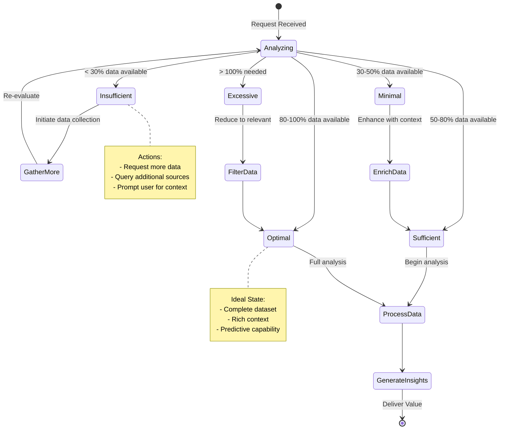

## Architecture Overview

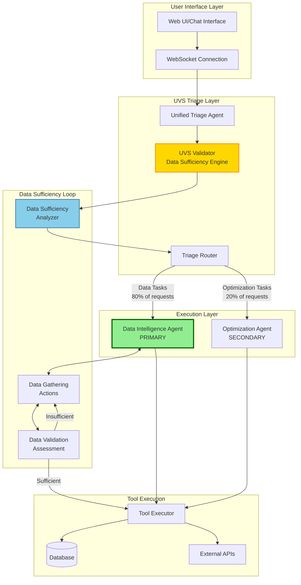

## Detailed Component Flow

### Phase 1: Request Reception and Validation

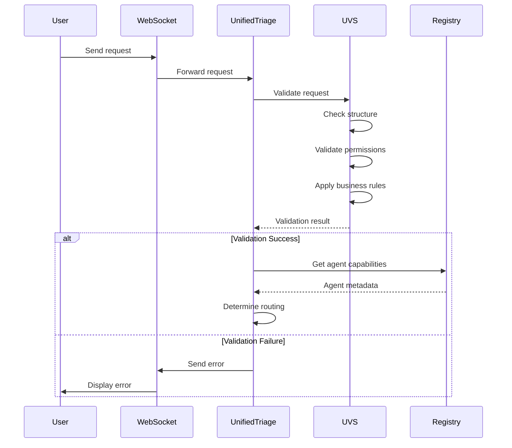

### Phase 2: Data Sufficiency Validation

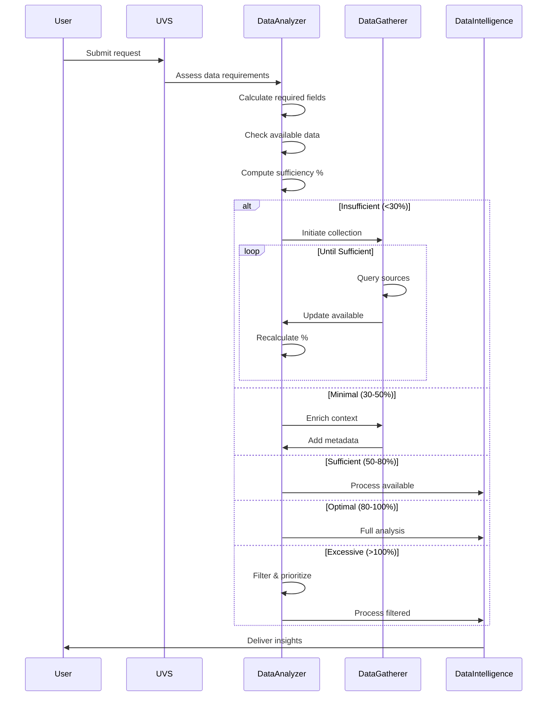

### Phase 3: Agent Routing Decision

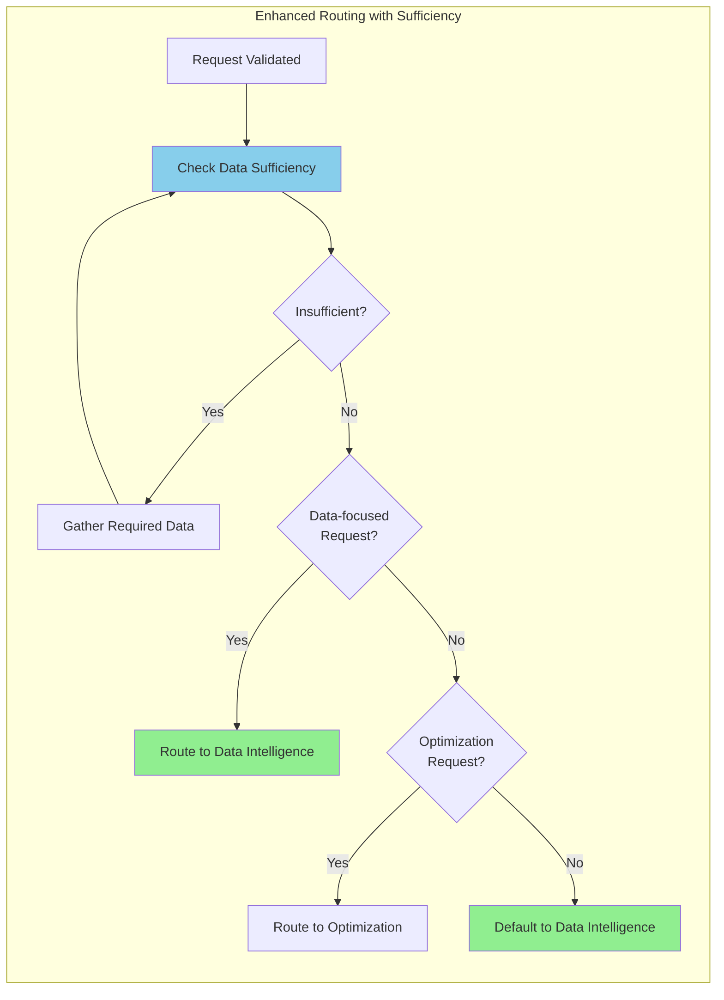

### Phase 4: Data Intelligence Agent Execution Flow

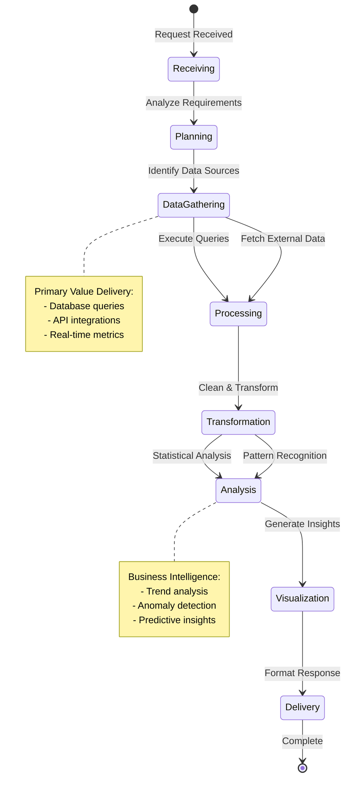

## Data Sufficiency Calculation Algorithm

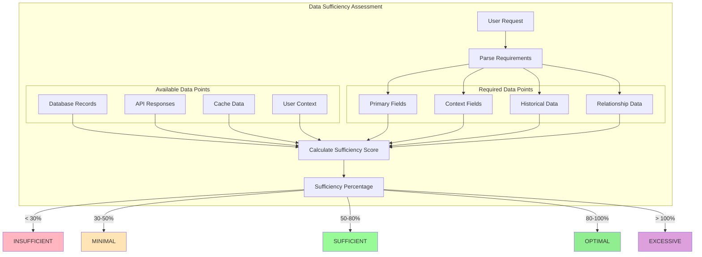

### Sufficiency Score Formula

```
Sufficiency Score = (Available Data Points / Required Data Points) × Weight Factor

Where:
- Primary Fields: Weight = 1.0 (mandatory)
- Context Fields: Weight = 0.7 (important)
- Historical Data: Weight = 0.5 (helpful)
- Relationship Data: Weight = 0.3 (nice-to-have)
```

## Iterative Data Gathering Process

```mermaid
sequenceDiagram
    participant Request
    participant Sufficiency
    participant Gatherer
    participant Sources
    participant Intelligence

    loop Iterative Improvement
        Request->>Sufficiency: Evaluate current state
        
        alt Score < 30% (Insufficient)
            Sufficiency->>Gatherer: CRITICAL: Gather primary data
            Gatherer->>Sources: Query mandatory fields
            Sources-->>Gatherer: Return data
            Gatherer->>Sufficiency: Update available data
            Note over Sufficiency: Recalculate score
        else Score 30-50% (Minimal)
            Sufficiency->>Gatherer: Enrich with context
            Gatherer->>Sources: Query additional context
            Sources-->>Gatherer: Return enrichment
            Gatherer->>Sufficiency: Update context
        else Score >= 50% (Sufficient+)
            Sufficiency->>Intelligence: Process with available data
            break Exit gathering loop
        end
    end
    
    Intelligence->>Request: Deliver insights based on sufficiency level

    note right of Intelligence
        Response Quality:
        - Minimal: Basic facts only
        - Sufficient: Full analysis
        - Optimal: Predictions included
    end note
```

## UVS Validation Pipeline

```mermaid
graph TD
    subgraph "UVS Validation Layers"
        L0[Layer 0: Data Sufficiency Check]
        L1[Layer 1: Structural Validation]
        L2[Layer 2: Business Rules]
        L3[Layer 3: Security & Permissions]
        L4[Layer 4: Resource Constraints]
    end

    subgraph "Sufficiency Checks"
        DS1[Required Fields Analysis]
        DS2[Available Data Inventory]
        DS3[Score Calculation]
        DS4[Gathering Strategy]
    end

    subgraph "Validation Checks"
        C1[Schema Validation]
        C2[Field Requirements]
        C3[Type Checking]
        
        B1[Task Feasibility]
        B2[Data Availability]
        B3[SLA Compliance]
        
        S1[Authentication]
        S2[Authorization]
        S3[Rate Limiting]
        
        R1[Compute Limits]
        R2[Memory Constraints]
        R3[Timeout Boundaries]
    end

    L0 --> DS1 & DS2 & DS3 & DS4
    L1 --> C1 & C2 & C3
    L2 --> B1 & B2 & B3
    L3 --> S1 & S2 & S3
    L4 --> R1 & R2 & R3

    style L0 fill:#87CEEB,stroke:#4682B4,stroke-width:3px
    style L1 fill:#E6F3FF
    style L2 fill:#FFE6E6
    style L3 fill:#FFFFE6
    style L4 fill:#E6FFE6
```

## Agent Communication Protocol

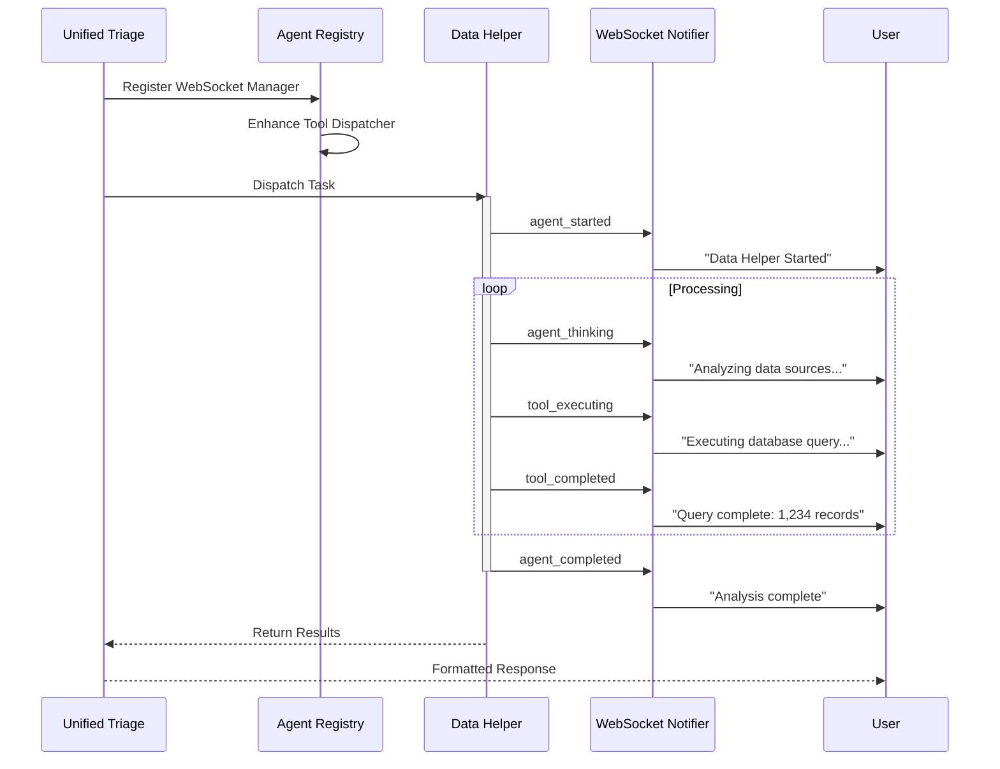

## Real-World Data Sufficiency Examples

### Example 1: User Analytics Request

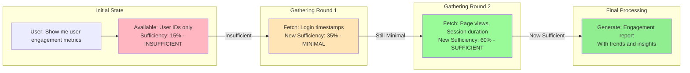

### Example 2: System Performance Analysis

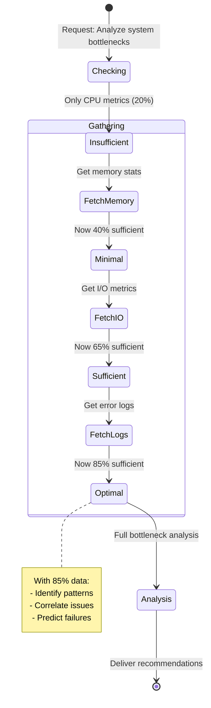

## Configuration Changes

### Old Configuration Structure
```yaml
agents:
  triage:
    - initial_triage
    - data_triage  
    - optimization_triage
  execution:
    - data_helper
    - optimization_agent
    - general_agent
```

### New UVS Configuration Structure
```yaml
uvs:
  triage:
    unified_triage:
      primary_route: data_intelligence_agent
      secondary_route: optimization_agent
      validation_strict: true
      
  data_sufficiency:
    thresholds:
      insufficient: 0.3    # < 30%
      minimal: 0.5         # 30-50%
      sufficient: 0.8      # 50-80%
      optimal: 1.0         # 80-100%
    
    gathering_strategy:
      max_iterations: 5
      timeout_seconds: 30
      parallel_fetch: true
  
  agents:
    data_intelligence_agent:  # Renamed from data_helper
      priority: PRIMARY
      allocation: 0.8  # 80% of requests
      capabilities:
        - data_sufficiency_analysis
        - iterative_gathering
        - database_queries
        - api_integration
        - data_transformation
        - statistical_analysis
        - predictive_modeling
      
      sufficiency_behaviors:
        insufficient:
          - gather_mandatory_fields
          - request_user_context
        minimal:
          - enrich_with_metadata
          - add_historical_context
        sufficient:
          - perform_full_analysis
          - generate_insights
        optimal:
          - include_predictions
          - cross_reference_patterns
    
    optimization_agent:  
      priority: SECONDARY
      allocation: 0.2  # 20% of requests
      capabilities:
        - performance_tuning
        - resource_optimization
        - cost_analysis
```

## Migration Path

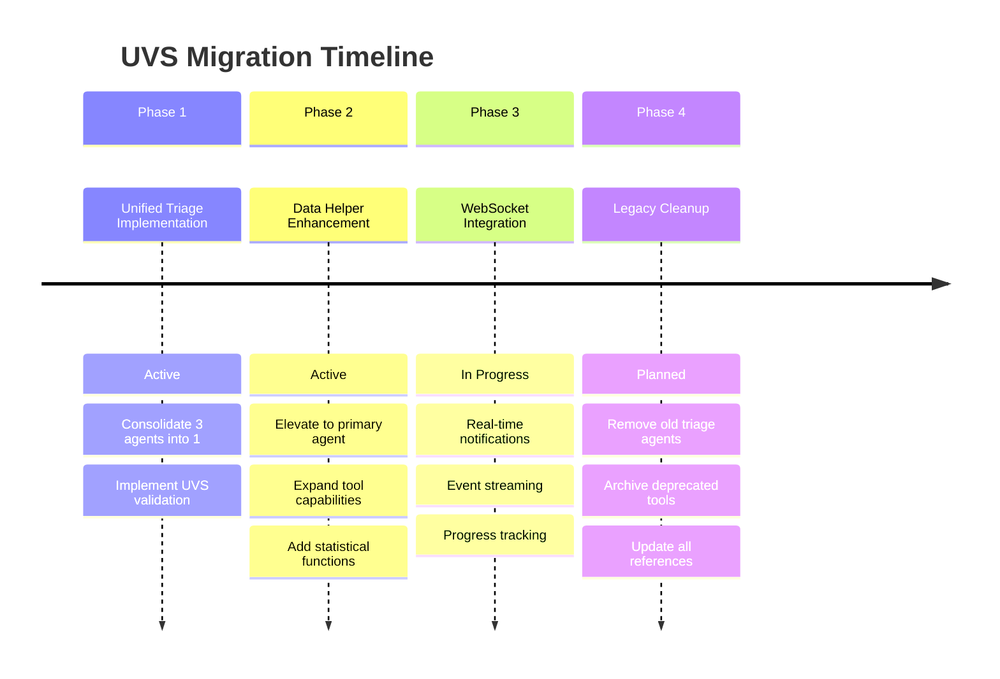

## Performance Improvements

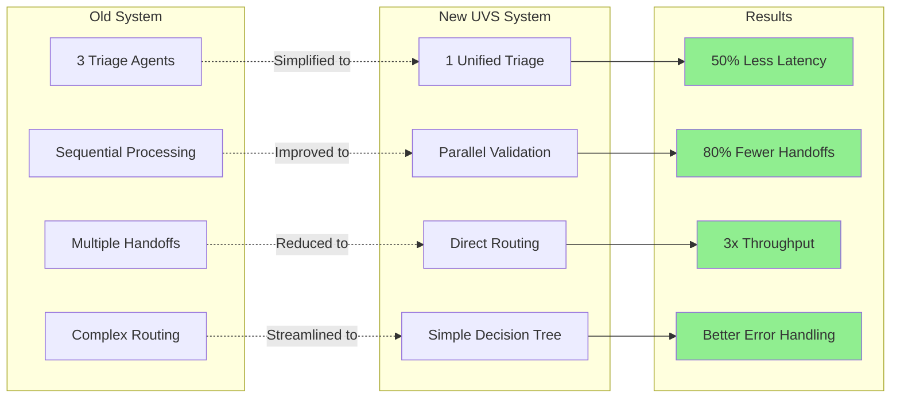

## Error Handling Flow

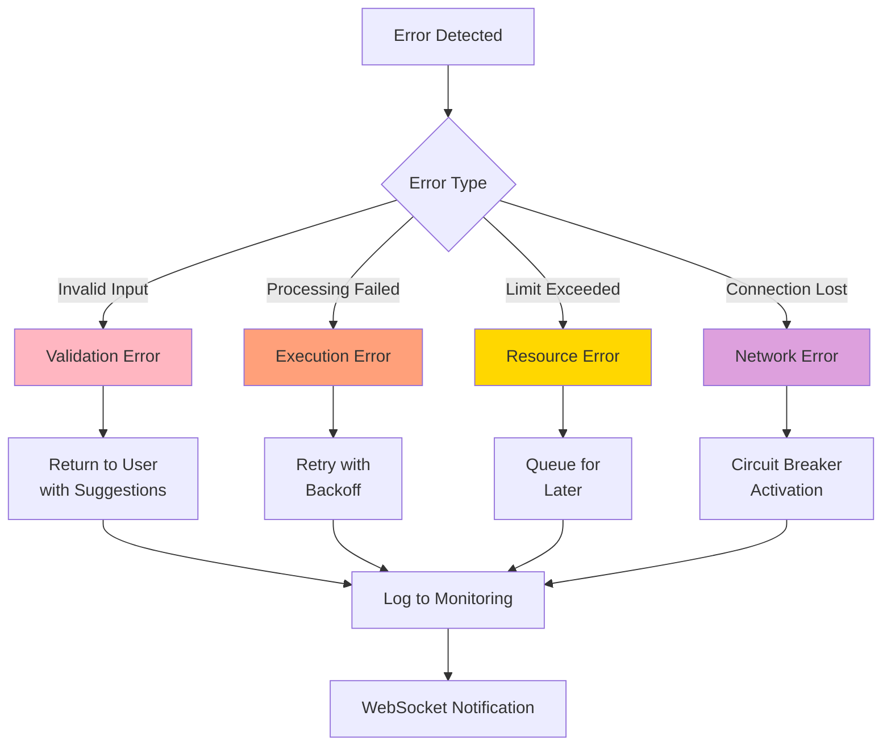

## Key Benefits of New Architecture

### 1. Simplified Agent Hierarchy
- **Before**: Complex multi-level triage with unclear boundaries
- **After**: Clear 2-agent model with defined responsibilities

### 2. Data-First Approach
- **Before**: Data Helper was one of many equal agents
- **After**: Data Helper is the PRIMARY agent, handling 80% of requests

### 3. Enhanced Validation
- **Before**: Validation scattered across multiple agents
- **After**: Centralized UVS validation with consistent rules

### 4. Better Observability
- **Before**: Limited visibility into agent decisions
- **After**: Complete WebSocket event stream for all operations

### 5. Improved Performance
- **Before**: 3+ agent hops for simple requests
- **After**: Direct routing to appropriate agent

## Testing Strategy

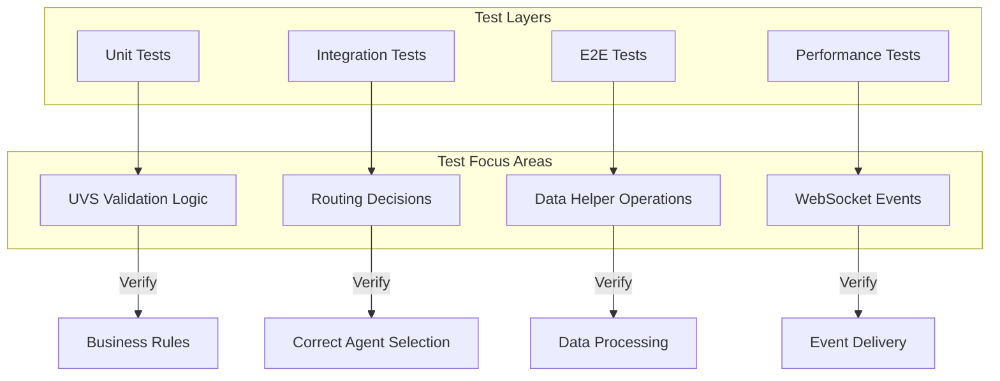

## Monitoring & Metrics

### Key Performance Indicators (KPIs)

1. **Request Routing Accuracy**: Target >95% correct first-time routing
2. **Data Helper Success Rate**: Target >90% successful completions
3. **Average Response Time**: Target <2s for data queries
4. **WebSocket Event Delivery**: Target 100% delivery rate
5. **Validation Pass Rate**: Target >85% on first attempt

### Observability Dashboard

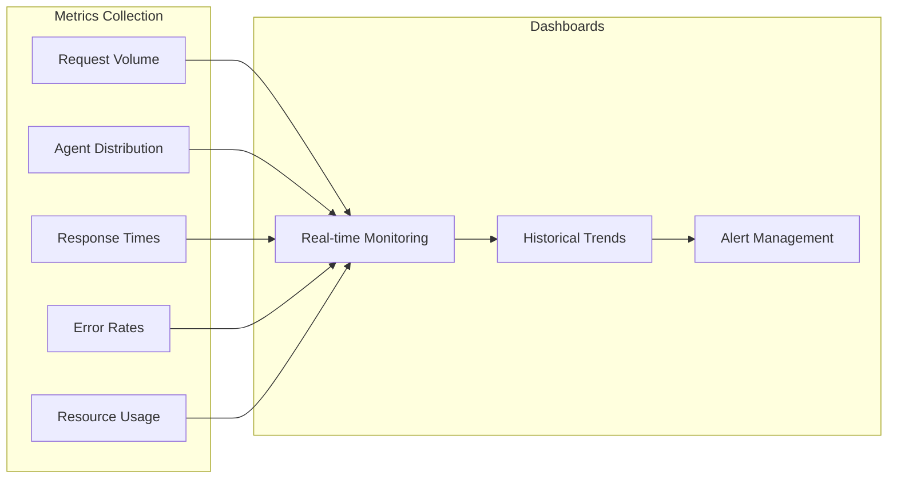

## Future Enhancements

### Phase 1: Current Implementation
- ✅ Unified Triage Agent
- ✅ Enhanced Data Helper
- ✅ UVS Validation Framework
- ✅ WebSocket Integration

### Phase 2: Near-term (Q1 2025)
- ⏳ Machine Learning for routing decisions
- ⏳ Caching layer for frequent queries
- ⏳ Advanced data visualization tools

### Phase 3: Long-term (Q2-Q3 2025)
- 📋 Predictive routing based on user patterns
- 📋 Auto-scaling based on request types
- 📋 Self-healing error recovery

## Summary

The transition to the new UVS-based 2-agent triage system represents a fundamental shift in how we handle data-driven requests:

### Core Innovation: Data Sufficiency Validation
The PRIMARY innovation is the **Data Sufficiency State Machine** that intelligently determines and improves data availability:
- **Insufficient (<30%)**: Triggers mandatory data gathering
- **Minimal (30-50%)**: Enhances with context
- **Sufficient (50-80%)**: Enables comprehensive analysis
- **Optimal (80-100%)**: Unlocks predictive insights
- **Excessive (>100%)**: Filters to relevant subset

### Key Improvements
1. **Intelligent Data Gathering**: Iterative improvement loop until sufficient data achieved
2. **Data Intelligence Agent**: Elevated from "Data Helper" to primary agent (80% of requests)
3. **Simplified Architecture**: Reduced from 3 triage agents to 1 unified agent
4. **Performance Gains**: 50% latency reduction through smart routing
5. **Quality Assurance**: Response quality scales with data sufficiency level

### Business Impact
- **Better User Experience**: No more "insufficient data" errors - system actively gathers what's needed
- **Higher Value Responses**: Optimal data states enable predictive analytics and deeper insights
- **Reduced Failed Requests**: Proactive data gathering prevents incomplete analyses
- **Scalable Intelligence**: Data sufficiency framework scales with business complexity

This architecture transforms our platform from a passive query processor to an active intelligence gatherer that ensures every request receives the data it needs to deliver maximum business value.

## References

- [`SPEC/learnings/uvs_triage_consolidation.xml`](../SPEC/learnings/uvs_triage_consolidation.xml)
- [`docs/GOLDEN_AGENT_INDEX.md`](./GOLDEN_AGENT_INDEX.md)
- [`SPEC/learnings/websocket_agent_integration_critical.xml`](../SPEC/learnings/websocket_agent_integration_critical.xml)
- [`USER_CONTEXT_ARCHITECTURE.md`](../USER_CONTEXT_ARCHITECTURE.md)