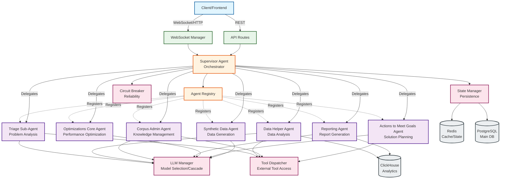
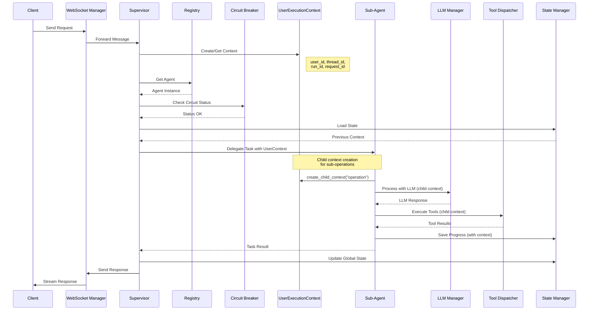
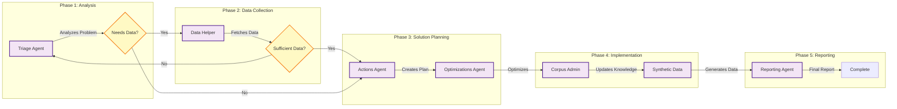
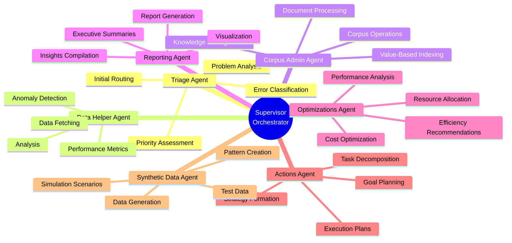
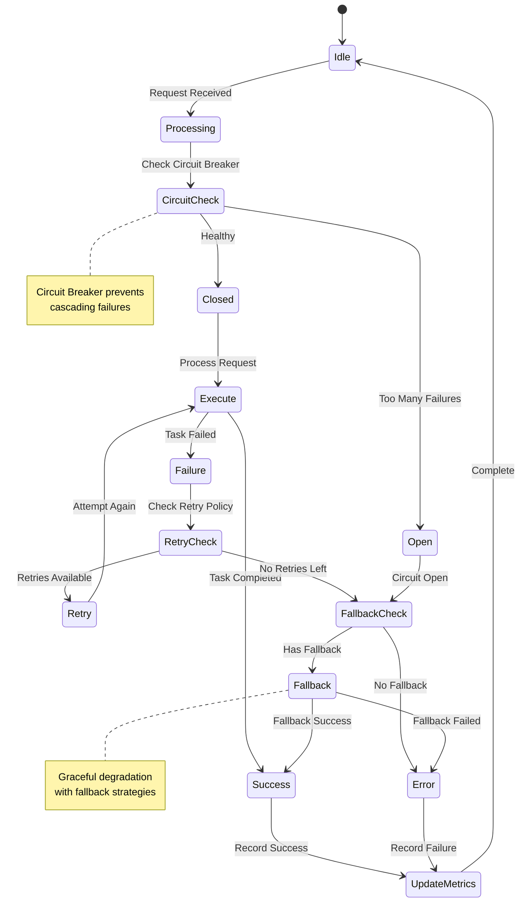
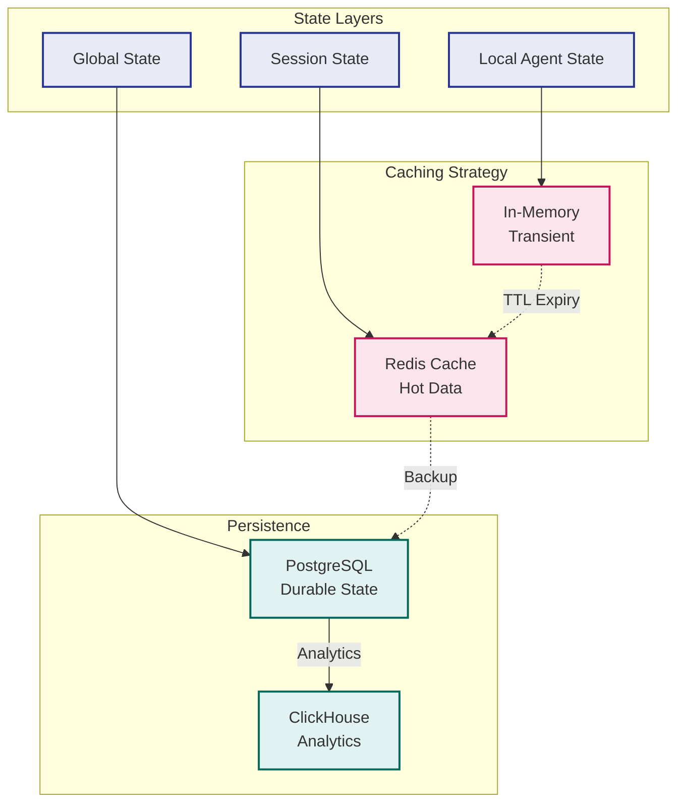

# Netra Apex Core Sub-Agent Architecture Flow Diagram

## System Overview

## Agent Workflow Execution Flow

## Multi-Agent Collaboration Pattern

## Agent Specialized Capabilities

## Error Handling and Resilience Flow

## State Management and Persistence

## Notes

- **Supervisor Agent** acts as the central orchestrator, managing task delegation and agent coordination
- **Circuit Breaker** pattern ensures system resilience by preventing cascading failures
- **State Management** uses a multi-tier approach with Redis for hot data and PostgreSQL for persistence
- **LLM Manager** implements model cascade for optimal cost/performance balance
- **Tool Dispatcher** provides unified interface for external tool access
- Each agent is specialized for specific domain tasks, enabling efficient parallel processing
- WebSocket connections enable real-time streaming of agent responses to clients
- **UserExecutionContext** provides complete user isolation with child context support for sub-agent operations
- **Child Context Creation** enables hierarchical agent execution while maintaining proper isolation and traceability
- All contexts include full metadata inheritance and operation depth tracking for comprehensive observability