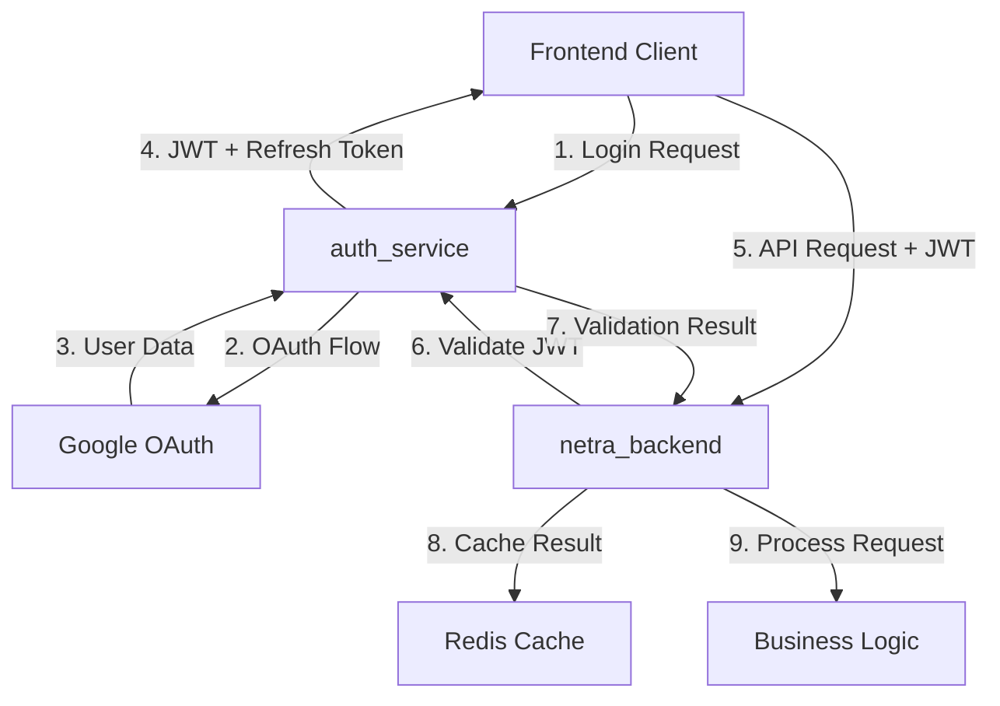

# ADR-001: Unified Authentication Pattern

## Status
**Proposed** | Date: 2025-08-30

## Context

The Netra platform currently has multiple authentication implementations across services:
- **auth_service**: JWT validation with Redis blacklisting and database persistence
- **netra_backend**: Local JWT validation and partial OAuth implementation  
- **frontend**: Multiple token storage mechanisms and validation approaches

This violates the Single Source of Truth (SSOT) principle and creates:
- **Security vulnerabilities** from inconsistent validation
- **3x maintenance burden** for authentication changes
- **Debugging complexity** from multiple failure points
- **Performance overhead** from redundant validations

## Decision

We will establish **auth_service as the sole authentication authority** with clearly defined responsibilities for each service layer:

### Service Responsibilities

#### auth_service (Authentication Authority)
- **Owns**: OAuth flows, JWT creation/validation, user management, token lifecycle
- **Provides**: `/validate`, `/refresh`, `/revoke` endpoints for other services
- **Stores**: User data in PostgreSQL, sessions in Redis

#### netra_backend (API Layer)
- **Delegates**: All JWT validation to auth_service
- **Caches**: Validation results in Redis (5-minute TTL)
- **Enforces**: Permissions based on validated tokens
- **Removes**: All OAuth implementations

#### frontend (Client Layer)
- **Uses**: UnifiedAuthService as sole token manager
- **Stores**: Tokens in localStorage via UnifiedAuthService only
- **Guards**: Routes with centralized AuthGuard component
- **Refreshes**: Tokens proactively before expiry

### Technical Implementation



### Token Validation Flow

```python
# netra_backend/app/middleware/auth_middleware.py
class AuthMiddleware:
    async def validate_token(self, token: str) -> Dict:
        # 1. Check Redis cache first
        cached = await redis.get(f"validated:{token}")
        if cached:
            return json.loads(cached)
        
        # 2. Validate with auth_service
        response = await auth_client.post("/validate", 
            json={"token": token})
        
        # 3. Cache successful validation
        if response.status == 200:
            await redis.setex(
                f"validated:{token}", 
                300,  # 5 minute TTL
                json.dumps(response.json())
            )
        
        return response.json()
```

### Service-to-Service Authentication

```yaml
Primary Method: Service Account Tokens
- Each service has unique identity token
- Tokens include service name and permissions
- Managed through auth_service registry

Fallback Method: API Keys  
- Used only for emergency access
- Rotated monthly
- Logged and monitored heavily
```

## Consequences

### Positive Consequences

1. **Security Enhancement**
   - Single point for security updates
   - Consistent validation rules
   - Centralized blacklisting and revocation
   - Audit trail in one location

2. **Reduced Complexity**
   - 50% less authentication code
   - Single source of truth for auth logic
   - Clear service boundaries
   - Simplified debugging

3. **Improved Maintainability**
   - 70% reduction in auth change effort
   - One place to update security policies
   - Standardized patterns across services
   - Better testability

4. **Performance Benefits**
   - Efficient caching strategy
   - Reduced redundant validations
   - Optimized auth service for high throughput
   - Connection pooling for auth calls

### Negative Consequences

1. **Auth Service Dependency**
   - All services depend on auth_service availability
   - **Mitigation**: High availability deployment, Redis caching, circuit breakers

2. **Network Latency**
   - Additional network call for validation
   - **Mitigation**: Aggressive caching, async validation where possible

3. **Migration Complexity**
   - 6-week migration effort required
   - **Mitigation**: Phased rollout with feature flags

## Implementation Plan

### Week 1: Foundation
- [ ] Create auth_service `/validate` endpoint
- [ ] Set up monitoring and metrics
- [ ] Document migration plan
- [ ] Create feature flags

### Week 2-3: Backend Migration
- [ ] Update auth middleware to use auth_service
- [ ] Remove OAuth from netra_backend
- [ ] Implement Redis caching
- [ ] Update integration tests

### Week 4: Frontend Consolidation  
- [ ] Enforce UnifiedAuthService usage
- [ ] Remove duplicate auth logic
- [ ] Standardize WebSocket auth
- [ ] Update component tests

### Week 5: Testing
- [ ] End-to-end testing all flows
- [ ] Security audit
- [ ] Performance testing
- [ ] Load testing auth_service

### Week 6: Deployment
- [ ] Staged rollout to production
- [ ] Monitor metrics and errors
- [ ] Update documentation
- [ ] Team training

## Alternatives Considered

### Alternative 1: Distributed JWT Validation
**Description**: Each service validates JWTs independently using shared secret.
**Rejected Because**: 
- No centralized revocation
- Difficult to update validation rules
- Security updates require coordinated deployment

### Alternative 2: API Gateway Authentication
**Description**: Single API gateway handles all authentication.
**Rejected Because**:
- Single point of failure
- Doesn't work for service-to-service
- Complex for WebSocket connections

### Alternative 3: Federated Authentication
**Description**: Each service is its own OAuth provider.
**Rejected Because**:
- Massive complexity increase
- Poor user experience
- Overkill for our use case

## Success Metrics

- **Code Reduction**: 50% less auth code across platform
- **Validation Latency**: <50ms cached, <200ms uncached
- **Availability**: 99.99% auth service uptime
- **Security**: Zero auth-related vulnerabilities in quarterly audit
- **Developer Velocity**: 70% faster auth-related changes

## References

- [SPEC/multi_system_authentication_architecture.xml](../../SPEC/multi_system_authentication_architecture.xml)
- [Authentication Redundancy Audit](../AUTHENTICATION_REDUNDANCY_AUDIT.md)
- [SPEC/learnings/authentication_ssot.xml](../../SPEC/learnings/authentication_ssot.xml)
- [OAuth 2.0 RFC 6749](https://tools.ietf.org/html/rfc6749)
- [JWT RFC 7519](https://tools.ietf.org/html/rfc7519)

## Sign-off

- [ ] Engineering Lead
- [ ] Security Team
- [ ] DevOps Team
- [ ] Product Manager